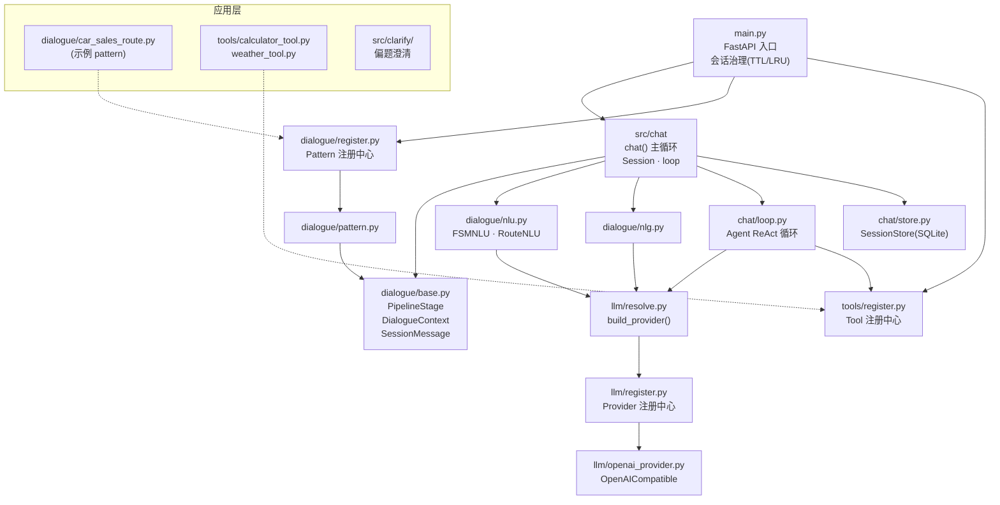

# Architecture

> 活的系统地图——每次框架改动后同步更新本文件。模块依赖方向、公共契约、“什么代码放哪”以此为准。

## 模块依赖图

**依赖方向（不许反向）**：`main → chat → dialogue(base/stages) → llm`；应用层只通过 registry 挂进来。

## 核心概念

- **Pattern**：一个完整对话流程（如 car_sales_route），由多个 Module 组成，声明 stages 流水线
- **Module**：三种类型 `ROUTE`（菜单分发）/ `FSM`（状态机）/ `AGENT`（自由对话+工具）
- **Node**：FSM/ROUTE 内的状态节点；`sub_nodes` 构成转移图；节点级 NLU/NLG 可覆盖模块级
- **PipelineStage**：可插拔管线步骤，`execute(ctx) -> ctx`；ctx 即 `DialogueContext` 全程数据载体
- **Session**：持有 `cxt`（DialogueContext）；每轮更新 `user_query`，轮末回写状态
- **SessionStore**：SQLite write-through 审计流水（sessions 快照 + messages 行级消息），
  兼重启恢复数据源；治理仍在内存，DB 非事实源（`chat/store.py`）

## 公共契约（改动需走内核流程）

| 契约 | 位置 | 说明 |
|---|---|---|
| `PipelineStage.execute(ctx)` | `dialogue/base.py` | 所有 stage 的唯一接口 |
| `DialogueContext` 字段 | `dialogue/base.py` | stage 间数据交换全部经由 ctx，不另开通道 |
| `registry.register()` 自注册 | `dialogue/register.py` `tools/register.py` `llm/register.py` | 应用层接入框架的唯一方式（AST 扫描发现） |
| `build_provider(llm_config)` | `llm/resolve.py` | 所有 LLM 调用的统一入口 |
| `conversation(session, module, llm_config)` | `chat/loop.py` | Agent 模块对话循环入口 |
| `SessionStore` | `chat/store.py` | launch/轮末落盘、startup 恢复、审计查询；实例由 main.py 注入，非全局单例 |

## 什么代码放哪

- 新业务对话流程 → `src/dialogue/<name>_route.py`，模块级 `registry.register()`
- 新工具 → `src/tools/<name>_tool.py`，自动被 AST 发现
- 新 LLM provider → `src/llm/<name>_provider.py`
- 新管线阶段 → `src/dialogue/<stage>.py` 继承 `PipelineStage`
- 全局 prompt 模板 → `src/prompt.py`（node/module 可覆盖）

## 测试

`tests/` 全离线（fake_provider 打桩 LLM）：`export DASHSCOPE_API_KEY=... && .venv/bin/python -m pytest tests/ -q`。
改框架后必须全绿再提交。
