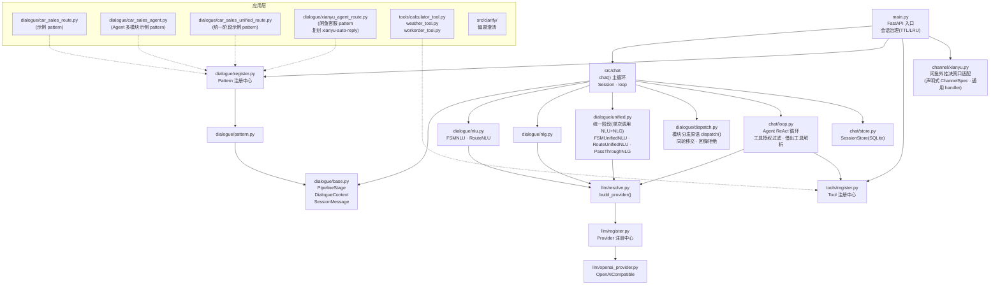

# Architecture

> 活的系统地图——每次框架改动后同步更新本文件。模块依赖方向、公共契约、“什么代码放哪”以此为准。

## 模块依赖图

**依赖方向（不许反向）**：`main → chat → dialogue(base/stages) → llm`；应用层只通过 registry 挂进来。

## 核心概念

- **Pattern**：一个完整对话流程（如 car_sales_route），由多个 Module 组成，声明 stages 流水线
- **Module**：三种类型 `ROUTE`（菜单分发）/ `FSM`（状态机）/ `AGENT`（自由对话+工具）
- **Node**：FSM/ROUTE 内的状态节点；`sub_nodes` 构成转移图；节点级 NLU/NLG 可覆盖模块级
- **PipelineStage**：可插拔管线步骤，`execute(ctx) -> ctx`；ctx 即 `DialogueContext` 全程数据载体
- **统一阶段（unified.py）**：单次调用 + structured output 的 NLU+NLG 合一形态——一次 LLM 调用产出 `{"reply","next_node","slots"}`，拆写 `ctx.nlu_result`/`ctx.nlg_result`；`next_node` 由代码按合法转移边硬校验（开启 `enable_clarify` 的模块放行 `"clarify"`，与 ClarifyStage 组合成 `[统一, 澄清, PassThroughNLG]` 管线）。module 级注入（`nlu_stage=FSMUnifiedNLU()/RouteUnifiedNLU(), nlg_stage=PassThroughNLG()`），替换默认两阶段（每轮 2 次调用 → 1 次；澄清轮 2 次，与两阶段+澄清持平）
- **Session**：持有 `cxt`（DialogueContext）；每轮更新 `user_query`，轮末回写状态
- **SessionStore**：SQLite write-through 审计流水（sessions 快照 + messages 行级消息），
  兼重启恢复数据源；治理仍在内存，DB 非事实源（`chat/store.py`）
- **Channel**：外部消息源适配层（`src/channel/`，webhook 回调型）。声明式
  ChannelSpec（载荷 schema/session 派生/task_info 映射/成功响应契约，`base.py`）
  + 第 4 个 registry（AST 自动发现，`register.py`）+ 通用 handler
  （token 校验/过期过滤/get-or-create/session 前缀/错误码固定契约，
  `webhooks.py`，结构上不可绕过）；引擎操作经 EngineOps 由 main.py 注入，
  channel 模块不感知会话治理与 LLM。闲鱼适配把 `(account_id, chat_id)`
  派生为稳定 session_id 并对不存在会话自动 launch（get-or-create），
  错误一律非 200（对方 parse 契约：非 200 不发送）
- **xianyu_agent pattern**：闲鱼卖家客服流程（`dialogue/xianyu_agent_route.py`），
  复刻 xianyu-auto-reply 的 agent 对话管理：单 RouteModule 内 XianyuIntentNLU
  （本地关键词意图检测 price/tech/default，零 LLM，模块级 nlu_stage）+ 意图级
  节点 `base_nlg_prompt`（议价/技术/通用三套模板）+ 议价轮数控制（user 消息
  metadata 回标 intent 计数，达上限切拒绝节点走 FixedNLG 固定话术，零 LLM）。
  ROUTE 轮末回 root 与原实现"每条消息独立检测"同构；议价设置经
  `ctx.metadata["bargain_settings"]` 注入（账号级配置入口）

## 公共契约（改动需走内核流程）

| 契约 | 位置 | 说明 |
|---|---|---|
| `PipelineStage.execute(ctx)` | `dialogue/base.py` | 所有 stage 的唯一接口 |
| `DialogueContext` 字段 | `dialogue/base.py` | stage 间数据交换全部经由 ctx，不另开通道 |
| `registry.register()` 自注册 | `dialogue/register.py` `tools/register.py` `llm/register.py` | 应用层接入框架的唯一方式（AST 扫描发现） |
| `build_provider(llm_config)` | `llm/resolve.py` | 所有 LLM 调用的统一入口 |
| `run_agent(session, module, llm_config)` | `chat/loop.py` | Agent 模块对话循环入口（返回 TurnResult）；`conversation()` 为兼容 wrapper |
| `SessionStore` | `chat/store.py` | launch/轮末落盘、startup 恢复、审计查询；实例由 main.py 注入，非全局单例 |
| `ChannelSpec` 协议 + `build_channel_router(spec, ops)` | `channel/base.py` `channel/webhooks.py` | 外部消息源适配的唯一形态：渠道声明差异 + 通用 handler 共性流程；`registry.register()` 自注册（AST 发现），main.py `discover_builtin_channels()` + `build_channel_routers(EngineOps(...))` 接线 |

## 什么代码放哪

- 新业务对话流程 → `src/dialogue/<name>_route.py`，模块级 `registry.register()`
- 新工具 → `src/tools/<name>_tool.py`，自动被 AST 发现
- 新 LLM provider → `src/llm/<name>_provider.py`
- 新外部消息渠道（channel）→ `src/channel/<name>.py`，实现 ChannelSpec（`payload_model`/`parse`/`build_reply` + 环境变量声明）并模块级 `registry.register()`，AST 自动发现，main.py 无需改动；默认 pattern/token 走环境变量（如 `XIANYU_CHANNEL_PATTERN`）
- 新管线阶段 → `src/dialogue/<stage>.py` 继承 `PipelineStage`
- 模块要单次调用（NLU+NLG 合一）→ module 上配 `nlu_stage=FSMUnifiedNLU()/RouteUnifiedNLU()` + `nlg_stage=PassThroughNLG()`（见 `car_sales_unified_route.py` 示例；候选节点需声明 `answer_examples`）
- 全局 prompt 模板 → `src/prompt.py`（node/module 可覆盖）

## 测试

`tests/` 全离线（fake_provider 打桩 LLM）：`export DASHSCOPE_API_KEY=... && .venv/bin/python -m pytest tests/ -q`。
改框架后必须全绿再提交。
