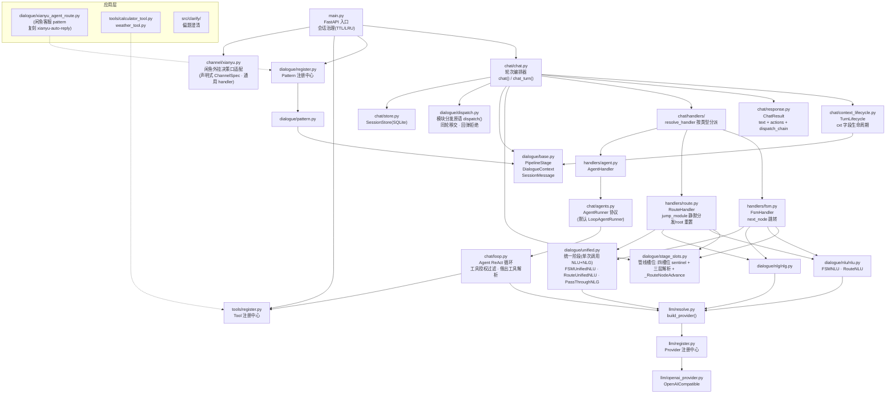

# Architecture

> 活的系统地图——每次框架改动后同步更新本文件。模块依赖方向、公共契约、“什么代码放哪”以此为准。

## 模块依赖图

```mermaid
flowchart TB
    main["main.py<br/>FastAPI 入口<br/>会话治理(TTL/LRU)"] --> chat["chat/chat.py<br/>轮次编排器<br/>chat() / chat_turn()"]
    main --> preg["dialogue/register.py<br/>Pattern 注册中心"]
    main --> treg["tools/register.py<br/>Tool 注册中心"]
    main --> chan["channel/xianyu.py<br/>闲鱼外挂决策口适配<br/>(声明式 ChannelSpec · 通用 handler)"]

    chat --> lc["chat/context_lifecycle.py<br/>TurnLifecycle<br/>cxt 字段生命周期"]
    chat --> resp["chat/response.py<br/>ChatResult<br/>text + actions + dispatch_chain"]
    chat --> hdls["chat/handlers/<br/>resolve_handler 按类型分派"]
    chat --> slots["dialogue/stage_slots.py<br/>管线槽位: 四槽位 sentinel + 三层解析 + _RouteNodeAdvance"]
    chat --> base["dialogue/base.py<br/>PipelineStage<br/>DialogueContext<br/>SessionMessage"]
    chat --> disp["dialogue/dispatch.py<br/>模块分发原语 dispatch()<br/>同轮移交 · 回弹拒绝"]
    chat --> store["chat/store.py<br/>SessionStore(SQLite)"]

    hdls --> fsmh["handlers/fsm.py<br/>FsmHandler<br/>next_node 跳转"]
    hdls --> routh["handlers/route.py<br/>RouteHandler<br/>jump_module 静默分发/root 重置"]
    hdls --> agnth["handlers/agent.py<br/>AgentHandler"]
    agnth --> runners["chat/agents.py<br/>AgentRunner 协议<br/>(默认 LoopAgentRunner)"]
    runners --> loop2["chat/loop.py<br/>Agent ReAct 循环<br/>工具授权过滤 · 借出工具解析"]
    fsmh --> slots
    routh --> slots
    fsmh --> nlu["dialogue/nlu/nlu.py<br/>FSMNLU · RouteNLU"]
    fsmh --> nlg["dialogue/nlg/nlg.py"]
    fsmh --> uni["dialogue/unified.py<br/>统一阶段(单次调用 NLU+NLG)<br/>FSMUnifiedNLU · RouteUnifiedNLU · PassThroughNLG"]
    routh --> nlu
    routh --> nlg
    routh --> uni

    preg --> pattern["dialogue/pattern.py"]
    pattern --> base

    nlu --> resolve["llm/resolve.py<br/>build_provider()"]
    nlg --> resolve
    uni --> resolve
    loop2 --> resolve
    loop2 --> treg
    lc --> base

    resolve --> llmreg["llm/register.py<br/>Provider 注册中心"]
    llmreg --> oai["llm/openai_provider.py<br/>OpenAICompatible"]

    subgraph 应用层
        xianyuagent["dialogue/xianyu_agent_route.py<br/>(闲鱼客服 pattern<br/>复刻 xianyu-auto-reply)"]
        tools["tools/calculator_tool.py<br/>weather_tool.py"]
        clarify["src/clarify/<br/>偏题澄清"]
    end
    xianyuagent -.-> preg
    tools -.-> treg
```

**依赖方向（不许反向）**：`main → chat → dialogue(base/stages) → llm`；应用层只通过 registry 挂进来。

## 核心概念

- **Pattern**：一个完整对话流程（如 xianyu_agent），由多个 Module 组成；stages 声明管线骨架（具体 stage 原样执行 + 槽位混排），另设 pattern 级四槽位默认（generate/query/pre_recall/post_recall，作三层解析的第三层）
- **Module**：三种类型 `ROUTE`（菜单分发）/ `FSM`（状态机）/ `AGENT`（自由对话+工具）
- **Node**：FSM/ROUTE 内的状态节点；`sub_nodes` 构成转移图；节点级 NLU/NLG 可覆盖模块级；节点级四槽位配置（generate/query/pre_recall/post_recall）全路径生效——含 ROUTE 菜单节点：generate 的 nlg 部件在 advance 切换后按菜单节点解析
- **管线槽位轴（stage_slots.py）**：`pre_recall → query → post_recall → generate` 四槽位；
  执行期三层解析 node > module > pattern，层配置非法（dict 缺键/多键/值非法、stage 无 execute）
  整层降级，全空时召回/改写槽位 no-op、generate 落 builtin（FSMNLU/FSMNLG 或 RouteNLU/RouteNLG）。
  generate 双形态：单 stage（unified 一次调用）或 dict `{"nlu":…, "nlg":…}`；展开为 nlu/nlg 两个
  惰性子部件，各自在执行时刻解析（ROUTE：`[nlu, _RouteNodeAdvance, nlg]`；FSM+enable_clarify：
  `[nlu, ClarifyStage, nlg]`）
- **PipelineStage**：可插拔管线步骤，`execute(ctx) -> ctx`；ctx 即 `DialogueContext` 全程数据载体
- **统一阶段（unified.py）**：单次调用 + structured output 的 NLU+NLG 合一形态——一次 LLM 调用产出 `{"reply","next_node","slots"}`，拆写 `ctx.nlu_result`/`ctx.nlg_result`；`next_node` 由代码按合法转移边硬校验（开启 `enable_clarify` 的模块放行 `"clarify"`，ClarifyStage 在 generate 展开的 nlu/nlg 部件之间执行）。module 级注入（`generate=FSMUnifiedNLU()/RouteUnifiedNLU()`，generate 单 stage 形态，nlu 部件整体执行、nlg 部件 no-op），替换默认两阶段（每轮 2 次调用 → 1 次；澄清轮 2 次，与两阶段+澄清持平）
- **Session**：持有 `cxt`（DialogueContext）；每轮更新 `user_query`，轮末回写状态
- **chat 编排器（chat/chat.py）**：`chat()` 兼容入口（返回 str）/ `chat_turn()` 全量入口
  （返回 `ChatResult`：text + 预留 actions + dispatch_chain 转移链观测）。职责收窄为
  轮次编排：session 定位 → lifecycle 轮首重置 → 同轮 hop 循环（`resolve_handler`
  按 AGENT/FSM/ROUTE 分派）→ 轮末 history 追加 + 产出快照。单模块处理在 handlers 包
- **模块处理器（chat/handlers/）**：`ModuleHandler.handle(session, module, force_close)
  -> TurnResult`；`PipelineHandler` 提供 FSM/ROUTE 共享的「节点解析 → R3 刷新 →
  stage 执行」骨架；AgentHandler 委托可插拔 `AgentRunner`（chat/agents.py 协议，
  默认 `LoopAgentRunner` → loop.run_agent；经 chat()/chat_turn() 可选参数注入，
  不加 registry）。LLM 配置刷新函数经构造注入（R1-R3 的 get_llm_config 保持
  在 chat 模块命名空间解析——测试 patch 锚点）
- **cxt 字段生命周期（chat/context_lifecycle.py）**：`TurnLifecycle` 声明式四类集合，
  改集合即改政策：
  - PERSISTENT（跨轮绝不删）：history / current_module_code / current_node_code /
    filled_slots / task_basic_info / node_map / module_map / metadata 五键
    （dispatch_graph, bargain_settings, task_info, llm_override, pattern_code）
  - PER_TURN_RESET（每轮轮首）：user_query 覆写、nlu/nlg/agent_result、
    pre/post_recall_results、rewritten_queries、actions、metadata 三键
    （dispatch_log, handoff_context, unified）。begin_turn 每轮恰好一次、
    hop 之间绝不调（dispatch_log 同轮累积是回弹拒绝依据）
  - INCREMENTAL（增量）：history 追加（end_turn）、filled_slots 合并（merge_slots）
  - STAGE_MANAGED（不触碰）：clarify（ClarifyStage 自管理）、served_by_projection
    （dispatch() 维护）
- **SessionStore**：SQLite write-through 审计流水（sessions 快照 + messages 行级消息），
  兼重启恢复数据源；治理仍在内存，DB 非事实源（`chat/store.py`）
- **Channel**：外部消息源适配层（`src/channel/`，webhook 回调型）。声明式
  ChannelSpec（载荷 schema/session 派生/task_info 映射/成功响应契约，`base.py`）
  + 第 4 个 registry（AST 自动发现，`register.py`）+ 通用 handler
  （token 校验/过期过滤/get-or-create/session 前缀/错误码固定契约，
  `webhooks.py`，结构上不可绕过）；引擎操作经 EngineOps 由 main.py 注入，
  channel 模块不感知会话治理与 LLM。闲鱼适配把 `(account_id, chat_id)`
  派生为稳定 session_id 并对不存在会话自动 launch（get-or-create），
  错误一律非 200（对方 parse 契约：非 200 不发送）
- **xianyu_agent pattern**：闲鱼卖家客服流程（`dialogue/xianyu_agent_route.py`），
  复刻 xianyu-auto-reply 的 agent 对话管理：单 RouteModule 内 XianyuIntentNLU
  （本地关键词意图检测 price/tech/default，零 LLM，模块级 generate dict 的 nlu 位）+ 意图级
  节点 `base_nlg_prompt`（议价/技术/通用三套模板）+ 议价轮数控制（user 消息
  metadata 回标 intent 计数，达上限切拒绝节点走 FixedNLG 固定话术，零 LLM）。
  ROUTE 轮末回 root 与原实现"每条消息独立检测"同构；议价设置经
  `ctx.metadata["bargain_settings"]` 注入（账号级配置入口）

## 公共契约（改动需走内核流程）

| 契约 | 位置 | 说明 |
|---|---|---|
| `PipelineStage.execute(ctx)` | `dialogue/base.py` | 所有 stage 的唯一接口 |
| `resolve_stage(stage, ctx, module, pattern)` | `dialogue/stage_slots.py` | 槽位三层延迟解析器（node > module > pattern；校验整层降级；generate 双形态展开为惰性子部件） |
| `DialogueContext` 字段 | `dialogue/base.py` | stage 间数据交换全部经由 ctx，不另开通道 |
| `registry.register()` 自注册 | `dialogue/register.py` `tools/register.py` `llm/register.py` | 应用层接入框架的唯一方式（AST 扫描发现） |
| `build_provider(llm_config)` | `llm/resolve.py` | 所有 LLM 调用的统一入口 |
| `get_llm_config(pattern_code, module_code, node_code, override)` | `config/config.py` | LLM 配置解析入口：`llm_providers` 连接层 ⊕ `llm_default`/`pattern_llm` 三层编排；`ctx.metadata["llm_override"]`（CLI 手动选择）最高优先级；chat 层每轮按当前位置刷新（R1-R4） |
| `run_agent(session, module, llm_config)` | `chat/loop.py` | Agent 模块对话循环入口（返回 TurnResult）；`conversation()` 为兼容 wrapper |
| `chat_turn(query, session_id, all_sessions, agent_runner=None) -> ChatResult` | `chat/chat.py` | 全量轮次入口：text + 预留 actions + dispatch_chain；`chat()` 为兼容入口（等价 `.text`） |
| `ModuleHandler.handle(session, module, force_close) -> TurnResult` | `chat/handlers/base.py` | 单模块单轮处理器接口；`resolve_handler(module_type, refresh_llm, agent_runner)` 按类型构造（AGENT/FSM/ROUTE，非 registry） |
| `AgentRunner.run(session, module, llm_config, force_close)` | `chat/agents.py` | AGENT 后端插件协议（默认 `LoopAgentRunner` 委托 loop.run_agent）；经 chat 入口可选参数注入 |
| `TurnLifecycle` 字段集合 | `chat/context_lifecycle.py` | cxt 字段生命周期唯一管理者：PERSISTENT / PER_TURN_RESET / INCREMENTAL / STAGE_MANAGED 四类声明式集合 + begin_turn / bind_pattern / end_turn / merge_slots |
| `SessionStore` | `chat/store.py` | launch/轮末落盘、startup 恢复、审计查询；实例由 main.py 注入，非全局单例 |
| `ChannelSpec` 协议 + `build_channel_router(spec, ops)` | `channel/base.py` `channel/webhooks.py` | 外部消息源适配的唯一形态：渠道声明差异 + 通用 handler 共性流程；`registry.register()` 自注册（AST 发现），main.py `discover_builtin_channels()` + `build_channel_routers(EngineOps(...))` 接线 |

## 什么代码放哪

- 新业务对话流程 → `src/dialogue/<name>_route.py`，模块级 `registry.register()`
- 新工具 → `src/tools/<name>_tool.py`，自动被 AST 发现
- 新 LLM provider → `src/llm/<name>_provider.py`
- 新外部消息渠道（channel）→ `src/channel/<name>.py`，实现 ChannelSpec（`payload_model`/`parse`/`build_reply` + 环境变量声明）并模块级 `registry.register()`，AST 自动发现，main.py 无需改动；默认 pattern/token 走环境变量（如 `XIANYU_CHANNEL_PATTERN`）
- 新管线阶段 → `src/dialogue/<stage>.py` 继承 `PipelineStage`
- 换 agent 后端（如 planner-executor / 外部 agent 服务）→ 实现 `AgentRunner`
  协议（`chat/agents.py`），经 `chat()/chat_turn(agent_runner=...)` 注入；不加 registry
- 调整 cxt 某字段的轮次归属（跨轮保留 / 每轮重置）→ 改 `TurnLifecycle` 声明式集合
  （`chat/context_lifecycle.py`），不动流程代码
- 模块要单次调用（NLU+NLG 合一）→ module 上配 `generate=FSMUnifiedNLU()/RouteUnifiedNLU()`（见 `tests/test_unified_stage.py` 的内联示例；候选节点需声明 `answer_examples`）
- 全局 prompt 模板 → `src/prompt.py`（node/module 可覆盖）

## 测试

`tests/` 全离线（fake_provider 打桩 LLM）：`export DASHSCOPE_API_KEY=... && .venv/bin/python -m pytest tests/ -q`。
改框架后必须全绿再提交。
