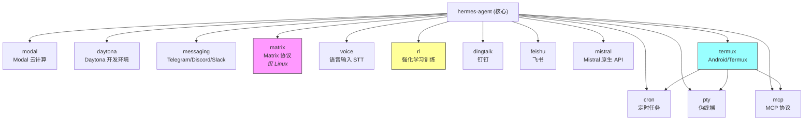
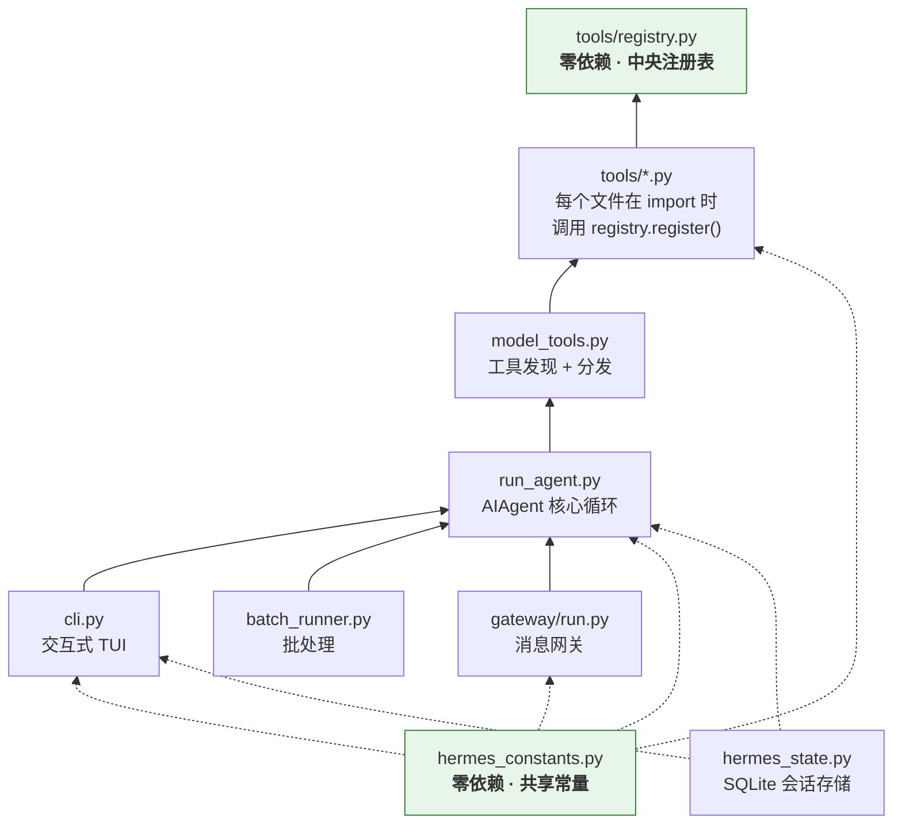

# 第一章 项目全景

> **关键词：** 技术栈选型、模块依赖全景、文件依赖链

在深入任何一行源码之前，我们需要先站在高处俯瞰整个项目的轮廓。一个优秀的工程师拿到一份陌生代码时，第一件事不是打开核心文件逐行阅读，而是回答三个问题：**它用什么构建的？它由哪些模块组成？模块之间如何连接？** 本章将围绕这三个问题，从 `pyproject.toml` 出发，逐步展开 Hermes Agent 的全景地图。

---

## 1.1 一句话理解 Hermes Agent

Hermes Agent 是 Nous Research 开发的**自我改进 AI 智能体**（self-improving AI agent），其核心定位是：

> *从经验中创建技能，在使用中改进技能，随处运行。*

版本 v0.9.0，MIT 许可证，纯 Python 实现。代码规模约 **276 个 Python 文件、20 万行代码**（不含测试、虚拟环境和文档站点）。

它不是一个简单的 chatbot wrapper。Hermes Agent 是一个**全栈 AI Agent 框架**，支持：

- **CLI 交互**：带有 Rich 渲染和 prompt_toolkit 输入的终端界面
- **多平台消息网关**：Telegram、Discord、Slack、微信、钉钉、飞书等 17+ 平台
- **工具系统**：终端执行、文件操作、网页搜索、浏览器自动化等 35+ 工具
- **技能系统**：可学习、可共享、可自我改进的技能集合
- **记忆系统**：跨会话持久记忆
- **子智能体委托**：任务分解与并行执行

---

## 1.2 技术栈选型

打开 `pyproject.toml`，我们能读出整个项目的技术哲学。

### 1.2.1 核心依赖

`dependencies` 列表中的每一项都经过精心挑选，并使用 **pinned ranges**（`>=x,<y`）锁定版本范围。源码注释说得很直白：

```toml
# Core — pinned to known-good ranges to limit supply chain attack surface
```

以下是核心依赖的完整分类：

| 类别 | 依赖 | 版本约束 | 用途 |
|------|------|---------|------|
| **LLM SDK** | `openai>=2.21.0,<3` | 主接口 | 所有 LLM 调用走 OpenAI 兼容协议 |
| **LLM SDK** | `anthropic>=0.39.0,<1` | 原生适配 | Anthropic 模型的原生 API 适配 |
| **配置** | `python-dotenv>=1.2.1,<2` | 环境变量 | `.env` 文件加载 |
| **CLI 框架** | `fire>=0.7.1,<1` | 命令路由 | CLI 子命令路由 |
| **HTTP** | `httpx[socks]>=0.28.1,<1` | 异步 HTTP | 带 SOCKS 代理支持的客户端 |
| **TUI 渲染** | `rich>=14.3.3,<15` | 终端美化 | Banner、Panel、Markdown 渲染 |
| **TUI 输入** | `prompt_toolkit>=3.0.52,<4` | 交互输入 | 自动补全、多行编辑 |
| **重试** | `tenacity>=9.1.4,<10` | 重试策略 | API 调用重试和回退 |
| **配置格式** | `pyyaml>=6.0.2,<7` | YAML 解析 | `config.yaml` 读写 |
| **HTTP** | `requests>=2.33.0,<3` | 同步 HTTP | 备用 HTTP 客户端 |
| **模板** | `jinja2>=3.1.5,<4` | 模板引擎 | System Prompt 模板渲染 |
| **数据校验** | `pydantic>=2.12.5,<3` | 数据模型 | 配置与数据校验 |
| **搜索** | `exa-py`, `parallel-web` | — | Web 搜索引擎 |
| **爬取** | `firecrawl-py>=4.16.0,<5` | 网页提取 | 网页内容结构化提取 |
| **图像** | `fal-client>=0.13.1,<1` | 图像生成 | Fal.ai 图像生成 |
| **语音** | `edge-tts>=7.2.7,<8` | 语音合成 | 免费 TTS，无需 API key |
| **认证** | `PyJWT[crypto]>=2.12.0,<3` | JWT | Skills Hub GitHub App 认证 |

从这张表中可以读出几个重要的**设计选择**：

**1. "OpenAI 兼容优先，但不放弃原生优化"**

项目同时依赖 `openai` 和 `anthropic` 两个 SDK。前者作为统一接口——市面上绝大多数 LLM 提供商都支持 OpenAI 兼容协议；后者用于 Anthropic 模型的原生适配（如 prompt caching 等原生特性）。这种"兼容层 + 原生层"的双轨策略在后续章节中会反复出现。

**2. Rich + prompt_toolkit = Python CLI TUI 的黄金搭配**

`rich` 负责输出美化（Banner、Panel、Markdown 渲染、Spinner），`prompt_toolkit` 负责输入增强（自动补全、多行编辑、快捷键绑定）。这是 Python 社区构建交互式 CLI 的标准选择，二者各司其职、互不冲突。

**3. `httpx[socks]` 暗示了全球用户视角**

SOCKS 代理支持说明团队考虑了需要代理才能访问 API 的使用场景，体现了对非美国用户的友好态度。

**4. Jinja2 渲染 System Prompt**

选择模板引擎而非简单的字符串拼接来构建 system prompt，说明提示词构建逻辑已经复杂到需要条件分支、循环和变量替换。这个设计在第六章"提示词工程"中会详细展开。

### 1.2.2 可选依赖：17 个 extras 的模块化哲学

`pyproject.toml` 的可选依赖组织为 **17 个 extras**，这是高度模块化设计的直接体现：



几个值得注意的设计细节：

| Extra | 设计考量 |
|-------|---------|
| `termux` | 专为 Android 优化，排除了依赖 C 扩展的 `voice` extra（`ctranslate2` 无 Android wheel） |
| `matrix` | 限定 `sys_platform == 'linux'`，因为 `python-olm` 在 macOS 上存在编译问题 |
| `pty` | 跨平台分支：Unix 用 `ptyprocess`，Windows 用 `pywinpty` |
| `rl` | 通过 git URL 引入 Atropos 和 Tinker，表明强化学习训练仍是实验性功能 |

这种设计确保了 `pip install hermes-agent` 只安装核心功能，用户按需添加：

```bash
pip install hermes-agent[messaging]    # 需要消息平台支持
pip install hermes-agent[termux]       # Android 用户
pip install hermes-agent[all]          # 安装全部
```

### 1.2.3 三个入口点

```toml
[project.scripts]
hermes = "hermes_cli.main:main"        # 交互式 CLI
hermes-agent = "run_agent:main"        # 编程式直接启动
hermes-acp = "acp_adapter.entry:main"  # 编辑器集成（VS Code/Zed/JetBrains）
```

三个入口体现了三种使用模式：

| 入口 | 场景 | 目标用户 |
|------|------|---------|
| `hermes` | 交互式终端 TUI | 日常使用的开发者 |
| `hermes-agent` | 跳过 CLI 直接启动 Agent | 脚本调用、自动化流水线 |
| `hermes-acp` | ACP 服务器 | 编辑器/IDE 用户 |

---

## 1.3 模块结构全景

### 1.3.1 顶层文件

项目根目录放置了 10 余个核心 Python 文件。它们是整个系统的"脊柱"：

| 文件 | 行数 | 职责 |
|------|------|------|
| `run_agent.py` | ~11,000 | **AIAgent 类** — 核心对话循环、tool dispatch、会话持久化 |
| `cli.py` | ~10,000 | **HermesCLI 类** — 交互式 TUI 壳层 |
| `hermes_state.py` | ~1,200 | **SessionDB** — SQLite WAL + FTS5 全文搜索 |
| `toolsets.py` | ~700 | 工具集定义和组合解析 |
| `model_tools.py` | ~560 | 工具编排薄层（发现、分发、schema 管理） |
| `hermes_constants.py` | ~294 | 共享常量（**零依赖**，可从任何地方安全导入） |
| `hermes_logging.py` | ~390 | 结构化日志 |
| `batch_runner.py` | — | 并行批处理 |
| `trajectory_compressor.py` | — | 轨迹压缩 |

注意 `run_agent.py` 和 `cli.py` 各自超过一万行。这不是代码质量问题——它们各自承载了完整的领域逻辑。`run_agent.py` 是 Agent 的"大脑"，`cli.py` 是它的"面孔"。后续章节会分别深入。

### 1.3.2 包结构

```
hermes-agent/
├── agent/                  # Agent 内部模块
│   ├── prompt_builder.py       # System Prompt 组装
│   ├── context_compressor.py   # 自动上下文压缩
│   ├── prompt_caching.py       # Anthropic prompt 缓存
│   ├── model_metadata.py       # 模型上下文长度、token 估算
│   └── display.py              # KawaiiSpinner、工具预览
│
├── tools/                  # 工具实现（自注册模式）
│   ├── registry.py             # 中央工具注册表（零依赖）
│   ├── terminal_tool.py        # 终端执行编排
│   ├── file_tools.py           # 文件读写搜索
│   ├── web_tools.py            # 网页搜索与提取
│   ├── delegate_tool.py        # 子智能体委托
│   ├── mcp_tool.py             # MCP 客户端（~1050 行）
│   └── environments/           # 终端后端（local/docker/ssh/modal/daytona）
│
├── hermes_cli/             # CLI 子命令和配置管理
│   ├── main.py                 # 入口：所有 hermes 子命令
│   ├── commands.py             # 斜杠命令注册表
│   └── skin_engine.py          # 皮肤/主题引擎
│
├── gateway/                # 消息平台网关
│   ├── run.py                  # 主循环、消息分发
│   └── platforms/              # 17+ 平台适配器（24 个文件）
│
├── skills/                 # 捆绑技能（26 个类别目录）
├── optional-skills/        # 官方可选技能
├── cron/                   # 定时调度器
├── plugins/                # 插件系统
├── acp_adapter/            # ACP 服务器（编辑器集成）
├── environments/           # RL 训练环境（Atropos 集成）
└── tests/                  # ~3000 个测试
```

### 1.3.3 消息平台覆盖

`gateway/platforms/` 目录下覆盖了 **17+ 个通信平台**，这是 Hermes Agent 区别于其他 Agent 框架最显著的特征之一：

| 类别 | 平台 |
|------|------|
| **即时通讯** | Telegram, Discord, Slack, Signal, WhatsApp |
| **中国生态** | 微信（WeChat）, 企业微信（WeCom）, 钉钉（DingTalk）, 飞书（Lark）, QQ Bot |
| **开放协议** | Matrix, Mattermost |
| **苹果生态** | BlueBubbles (iMessage 桥接) |
| **通用通道** | Email (IMAP/SMTP), SMS (Twilio), Webhook, API Server |
| **IoT** | Home Assistant |

所有平台共享同一组核心工具（`_HERMES_CORE_TOOLS`），这意味着用户在 Telegram 上和在 CLI 上获得的 Agent 能力是一致的。

---

## 1.4 文件依赖链

理解模块间的依赖关系是阅读源码的钥匙。Hermes Agent 的核心依赖链清晰而有层次：



### 1.4.1 自注册工具模式（Self-Registration Pattern）

这是 Hermes Agent 工具系统的核心架构模式，理解它等于理解了半个项目：

```python
# tools/registry.py — 零依赖的中央注册表
class ToolRegistry:
    def register(self, name, toolset, schema, handler, check_fn=None):
        """在 import 时被各工具模块调用"""
        ...
```

```python
# tools/web_tools.py — 典型的工具文件
from tools.registry import registry

def web_search(query, **kwargs):
    """执行网页搜索"""
    ...

registry.register(
    name="web_search",
    toolset="web",
    schema=WEB_SEARCH_SCHEMA,
    handler=lambda args, **kw: web_search(**args, **kw),
    check_fn=_check_requirements,
)
```

```python
# model_tools.py — 导入所有工具模块，触发注册
import tools.web_tools      # 模块加载 → 执行模块级 register() 调用
import tools.file_tools
import tools.terminal_tool
# ...
```

这种模式的优势是：**添加新工具不需要修改任何注册文件**，只需创建一个新的 Python 文件并在模块级别调用 `registry.register()`。`CONTRIBUTING.md` 提供了标准模板：

```python
from tools.registry import registry

def my_tool(param1, param2, **kwargs):
    """工具实现"""
    ...

registry.register(
    name="my_tool",
    toolset="my_toolset",
    schema=MY_TOOL_SCHEMA,
    handler=lambda args, **kw: my_tool(**args, **kw),
    check_fn=_check_requirements,
)
```

### 1.4.2 零依赖基石模块

`hermes_constants.py` 和 `tools/registry.py` 是两个**零依赖的基石模块**。它们只使用 Python 标准库，不导入项目内的任何其他模块。这种设计避免了循环导入——在一个 20 万行的 Python 项目中，循环导入问题如果不从架构上预防，将变得无法收拾。

`hermes_constants.py` 的文件头注释明确声明了这个契约：

```python
"""Shared constants for Hermes Agent.

Import-safe module with no dependencies — can be imported from anywhere
without risk of circular imports.
"""
```

---

## 1.5 `hermes_constants.py` 深度解析

这个仅有 294 行的文件是理解项目运行时环境适配的钥匙。

### 1.5.1 Profile-Safe 路径解析

项目中所有文件路径都通过 `get_hermes_home()` 获取，绝不硬编码 `~/.hermes`：

```python
def get_hermes_home() -> Path:
    """Return the Hermes home directory (default: ~/.hermes).

    Reads HERMES_HOME env var, falls back to ~/.hermes.
    This is the single source of truth.
    """
    return Path(os.getenv("HERMES_HOME", Path.home() / ".hermes"))
```

`AGENTS.md` 将这条规则标为**最重要的开发规范**——曾因违反此规则在一个 PR 中引入 5 个 bug（PR #3575）。

### 1.5.2 向后兼容的目录迁移

当项目调整目录结构时，`get_hermes_dir()` 确保了平滑迁移：

```python
def get_hermes_dir(new_subpath, old_name):
    """优先使用旧路径（如果存在），否则使用新路径"""
    old_path = home / old_name
    if old_path.exists():
        return old_path    # 旧路径存在 → 继续使用，不打扰用户
    return home / new_subpath  # 新安装 → 使用新路径
```

这是一个朴素但有效的迁移策略：不强制用户执行迁移脚本，而是在运行时自动适配。

### 1.5.3 环境检测与 IPv4 补丁

文件提供了三个环境检测函数（`is_termux()`、`is_wsl()`、`is_container()`），各采用不同的探测策略。它们都使用模块级全局变量缓存结果，避免重复的文件系统访问。

其中最精巧的是 `apply_ipv4_preference()`——在 IPv6 不可达的服务器上，Python 默认尝试 AAAA 记录会导致连接超时。解决方案是猴子补丁 `socket.getaddrinfo` 强制 IPv4 优先，同时用 `_hermes_ipv4_patched` 标志防止多入口点场景下的重复补丁。

---

## 1.6 工具集架构

`toolsets.py` 定义了工具的**组织和组合方式**，是理解"Agent 有哪些能力"的关键入口。

### 1.6.1 核心工具列表

`_HERMES_CORE_TOOLS` 定义了 CLI 和所有消息平台共享的 **35 个核心工具**：

| 类别 | 工具 |
|------|------|
| **Web** | `web_search`, `web_extract` |
| **终端** | `terminal`, `process` |
| **文件** | `read_file`, `write_file`, `patch`, `search_files` |
| **视觉** | `vision_analyze`, `image_generate` |
| **技能** | `skills_list`, `skill_view`, `skill_manage` |
| **浏览器** | 10 个浏览器自动化工具 |
| **语音** | `text_to_speech` |
| **规划** | `todo`, `memory` |
| **会话** | `session_search` |
| **其他** | `clarify`, `execute_code`, `delegate_task`, `cronjob`, `send_message` |

### 1.6.2 工具集组合模式

`TOOLSETS` 字典定义了 **30+ 个工具集**，支持分层组合：

```python
TOOLSETS = {
    # 基础工具集
    "web":      {"tools": ["web_search", "web_extract"]},
    "terminal": {"tools": ["terminal", "process"]},
    "file":     {"tools": ["read_file", "write_file", "patch", "search_files"]},

    # 场景工具集 — 组合多个基础工具集
    "debugging": {"includes": ["terminal", "web", "file"]},
    "safe":      {"tools": [...]},  # 无终端访问的安全模式

    # 平台工具集 — 所有平台共享核心工具
    "hermes-cli":      {"tools": _HERMES_CORE_TOOLS},
    "hermes-telegram":  {"tools": _HERMES_CORE_TOOLS},
    "hermes-discord":   {"tools": _HERMES_CORE_TOOLS},
    # ... 17 个平台

    # 聚合工具集
    "hermes-gateway":  {"includes": ["hermes-telegram", "hermes-discord", ...]},
}
```

### 1.6.3 递归解析与安全保护

`resolve_toolset()` 函数实现了递归解析，支持工具集之间的 `includes` 引用，并内建了安全机制：

```python
def resolve_toolset(name, visited=None):
    """递归解析工具集，支持组合、去重、循环检测"""
    if visited is None:
        visited = set()
    if name in visited:
        return []  # 循环检测
    visited.add(name)

    toolset = TOOLSETS.get(name, {})
    tools = list(toolset.get("tools", []))

    for include in toolset.get("includes", []):
        tools.extend(resolve_toolset(include, visited))  # 递归解析

    return list(dict.fromkeys(tools))  # 去重但保序
```

特别值得注意的是三重保护：**循环检测**（`visited` 集合）、**菱形依赖去重**（`dict.fromkeys`）、**特殊别名**（`all` / `*` 解析所有工具）。

---

## 1.7 用户配置体系

Hermes Agent 的运行时状态分布在 `~/.hermes/` 目录下：

```
~/.hermes/
├── config.yaml        # 用户设置（模型、终端、工具集、压缩策略等）
├── .env               # API key 和密钥
├── auth.json          # OAuth 凭据（Nous Portal）
├── state.db           # SQLite 会话数据库（WAL 模式 + FTS5）
├── sessions/          # JSON 会话日志（完整对话轨迹）
├── skills/            # 所有活跃技能
├── memories/          # 持久记忆（MEMORY.md, USER.md）
├── cron/              # 定时任务数据
└── skins/             # 自定义皮肤（YAML）
```

**Profile 模式**允许为不同场景创建完全隔离的配置空间。每个 profile 有独立的 `HERMES_HOME`，所有路径通过 `get_hermes_home()` 自动解析到正确的 profile 目录。

---

## 1.8 关键设计模式

在代码全景中，我们已经隐约看到了若干反复出现的设计模式。这里做一个汇总，为后续章节的深入分析做铺垫。

### Skill vs Tool 哲学

`CONTRIBUTING.md` 明确了一条重要原则：**大部分功能应该是 Skill 而非 Tool。**

| 维度 | Skill | Tool |
|------|-------|------|
| **实现** | 指令 + shell 命令 + 现有工具组合 | 端到端的 Python API 集成 |
| **门槛** | 低：无需编写自定义 Python 代码 | 高：需要处理 API、schema、错误 |
| **适用场景** | 可用已有工具组合解决的任务 | 需要二进制数据处理、自定义协议 |

技能系统分三层：

1. **Bundled skills**（`skills/`）：捆绑发布，26 个类别
2. **Optional skills**（`optional-skills/`）：官方但不默认激活
3. **Skills Hub**：社区贡献，通过 `hermes skills install` 安装

### Prompt 缓存保护

`AGENTS.md` 特别强调：**禁止在对话中途改变上下文、工具集、记忆或系统提示词**。原因很现实——这会打破 prompt 缓存，导致 API 成本剧增。唯一允许的上下文修改是自动压缩（由 `context_compressor.py` 执行）。

### 六层安全纵深

Hermes Agent 实现了六层安全防护：

1. **Shell 注入防护**：sudo 密码注入使用 `shlex.quote()` 转义
2. **危险命令审批**：检测并拦截危险命令，要求用户确认
3. **Cron 注入扫描**：防止通过定时任务进行 prompt injection
4. **写入拒绝列表**：受保护路径不可写入，解析符号链接防绕过
5. **技能安全卫士**：Hub 安装的技能经过安全扫描
6. **执行沙箱**：代码执行时剥离 API key 环境变量；Docker 容器全部 capability drop

### 同步核心循环

Agent 的核心对话循环是**完全同步**的：

```python
while api_call_count < max_iterations and iteration_budget.remaining > 0:
    response = client.chat.completions.create(
        model=model, messages=messages, tools=tool_schemas
    )
    if response.tool_calls:
        for tool_call in response.tool_calls:
            result = handle_function_call(tool_call.name, tool_call.args, task_id)
            messages.append(tool_result_message(result))
    else:
        return response.content
```

选择同步而非异步是一个深思熟虑的决定——Agent 的每一步都依赖上一步的结果，异步在这里不会带来并发优势，反而会增加复杂度。消息网关层面的异步交给各平台适配器独立处理。

---

## 1.9 与同类项目的对比

将 Hermes Agent 与其他知名 Agent 框架做一个快速对比，有助于理解它的定位：

| 维度 | Hermes Agent | Claude Code | 典型 LangChain 应用 |
|------|-------------|-------------|---------------------|
| **语言** | Python | TypeScript | Python |
| **LLM 接口** | OpenAI 兼容（多模型） | Anthropic 原生 | 多抽象层 |
| **对话循环** | 同步 | 异步 | 异步 |
| **工具注册** | 自注册模式 | 静态定义 | 装饰器注册 |
| **平台支持** | 17+ 消息平台 + CLI | CLI only | 取决于开发者 |
| **技能/记忆** | 内建三层技能 + 持久记忆 | 无 | 需第三方集成 |
| **代码规模** | ~207K 行 | ~50K 行 | 应用级别 |

Hermes Agent 的独特之处在于：它不是一个"框架"要求你在上面构建应用，而是一个**可以直接使用的完整产品**，同时又保持了框架级别的可扩展性。

---

## 1.10 本章小结

本章建立了阅读 Hermes Agent 源码所需的全景地图。让我们回顾三个核心问题的答案：

**它用什么构建的？**
- 纯 Python（≥3.11），核心依赖 17 个，可选依赖分 17 个 extras
- OpenAI SDK 为主接口，Anthropic SDK 为原生优化
- Rich + prompt_toolkit 构建 CLI，Jinja2 渲染提示词，SQLite 持久化

**它由哪些模块组成？**
- 两个万行核心文件：`run_agent.py`（Agent 大脑）和 `cli.py`（交互界面）
- 工具系统：`registry.py` → `tools/*.py` → `model_tools.py`
- 消息网关：17+ 平台适配器共享统一核心工具集
- 技能系统：三层架构（bundled / optional / hub）

**模块之间如何连接？**
- 两个零依赖基石模块（`hermes_constants.py`、`tools/registry.py`）打破循环依赖
- 自注册工具模式：工具在模块加载时自动注册，无需中央配置
- 工具集组合模式：`includes` 递归引用 + 循环检测 + 菱形去重

在接下来的章节中，我们将沿着这张地图深入每个模块的内部实现。下一章，我们从 `hermes_cli/main.py` 出发，跟踪一个用户输入从键盘到 Agent 响应的完整旅程。

---

> **延伸阅读：** 如果你想快速验证本章描述的架构，可以运行以下命令：
>
> ```bash
> # 验证三个入口点
> python -c "from hermes_cli.main import main; print('CLI entry OK')"
> python -c "from run_agent import main; print('Agent entry OK')"
> python -c "from acp_adapter.entry import main; print('ACP entry OK')"
>
> # 验证零依赖常量模块
> python -c "from hermes_constants import get_hermes_home; print(get_hermes_home())"
>
> # 验证工具集解析
> python -c "from toolsets import resolve_toolset; print(f'{len(resolve_toolset(\"hermes-cli\"))} tools')"
> ```
