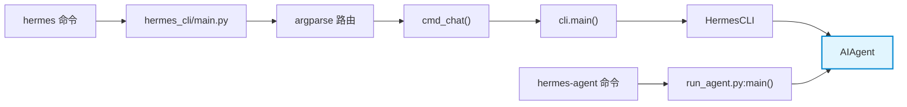
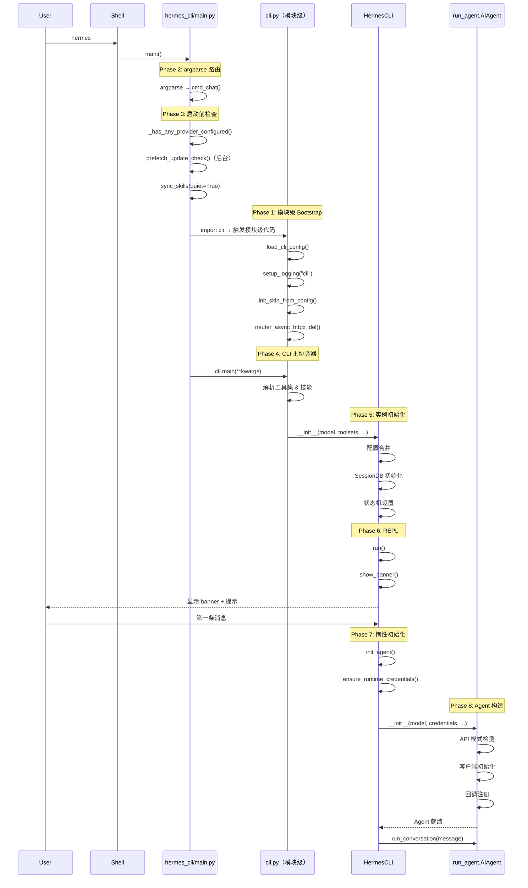

# 02 - 启动链路

> **引导问题：** 当你在终端键入 `hermes` 并按下回车，到 Agent 真正准备好接收第一条消息，中间经历了哪些步骤？哪些是立即执行的，哪些是惰性延迟的？

启动链路是理解任何大型应用的第一步。Hermes Agent 的启动过程并非简单的"解析参数 → 创建对象 → 运行循环"，而是一条精心设计的**八阶段流水线**——从 Python 入口点分发，到模块级副作用执行，再到惰性 Agent 初始化——每一步都体现了"**尽晚初始化、尽早响应用户**"的设计哲学。

本章将完整拆解这条链路，让你明白每一行代码在启动过程中的角色。

---

## 2.1 双入口点架构

Hermes 在 `pyproject.toml` 中注册了两个主要的 console_scripts 入口：

```toml
[project.scripts]
hermes       = "hermes_cli.main:main"
hermes-agent = "run_agent:main"
```

| 入口点 | 目标模块 | 适用场景 |
|--------|----------|----------|
| `hermes` | `hermes_cli/main.py:main()` | 完整交互式 CLI，日常开发使用 |
| `hermes-agent` | `run_agent.py:main()` | 简化直接运行器，用于脚本 / 自动化 / CI |

为什么需要两个入口？这是一个经典的**面向不同用户群体的设计**：

- **`hermes`** 走的是"完整体验"路径——Rich 终端渲染、prompt_toolkit 交互、banner 展示、会话恢复、slash 命令，适合人类开发者日常使用。
- **`hermes-agent`** 走的是"最短路径"——直接接收 query、创建 AIAgent、执行对话、输出结果，适合被其他程序调用。

两条链路最终都汇聚到同一个核心：`AIAgent` 类。区别仅在于**到达 `AIAgent` 之前**经过了多少中间层。



---

## 2.2 链路一：交互式 CLI 的八阶段启动

这是最常用的路径，也是最复杂的。我们把它拆分为八个阶段逐一分析。

### Phase 1 — 模块级 Bootstrap

**位置**：`cli.py` L522-564

当 Python 解释器导入 `cli.py` 模块时，以下代码**立即执行**——不需要调用任何函数：

```python
# cli.py 模块级代码（L522-564）

CLI_CONFIG = load_cli_config()          # ① 加载配置文件
setup_logging(mode="cli")               # ② 初始化日志系统
print_config_warnings()                 # ③ 配置问题预警
init_skin_from_config(CLI_CONFIG)       # ④ 初始化皮肤/主题引擎
set_tool_preview_max_len(...)           # ⑤ 设置工具输出预览长度
neuter_async_httpx_del()                # ⑥ 补丁 httpx 析构函数
```

每一步都被 `try/except` 保护——任何一步失败都不会阻止 CLI 启动。这是防御性编程的典范。

> **🔍 源码细节：为什么要 `neuter_async_httpx_del()`？**
>
> OpenAI SDK 内部的 `AsyncHttpxClientWrapper.__del__` 会尝试在 asyncio 事件循环上调度 `aclose()`。但在 CLI 空闲时，它会找到 prompt_toolkit 的事件循环，试图关闭已绑定到其他 worker loop 的 TCP 连接——导致 "Event loop is closed" 错误。这个补丁在源头禁用了该析构函数。

**关键洞察**：模块级副作用意味着，即使你只是 `import cli`，配置就已经加载了、日志就已经初始化了。这是有意为之——确保整个模块的运行时环境在任何函数调用前就已就绪。

### Phase 2 — 入口分发（argparse 路由）

**位置**：`hermes_cli/main.py:main()`

```python
def main():
    parser = argparse.ArgumentParser()
    subparsers = parser.add_subparsers()
    
    # 注册子命令
    # chat (默认), run, config, setup, gateway, sessions, logs, ...
    
    args = parser.parse_args()
    args.func(args)  # 分发到对应的 cmd_xxx() 函数
```

`hermes` 命令默认路由到 `chat` 子命令，即 `cmd_chat(args)`。其他子命令如 `hermes setup`、`hermes sessions list` 则分别路由到各自的处理函数。

### Phase 3 — 启动前检查

**位置**：`hermes_cli/main.py` `cmd_chat()` L676-783

这一阶段执行一系列**守卫检查**，确保环境就绪后再进入主流程：

```python
def cmd_chat(args):
    # ① 解析 session 恢复参数
    #    --continue / --resume → 查找 session ID
    
    # ② Provider 配置检查
    if not _has_any_provider_configured():
        print("Run: hermes setup")
        # 交互式提示：是否立即运行 setup？
    
    # ③ 后台更新检查
    prefetch_update_check()
    
    # ④ 同步内置技能
    sync_skills(quiet=True)
    
    # ⑤ YOLO 模式（跳过危险命令审批）
    if args.yolo:
        os.environ["HERMES_YOLO_MODE"] = "1"
    
    # ⑥ 构建 kwargs，调用 cli.main()
    cli_main(**kwargs)
```

**设计亮点**：`prefetch_update_check()` 在后台线程中执行版本检查，不阻塞主流程。`sync_skills()` 使用增量同步——跳过未改变的技能文件，保持启动速度。

### Phase 4 — CLI 主协调器

**位置**：`cli.py:main()` L9813-10039

`cli.main()` 是连接"命令行参数"与"HermesCLI 实例"的桥梁：

```python
def main(model=None, toolsets=None, provider=None, query=None, 
         resume=None, worktree=False, **kwargs):
    os.environ["HERMES_INTERACTIVE"] = "1"
    
    # ① Gateway 模式检查（单独启动路径）
    # ② Git worktree 隔离（如果请求）
    # ③ 解析工具集 → _get_platform_tools()
    # ④ 解析技能
    # ⑤ 创建 HermesCLI 实例
    cli = HermesCLI(model=model, toolsets=toolsets, ...)
    
    # ⑥ 注入技能/worktree 上下文到 system prompt
    
    # ⑦ 模式分叉
    if query:
        cli.chat(query)  # 单次查询模式 (-q)
    else:
        cli.run()         # 交互式 REPL
```

注意这里设置了 `HERMES_INTERACTIVE=1` 环境变量——下游代码通过检查此变量来决定是否使用交互式特性（如 spinner、彩色输出等）。

### Phase 5 — HermesCLI 初始化

**位置**：`cli.py` `HermesCLI.__init__()` L1577-1827

这是启动链路中最"重"的构造函数之一，负责设置整个交互式 CLI 的运行环境：

```python
class HermesCLI:
    def __init__(self, model=None, toolsets=None, provider=None,
                 max_turns=None, verbose=False, resume=None, ...):
        self.console = Console()         # Rich 终端渲染
        self.config = CLI_CONFIG         # 引用模块级配置
        # ... 大量初始化 ...
```

关键初始化步骤按功能分组：

| 类别 | 初始化内容 | 说明 |
|------|-----------|------|
| **渲染** | Rich Console | 终端输出渲染引擎 |
| **配置** | 多源合并 | CLI args > env vars > config file > defaults |
| **模型** | 模型名解析 | config.yaml 是权威来源（不是环境变量） |
| **会话** | Session ID 生成 | 格式：`YYYYMMDD_HHMMSS_<6位hex>` |
| **持久化** | SQLite SessionDB | 会话历史持久化 |
| **状态机** | 多个状态标志 | clarify、approval、sudo、voice、spinner |
| **容错** | 降级 provider 链 | fallback provider 配置 |
| **路由** | Smart routing | 智能模型路由配置 |

**配置合并顺序**（优先级从高到低）：

```
CLI 参数 (--model, --provider, ...)
    ↓ 覆盖
环境变量 (HERMES_MODEL, HERMES_PROVIDER, ...)
    ↓ 覆盖
配置文件 (~/.hermes/config.yaml)
    ↓ 覆盖
硬编码默认值
```

这个四层瀑布式的配置合并模式在很多成熟项目中都能见到（如 Docker、Kubernetes），它让用户可以在不同层级灵活覆盖配置。

> **📝 Max Turns 的解析顺序**
>
> `max_turns`（Agent 最大迭代次数）的优先级是：CLI arg > config file > env var > default(90)。注意它与一般配置的优先级顺序略有不同——config file 优先于 env var。

### Phase 6 — 主 REPL 循环

**位置**：`cli.py` `cli.run()` L8185-8385+

当 `cli.run()` 被调用时，用户才真正看到 Hermes 的交互界面：

```python
def run(self):
    # ① 推 TUI 到终端底部
    # ② 显示 banner
    self.show_banner()
    
    # ③ 恢复模式：加载并展示历史消息
    # ④ 显示欢迎文本 + 随机提示
    
    # ⑤ 初始化运行时状态
    #    - 消息队列、锁
    #    - 语音模式、剪贴板
    
    # ⑥ 注册回调
    #    - sudo 回调、approval 回调、secret capture
    
    # ⑦ 确保 Tirith 安全扫描器就绪
    
    # ⑧ 设置 prompt_toolkit 键绑定
    #    Enter, Ctrl+C, 方向键...
    
    # ⑨ 进入事件循环
    while True:
        user_input = prompt(...)
        response = self.process_input(user_input)
        # 渲染响应 → 等待下一条输入
```

**到这一步为止，`AIAgent` 还没有被创建！** 用户已经看到了 banner，可以输入命令——但真正的 AI Agent 是在下一阶段才被惰性初始化的。

### Phase 7 — 惰性 Agent 初始化

**位置**：`cli.py` `_init_agent()` L2801-2939

**这是整个启动链路中最关键的设计决策**：`AIAgent` 的创建被推迟到用户发送第一条消息时。

```python
def _init_agent(self, *, model_override=None, ...):
    if self.agent is not None:
        return True  # 已初始化，直接返回
    
    # ① 解析运行时凭证
    if not self._ensure_runtime_credentials():
        return False
    
    # ② 初始化 SessionDB（如果尚未完成）
    
    # ③ 恢复会话历史（从 SQLite）
    if self._resumed and self._session_db:
        restored = self._session_db.get_messages_as_conversation(self.session_id)
        self.conversation_history = restored
    
    # ④ 创建 AIAgent —— 传入 ~35+ 个参数
    self.agent = AIAgent(
        model=effective_model,
        api_key=runtime["api_key"],
        base_url=runtime["base_url"],
        provider=runtime["provider"],
        max_iterations=self.max_turns,
        enabled_toolsets=self.enabled_toolsets,
        session_id=self.session_id,
        platform="cli",
        session_db=self._session_db,
        clarify_callback=self._clarify_callback,
        # ... 还有 20+ 个参数
    )
    
    # ⑤ 存储引用，用于 atexit 清理
    global _active_agent_ref
    _active_agent_ref = self.agent
```

**为什么要惰性初始化？** 三个原因：

1. **快速启动**：用户打开 Hermes 后立即看到 banner，不需要等待网络请求或凭证验证。
2. **无凭证浏览**：用户可以在没有 API key 的情况下使用 `/help`、`/sessions` 等本地命令。
3. **凭证轮换**：`_ensure_runtime_credentials()` 每次都重新解析，支持不重启 CLI 的密钥更新。

### Phase 8 — AIAgent 构造

**位置**：`run_agent.py` `AIAgent.__init__()` L550-925+

这是启动链路的终点——AIAgent 的构造函数初始化了 Agent 的所有核心能力：

```python
class AIAgent:
    def __init__(self, model, api_key, base_url, provider, ...):
        # ① API 模式检测
        #    chat_completions / codex_responses / anthropic_messages
        
        # ② 模型名标准化
        #    非聚合器 provider 需要处理模型名前缀
        
        # ③ GPT-5.x 自动升级
        #    检测到 GPT-5.x 时自动切换到 Responses API
        
        # ④ 后台线程
        #    OpenRouter 模型元数据预热
        
        # ⑤ 回调注册
        #    10+ 种回调：clarify, reasoning, thinking, 
        #    tool_progress, stream_delta, ...
        
        # ⑥ 迭代预算
        #    IterationBudget — 与子 agent 共享
        
        # ⑦ Prompt 缓存
        #    Claude 模型的 prompt caching 配置
        
        # ⑧ 客户端初始化
        #    通过 provider router 创建 API 客户端
        
        # ⑨ 日志设置
        #    hermes_logging.setup_logging()
```

AIAgent 初始化中最值得注意的是**三种 API 模式**的自动检测：

| API 模式 | 触发条件 | 适用模型 |
|----------|---------|---------|
| `chat_completions` | 默认 | OpenAI GPT-4o、Claude（通过 OpenRouter）等 |
| `codex_responses` | GPT-5.x 模型 | GPT-5、GPT-5-mini |
| `anthropic_messages` | Anthropic 直连 provider | Claude 全系列 |

系统根据 provider 和模型名自动选择正确的 API 模式，开发者无需手动指定。

---

## 2.3 链路二：直接 Agent 运行器

**位置**：`run_agent.py:main()` L10809-11024

`hermes-agent` 命令走的是极简路径，省略了所有 CLI 交互层：

```python
def main():
    # ① 解析参数
    parser = argparse.ArgumentParser()
    # query, model, api_key, base_url, max_turns, toolsets...
    args = parser.parse_args()
    
    # ② 处理 --list-tools
    if args.list_tools:
        print_available_tools()
        return
    
    # ③ 直接创建 AIAgent
    agent = AIAgent(
        base_url=args.base_url,
        model=args.model,
        api_key=args.api_key,
        max_iterations=args.max_turns,
        # ...
    )
    
    # ④ 运行对话
    result = agent.run_conversation(args.query)
    
    # ⑤ 输出摘要
    print(f"Status: {result['status']}")
    print(f"API calls: {result['api_call_count']}")
    print(f"Response: {result['final_response']}")
    
    # ⑥ 可选：保存轨迹样本
```

两条链路的对比一目了然：

```mermaid
graph TB
    subgraph "hermes 命令（8 阶段）"
        A1["Phase 1: 模块 Bootstrap"] --> A2["Phase 2: argparse 路由"]
        A2 --> A3["Phase 3: 启动前检查"]
        A3 --> A4["Phase 4: CLI 主协调器"]
        A4 --> A5["Phase 5: HermesCLI 初始化"]
        A5 --> A6["Phase 6: REPL 循环"]
        A6 --> A7["Phase 7: 惰性 Agent 初始化"]
        A7 --> A8["Phase 8: AIAgent 构造"]
    end

    subgraph "hermes-agent 命令（3 步）"
        B1["argparse"] --> B2["AIAgent 构造"]
        B2 --> B3["run_conversation()"]
    end

    style A8 fill:#e1f5fe,stroke:#0288d1
    style B2 fill:#e1f5fe,stroke:#0288d1
```



---

## 2.4 完整时序图

下面这张时序图展示了 `hermes` 命令从键入到 Agent 就绪的完整流程：



> **注意时序**：Phase 1（模块级 Bootstrap）实际发生在 `import cli` 时，即 `cmd_chat()` 内部 `from cli import main` 那一行。所以虽然编号是 Phase 1，但在时间线上它发生在 Phase 3 之后。编号反映的是逻辑分层，不是严格的执行顺序。

---

## 2.5 关键架构洞察

### 2.5.1 惰性初始化模式（Lazy Initialization）

整个启动链路最重要的设计决策：

```
CLI 启动 → 显示 banner → 等待输入 → 第一条消息 → _init_agent() → 创建 AIAgent
```

这意味着 Hermes 的启动是**感知上即时**的——用户永远不需要盯着空白终端等待 Agent 初始化。所有耗时操作（网络请求、凭证验证、模型元数据获取）都推迟到真正需要的时刻。

### 2.5.2 凭证热轮换

```python
def _ensure_runtime_credentials(self):
    # 每次调用都重新解析 provider 和 API key
    resolved = resolve_runtime_provider(self.model, self.provider, ...)
    self.api_key = resolved["api_key"]
    self.base_url = resolved["base_url"]
    self.provider = resolved["provider"]
```

这个方法在每次 Agent 初始化时都被调用——不是一次性的。这意味着如果你在 CLI 运行过程中更新了 `~/.hermes/.env` 中的 API key，下次 Agent 重新初始化时就会自动使用新密钥。

### 2.5.3 共享迭代预算

```python
# AIAgent.__init__() 中
self.iteration_budget = IterationBudget(max_iterations)
# 子 agent 创建时
sub_agent = AIAgent(..., iteration_budget=self.iteration_budget)
```

父 Agent 和所有子 Agent 共享同一个 `IterationBudget` 对象。这是一个关键的安全机制——防止通过递归委托产生的**工具调用级联爆炸**。无论委托链有多深，总迭代次数始终受限。

### 2.5.4 模块级副作用的利与弊

Hermes 选择在 `cli.py` 模块导入时就执行配置加载和日志初始化，这带来了：

**优势**：
- 保证所有下游代码都能访问已初始化的配置
- 避免多处重复初始化的竞态条件
- 确保日志在最早的时刻就开始记录

**劣势**：
- `import cli` 产生副作用，违反"导入应无副作用"的 Python 惯例
- 测试时需要额外处理模块级状态
- 错误消息可能在用户期望之前出现

Hermes 的做法是用 `try/except` 把每个副作用都包起来，确保即使某一步失败也不影响整体启动——这是务实的工程选择。

---

## 2.6 关键文件索引

| 文件 | 关键行号 | 内容 |
|------|----------|------|
| `pyproject.toml` | L114-116 | 入口点定义 |
| `hermes_cli/main.py` | L676-783 | `cmd_chat()` 启动前检查 |
| `cli.py` | L522-564 | 模块级 Bootstrap |
| `cli.py` | L1577-1827 | `HermesCLI.__init__()` |
| `cli.py` | L2801-2939 | `_init_agent()` 惰性初始化 |
| `cli.py` | L8185-8385 | `cli.run()` 主 REPL 循环 |
| `cli.py` | L9813-10039 | `cli.main()` 启动协调器 |
| `run_agent.py` | L550-925 | `AIAgent.__init__()` |
| `run_agent.py` | L10809-11024 | `hermes-agent` 直接入口 |

---

## 2.7 设计模式提炼

本章涉及的启动链路体现了 **五个可迁移的设计模式**：

### 1. 延迟初始化（Lazy Initialization）

**场景**：重量级对象（如 AIAgent）的创建成本高，但 UI 需要即时响应。

**做法**：在第一次真正使用时才创建对象，之前用 `None` 占位。

```python
# 典型实现
def get_agent(self):
    if self._agent is None:
        self._agent = AIAgent(...)  # 首次使用时创建
    return self._agent
```

### 2. 配置瀑布（Configuration Cascade）

**场景**：多个来源可以提供同一配置项，需要明确优先级。

**做法**：按 CLI args > env vars > config file > defaults 的优先级逐层回退。

### 3. 模块级 Bootstrap

**场景**：某些子系统（日志、配置）需要在任何业务逻辑之前就绑定。

**做法**：在模块顶层执行初始化，用 `try/except` 保护每一步。

### 4. 策略模式（Strategy Pattern）

**场景**：不同 provider / 模型需要不同的 API 调用方式。

**做法**：运行时检测条件，动态选择 `chat_completions` / `codex_responses` / `anthropic_messages` 策略。

### 5. 观察者模式（Observer Pattern）

**场景**：Agent 运行过程中的事件（工具调用、推理过程、流式输出）需要通知多个消费者。

**做法**：AIAgent 接受 10+ 种回调函数参数，各消费者注册自己关心的事件。

---

## 2.8 小结

本章完整拆解了 Hermes Agent 从命令行输入到 Agent 就绪的启动链路。核心要点：

1. **双入口设计**：`hermes`（完整 CLI）和 `hermes-agent`（直接运行器）面向不同使用场景，最终汇聚于 `AIAgent`。

2. **八阶段流水线**：模块 Bootstrap → argparse 路由 → 启动前检查 → CLI 协调器 → HermesCLI 初始化 → REPL 循环 → 惰性 Agent 初始化 → AIAgent 构造。

3. **惰性初始化是灵魂**：用户看到 banner 的瞬间，AIAgent 还不存在。一切为了"感知上的即时启动"。

4. **配置瀑布**：四层优先级确保灵活性——同一个配置项可以在命令行、环境变量、配置文件、默认值中的任何一层设定。

5. **防御性编程**：每个模块级副作用都有 `try/except` 保护；每个启动检查失败都有优雅降级路径。

---

> **下一章预告**：[03-配置系统](03-配置系统.md) 将深入 `~/.hermes/config.yaml` 的完整结构，分析配置项的加载、校验、迁移和热更新机制。
