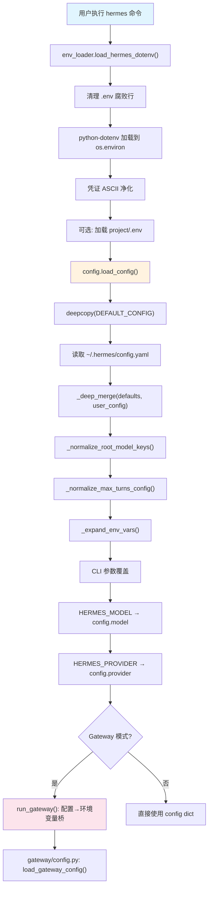
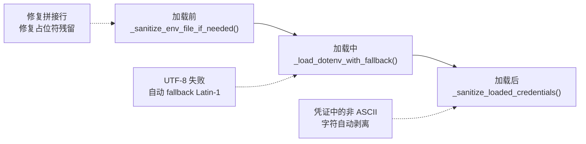
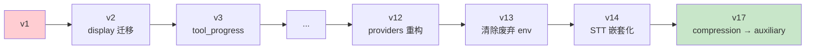
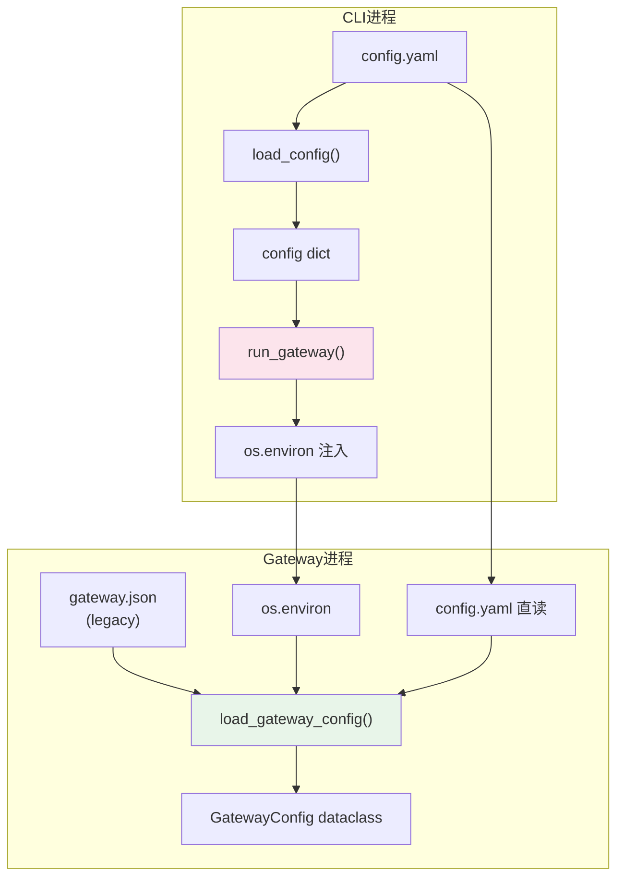

# 03 - 配置系统

> **引导问题：** 一个拥有 3000+ 配置字段、支持 20+ Provider、横跨 CLI 和 Gateway 两套运行模式的 Agent 框架，如何设计配置系统才能既灵活又不失控？

## 3.1 全景概览

Hermes 的配置系统是整个项目中最"重"的子系统之一——核心文件 `hermes_cli/config.py` 超过 3400 行，比很多独立项目的全部代码量还大。这种体量并非偶然：配置系统必须同时解决以下问题：

1. **多源合并**：硬编码默认值、YAML 用户配置、`.env` 环境变量、CLI 参数四层覆盖
2. **版本迁移**：用户从 v1 升级到 v17，配置文件必须自动适配
3. **跨进程传递**：CLI 进程的配置需要桥接到独立的 Gateway 进程
4. **多 Profile 隔离**：支持 work/personal 等多套完全独立的配置环境
5. **安全加固**：API Key 不能泄露，配置文件不能被其他用户读取

本章将从数据流入手，逐层拆解这套系统的设计与实现。

### 核心源码文件

| 文件 | 行数 | 职责 |
|------|------|------|
| `hermes_cli/config.py` | ~3415 | 配置系统的心脏：默认值、加载、保存、迁移 |
| `hermes_cli/env_loader.py` | ~123 | `.env` 文件的最早期加载 |
| `hermes_constants.py` | ~294 | 路径常量（`HERMES_HOME` 等） |
| `gateway/config.py` | ~1160 | Gateway 独立配置模型 |
| `hermes_cli/profiles.py` | ~1094 | Profile 管理系统 |

---

## 3.2 配置数据流：从启动到就绪

Hermes 的配置加载并非一次完成，而是分阶段、分层级地逐步构建。以下是一次完整的配置加载时序：



这个流程体现了 Hermes 配置系统的**四层覆盖**原则：

```
硬编码默认 → YAML 用户配置 → 环境变量 → CLI 参数
（优先级递增 →）
```

每一层都可以覆盖前一层的设置，用户只需关注自己想改的部分。

---

## 3.3 DEFAULT_CONFIG：3000+ 字段的默认值字典

`config.py` 的 L314-707 定义了一个接近 400 行的巨型字典 `DEFAULT_CONFIG`，它是整个配置系统的"地基"。每次 `load_config()` 都会先 `deepcopy` 这个字典，再合并用户配置。

### 顶层结构一览

| 顶层 Key | 用途 | 典型子字段 |
|-----------|------|-----------|
| `model` | 主模型选择 | 字符串或 `{default, provider, base_url}` |
| `providers` | 自定义 Provider 注册 | `{name: {api, api_key, default_model}}` |
| `fallback_providers` | 备选 Provider 列表 | `[{provider, model}]` |
| `agent` | Agent 运行参数 | `max_turns=90`, `gateway_timeout=1800` |
| `terminal` | 终端执行配置 | `backend="local"`, `timeout=180` |
| `browser` | 浏览器工具配置 | `inactivity_timeout`, `command_timeout` |
| `compression` | 上下文压缩 | `threshold=0.50`, `target_ratio=0.20` |
| `auxiliary` | 辅助模型配置 | vision, compression, session_search 等 8 个子任务 |
| `display` | 显示设置 | `personality="kawaii"`, `skin="default"` |
| `tts` / `stt` | 语音合成/识别 | 按 Provider 嵌套（edge, elevenlabs, openai 等） |
| `memory` | 持久记忆 | `memory_enabled=True`, `memory_char_limit=2200` |
| `delegation` | 子 Agent 委托 | model/provider/base_url/max_iterations |
| `security` | 安全设置 | `redact_secrets=True`, tirith 扫描 |
| `_config_version` | 配置版本号 | 当前 `17` |

### 设计亮点

**统一的辅助模型接口**。`auxiliary` 子系统为 8 个不同的辅助任务（vision、web_extract、compression、session_search、skills_hub、approval、mcp、flush_memories）提供了统一的 `{provider, model, base_url, api_key, timeout}` 接口。这意味着你可以为每个辅助任务单独指定模型——例如主 Agent 使用 Claude Opus，而压缩任务使用更便宜的 Haiku：

```yaml
# config.yaml 示例
auxiliary:
  compression:
    provider: anthropic
    model: claude-3-haiku-20240307
  vision:
    provider: openai
    model: gpt-4o
```

**按 Provider 嵌套的语音配置**。TTS 和 STT 不是一个扁平的配置块，而是按 Provider 嵌套——每个 Provider 有自己独立的参数集合：

```yaml
tts:
  provider: edge        # 选择哪个后端
  edge:
    voice: zh-CN-XiaoxiaoNeural
  elevenlabs:
    voice_id: EXAVITQu4vr4xnSDxMaL
    model_id: eleven_turbo_v2
```

这种设计的好处是切换 `tts.provider` 时，其他 Provider 的参数不会丢失，下次切回来就能直接使用。

---

## 3.4 `_deep_merge()`：递归字典合并

四层覆盖的核心实现是一个 20 行不到的递归函数：

```python
# config.py L2386-2403
def _deep_merge(base: dict, override: dict) -> dict:
    result = base.copy()
    for key, value in override.items():
        if key in result and isinstance(result[key], dict) and isinstance(value, dict):
            result[key] = _deep_merge(result[key], value)
        else:
            result[key] = value
    return result
```

这个函数的行为值得仔细理解：

- **嵌套 dict 递归合并**：当用户只覆盖 `tts.elevenlabs.voice_id` 时，`tts.elevenlabs.model_id` 保持默认值不变
- **非 dict 类型直接覆盖**：列表、字符串、数字等类型不会尝试"合并"，而是整体替换
- **用户新增 Key 保留**：如果用户在 YAML 中添加了 `DEFAULT_CONFIG` 中不存在的 Key，也会被保留

这种"只覆盖你关心的字段"模式在配置系统中非常重要——用户不需要复制完整的默认配置再修改，只需要在 YAML 中写出差异部分即可。

---

## 3.5 环境变量系统

### 3.5.1 `.env` 文件的生命周期

Hermes 使用 `~/.hermes/.env` 存储敏感凭证（API Key 等），与 `config.yaml` 分离。这是一个重要的安全设计——`.env` 文件的权限被设置为 `0600`（仅 owner 可读写），而且不包含在任何 YAML 配置备份中。

`.env` 文件由以下函数管理：

| 函数 | 作用 |
|------|------|
| `get_env_value(key)` | 先查 `os.environ`，再 fallback 到 `.env` 文件 |
| `save_env_value(key, value)` | 原子写入 `.env` 文件 + 同步更新 `os.environ` |
| `remove_env_value(key)` | 从 `.env` 文件和 `os.environ` 中同时移除 |
| `_sanitize_env_lines()` | 修复腐败的 `.env` 文件 |

### 3.5.2 `env_loader.py`：最早期加载

`load_hermes_dotenv()` 在 CLI 启动链路的最早期被调用，甚至早于 `load_config()`。加载优先级如下：

```
1. ~/.hermes/.env     (override=True)  → 用户配置，覆盖 shell 已有同名变量
2. project/.env       (override=False) → 开发用 fallback，只填空缺变量
```

注意第一层使用 `override=True`——这意味着 `~/.hermes/.env` 中的值会覆盖 shell 中已导出的同名环境变量。这是一个有意的设计选择：确保 Hermes 的配置始终由其专属 `.env` 文件控制，不会被意外的 shell 导出干扰。

### 3.5.3 防腐败三重保护

`.env` 文件是纯文本，容易在异常情况下被写坏。Hermes 实现了三重防护：



**拼接行修复**（issue #8908）：某些异常场景下，多个 `KEY=VALUE` 可能被写在同一行（缺少换行符）。`_sanitize_env_lines()` 会检测并拆分这些拼接行。

**凭证净化**：用户从 PDF 或网页复制 API Key 时，可能携带不可见的 Unicode 替身字符。`_sanitize_loaded_credentials()` 会自动剥离 `*_TOKEN`、`*_SECRET`、`*_KEY` 变量中的非 ASCII 字符，因为 API Key 必须是有效的 HTTP Header 值。

### 3.5.4 环境变量元数据

`config.py` 中定义了 `OPTIONAL_ENV_VARS` 字典，为每个可配置的环境变量提供元数据：

```python
OPTIONAL_ENV_VARS = {
    "OPENAI_API_KEY": {
        "description": "OpenAI API key",
        "prompt": "OpenAI API key",
        "url": "https://platform.openai.com/api-keys",
        "password": True,        # 交互输入时隐藏字符
    },
    # ... 20+ 个 Provider 的 API Key
}
```

还有一个 `ENV_VARS_BY_VERSION` 字典，记录每个配置版本新增的环境变量，用于迁移时只提示用户配置新增的 Key：

```python
ENV_VARS_BY_VERSION: Dict[int, List[str]] = {
    3: ["FIRECRAWL_API_KEY", "BROWSERBASE_API_KEY", ...],
    4: ["VOICE_TOOLS_OPENAI_KEY", "ELEVENLABS_API_KEY"],
    5: ["WHATSAPP_ENABLED", "WHATSAPP_MODE", ...],
    # ...
}
```

---

## 3.6 `load_config()` 与 `save_config()`：配置的读写

### 3.6.1 加载管线

`load_config()` 是配置系统的主入口，其处理管线可以用一行代码概括：

```python
# config.py L2491-2515 (简化)
def load_config() -> Dict[str, Any]:
    config = copy.deepcopy(DEFAULT_CONFIG)
    if config_path.exists():
        user_config = yaml.safe_load(f) or {}
        config = _deep_merge(config, user_config)
    return _expand_env_vars(
        _normalize_root_model_keys(
            _normalize_max_turns_config(config)
        )
    )
```

处理管线的执行顺序：

```
deepcopy(DEFAULT) → merge(user) → normalize_model_keys → normalize_max_turns → expand_env_vars
```

两个 `_normalize_*` 函数负责向后兼容性迁移：

- `_normalize_root_model_keys()`：将旧格式的根级 `provider`、`base_url` 迁移到新的嵌套结构
- `_normalize_max_turns_config()`：将根级 `max_turns` 迁移到 `agent.max_turns`

`_expand_env_vars()` 支持在 `config.yaml` 中引用环境变量：

```python
# config.py L2406-2423
def _expand_env_vars(obj):
    if isinstance(obj, str):
        return re.sub(
            r"\${([^}]+)}",
            lambda m: os.environ.get(m.group(1), m.group(0)),
            obj
        )
    # 递归处理 dict 和 list ...
```

未解析的 `${VAR}` 保持原样（不报错），这样可以方便地检测哪些变量尚未设置。

### 3.6.2 `read_raw_config()`：轻量级原始读取

除了 `load_config()`，还有一个 `read_raw_config()` 函数，它不走 deep-merge 和 migration 管线，直接返回用户 YAML 文件中的原始内容。这个函数的用途是在迁移逻辑中检查用户**实际写入**的配置（而非合并默认值后的结果），避免循环依赖。

### 3.6.3 保存管线

```python
# config.py L2615-2641 (简化)
def save_config(config: Dict[str, Any]):
    if is_managed():
        managed_error("save configuration")
        return
    normalized = _normalize_root_model_keys(
        _normalize_max_turns_config(config)
    )
    atomic_yaml_write(config_path, normalized, extra_content=parts)
    _secure_file(config_path)
```

三个关键设计点：

1. **Managed Mode 保护**：受管模式下直接拒绝写入（详见 §3.10）
2. **原子写入**：通过 `atomic_yaml_write` 实现——先写临时文件，再 `os.replace` 原子替换，保证崩溃安全
3. **权限加固**：写入后立即调用 `_secure_file()` 设置 `0600` 权限

---

## 3.7 Config Migration：版本化配置迁移

### 3.7.1 核心理念

Hermes 的配置迁移系统借鉴了数据库 Schema Migration 的思想：

- 每个配置文件都有一个 `_config_version` 字段（当前最新版本 `17`）
- `migrate_config()` 函数检查版本号并执行增量迁移
- 从任意旧版本都可以一次性升级到最新



### 3.7.2 迁移实现

```python
# config.py L1978-2383 (简化)
def migrate_config(interactive=True, quiet=False) -> Dict:
    current_ver, latest_ver = check_config_version()

    if current_ver < 2:
        # display.tool_progress 设置迁移
        ...
    if current_ver < 3:
        # tool_progress 设置迁移
        ...
    # ... 每个版本一个 if 块
    if current_ver < 17:
        # compression.summary_* → auxiliary.compression
        ...
```

注意这里使用 `if current_ver < N:` 而非 `switch/case` 或 `elif`，这保证了**从任意旧版本一次性升级**的能力——每个 if 块独立执行，不会跳过中间版本。

### 3.7.3 重要迁移清单

| 版本跳转 | 迁移内容 | 说明 |
|----------|----------|------|
| 1→2 | display.tool_progress | UI 设置重组 |
| 4→5 | 新增 timezone 字段 | 支持时区感知 |
| 8→9 | 清除 ANTHROPIC_TOKEN | 旧认证流程废弃 |
| 11→12 | `custom_providers` 列表 → `providers` 字典 | 数据结构升级 |
| 12→13 | 清除 LLM_MODEL/OPENAI_MODEL | 废弃环境变量清理 |
| 13→14 | STT flat `model` → Provider 嵌套 | 配置结构化升级 |
| 15→16 | tool_progress_overrides → display.platforms | 配置位置调整 |
| 16→17 | compression.summary_* → auxiliary.compression | 压缩配置统一化 |

### 3.7.4 迁移中的防御性设计

迁移逻辑使用 `read_raw_config()` 而非 `load_config()` 来检查用户实际配置：

```python
raw = read_raw_config()
if "custom_providers" in raw:
    # 用户确实使用了旧格式，执行迁移
    ...
```

如果用某些字段的值恰好等于默认值，迁移逻辑不应把它当作"用户设置"——`read_raw_config()` 返回的是 YAML 文件中实际存在的 Key，而非合并默认值后的完整字典。

每步迁移完成后立即调用 `save_config()` 持久化，保证即使中途崩溃，已完成的迁移步骤不会丢失。

---

## 3.8 Gateway 配置桥接

当 Hermes 以 Gateway 模式运行时（提供 Telegram、Discord、Slack、WhatsApp 集成），面临一个架构挑战：CLI 进程的配置如何传递给独立的 Gateway 进程？

### 3.8.1 CLI → Gateway 的环境变量桥

`gateway/run.py` 中的 `run_gateway()` 函数负责这一桥接：

```python
# gateway/run.py (简化)
config = load_config()
os.environ["HERMES_MODEL"] = config.get("model", "")
os.environ["HERMES_PROVIDER"] = config.get("provider", "")

# 桥接 API Keys
for key_name in ("OPENAI_API_KEY", "ANTHROPIC_API_KEY", "OPENROUTER_API_KEY", ...):
    if val := get_env_value(key_name):
        os.environ[key_name] = val
```

为什么不直接传 Python dict？因为 Gateway 可以作为独立进程甚至容器运行，环境变量是跨进程通信的最通用方式。

### 3.8.2 GatewayConfig：独立的配置模型

Gateway 有自己的配置数据模型，不复用 CLI 的 `DEFAULT_CONFIG` 字典：

```python
# gateway/config.py
@dataclass
class GatewayConfig:
    model: str = ""
    provider: str = ""
    base_url: str = ""
    platforms: Dict[str, PlatformConfig] = field(default_factory=dict)
    # ... 30+ 字段
```

`load_gateway_config()` 的多源加载优先级：

```
环境变量 (os.environ)  ←  最高优先级
     ↓
~/.hermes/config.yaml  ←  YAML 各 section 手动映射
     ↓
~/.hermes/gateway.json ←  Legacy fallback
     ↓
内置默认值             ←  最低优先级
```

`config.yaml` 到 `GatewayConfig` 的映射不是自动的，而是手动逐字段桥接（如 `yaml_cfg.get("stt")` → `gw_data["stt"]`）。这种看似"笨拙"的做法实际上提供了清晰的转换语义——你可以精确控制哪些 CLI 配置被传递到 Gateway、以什么形式传递。



---

## 3.9 Profile 系统：目录级配置隔离

### 3.9.1 核心概念

很多工具的 Profile 功能只是"切换配置文件"。Hermes 的 Profile 更进一步——切换的是**整个 `HERMES_HOME` 目录**：

```
~/.hermes/                      ← "default" profile
    ├── config.yaml
    ├── .env
    ├── sessions/
    ├── skills/
    └── memories/

~/.hermes/profiles/work/        ← "work" profile
    ├── config.yaml             ← 独立的配置
    ├── .env                    ← 独立的 API Keys
    ├── sessions/               ← 独立的会话历史
    ├── skills/                 ← 独立的技能
    └── memories/               ← 独立的记忆

~/.hermes/profiles/personal/    ← "personal" profile
    └── (同上)

~/.hermes/active_profile        ← 当前活跃 profile 名称
```

这种设计避免了"选择性合并"的复杂性——每个 Profile 就是一个完整、独立的 Hermes 实例环境。

### 3.9.2 使用方式

```bash
# 单次指定 profile
hermes -p work "帮我写个技术方案"

# 持久切换 profile
hermes profile switch work

# 创建新 profile
hermes profile create work

# 列出所有 profile
hermes profile list
```

切换时，系统将 `HERMES_HOME` 环境变量指向 profile 目录，所有路径计算（`get_config_path()`、`get_env_path()` 等）自动指向新目录。

### 3.9.3 安全约束

Profile 名称有严格的验证规则：

```python
# profiles.py
_RESERVED_NAMES = frozenset({
    "hermes", "default", "test", "tmp", "root", "sudo"
})
_HERMES_SUBCOMMANDS = frozenset({
    "chat", "model", "gateway", "setup", ...
})
```

- 名称格式：`[a-z0-9][a-z0-9_-]{0,63}`
- 不能与保留名冲突（如 `root`、`sudo`）
- 不能与 Hermes 子命令同名（如 `chat`、`gateway`），防止 shell alias 冲突

### 3.9.4 Alias/Wrapper Scripts

`profiles.py` 会在 `~/.local/bin/` 下自动生成 shell wrapper 脚本，让你直接用 profile 名作为命令：

```bash
# 自动生成的 ~/.local/bin/work
#!/bin/sh
exec hermes -p work "$@"
```

之后直接执行 `work "帮我写报告"` 就等同于 `hermes -p work "帮我写报告"`。

---

## 3.10 安全机制与 Managed Mode

### Managed Mode（受管模式）

Hermes 支持以"受管模式"运行（SaaS/Docker 部署），通过 `HERMES_MANAGED=1` 环境变量启用。受管模式下，`save_config()`、`save_env_value()` 等写操作**全部被拦截**，配置完全由外部编排器通过环境变量注入，保证容器化部署的不可变性。

### 文件权限与原子写入

```python
def _secure_file(path: Path):
    if not _IS_WINDOWS:
        os.chmod(path, stat.S_IRUSR | stat.S_IWUSR)  # 0600
```

所有配置文件写入采用 `tempfile → write → fsync → os.replace` 模式。`os.replace()` 在 POSIX 系统上是原子操作——即使进程在写入过程中被杀死，原始文件要么保持不变，要么被完整替换，不会出现"写了一半"的损坏状态。

### 凭证净化

用户从 PDF 或网页复制 API Key 时，可能携带不可见的 Unicode 字符（零宽空格、BOM 等）。`_sanitize_loaded_credentials()` 会自动剥离 `*_TOKEN`、`*_SECRET`、`*_KEY` 变量中的非 ASCII 字符，防止 API 请求因为不可见字符而静默失败。

---

## 3.11 Provider 系统与路径常量

### Provider 别名与自定义注册

Hermes 通过 `PROVIDER_ALIASES` 将缩写映射到规范名称（如 `"gpt"` → `"openai"`、`"claude"` → `"anthropic"`），并允许用户在 `config.yaml` 中注册任何 OpenAI 兼容端点：

```yaml
providers:
  my-local-llm:
    api: http://localhost:8080/v1
    api_key: no-key
    default_model: my-model
```

### 路径常量：`hermes_constants.py`

所有路径计算都从 `get_hermes_home()` 开始，它检查 `HERMES_HOME` 环境变量（默认 `~/.hermes`）。这正是 Profile 系统的切换机制——切换 Profile 本质上就是修改 `HERMES_HOME`，之后 `get_config_path()`、`get_env_path()` 等函数自动指向新目录。

---

## 3.12 设计模式与实践总结

### 模式一：分层配置合并（Layered Configuration）

```
DEFAULT_CONFIG → config.yaml → .env → CLI 参数
```

通过 `_deep_merge()` 实现嵌套字典的智能合并，用户只需覆盖想改的字段。这是 CLI 工具配置的经典最佳实践，Hermes 的实现干净且完整。

### 模式二：版本化迁移（Versioned Migration）

类似数据库 Schema Migration：`_config_version` 跟踪版本号，`migrate_config()` 执行增量升级。关键优势：
- 老用户升级无需手动修改配置
- 新字段自动补充默认值
- 废弃字段自动清理

### 模式三：配置与运行时隔离（Config→Env Bridge）

CLI config（YAML dict）通过显式的环境变量桥传递给 Gateway，而非共享内存。这使得 Gateway 可以独立进程运行，也方便容器化部署。这种设计在微服务架构中很常见，但在单体 CLI 工具中相对少见。

### 模式四：目录级 Profile 隔离

Profile 不是"切换配置文件"，而是切换整个 `HERMES_HOME` 目录——每个 Profile 有独立的 sessions、skills、memories。这避免了选择性合并的复杂性，是一种"粗粒度但可靠"的隔离策略。

### 模式五：防御性配置工程

- 每个文件读取都有 try/except 包裹
- `.env` 解析支持 UTF-8 → Latin-1 fallback
- 凭证自动净化非 ASCII 字符
- 原子写入防止断电数据丢失
- Windows 兼容：显式指定 `encoding="utf-8"`

---

## 3.13 配置系统与其他子系统的交互

| 消费方 | 配置入口 | 说明 |
|--------|---------|------|
| Agent 主循环 | `load_config()` | 获取 model、agent 参数 |
| 工具系统 | `config["terminal"]`, `config["browser"]` | 工具特定配置 |
| Gateway | `load_gateway_config()` | 独立的 dataclass 加载 |
| TTS/STT | `config["tts"]`, `config["stt"]` | 按 Provider 嵌套 |
| 记忆系统 | `config["memory"]` | 是否启用、字符限制 |
| 压缩系统 | `config["compression"]` | 阈值、保护消息数 |
| 辅助模型 | `config["auxiliary"]` | 8 个子任务的独立模型配置 |
| 安全扫描 | `config["security"]` | tirith 扫描、secret 脱敏 |
| Profiles | `profiles.py` | 切换 HERMES_HOME |

配置系统是 Hermes 的"神经系统"——它不直接执行任何业务逻辑，但几乎所有子系统都依赖它提供运行参数。理解配置系统的数据流，是理解整个 Hermes 架构的基础。

---

## 本章小结

Hermes 的配置系统展示了一个成熟 CLI 框架应有的配置管理水准：

1. **四层覆盖**保证了灵活性——从硬编码默认到 CLI 参数，每层都可以精确覆盖
2. **`_deep_merge()`** 让用户只需关注差异，不必复制完整配置
3. **Config Migration** 让版本升级对用户透明，无需手动修改配置文件
4. **Gateway 配置桥** 优雅地解决了跨进程配置传递问题
5. **Profile 系统** 通过目录级隔离提供了简单可靠的多环境支持
6. **安全加固** 从文件权限到凭证净化，层层防护

> **下一章预告**：[04-状态持久化](04-状态持久化.md) 将深入 `hermes_state.py`，分析 Hermes 如何在会话之间保持状态——包括对话历史、工具状态快照和检查点机制。
