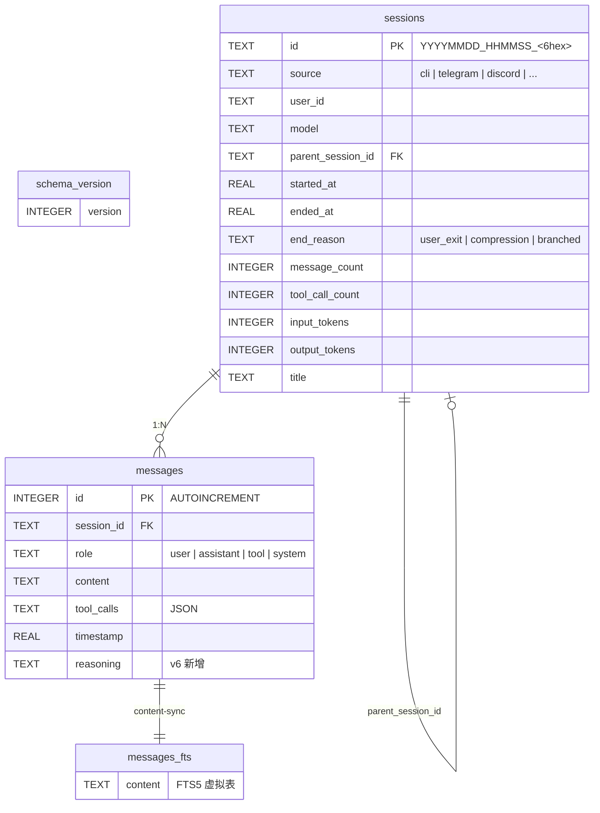
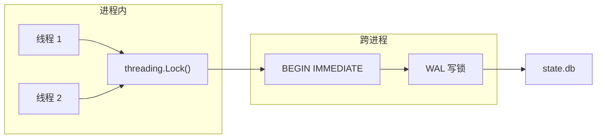
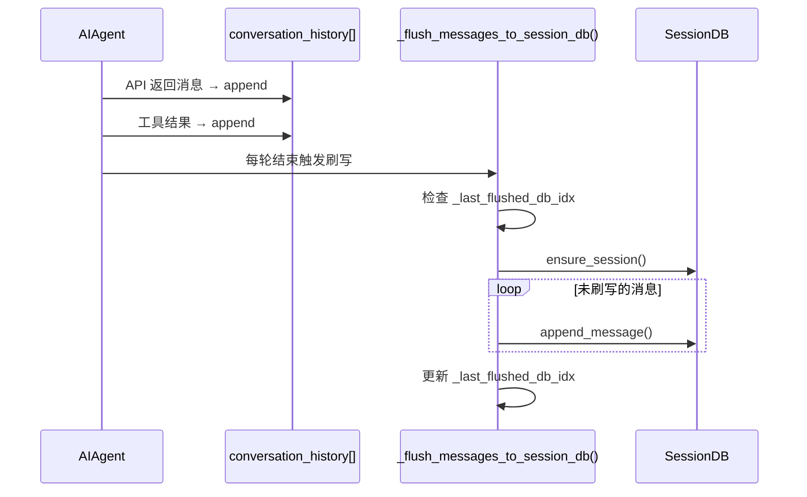
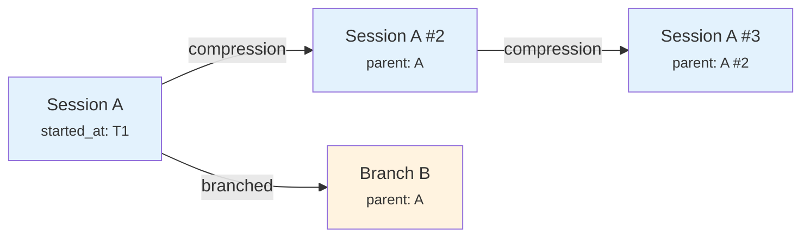
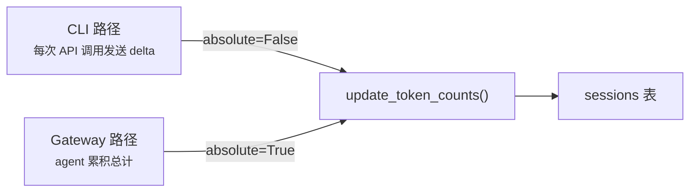
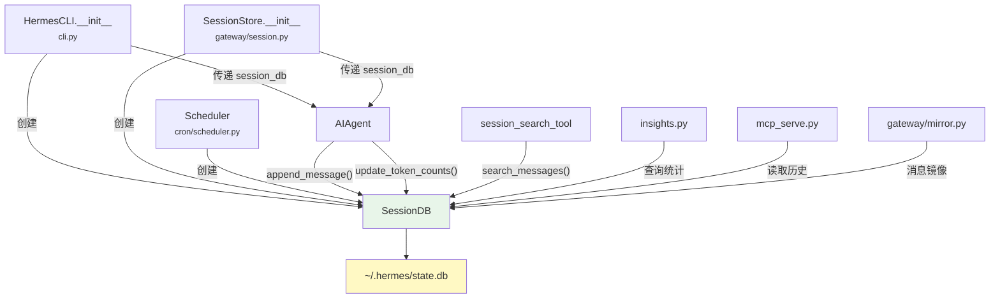

# 04 - 状态持久化

> **引导问题：** Hermes Agent 如何在多进程（CLI + Gateway + worktree agent）共享同一个 SQLite 数据库的场景下，实现高并发写入、全文搜索和会话链路追踪？

## 4.1 为什么需要状态持久化？

一个 Agent 如果没有持久化层，就像一个失忆的对话者——每次启动都是全新的开始。但 Hermes 面临的挑战远不止"保存聊天记录"这么简单：

1. **多进程共享**：CLI 会话、Gateway 多平台网关、worktree agent、cron 调度器——它们可能同时读写同一个数据库
2. **全文搜索**：用户需要跨所有历史会话搜索消息内容，而不是逐个翻找
3. **会话链路追踪**：上下文压缩会"分裂"一个长对话为多个 session，需要维护父子关系
4. **费用审计**：每次 API 调用的 token 消耗和费用需要精确追踪

Hermes 的答案是 `hermes_state.py` 中的 `SessionDB` 类——一个 1238 行的 SQLite 持久化层，用单文件数据库 `~/.hermes/state.db` 解决了所有上述问题。

### 核心源码文件

| 文件 | 行数 | 职责 |
|------|------|------|
| `hermes_state.py` | ~1238 | 核心持久化层：SessionDB 类 |
| `hermes_constants.py` | ~294 | 路径常量（`HERMES_HOME`、`DEFAULT_DB_PATH`） |
| `run_agent.py` | ~7000+ | AIAgent 消息刷写逻辑 |
| `cli.py` | ~5000+ | CLI 创建 SessionDB 实例 |
| `gateway/session.py` | ~600+ | Gateway SessionStore 封装 |
| `tools/session_search_tool.py` | — | FTS5 搜索工具暴露给 Agent |

---

## 4.2 数据库 Schema 设计

### 整体架构

Hermes 的持久化层由三张表（加一张虚拟表）构成：



### sessions 表：会话元数据

`sessions` 表是整个状态系统的核心，字段设计体现了 Hermes 对多场景兼容性的考量：

```sql
CREATE TABLE IF NOT EXISTS sessions (
    id TEXT PRIMARY KEY,               -- 格式: YYYYMMDD_HHMMSS_<6位uuid>
    source TEXT NOT NULL,              -- 来源: 'cli', 'telegram', 'discord' 等
    user_id TEXT,                      -- 用户 ID（Gateway 场景）
    model TEXT,                        -- 模型名，如 'anthropic/claude-opus-4.6'
    model_config TEXT,                 -- JSON: max_iterations, reasoning_config 等
    system_prompt TEXT,                -- 完整 system prompt 快照
    parent_session_id TEXT,            -- 父 session ID（压缩分裂/分支）
    started_at REAL NOT NULL,          -- Unix 时间戳
    ended_at REAL,                     -- 结束时间
    end_reason TEXT,                   -- 'user_exit', 'compression', 'branched'
    message_count INTEGER DEFAULT 0,   -- 消息计数器
    tool_call_count INTEGER DEFAULT 0, -- 工具调用计数器
    -- Token 统计（v5 新增）
    input_tokens INTEGER DEFAULT 0,
    output_tokens INTEGER DEFAULT 0,
    cache_read_tokens INTEGER DEFAULT 0,
    cache_write_tokens INTEGER DEFAULT 0,
    reasoning_tokens INTEGER DEFAULT 0,
    -- 费用追踪（v5 新增）
    billing_provider TEXT,
    billing_base_url TEXT,
    billing_mode TEXT,
    estimated_cost_usd REAL,
    actual_cost_usd REAL,
    cost_status TEXT,
    cost_source TEXT,
    pricing_version TEXT,
    -- 标题（v3 新增）
    title TEXT,
    FOREIGN KEY (parent_session_id) REFERENCES sessions(id)
);
```

几个值得注意的设计：

- **Session ID 格式**：`YYYYMMDD_HHMMSS_<6hex>`——既可读（按日期排序），又唯一（UUID 后缀）
- **`source` 字段**：区分会话来源，Gateway 按平台过滤时直接走索引
- **`parent_session_id`**：自引用外键，形成会话谱系链（详见 §4.7）
- **`system_prompt` 快照**：每个 session 保存完整的 system prompt，便于事后审计和回放

### messages 表：消息存储

```sql
CREATE TABLE IF NOT EXISTS messages (
    id INTEGER PRIMARY KEY AUTOINCREMENT,
    session_id TEXT NOT NULL REFERENCES sessions(id),
    role TEXT NOT NULL,              -- 'user', 'assistant', 'tool', 'system'
    content TEXT,                    -- 消息正文
    tool_call_id TEXT,               -- 工具调用 ID
    tool_calls TEXT,                 -- JSON: [{name, arguments}]
    tool_name TEXT,                  -- 工具名
    timestamp REAL NOT NULL,         -- Unix 时间戳
    token_count INTEGER,
    finish_reason TEXT,              -- v2 新增
    reasoning TEXT,                  -- v6 新增: 推理文本
    reasoning_details TEXT,          -- v6 新增: 结构化推理详情(JSON)
    codex_reasoning_items TEXT       -- v6 新增: Codex 推理项(JSON)
);
```

`messages` 表遵循 OpenAI 的消息格式（`role` + `content` + `tool_calls`），这让从数据库恢复 `conversation_history` 变得直接——不需要格式转换就能喂给 API。

### 索引策略

```sql
CREATE INDEX idx_sessions_source ON sessions(source);           -- 按来源过滤
CREATE INDEX idx_sessions_parent ON sessions(parent_session_id); -- 追踪谱系链
CREATE INDEX idx_sessions_started ON sessions(started_at DESC);  -- 时间倒序列表
CREATE INDEX idx_messages_session ON messages(session_id, timestamp); -- 按 session 加载消息
```

还有一个精巧的**条件唯一索引**：

```sql
CREATE UNIQUE INDEX idx_sessions_title_unique
    ON sessions(title) WHERE title IS NOT NULL;
```

这个 `WHERE title IS NOT NULL` 条件允许多个 session 没有标题（`NULL` 不参与唯一性检查），但非 `NULL` 标题必须全局唯一——完美契合"标题可选但不重复"的业务需求。

---

## 4.3 FTS5 全文搜索

全文搜索是 Hermes 持久化层最有特色的功能之一。用户可以跨所有历史会话搜索消息内容，Agent 也可以通过 `session_search_tool` 主动检索过往对话。

### Content-Sync 模式

Hermes 采用 FTS5 的 **content-sync** 模式，即 FTS 索引不存储原始文本，而是通过 `content=messages` 指向原始表：

```sql
CREATE VIRTUAL TABLE messages_fts USING fts5(
    content,
    content=messages,        -- 外部内容表
    content_rowid=id
);
```

这种模式的优势是**不重复存储数据**——对于一个可能积累数万条消息的 Agent 来说，这节省了大量磁盘空间。代价是需要通过触发器手动保持同步：

```sql
-- 插入同步
CREATE TRIGGER messages_fts_insert AFTER INSERT ON messages BEGIN
    INSERT INTO messages_fts(rowid, content) VALUES (new.id, new.content);
END;

-- 删除同步
CREATE TRIGGER messages_fts_delete AFTER DELETE ON messages BEGIN
    INSERT INTO messages_fts(messages_fts, rowid, content)
        VALUES('delete', old.id, old.content);
END;

-- 更新同步（先删再加）
CREATE TRIGGER messages_fts_update AFTER UPDATE ON messages BEGIN
    INSERT INTO messages_fts(messages_fts, rowid, content)
        VALUES('delete', old.id, old.content);
    INSERT INTO messages_fts(rowid, content) VALUES (new.id, new.content);
END;
```

> **为什么不用独立 FTS？** 独立模式会把 `content` 列的文本复制一份到 FTS 表内部。对于聊天消息这种文本密集型数据，这意味着存储量几乎翻倍。而 content-sync 模式下，所有写入都通过 `append_message()` 这一个入口，触发器同步的可靠性有充分保障。

### 查询清洗：防御 FTS5 注入

FTS5 有自己的查询语法（支持 `AND`, `OR`, `NOT`, `*`, `"短语"` 等），用户输入如果直接传入可能导致语法错误甚至意外行为。`_sanitize_fts5_query()` 是一个精心设计的清洗函数，执行六步净化：

```
用户输入 → ① 保护合法引号短语 → ② 移除特殊字符(+{}()^)
    → ③ 折叠连续 * / 移除行首 * → ④ 清除悬挂布尔运算符
    → ⑤ 引用含点/连字符的术语 → ⑥ 恢复引号短语
```

例如，用户搜索 `chat-send AND` 会被处理为 `"chat-send"` ——连字符被引号保护（防止 tokenizer 拆分），悬挂的 `AND` 被移除。

### 搜索查询结构

实际搜索使用的 SQL 充分利用了 FTS5 的特性：

```sql
SELECT m.id, m.session_id, m.role,
       snippet(messages_fts, 0, '>>>', '<<<', '...', 40) AS snippet,
       m.content, m.timestamp, m.tool_name,
       s.source, s.model, s.started_at
FROM messages_fts
JOIN messages m ON m.id = messages_fts.rowid
JOIN sessions s ON s.id = m.session_id
WHERE messages_fts MATCH ?
  [AND s.source IN (...)]
  [AND m.role IN (...)]
ORDER BY rank            -- FTS5 BM25 排名
LIMIT ? OFFSET ?
```

**设计亮点：**

| 特性 | 实现方式 |
|------|----------|
| 高亮标记 | `snippet()` 函数生成 `>>>匹配<<<` 标记，最多 40 个 token |
| 多维过滤 | 支持按 `source`（来源平台）、`role`（消息角色）过滤 |
| 上下文窗口 | 每个匹配结果附加前后各 1 条消息作为上下文 |
| 节省 token | 返回结果**删除 full content**，只保留 snippet |
| 避免长持锁 | 上下文查询在 lock 外逐条执行 |

最后一点尤其值得注意——搜索结果的主查询在锁内完成，但附加上下文的 N 次查询故意放在锁外，避免大结果集场景下长时间阻塞其他写入操作。

---

## 4.4 并发写入架构

这是整个持久化层最精妙的部分。当多个 Hermes 进程（CLI 会话、Gateway、worktree agent）同时写入同一个 `state.db` 时，如何保证数据一致性且不卡顿？

### 双层锁结构



Hermes 使用了**两层锁**来分别解决进程内和跨进程的并发问题：

1. **Python `threading.Lock`**：保护同进程内的线程安全（Gateway 的多个平台适配器可能在不同线程中运行）
2. **SQLite `BEGIN IMMEDIATE`**：在 WAL 模式下获取跨进程的写锁

**为什么用 `BEGIN IMMEDIATE` 而不是 `BEGIN`？**

普通的 `BEGIN`（deferred 模式）在第一条 DML 语句执行时才获取锁，这意味着如果在 `INSERT` 时发现锁冲突，整个事务的前序工作都白费了。`BEGIN IMMEDIATE` 在事务开始的瞬间就尝试获取写锁，**让冲突尽早暴露**。

### Anti-Convoy 重试策略

传统做法是设置 SQLite 的 `busy_timeout`（比如 30 秒）让数据库自己排队等锁。但 Hermes 选择了不同的方案——源码注释解释了原因：

> SQLite's built-in busy handler uses a deterministic sleep schedule that causes **convoy effects** under high concurrency.

**什么是 Convoy Effect？** 当多个进程使用相同的退避策略时，它们会同时醒来争锁→同时失败→同时睡眠，形成周期性的锁竞争浪潮，如同一队卡车被同一个红绿灯"护航"。

Hermes 的解决方案是**应用层随机抖动重试**：

```python
class SessionDB:
    _WRITE_MAX_RETRIES = 15
    _WRITE_RETRY_MIN_S = 0.020   # 20ms
    _WRITE_RETRY_MAX_S = 0.150   # 150ms
    _CHECKPOINT_EVERY_N_WRITES = 50

    def _execute_write(self, fn: Callable[[sqlite3.Connection], T]) -> T:
        last_err = None
        for attempt in range(self._WRITE_MAX_RETRIES):
            try:
                with self._lock:                           # ① Python 线程锁
                    self._conn.execute("BEGIN IMMEDIATE")   # ② SQLite 写锁
                    try:
                        result = fn(self._conn)
                        self._conn.commit()
                    except BaseException:
                        self._conn.rollback()
                        raise
                # ③ 周期性 WAL checkpoint
                self._write_count += 1
                if self._write_count % self._CHECKPOINT_EVERY_N_WRITES == 0:
                    self._try_wal_checkpoint()
                return result
            except sqlite3.OperationalError as exc:
                if "locked" in str(exc).lower() or "busy" in str(exc).lower():
                    last_err = exc
                    if attempt < self._WRITE_MAX_RETRIES - 1:
                        jitter = random.uniform(0.020, 0.150)  # ④ 随机退避
                        time.sleep(jitter)
                        continue
                raise
        raise last_err  # 15 次重试全部失败
```

这段代码的精髓在于第 ④ 步的 `random.uniform(20ms, 150ms)`：每个进程的重试间隔是随机的，自然错开了竞争者，打破了 convoy effect。

**三种方案对比：**

| 方案 | 最大等待 | Convoy 风险 | 复杂度 |
|------|----------|-------------|--------|
| `busy_timeout=30s` | 30 秒 | 高（确定性退避） | 低 |
| Hermes 随机抖动重试 | ~2.25 秒 | 低（随机退避） | 中 |
| 外部消息队列 | N/A | 无 | 高 |

### 连接配置的细节

```python
self._conn = sqlite3.connect(
    str(self.db_path),
    check_same_thread=False,    # 允许跨线程使用（配合 self._lock）
    timeout=1.0,                # 短超时，快速失败
    isolation_level=None,       # 关闭 Python 自动事务管理
)
self._conn.row_factory = sqlite3.Row
self._conn.execute("PRAGMA journal_mode=WAL")
self._conn.execute("PRAGMA foreign_keys=ON")
```

**`isolation_level=None` 的妙处：** Python 的 `sqlite3` 模块默认在 DML 语句前自动插入 `BEGIN` 语句。这和 `_execute_write()` 中显式的 `BEGIN IMMEDIATE` 冲突——如果两个 `BEGIN` 嵌套，事务管理就乱套了。设为 `None` 关闭自动事务，让 Hermes 完全掌控事务边界。

### WAL Checkpoint

WAL 模式下，写入不直接修改数据库文件，而是追加到 WAL 日志中。如果不定期 checkpoint，WAL 文件会无限增长。Hermes 每 50 次写入触发一次 **PASSIVE checkpoint**：

```python
def _try_wal_checkpoint(self):
    """Best-effort PASSIVE WAL checkpoint. Never blocks, never raises."""
    try:
        with self._lock:
            self._conn.execute("PRAGMA wal_checkpoint(PASSIVE)").fetchone()
    except Exception:
        pass  # Best effort
```

选择 `PASSIVE`（而非 `FULL` 或 `TRUNCATE`）是因为 PASSIVE **绝不阻塞其他连接**——它只回写其他连接不再需要的 WAL 帧。`close()` 时也会尝试 checkpoint，确保优雅退出。

---

## 4.5 Session 生命周期

### 创建

`create_session()` 使用 `INSERT OR IGNORE` 实现幂等创建——重复调用不会报错：

```python
def create_session(self, session_id, source, model=None, ...):
    def _do(conn):
        conn.execute("""
            INSERT OR IGNORE INTO sessions (id, source, model, ..., started_at)
            VALUES (?, ?, ?, ..., ?)
        """, (session_id, source, model, ..., time.time()))
    self._execute_write(_do)
```

Session ID 的格式 `YYYYMMDD_HHMMSS_<6hex>` 由调用方生成，兼顾可读性和唯一性。

### 确保存在

`ensure_session()` 是一个容错入口——如果初始 `create_session()` 因锁竞争失败，后续写消息时先确保 session 行存在。这是 `_flush_messages_to_session_db` 的安全网。

### 结束与重新打开

```python
def end_session(self, session_id, end_reason):
    # 标记 ended_at + end_reason
    
def reopen_session(self, session_id):
    # 清除 ended_at + end_reason → session 重新变为"活跃"
```

`end_reason` 的三种值体现了三种不同的生命周期终结方式：
- `"user_exit"`：用户主动退出
- `"compression"`：上下文压缩触发分裂（详见 §4.7）
- `"branched"`：用户通过 `/branch` 命令创建分支

### 前缀匹配解析

`resolve_session_id()` 支持模糊匹配——用户不需要输入完整的 session ID：

1. 先精确查找
2. 若不存在，用 `LIKE '{escaped}%'` 前缀匹配
3. 仅当匹配结果**恰好 1 个**时返回（避免歧义）

对 `%`, `_`, `\` 的 SQL LIKE 转义处理确保特殊字符不会被误解为通配符。

---

## 4.6 消息存储与加载

### 消息刷写管道

消息并非实时逐条写入数据库，而是由 `AIAgent` 批量刷写。整个管道如下：



**关键设计：`_last_flushed_db_idx`**

这个变量追踪 `conversation_history` 中已写入数据库的消息下标，防止重复写入。这是一个看似简单但解决了实际 bug 的设计（修复了 issue #860）。当上下文压缩触发 session 分裂时，`_last_flushed_db_idx` 重置为 0。

### 追加消息

`append_message()` 在单个写事务中完成三件事：

1. 序列化 `tool_calls`, `reasoning_details`, `codex_reasoning_items` 为 JSON
2. INSERT 消息行
3. UPDATE session 的 `message_count`（+1）和 `tool_call_count`（如有 tool_calls 则 +N）

FTS 同步通过触发器自动完成——代码中无需手动写入 FTS 表。

### OpenAI 格式转换

`get_messages_as_conversation()` 是 Gateway 恢复会话历史的关键方法。它将数据库中的消息行转换为 OpenAI 格式的 `conversation_history`：

```python
def get_messages_as_conversation(self, session_id):
    # 只取 role, content, tool_call_id, tool_calls, tool_name
    # v6 新增：对 assistant 消息恢复 reasoning 字段
    # → 返回可直接传入 API 的消息列表
```

v6 新增的 reasoning 字段恢复值得注意——某些 Provider（OpenRouter、OpenAI、Nous）需要在重放时保持连贯的推理上下文，否则模型的推理链会断裂。

---

## 4.7 Session 分裂与谱系追踪

长对话最终会触及模型的上下文窗口限制。当 Hermes 的上下文压缩器触发时，不是简单地截断历史，而是创建一个新的 session 继承对话：



### 压缩触发分裂流程

在 `run_agent.py` 中，压缩分裂的步骤如下：

1. 获取旧 session 标题
2. `end_session(old_id, "compression")` — 标记旧 session 结束
3. 生成新 session ID
4. `create_session(new_id, parent_session_id=old_id)` — 创建子 session
5. 自动编号标题：`"my chat"` → `"my chat #2"`
6. 更新 system prompt
7. 重置 `_last_flushed_db_idx = 0`

### 谱系编号系统

`get_next_title_in_lineage()` 实现了自动编号逻辑：

```
"my session"   →  "my session #2"  →  "my session #3"
```

算法步骤：
1. Strip 已有 `#N` 后缀找到 base title
2. 查询所有 `title = base` 或 `title LIKE 'base #%'` 的 session
3. 找到最大编号 N → 返回 `"base #(N+1)"`

### 标题清洗

`sanitize_title()` 执行多层清理：

| 步骤 | 处理 | 示例 |
|------|------|------|
| ① | 移除 ASCII 控制字符 | `\x00hello` → `hello` |
| ② | 移除 Unicode 零宽/方向覆盖字符 | `\u200bhello` → `hello` |
| ③ | 折叠连续空白 | `hello   world` → `hello world` |
| ④ | 截断到 100 字符 | 超长标题被截断 |
| ⑤ | 空白 → None | `"   "` → `None` |

### 按标题解析的优先级

`resolve_session_by_title()` 的解析策略考虑了谱系编号：

1. 精确匹配存在 **且** 编号变体也存在 → 返回**最新编号**（最近的延续）
2. 仅精确匹配 → 返回精确匹配
3. 仅编号变体 → 返回最新编号

这意味着用户输入 `"my chat"` 时，如果已经分裂到 `"my chat #5"`，系统会自动定位到最新的那个。

---

## 4.8 Token 和费用统计

`update_token_counts()` 支持两种更新模式，适配不同的调用路径：



- **增量模式** (`absolute=False`)：CLI 每次 API 调用后发送本次消耗的 delta，用 `+=` 累加
- **绝对模式** (`absolute=True`)：Gateway 的 agent 跨多轮保持状态，直接用累积总计覆盖

费用字段的 `COALESCE` 逻辑也很有讲究：

| 字段 | 更新策略 | 原因 |
|------|----------|------|
| `estimated_cost_usd` | 始终累加/覆盖 | 每次都有新估算 |
| `actual_cost_usd` | NULL 时不覆盖 | 供应商可能还没返回实际费用 |
| `billing_provider` | 仅回填（COALESCE 先取已有值） | 首次设置后不变 |
| `model` | 仅回填 | 首次可能未知，API 返回后补填 |

---

## 4.9 Schema 迁移

Hermes 采用**线性版本号 + ALTER TABLE** 的迁移策略，当前版本号为 6。

### 迁移历史

| 版本 | 变更内容 | 关键字段 |
|------|----------|----------|
| v1→v2 | messages 表增列 | `finish_reason` |
| v2→v3 | sessions 表增列 | `title` |
| v3→v4 | 添加条件唯一索引 | `idx_sessions_title_unique` |
| v4→v5 | sessions 表增 11 列 | cache tokens + billing 系列 |
| v5→v6 | messages 表增 3 列 | `reasoning`, `reasoning_details`, `codex_reasoning_items` |

### 幂等迁移设计

每个 `ALTER TABLE` 包裹在 `try/except sqlite3.OperationalError: pass` 中——如果列已存在，SQLite 会抛出 OperationalError，Hermes 捕获后静默跳过：

```python
for col, col_type in new_columns:
    try:
        cursor.execute(f'ALTER TABLE t ADD COLUMN "{col}" {col_type}')
    except sqlite3.OperationalError:
        pass  # 列已存在，幂等跳过
```

这种设计确保迁移可以**安全地重复执行**——无论用户从哪个版本升级，无论中间是否有中断，最终状态都是一致的。

> **值得注意：** FTS5 虚拟表的创建放在迁移之后单独处理，因为 `CREATE VIRTUAL TABLE ... IF NOT EXISTS` 在 `executescript()` 中不可靠——这是 SQLite 的一个已知边界行为。

---

## 4.10 调用者拓扑

`SessionDB` 并非全局单例，而是由顶层入口点创建，通过参数注入到下游组件：



这种**依赖注入**架构的优势：
- 测试时可以注入 mock 或临时数据库
- 不同入口点可以指向不同的数据库路径
- 避免了全局状态带来的隐式耦合

### 各调用者的典型用法

| 调用者 | 文件 | 主要操作 |
|--------|------|----------|
| `HermesCLI` | `cli.py` | 创建实例，管理 session 生命周期 |
| `AIAgent` | `run_agent.py` | 刷写消息，更新 token 统计 |
| `SessionStore` | `gateway/session.py` | Gateway 创建实例，恢复会话 |
| `Scheduler` | `cron/scheduler.py` | Cron 调度保存 session |
| `session_search_tool` | `tools/session_search_tool.py` | FTS5 搜索 + 摘要生成 |
| `insights` | `agent/insights.py` | 用量统计分析 |
| `mcp_serve` | `mcp_serve.py` | MCP 服务端读取历史 |

---

## 4.11 Session 列表与导出

### 智能列表查询

`list_sessions_rich()` 使用**关联子查询**替代 N+2 查询，一条 SQL 获取所有需要的信息：

```sql
SELECT s.*,
    COALESCE(
        (SELECT SUBSTR(REPLACE(REPLACE(m.content, X'0A', ' '), X'0D', ' '), 1, 63)
         FROM messages m
         WHERE m.session_id = s.id AND m.role = 'user' AND m.content IS NOT NULL
         ORDER BY m.timestamp, m.id LIMIT 1),
        ''
    ) AS _preview_raw,
    COALESCE(
        (SELECT MAX(m2.timestamp) FROM messages m2 WHERE m2.session_id = s.id),
        s.started_at
    ) AS last_active
FROM sessions s
WHERE s.parent_session_id IS NULL  -- 排除子 session
ORDER BY s.started_at DESC
LIMIT ? OFFSET ?
```

三个设计要点：
- **默认排除子 session**：`parent_session_id IS NULL` 保持列表干净，用户看到的是"对话"而不是"碎片"
- **preview = 第一条 user 消息的前 60 字符**：让用户快速辨识每个会话的内容
- **换行符处理**：`REPLACE(m.content, X'0A', ' ')` 确保预览是单行文本

### 删除策略：孤儿化而非级联

`delete_session()` 不级联删除子 session，而是将它们**孤儿化**——把 `parent_session_id` 设为 `NULL`：

```python
# 先孤儿化子 session
conn.execute("UPDATE sessions SET parent_session_id = NULL WHERE parent_session_id = ?",
             (session_id,))
# 再删消息和 session
conn.execute("DELETE FROM messages WHERE session_id = ?", (session_id,))
conn.execute("DELETE FROM sessions WHERE id = ?", (session_id,))
```

这确保删除父 session 不会丢失有价值的子对话——它们变成独立的顶层 session 继续存在。

### 剪枝

`prune_sessions()` 只删除已结束（`ended_at IS NOT NULL`）且超过 N 天的 session，同样先孤儿化子 session。这是一种**保守的清理策略**——宁可保留数据，也不误删。

---

## 4.12 设计取舍总结

| 决策 | 选择 | 替代方案 | 取舍分析 |
|------|------|----------|----------|
| 存储引擎 | 单文件 SQLite | PostgreSQL / Redis | 零依赖、单文件部署；写并发上限 ~千次/秒 对 Agent 场景绰绰有余 |
| FTS 模式 | Content-sync | 独立存储 | 不重复数据、省空间；需要触发器同步但写入入口唯一 |
| 并发策略 | 应用层随机抖动 | SQLite busy_handler | 打破 convoy effect、等待可控；多一层代码复杂度 |
| 删除策略 | 孤儿化 | 级联删除 | 子 session 始终可独立访问；不会因删父而丢失数据 |
| Token 更新 | 增量/绝对双模式 | 统一模式 | 适配 CLI（delta）和 Gateway（累积）两种调用路径 |
| 迁移策略 | 幂等 ALTER TABLE | ORM migration framework | 简单直接、无外部依赖；但不支持降级 |

---

## 4.13 可迁移的设计模式

以下三个模式可以直接应用于任何多进程共享 SQLite 的场景：

### 模式一：Anti-Convoy 写入重试

```python
for attempt in range(max_retries):
    try:
        with lock:
            conn.execute("BEGIN IMMEDIATE")
            result = fn(conn)
            conn.commit()
        return result
    except OperationalError as e:
        if "locked" in str(e):
            time.sleep(random.uniform(min_s, max_s))  # 随机退避
            continue
        raise
```

### 模式二：外部内容 FTS5 + 触发器

```sql
CREATE VIRTUAL TABLE t_fts USING fts5(col, content=t, content_rowid=id);
-- 配合 INSERT/DELETE/UPDATE 三个触发器保持同步
```

### 模式三：幂等 Schema 迁移

```python
for col, col_type in new_columns:
    try:
        cursor.execute(f'ALTER TABLE t ADD COLUMN "{col}" {col_type}')
    except OperationalError:
        pass  # 列已存在，静默跳过
```

---

## 4.14 本章小结

Hermes 的状态持久化层是一个教科书级的 SQLite 工程实践。在一个 1238 行的文件中，它实现了：

- **完整的会话生命周期管理**——从创建到分裂再到剪枝
- **高并发写入安全**——WAL + 双层锁 + 随机抖动重试
- **高效全文搜索**——FTS5 content-sync 模式 + 精心设计的查询清洗
- **灵活的谱系追踪**——通过 `parent_session_id` 链式关联
- **渐进式 Schema 演进**——幂等迁移确保向后兼容

最值得记住的是 Anti-Convoy Pattern：在多进程共享数据库的场景中，`random.uniform()` 比任何精心设计的确定性退避都更有效——因为**随机性本身就是最好的负载均衡器**。

> **下一章预告：** 第 5 章将深入 Hermes 的工具注册与分发系统——一个 Agent 如何发现、组织和调用数十种工具？
