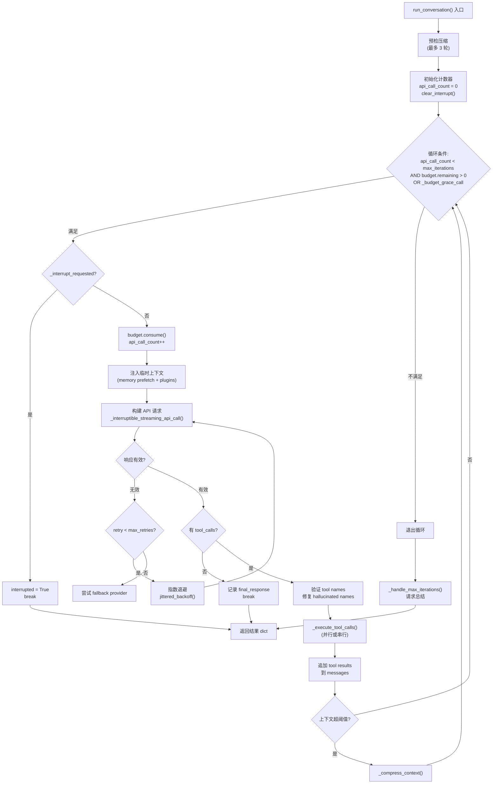
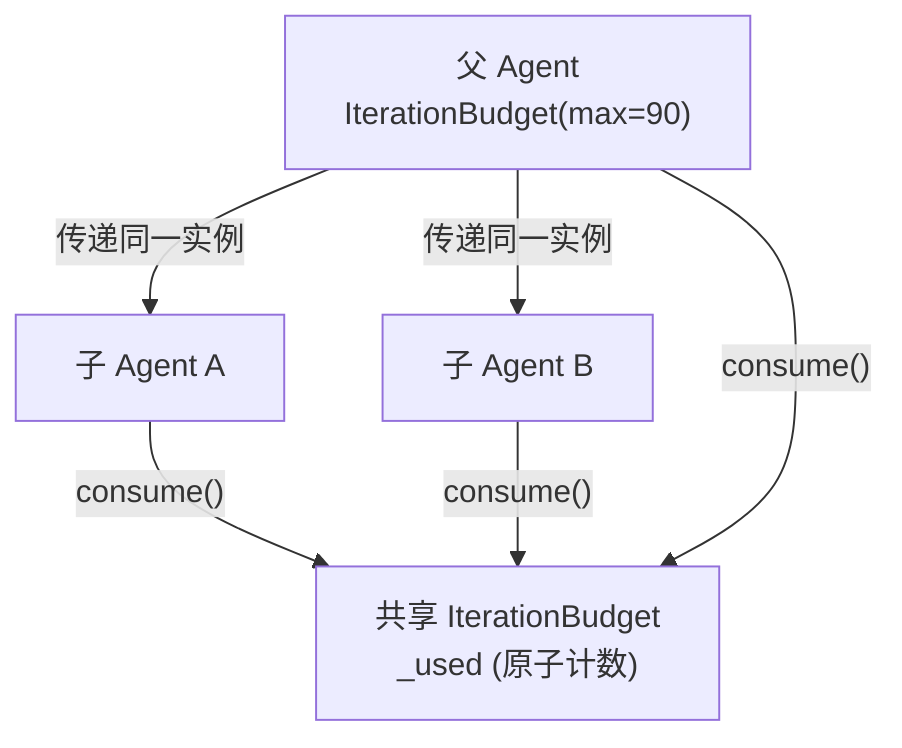
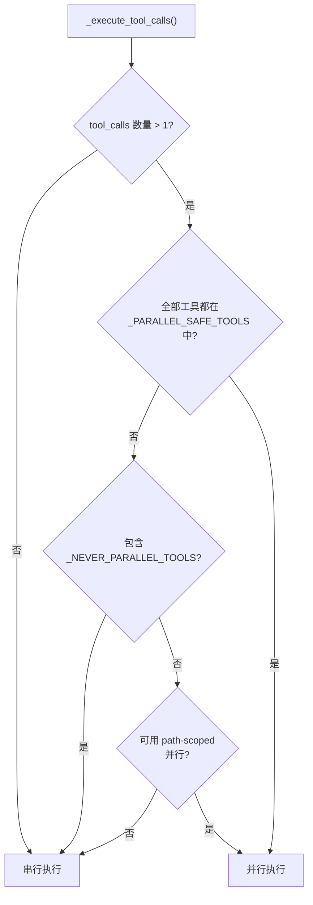
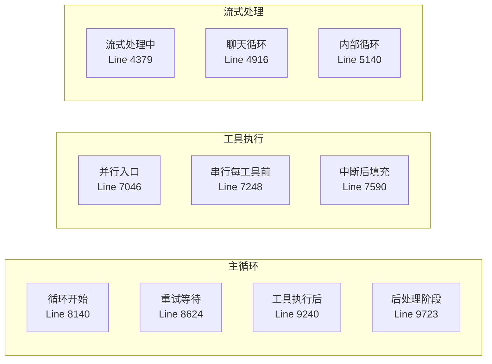
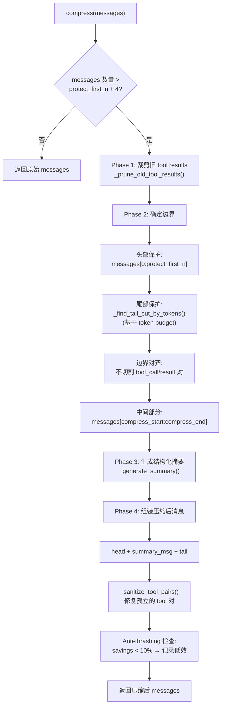

# 05 - 对话循环

> **引导问题：** 一个 AI Agent 在收到用户消息后，如何决定"调用工具、思考、还是给出最终回复"？当 context 膨胀到模型极限时怎么办？当用户按下 Ctrl+C 时，正在执行的工具调用如何安全退出？

## 5.1 全景概览

对话循环（Conversation Loop）是 Hermes Agent 的**核心引擎**。如果说启动链路是汽车的点火系统，配置系统是仪表盘，那么对话循环就是发动机本身——它驱动着 Agent 从接收用户消息到产出最终回复的全部过程。

Hermes 采用经典的 **"LLM 调用 → 工具分发 → 追加结果 → 重复"** 模式，但在此基础上叠加了大量工程细节：线程安全的迭代预算、协作式中断机制、自适应上下文压缩、Prompt Caching 优化等。这些机制共同构成了一个健壮的、能在真实生产环境中长时间运行的对话引擎。

### 核心源码文件

| 文件 | 行数 | 职责 |
|------|------|------|
| `run_agent.py` | ~11,024 | 对话循环主体：主循环、工具分发、中断处理 |
| `model_tools.py` | ~562 | 工具定义与注册 |
| `agent/context_compressor.py` | ~1,091 | 上下文压缩：摘要生成、消息裁剪 |
| `agent/prompt_caching.py` | ~72 | Anthropic Prompt Caching 优化 |

---

## 5.2 主循环：`run_conversation()` 的全貌

### 5.2.1 入口签名与返回值

对话循环的入口位于 `run_agent.py` 的 `AIAgent.run_conversation()` 方法（**line 7803**）：

```python
# run_agent.py:7803
def run_conversation(self, user_message, ...):
```

该方法返回一个结构化的 dict，精确描述本次对话执行的结果状态：

```python
{
    "final_response": str | None,   # 最终文本回复
    "messages": list,               # 完整消息历史
    "api_calls": int,               # API 调用次数
    "completed": bool,              # 是否正常完成
    "interrupted": bool,            # 是否被用户中断
    "partial": bool,                # 是否部分完成
    "error": str,                   # 错误信息
    "failed": bool,                 # 是否为致命失败
}
```

注意 `completed`、`interrupted`、`partial`、`failed` 四个布尔字段的组合——它们覆盖了所有可能的退出路径，让调用者（TUI、Gateway、测试框架）能精确判断后续处理策略。

### 5.2.2 主循环流程

下图展示了一次完整的对话循环执行路径：



从这张图中可以看到对话循环的两个关键分支点：

1. **有无 tool_calls**：决定循环是继续还是终止
2. **上下文是否超阈值**：决定是否触发压缩

这是一个典型的 **ReAct 模式**（Reasoning + Acting）实现——模型在每轮迭代中自主决定是"行动"（调用工具）还是"回复"（输出最终答案）。

### 5.2.3 循环终止的三重保护

循环条件看似简单，实则由三个条件共同控制（line 8135）：

```python
while (api_call_count < self.max_iterations 
       and self.iteration_budget.remaining > 0) \
      or self._budget_grace_call:
```

| 条件 | 含义 | 默认值 |
|------|------|--------|
| `api_call_count < max_iterations` | 本次对话的局部迭代上限 | 父 Agent: 90, 子 Agent: 50 |
| `budget.remaining > 0` | 全局共享预算剩余 | 同上 |
| `_budget_grace_call` | 预算耗尽后的一次宽限调用 | `False` |

**局部上限**（`max_iterations`）防止单次对话失控；**全局预算**（`budget.remaining`）防止父子 Agent 整体耗尽资源。两者的交集才是真正的循环边界。

---

## 5.3 迭代预算系统（IterationBudget）

### 5.3.1 为什么需要预算？

想象一个场景：父 Agent 启动了 3 个子 Agent，每个子 Agent 又在疯狂调用工具。如果没有全局预算控制，API 调用次数可能爆炸式增长，导致巨额费用和无意义的循环。

`IterationBudget` 解决的就是这个问题——它是一个**线程安全的共享计数器**，在父子 Agent 之间共享同一实例。

### 5.3.2 类定义与核心方法

```python
# run_agent.py:170-270
class IterationBudget:
    """Thread-safe shared iteration counter for parent ↔ subagent budget."""
```

三个核心方法：

```python
def consume(self) -> bool:
    """消耗一次迭代。返回 False 表示预算耗尽。"""
    with self._lock:
        if self._used >= self.max_total:
            return False
        self._used += 1
        return True

def refund(self, n: int = 1):
    """退还 n 次迭代（用于 execute_code 等可退款工具）。"""
    with self._lock:
        self._used = max(0, self._used - n)

@property
def remaining(self) -> int:
    with self._lock:
        return max(0, self.max_total - self._used)
```

`threading.Lock` 保护 `_used` 字段，确保多线程环境下的原子性——这在子 Agent 并行运行时至关重要。

### 5.3.3 父子 Agent 共享预算



关键设计决策：**父 Agent 和子 Agent 共享同一个 `IterationBudget` 实例**。子 Agent 的默认 `max_total=50`，但如果父 Agent 传入了自己的 budget 实例，子 Agent 会直接使用该共享实例。这意味着：

- 父 Agent 用了 30 次后，子 Agent 只剩 60 次可用
- 两个子 Agent 同时运行时，它们竞争同一个预算池
- 锁机制确保不会出现超发

### 5.3.4 Grace Call：优雅耗尽

预算耗尽时，系统不是硬截断，而是允许模型再做一次 **不带 tools 的 API 调用**——让它有机会输出最终回复：

```python
# run_agent.py:8154-8160
if self._budget_grace_call:
    self._budget_grace_call = False      # 只允许一次
elif not self.iteration_budget.consume():
    _turn_exit_reason = "budget_exhausted"
    break
```

这就像一场考试的最后五分钟提醒——给模型一个整理思路并输出结论的机会，而不是在它写到一半时强行收卷。

### 5.3.5 Refund 机制

`execute_code` 等工具在执行后会调用 `budget.refund(1)`。原因很朴素：代码执行可能花费很长时间，但它是用户明确请求的"动作"，不应该快速耗尽"思考"预算：

```python
# 工具执行结束后:
self.iteration_budget.refund(1)
```

这是一个巧妙的设计——把迭代预算从"API 调用次数限制"变成了更精确的"思考轮次限制"。

---

## 5.4 工具调度：从分发到执行

### 5.4.1 分发入口

`_execute_tool_calls()`（line 6901）是工具调用的总分发入口。它的核心职责是根据工具类型和数量，决定采用**并行**还是**串行**执行策略。

### 5.4.2 并行 vs 串行决策



Hermes 定义了三组工具分类常量（line 300-380），它们精确描述了每个工具的并发安全性：

```python
# 绝不并行的工具（如 clarify 需要用户交互，并行无意义）
_NEVER_PARALLEL_TOOLS = {"clarify"}

# 完全安全的只读工具（可无限并行）
_PARALLEL_SAFE_TOOLS = {
    "read_file", "search_files", "list_directory",
    "web_search", "web_browse", "vision_analyze",
    "check_syntax", "run_tests", "get_diagnostics",
    "memory_read", "memory_search",
}

# 基于路径隔离的工具（操作不同路径时可并行）
_PATH_SCOPED_TOOLS = {"read_file", "write_file", "patch"}
```

这套分类体系的设计理念是**保守安全**——只有明确标记为安全的工具才允许并行，未知工具一律走串行路径。

### 5.4.3 并行执行实现

并行执行使用 `concurrent.futures.ThreadPoolExecutor`，最大 8 个 worker：

```python
# run_agent.py:7046-7136 (简化)
if self._interrupt_requested:
    return [{"role": "tool", "tool_call_id": tc.id,
             "content": "⚡ Skipped: operation interrupted"} 
            for tc in assistant_message.tool_calls]

with ThreadPoolExecutor(max_workers=min(n_calls, _MAX_PARALLEL_WORKERS)) as pool:
    futures = {}
    for tc in assistant_message.tool_calls:
        future = pool.submit(self._invoke_tool, tc, messages, ...)
        futures[future] = tc
    
    results = []
    for future in as_completed(futures):
        tc = futures[future]
        try:
            result = future.result()
            results.append(result)
        except Exception as e:
            results.append({
                "role": "tool",
                "tool_call_id": tc.id,
                "content": f"Error: {e}",
            })
```

注意入口处的中断检查——如果在工具执行前就收到中断信号，直接跳过全部工具调用并返回占位消息。

### 5.4.4 串行执行与中断

串行执行（line 7242）的逻辑更加直接，但中断处理更细腻：

```python
for i, tc in enumerate(assistant_message.tool_calls):
    if self._interrupt_requested:
        # 未执行的工具用取消消息填充
        results.append({
            "role": "tool",
            "tool_call_id": tc.id,
            "content": "⚡ Skipped: operation interrupted by user"
        })
        continue
    
    result = self._invoke_tool(tc, messages, ...)
    results.append(result)
```

关键约束：**每个 `tool_call` 必须有对应的 `tool` result 消息**。这是 OpenAI API 的硬性要求。即使工具被跳过，也必须填充一条取消消息。Hermes 用 `"⚡ Skipped: operation interrupted by user"` 作为占位内容，既满足 API 格式要求，又让模型理解发生了什么。

### 5.4.5 Tool Call 验证与自修复

模型有时会 hallucinate 不存在的工具名。Hermes 对此有一套**自纠错循环**：

```python
# run_agent.py:9947-9994
for tc in assistant_message.tool_calls:
    if tc.function.name not in self.valid_tool_names:
        repaired = self._repair_tool_call(tc.function.name)
        if repaired:
            tc.function.name = repaired

# 无法修复则返回错误让模型自行纠正
if invalid_tool_calls:
    self._invalid_tool_retries += 1
    if self._invalid_tool_retries >= 3:
        return {"completed": False, "partial": True, ...}
    content = f"Tool '{tc.function.name}' does not exist. Available tools: {available}"
```

这个三层防御很精妙：
1. **自动修复**：`_repair_tool_call()` 尝试模糊匹配（比如 `readFile` → `read_file`）
2. **引导纠正**：修复失败时，向模型返回可用工具列表，让它在下一轮自行纠正
3. **硬性兜底**：3 次自纠正失败后硬停止，防止无限循环

参数验证同样严谨——空字符串自动转为 `{}`，JSON 解析失败则将错误信息返回给模型。

---

## 5.5 消息流（Message Flow）

### 5.5.1 消息列表结构

对话循环维护一个 `messages: list[dict]` 列表，遵循 OpenAI 消息格式：

```python
# 用户消息
{"role": "user", "content": "帮我修复这个 bug"}

# 助手消息（可能含 tool calls）
{"role": "assistant", "content": "让我看看代码...", 
 "tool_calls": [...], "reasoning": "..."}

# 工具结果
{"role": "tool", "tool_call_id": "call_xxx", "content": "文件内容..."}

# 系统消息
{"role": "system", "content": "You are a helpful assistant..."}
```

### 5.5.2 每轮迭代的消息推进

每次循环迭代中，消息的流动遵循固定模式：

1. **预处理**：注入临时上下文（memory prefetch、plugin hooks）到 `api_messages`（**不**持久化到 `messages`）
2. **API 调用**：发送 `api_messages` 到 LLM
3. **响应处理**：解析 assistant_message
4. **分支判断**：
   - 无 `tool_calls` → 提取 `final_response`，循环结束
   - 有 `tool_calls` → 追加 assistant message 到 `messages`，执行工具，追加 tool results
5. **压缩检查**：token 数超阈值时触发上下文压缩

### 5.5.3 临时上下文注入（Ephemeral Injection）

这是一个值得特别关注的设计模式：

```python
# run_agent.py:8204-8214 (概念)
api_messages = messages.copy()
if _ext_prefetch_cache:
    inject_into_user_message(api_messages, _ext_prefetch_cache)
```

Memory prefetch 和 plugin hook 的结果**只在 API 调用时注入**到消息中，**不写入持久化的 `messages` 列表**。这避免了每次迭代都重复积累临时上下文，从而防止消息列表无限膨胀。

如果每轮都把 prefetch 结果写入 `messages`，10 轮迭代后就会有 10 份重复的 memory 内容。临时注入模式彻底避免了这个问题。

### 5.5.4 Streaming 优先策略

即使没有流式消费者（如 TUI 显示），Hermes 也**优先使用 streaming**：

```python
# run_agent.py:8395-8433
_use_streaming = True
response = self._interruptible_streaming_api_call(
    api_kwargs, on_first_delta=_stop_spinner
)
```

这个看似反直觉的决策背后有充分的工程理由：

| 关注点 | 非 Streaming | Streaming |
|--------|-------------|-----------|
| 超时检测 | 只有整体超时，粒度粗 | 90s stale-stream 检测 + 60s read timeout |
| 挂起风险 | Provider keep-alive 但不返回数据时，可能无限挂起 | 细粒度健康检查，及时发现僵死连接 |
| 中断响应 | 必须等整个响应返回 | 可在流式传输过程中检查中断标志 |
| 进度反馈 | 无 | 可实时显示思考进度 |

对于 subagent 场景，streaming 模式的健壮性优势尤为明显——非 streaming 模式下，一个行为异常的 provider 可能导致 subagent 无限挂起，而 streaming 的 stale-stream 检测能及时发现并处理这种情况。

---

## 5.6 中断与恢复机制

### 5.6.1 协作式中断模型

Hermes 的中断机制采用**协作式**（cooperative）而非**抢占式**（preemptive）设计：

```python
# run_agent.py:754
self._interrupt_requested = False

# 设置中断 (line 2947)
def interrupt(self):
    self._interrupt_requested = True

# 清除中断 (line 2966)
def clear_interrupt(self):
    self._interrupt_requested = False
```

**为什么用 flag 而非异常实现中断？** 协作式中断保证了消息列表的一致性——每个 `tool_call` 都有对应的 `tool` result。如果用异常中断，正在执行的工具可能产生半成品结果，消息列表可能处于不一致状态，后续恢复会变得极其复杂。

### 5.6.2 中断检查点分布

中断标志在对话循环中被检查的位置多达 **16 处**，覆盖了所有关键路径：



### 5.6.3 不同阶段的中断处理策略

**循环入口中断**（最清洁的退出路径）：

```python
# run_agent.py:8139-8145
if self._interrupt_requested:
    interrupted = True
    _turn_exit_reason = "interrupted_by_user"
    if not self.quiet_mode:
        self._safe_print("\n⚡ Breaking out of tool loop due to interrupt...")
    break
```

**重试等待中断**（带 session 持久化）——在指数退避等待中，每 0.2s 检查一次中断：

```python
# run_agent.py:8620-8644
while time.time() < sleep_end:
    if self._interrupt_requested:
        self._persist_session(messages, conversation_history)
        self.clear_interrupt()
        return {
            "final_response": f"Operation interrupted during retry...",
            "interrupted": True,
            ...
        }
    time.sleep(0.2)
    # 每 30s touch 一次活动状态（防止 gateway 超时）
    if _backoff_touch_counter % 150 == 0:
        self._touch_activity(...)
```

**工具执行中断**——已启动的工具会完成执行（不强制终止），后续工具被跳过并填充取消消息。这保证了：
- 不会出现文件写到一半的状态
- 每个 `tool_call` 都有对应的 `tool` result（API 要求）
- 模型在恢复时能理解哪些工具执行了、哪些被跳过了

### 5.6.4 线程隔离

```python
# run_agent.py:8117
self._execution_thread_id = threading.current_thread().ident
```

中断信号被限定在当前 Agent 的执行线程上。这防止了一个重要问题：父 Agent 的中断不应影响子 Agent，反之亦然。每个 Agent 独立管理自己的中断生命周期。

### 5.6.5 恢复机制

中断后的恢复通过 **session 持久化** 实现，流程极其简洁：

1. 中断时调用 `_persist_session(messages, conversation_history)` 保存当前完整状态
2. 下次用户发送消息时，从持久化的 `messages` 继续
3. 被跳过的工具在消息中留有 `"⚡ Skipped"` 标记，模型能理解上下文

这种设计让中断/恢复变成了对话流的自然延续，而非需要特殊处理的异常路径。

---

## 5.7 上下文压缩

长时间运行的 Agent 任务（如重构一个大型项目）可能产生数百条消息。当 token 数逼近模型的 context window 极限时，Hermes 会自动触发上下文压缩。

### 5.7.1 压缩触发时机

压缩在两个时机触发：

**预检压缩**——在主循环开始之前，最多执行 3 轮：

```python
# run_agent.py:8007-8067 (概念)
for _pass in range(3):
    current_tokens = estimate_messages_tokens_rough(messages)
    if current_tokens <= self.context_compressor.threshold_tokens:
        break
    messages = self._compress_context(messages, ...)
```

**循环内压缩**——在 API 调用返回 context overflow 错误或 token 数超阈值时触发。

### 5.7.2 `_compress_context()` 方法

`_compress_context()`（line 6787）是压缩的协调者，执行五个步骤：

1. **Flush memories**：将重要上下文保存到外部 memory
2. **调用 `context_compressor.compress()`**：核心压缩逻辑
3. **追加 TODO snapshot**：保留待办事项上下文
4. **创建新 session**：在数据库中开始新 session
5. **重置 file dedup cache**：清除文件去重缓存

### 5.7.3 ContextCompressor 核心参数

```python
# agent/context_compressor.py:230
class ContextCompressor:
```

| 参数 | 默认值 | 含义 |
|------|--------|------|
| `threshold_percent` | 0.50 | 触发压缩的 context 使用比例 |
| `protect_first_n` | 3 | 保护的头部消息数（含系统提示） |
| `protect_last_n` | 20 | 保护的尾部消息数（软限制） |
| `summary_target_ratio` | 0.20 | 摘要目标占 context 比例 |
| `max_summary_tokens` | min(5% of context, ceiling) | 摘要最大 token 数 |

### 5.7.4 压缩算法：三段式分割



核心思路是把消息列表分为**头部**（保护）、**中间**（压缩为摘要）、**尾部**（保护）三段。头部包含系统提示等不可丢弃的信息，尾部包含最近的对话上下文，中间的历史消息被替换为结构化摘要。

### 5.7.5 Token-Budget 尾部保护

传统方案用固定消息数量保护尾部（比如"保留最近 20 条"），但这在消息大小差异悬殊时失效——一条 `read_file` 的结果可能等于 50 条普通对话消息的 token 量。

Hermes 采用**基于 token 预算的尾部保护**（`_find_tail_cut_by_tokens()`，line 865）：

```python
# agent/context_compressor.py:865-921
def _find_tail_cut_by_tokens(self, messages, head_end, token_budget=None):
    """从 messages 尾部向前累积 tokens，直到达到预算上限。"""
    soft_ceiling = int(token_budget * 1.5)  # 1.5x 软上限
    accumulated = 0
    cut_idx = n

    for i in range(n - 1, head_end - 1, -1):
        msg_tokens = estimate_msg_tokens(messages[i])
        if accumulated + msg_tokens > soft_ceiling and (n - i) >= min_tail:
            break
        accumulated += msg_tokens
        cut_idx = i

    # 对齐到 tool group 边界
    cut_idx = self._align_boundary_backward(messages, cut_idx)
    return max(cut_idx, head_end + 1)
```

设计要点：
- Token budget 基于 `summary_target_ratio × context_length`，随模型 context window 自动缩放
- 硬性最低保护 3 条消息
- 1.5x 软上限，允许超大消息不被硬切
- **边界对齐**：绝不切割 tool_call/result 对（否则 API 会报格式错误）

### 5.7.6 摘要生成

`_generate_summary()`（line 542）支持两种模式：

1. **首次压缩**：从零生成结构化摘要
2. **迭代更新**：基于上一次摘要 `_previous_summary` 增量更新

结构化摘要包含 11 个 section，覆盖了 Agent 工作的方方面面：

> Goal、Constraints & Preferences、Completed Actions、Active State、In Progress、Blocked、Key Decisions、Resolved Questions、Pending User Asks、Relevant Files、Remaining Work、Critical Context

Summarizer 的 preamble 包含一条关键防护指令：

```
You are a summarization agent creating a context checkpoint.
Your output will be injected as reference material for a DIFFERENT assistant.
Do NOT respond to any questions or requests in the conversation — only output 
the structured summary.
```

这防止摘要模型"入戏"——看到对话中的问题就忍不住去回答，而不是老老实实做摘要。

**失败处理** 同样设计精良：
- `RuntimeError`（无可用 provider）→ 长冷却期
- 模型 404/503 → 自动回退到主模型
- 临时错误 → 60s 短冷却
- 所有失败 → 插入静态 fallback 标记而非丢弃中间消息

### 5.7.7 Tool Pair 完整性维护

压缩后可能产生孤立的 `tool_call` 或 `tool` result。`_sanitize_tool_pairs()`（line 767）修复两种情况：

```python
# 情况 1: tool result 没有对应的 tool_call → 删除
orphaned_results = result_call_ids - surviving_call_ids
messages = [m for m in messages if not is_orphaned(m)]

# 情况 2: tool_call 没有对应的 tool result → 插入 stub
missing_results = surviving_call_ids - result_call_ids
for cid in missing_results:
    insert_after_parent({
        "role": "tool",
        "content": "[Result from earlier conversation — see context summary above]",
        "tool_call_id": cid,
    })
```

这是防御性编程的典范——压缩算法已经尽力保持 tool pair 完整，但 `_sanitize_tool_pairs()` 作为最后一道防线，确保无论压缩过程中发生什么意外，最终输出都是 API 合规的。

### 5.7.8 Anti-Thrashing 机制

如果连续多次压缩效果不佳（节省 < 10%），系统会记录低效计数：

```python
# agent/context_compressor.py:1073-1079
savings_pct = (saved_estimate / display_tokens * 100)
if savings_pct < 10:
    self._ineffective_compression_count += 1
else:
    self._ineffective_compression_count = 0
```

这防止了"压缩-膨胀-再压缩"的死循环——当尾部保护的消息本身就很大时，压缩中间的少量消息几乎不会减少总 token 数。

---

## 5.8 错误处理与重试

### 5.8.1 三层重试策略

```python
# run_agent.py:8345-8644
retry_count = 0
max_retries = 3

while retry_count < max_retries:
    try:
        response = self._interruptible_streaming_api_call(api_kwargs)
    except ContextOverflowError:
        messages = self._compress_context(messages)
        compression_attempts += 1
        continue
    except RateLimitError:
        wait_time = jittered_backoff(retry_count, base_delay=5.0, max_delay=120.0)
        time.sleep(wait_time)
        continue
```

错误处理形成了一条**降级链**：

```
重试（指数退避）→ Fallback Provider → 上下文压缩 → 最终降级
```

### 5.8.2 Fallback Provider

重试次数耗尽后，尝试切换到 fallback provider：

```python
# run_agent.py:8596-8603
if retry_count >= max_retries:
    if self._try_activate_fallback():
        retry_count = 0           # 重置计数器
        compression_attempts = 0  # 重置压缩计数
        continue                  # 用新 provider 重试
```

注意 `retry_count` 和 `compression_attempts` 都被重置——给新 provider 完全新鲜的重试机会。

### 5.8.3 `_handle_max_iterations()`

当循环因达到迭代上限退出时，不是直接返回空结果，而是请求模型给出总结：

```python
# run_agent.py:7652-7660
def _handle_max_iterations(self, messages, api_call_count):
    summary_request = (
        "You've reached the maximum number of tool-calling iterations allowed. "
        "Please provide a final response summarizing what you've found and "
        "accomplished so far, without calling any more tools."
    )
    messages.append({"role": "user", "content": summary_request})
    # 不带 tools 参数调用 API，强制文本回复
```

不带 `tools` 参数调用 API，确保模型只能输出文本而非继续调用工具。

---

## 5.9 Prompt Caching（Anthropic 优化）

### 5.9.1 `system_and_3` 策略

Anthropic 支持 Prompt Caching，可以跨请求复用已编码的 token。Hermes 的策略是在消息上放置**最多 4 个 cache_control 断点**：

```python
# agent/prompt_caching.py:41-72
def apply_anthropic_cache_control(api_messages, cache_ttl="5m", native_anthropic=False):
    """
    1. System prompt（跨所有 turn 稳定）
    2-4. 最后 3 条非 system 消息（滚动窗口）
    """
```

**效果**：多轮对话中输入 token 成本降低约 **75%**。

实现细节值得注意：
- 深拷贝 messages 避免修改原始数据
- Cache marker: `{"type": "ephemeral"}` 或 `{"type": "ephemeral", "ttl": "1h"}`
- 普通 content（str）转为 content blocks 格式以支持 `cache_control`
- Tool messages 在 native Anthropic 模式下直接加 `cache_control`，否则跳过

---

## 5.10 设计模式总结

回顾本章涉及的所有设计模式：

| 模式 | 位置 | 说明 |
|------|------|------|
| **Shared Budget** | `IterationBudget` | 父子 Agent 共享、线程安全的迭代预算 |
| **Grace Call** | 主循环 | 预算耗尽后允许一次宽限 API 调用 |
| **Ephemeral Injection** | API 调用前 | 临时上下文只注入到 API 请求，不持久化 |
| **Self-Correction Loop** | Tool 验证 | 工具名错误返回给模型自纠正（最多 3 次） |
| **Cooperative Interruption** | 中断系统 | 标志位检查而非强制终止，保证一致性 |
| **Iterative Summarization** | 上下文压缩 | 增量更新而非每次从零生成摘要 |
| **Boundary Alignment** | 压缩边界 | 不切割 tool_call/result 对 |
| **Anti-Thrashing** | 压缩效果追踪 | 低效压缩计数防止频繁无效操作 |
| **Token-Budget Tail Protection** | 尾部保护 | 基于 token 而非固定消息数保护近期上下文 |
| **Fallback Chain** | 错误处理 | 重试 → fallback provider → 压缩 → 降级 |
| **Jittered Backoff** | 重试等待 | 指数退避 + 随机抖动避免群体效应 |
| **Static Fallback Marker** | 摘要失败 | 摘要生成失败时插入静态标记而非丢弃 |
| **Streaming for Health** | API 调用 | 即使无消费者也用 streaming 获取健康检查能力 |

---

## 5.11 本章小结

对话循环是 Hermes Agent 最复杂的子系统之一。它的核心并不复杂——一个 `while` 循环加上 LLM 调用和工具分发——但真正的工程挑战在于处理所有边缘情况：

1. **预算管理**：`IterationBudget` 通过线程安全的共享计数器，在父子 Agent 之间实现细粒度的资源控制。Grace Call 机制确保预算耗尽时模型仍能给出有意义的回复。

2. **工具调度**：三组工具分类常量（NEVER_PARALLEL、PARALLEL_SAFE、PATH_SCOPED）定义了精确的并发策略。自修复机制让 hallucinated tool name 不再是致命错误。

3. **中断处理**：协作式中断模型在 16 个检查点上确保随时可安全退出，同时保证消息列表的完整性。session 持久化让中断/恢复成为自然的对话延续。

4. **上下文压缩**：Token-budget 尾部保护、boundary alignment、anti-thrashing 等机制，让压缩在保持信息完整性的同时最大化空间回收。

5. **错误韧性**：重试 → fallback provider → 压缩的降级链，加上 jittered backoff 和 streaming 健康检查，让系统能在各种异常条件下继续运行。

这些机制共同构成了一个能在真实生产环境中**长时间稳定运行**的对话引擎——这正是 Hermes 从"demo 级别"迈向"工程级别"的关键一步。

> **下一章预告**：第 6 章将深入工具注册与执行系统——Agent 如何发现、验证和执行数十种内置工具，以及工具系统的扩展机制。
