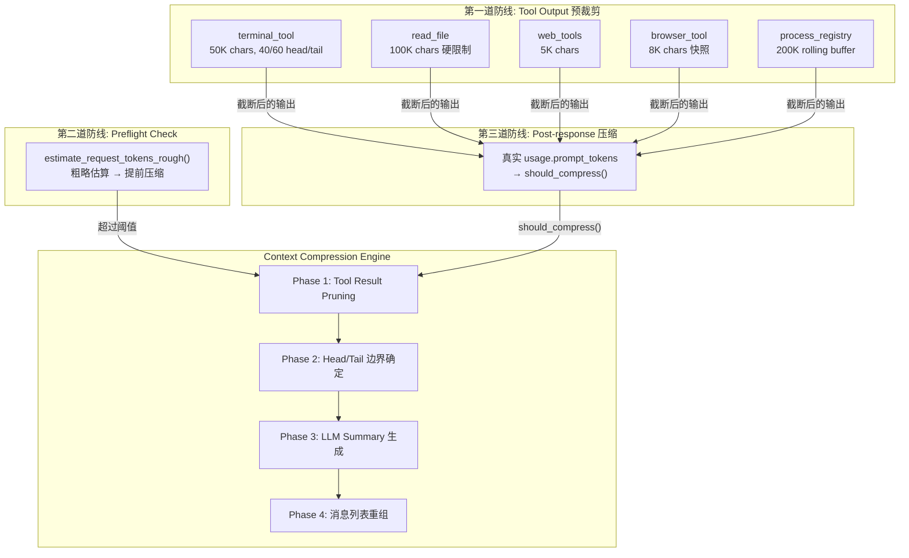
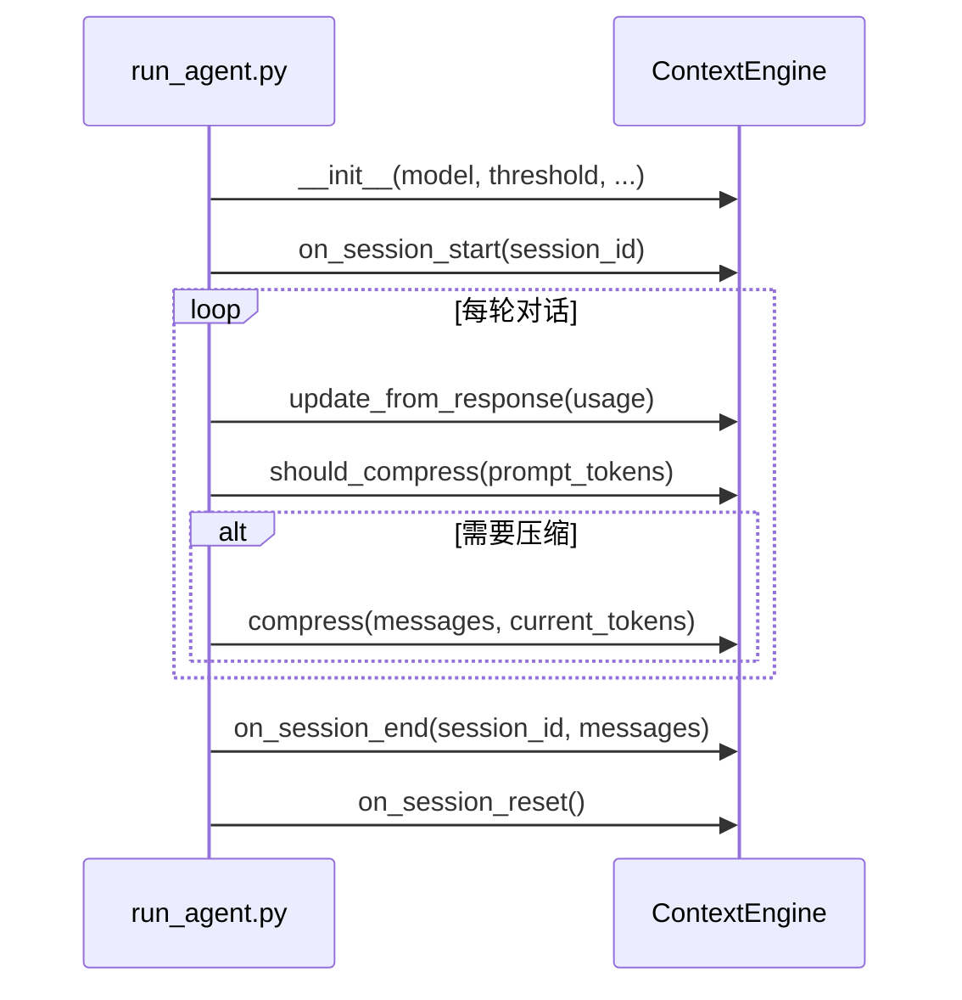
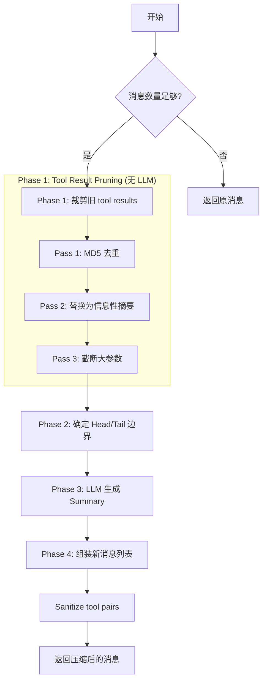
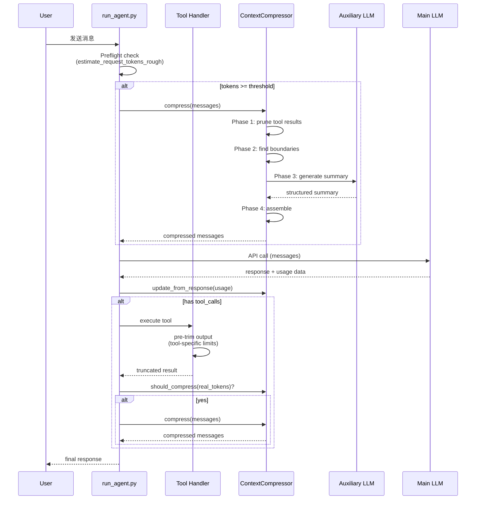

# 第七章 上下文管理

> *"Context is the currency of intelligence — spend it wisely, or go bankrupt mid-conversation."*

LLM Agent 的上下文窗口既是它的工作记忆，也是它最紧张的资源。一个 200K token 的窗口听起来很大，但当 Agent 需要执行数十轮工具调用、读取文件、运行命令时，上下文可以在几分钟内被耗尽。Hermes Agent 构建了一套精密的多层防御系统来管理这一资源——从工具输出的源头裁剪，到消息级别的智能压缩，再到基于 LLM 的迭代式摘要生成。

本章将深入解析这套上下文管理体系的每一个层次。

## 7.1 系统架构：三道防线

Hermes Agent 的上下文管理采用**纵深防御**（Defense in Depth）架构，三道防线逐层递进：

| 防线 | 位置 | 机制 | 是否需要 LLM |
|------|------|------|-------------|
| 第一道 | 各工具内部 | Tool Output 预裁剪 | ❌ |
| 第二道 | API 调用前 | Preflight 粗略估算 + 压缩 | ⚠️ 可能 |
| 第三道 | API 返回后 | 基于真实 token 数的压缩 | ✅ |



这种多层设计的好处在于：每一层都可以独立工作，即使某一层失效，后续层仍能提供保护。

## 7.2 Context Engine 抽象层

### 可插拔引擎设计

`agent/context_engine.py` 定义了上下文引擎的抽象基类，这是 **Strategy Pattern** 的经典应用：

```python
# agent/context_engine.py
class ContextEngine(ABC):
    """Base class all context engines must implement."""

    # Token 状态追踪
    last_prompt_tokens: int = 0
    last_completion_tokens: int = 0
    last_total_tokens: int = 0
    threshold_tokens: int = 0
    context_length: int = 0
    compression_count: int = 0

    # 压缩参数
    threshold_percent: float = 0.75
    protect_first_n: int = 3
    protect_last_n: int = 6

    @abstractmethod
    def should_compress(self, prompt_tokens: int = None) -> bool: ...

    @abstractmethod
    def compress(self, messages, current_tokens=None) -> List[Dict]: ...
```

引擎通过 `config.yaml` 的 `context.engine` 字段配置，默认使用内置的 `ContextCompressor`。Plugin engines 可以通过 `plugins/context_engine/<name>/` 目录注册，实现完全自定义的压缩策略。

### 引擎生命周期



### 配置参数

```python
# run_agent.py (关键配置初始化)
_compression_cfg = _agent_cfg.get("compression", {})
compression_threshold = float(_compression_cfg.get("threshold", 0.50))      # 50%
compression_enabled = str(_compression_cfg.get("enabled", True))
compression_target_ratio = float(_compression_cfg.get("target_ratio", 0.20)) # 20%
compression_protect_last = int(_compression_cfg.get("protect_last_n", 20))   # 20 条
```

这些参数可以通过配置文件调整，为不同的模型和使用场景提供灵活性。

## 7.3 Token 估算与模型元数据

### 粗略 Token 估算

准确的 token 计数需要 tokenizer，但加载 tokenizer 成本很高，而且不同模型使用不同的 tokenizer。Hermes Agent 采用了一个务实的方案——基于 `4 chars ≈ 1 token` 的粗略估算：

```python
# agent/model_metadata.py
def estimate_tokens_rough(text: str) -> int:
    """~4 chars/token, ceiling division 防止短文本估为 0"""
    if not text:
        return 0
    return (len(text) + 3) // 4

def estimate_request_tokens_rough(messages, *, system_prompt="", tools=None) -> int:
    """完整请求估算，包括 system prompt + tools schemas"""
    total_chars = 0
    if system_prompt: total_chars += len(system_prompt)
    if messages:      total_chars += sum(len(str(msg)) for msg in messages)
    if tools:         total_chars += len(str(tools))    # ← 关键！
    return (total_chars + 3) // 4
```

**设计要点**：

- 使用 ceiling division `(len + 3) // 4` 确保短文本不会被估为 0
- `estimate_request_tokens_rough` 特别将 **tool schemas** 纳入估算——当注册了 50+ 工具时，仅 schema 就可能占 20-30K tokens
- 这些估算函数只用于阈值判断，不需要精确——宁可高估也不低估

### 模型 Context Length 解析链

确定模型的最大 context length 是预算管理的基础。`get_model_context_length()` 实现了一个 **Chain of Responsibility** 模式的 10 级解析链：


**常见模型的硬编码默认值**：

| 模型族 | Context Length |
|--------|---------------|
| Claude Opus/Sonnet 4.6 | 1,000,000 |
| GPT-5.4 | 1,050,000 |
| GPT-5 (base/mini/codex) | 400,000 |
| Gemini | 1,048,576 |
| DeepSeek | 128,000 |
| Llama | 131,072 |
| Qwen3-Coder-Plus | 1,000,000 |

当模型完全未知时，使用降阶探测（Context Probe）：

```python
CONTEXT_PROBE_TIERS = [128_000, 64_000, 32_000, 16_000, 8_000]
```

系统会依次尝试这些上下文大小，从高到低探测模型的实际能力。

### 最小 Context Length

```python
MINIMUM_CONTEXT_LENGTH = 64_000
```

Context window 小于此值的模型无法有效运行 Hermes Agent 的 tool-calling 工作流。这个下限也被用在阈值计算中：

```python
self.threshold_tokens = max(
    int(self.context_length * threshold_percent),
    MINIMUM_CONTEXT_LENGTH,
)
```

## 7.4 第一道防线：Tool Output 预裁剪

每个工具在返回结果时就地进行截断，是防止单次工具调用"塞满"上下文的第一道防线。

### 各工具的裁剪策略

| 工具 | 限制 | 裁剪策略 |
|------|------|---------|
| `terminal` | 50,000 chars | **Head/Tail**: 40% head + 60% tail |
| `read_file` | 100,000 chars | 硬截断 + 建议用 offset/limit |
| `web_extract` | 5,000 chars | LLM 辅助提取 + 硬截断 |
| `browser_snapshot` | 8,000 chars | 行边界截断（保持 a11y tree 完整） |
| `process_registry` | 200,000 chars | Rolling buffer |
| `web_search` | 5,000 chars | 硬截断 + 提示 |

### Terminal Tool 的 Head/Tail 截断

Terminal 工具的截断策略最具代表性，展示了 head/tail 保留模式的精髓：

```python
# tools/terminal_tool.py
MAX_OUTPUT_CHARS = 50000

if len(output) > MAX_OUTPUT_CHARS:
    head_chars = int(MAX_OUTPUT_CHARS * 0.4)     # 40% head
    tail_chars = MAX_OUTPUT_CHARS - head_chars     # 60% tail
    omitted = len(output) - head_chars - tail_chars
    truncated_notice = (
        f"\n\n... [OUTPUT TRUNCATED - {omitted} chars omitted "
        f"out of {len(output)} total] ...\n\n"
    )
    output = output[:head_chars] + truncated_notice + output[-tail_chars:]
```

**为什么是 40/60 而不是 50/50？**

- **40% head**：错误消息（编译错误、import 失败）通常出现在输出开头
- **60% tail**：最近的输出通常最相关（测试结果、最终状态、命令退出码）
- 中间插入截断通知，告知模型有多少内容被省略

### Browser Snapshot 的结构感知截断

浏览器快照的截断需要特殊处理——不能从 accessibility tree 元素的中间切断：

```python
# tools/browser_tool.py
def _truncate_snapshot(snapshot_text: str, max_chars: int = 8000) -> str:
    if len(snapshot_text) <= max_chars:
        return snapshot_text
    lines = snapshot_text.split('\n')
    result = []
    chars = 0
    for line in lines:
        if chars + len(line) + 1 > max_chars - 80:  # 留 80 chars 给截断通知
            break
        result.append(line)
        chars += len(line) + 1
    # ... 添加截断通知
```

在**行边界**截断，确保每个 a11y tree 元素都是完整的。

## 7.5 Head/Tail 保护策略

### 三区域模型

压缩时，消息列表被划分为三个区域：

```
┌──────────────────────────────────────────────────────┐
│  HEAD (protected)  │  MIDDLE (summarize)  │  TAIL (protected)  │
│  protect_first_n=3 │  ← 这些被摘要压缩    │  tail_token_budget  │
│  system + 初始交换  │                      │  最近的对话轮次      │
└──────────────────────────────────────────────────────┘
```

### Head 保护

`protect_first_n=3` 保护以下内容：

1. **System prompt** — 包含所有行为规则和身份信息
2. **第一条 user message** — 通常包含初始任务定义
3. **第一条 assistant response** — 建立对话基调和上下文

```python
compress_start = self.protect_first_n  # 默认 3
compress_start = self._align_boundary_forward(messages, compress_start)
```

`_align_boundary_forward` 确保压缩不会从 tool result 消息中间开始——如果第 3 条消息是 tool result，会向前滑动直到遇到非 tool 消息。

### Tail 保护 — 基于 Token 预算

这是上下文管理中最精巧的设计之一。与简单地保护固定数量的尾部消息不同，Hermes Agent 使用 **token 预算** 来决定保留多少尾部内容：

```python
# agent/context_compressor.py
def _find_tail_cut_by_tokens(self, messages, head_end, token_budget=None):
    """从消息末尾向前走，累积 tokens 直到超过预算"""
    if token_budget is None:
        token_budget = self.tail_token_budget

    # tail_token_budget = threshold_tokens * summary_target_ratio
    # 例如：context=200K, threshold=50%=100K, ratio=20% → tail=20K tokens

    n = len(messages)
    min_tail = min(3, n - head_end - 1)     # 至少保留 3 条
    soft_ceiling = int(token_budget * 1.5)   # 允许 1.5x 超出
    accumulated = 0
    cut_idx = n

    for i in range(n - 1, head_end - 1, -1):
        msg = messages[i]
        content = msg.get("content") or ""
        msg_tokens = len(content) // _CHARS_PER_TOKEN + 10
        # 也计算 tool_call arguments
        for tc in msg.get("tool_calls") or []:
            if isinstance(tc, dict):
                args = tc.get("function", {}).get("arguments", "")
                msg_tokens += len(args) // _CHARS_PER_TOKEN

        if accumulated + msg_tokens > soft_ceiling and (n - i) >= min_tail:
            break
        accumulated += msg_tokens
        cut_idx = i

    cut_idx = self._align_boundary_backward(messages, cut_idx)
    return max(cut_idx, head_end + 1)
```

**Token 预算计算**：

```python
# tail_token_budget = threshold_tokens * summary_target_ratio
target_tokens = int(self.threshold_tokens * self.summary_target_ratio)
self.tail_token_budget = target_tokens
# 例如: 200K context, 50% threshold = 100K, 20% ratio → tail = 20K tokens
```

**为什么使用 token 预算而非固定消息数？** 因为消息大小差异巨大——一条包含大量代码的 tool result 可能有 5000 tokens，而一条简单的 user message 可能只有 20 tokens。固定保留 20 条消息，实际占用的 token 可能从 400 到 100,000 不等。

### 边界对齐

Tool call 和 tool result 必须成对出现，压缩边界不能切割这个配对：

```python
def _align_boundary_forward(self, messages, idx):
    """向前推到非 tool 消息（避免从 tool result 中间开始）"""
    while idx < len(messages) and messages[idx].get("role") == "tool":
        idx += 1
    return idx

def _align_boundary_backward(self, messages, idx):
    """向后拉，保持 assistant + tool_results 组的完整性"""
    check = idx - 1
    while check >= 0 and messages[check].get("role") == "tool":
        check -= 1
    if check >= 0 and messages[check].get("role") == "assistant" \
       and messages[check].get("tool_calls"):
        idx = check  # 把整个组拉进 summarized 区
    return idx
```

## 7.6 压缩流水线详解

当 `should_compress()` 返回 `true` 时，`compress()` 方法启动四阶段流水线：



### Phase 1: Tool Result Pruning（无 LLM 调用）

这个阶段纯粹是机械操作，不需要任何 LLM 调用，因此成本为零。

**Pass 1 — MD5 去重**：

```python
# 用 MD5 hash 检测相同的 tool output
content_hashes = {}
for i in range(len(result) - 1, -1, -1):  # 从后向前遍历
    msg = result[i]
    if msg.get("role") != "tool": continue
    if len(content) < 200: continue  # 短内容不去重
    h = hashlib.md5(content.encode()).hexdigest()[:12]
    if h in content_hashes:
        result[i] = {**msg, "content":
            "[Duplicate tool output — same content as a more recent call]"}
    else:
        content_hashes[h] = (i, msg.get("tool_call_id", "?"))
```

从后向前遍历确保**保留最新的副本**。典型场景：Agent 多次读取同一个文件，旧的读取结果被替换为引用。

**Pass 2 — 信息性单行摘要**：

不再使用笼统的 `[Old tool output cleared]`，而是根据工具类型生成具体的执行摘要：

```
[terminal] ran `npm test` -> exit 0, 47 lines output
[read_file] read config.py from line 1 (1,200 chars)
[search_files] content search for 'compress' in agent/ -> 12 matches
[patch] replace in config.py (340 chars result)
```

对 20+ 种工具都有定制的摘要格式，附带通用 fallback。这让模型在看到被压缩的工具结果时，仍然能知道**做了什么操作**和**大致结果如何**。

**Pass 3 — 截断大的 tool_call arguments**：

```python
for i in range(prune_boundary):
    msg = result[i]
    if msg.get("role") != "assistant" or not msg.get("tool_calls"):
        continue
    for tc in msg["tool_calls"]:
        args = tc.get("function", {}).get("arguments", "")
        if len(args) > 500:
            tc["function"]["arguments"] = args[:200] + "...[truncated]"
```

### Phase 3: LLM Summary 生成

#### 摘要输入的预处理

为了控制发送给 summary model 的输入大小，每条消息都有严格的截断限制：

```python
_CONTENT_MAX  = 6000    # 总字符上限
_CONTENT_HEAD = 4000    # 保留头部 4K chars
_CONTENT_TAIL = 1500    # 保留尾部 1.5K chars
_TOOL_ARGS_MAX = 1500   # tool call 参数上限
```

这又是 head/tail 保护模式的又一次出现——始终保留"开头的结构信息"和"结尾的最新信息"。

#### Summary Budget 计算

摘要的 token 预算与被压缩内容量成正比，但有上下限：

```
summary_budget = max(
    _MIN_SUMMARY_TOKENS,
    min(
        content_tokens * 0.20,                           # 被压缩内容的 20%
        min(context_length * 0.05, _SUMMARY_TOKENS_CEILING)  # 上限
    )
)

max_tokens = summary_budget * 1.3  # 30% 缓冲
```

#### 结构化 Summary 模板

生成的摘要遵循严格的结构模板：

```markdown
## Goal
## Constraints & Preferences
## Completed Actions          ← 编号列表，包含工具和结果
## Active State               ← 当前工作目录、修改的文件、测试状态
## In Progress
## Blocked
## Key Decisions
## Resolved Questions         ← 已回答的问题（避免重复回答）
## Pending User Asks          ← 未回答的问题
## Relevant Files
## Remaining Work             ← 用 "Remaining" 而非 "Next Steps"
## Critical Context           ← 具体值、错误消息、配置细节
```

**三个关键的设计细节**：

1. **`[CONTEXT COMPACTION — REFERENCE ONLY]`** 前缀——明确告知模型这是参考信息而非活跃指令
2. **"Remaining Work"** 替代 "Next Steps"——避免模型将摘要中的待办事项解读为需要立即执行的指令
3. **"Resolved Questions"** section——防止模型重复回答已经解决过的问题

#### Summarizer Preamble

```python
_summarizer_preamble = (
    "You are a summarization agent creating a context checkpoint. "
    "Your output will be injected as reference material for a DIFFERENT "
    "assistant that continues the conversation. "
    "Do NOT respond to any questions or requests in the conversation — "
    "only output the structured summary. "
    "Do NOT include any preamble, greeting, or prefix."
)
```

这段 preamble 巧妙地利用了 **"另一个助手"** 的框架（灵感来自 Codex），创造了心理分隔——让 summary model 不会试图回答对话中的问题，而是专注于摘要任务。

### 迭代式摘要更新

当已有 `_previous_summary` 时，不再从头生成，而是**增量更新**：

```python
if self._previous_summary:
    prompt = f"""{_summarizer_preamble}

You are updating a context compaction summary. A previous compaction
produced the summary below. New conversation turns have occurred since
then and need to be incorporated.

PREVIOUS SUMMARY:
{self._previous_summary}

NEW TURNS TO INCORPORATE:
{content_to_summarize}

Update the summary ... PRESERVE all existing information that is still
relevant. ADD new completed actions to the numbered list (continue
numbering). Move items from "In Progress" to "Completed Actions" when
done. Move answered questions to "Resolved Questions". ...
"""
```

更新规则：

| 操作 | 规则 |
|------|------|
| PRESERVE | 保留仍然相关的已有信息 |
| ADD | 新完成的操作追加到编号列表（续编号） |
| MOVE | In Progress → Completed Actions（完成时） |
| MOVE | Pending → Resolved Questions（回答时） |
| REMOVE | 仅移除明确过时的信息 |

这种增量更新避免了信息在多轮压缩中逐渐丢失的问题。

### Focus Topic（焦点主题）

受 Claude Code 的 `/compact <focus>` 启发，Hermes Agent 支持在压缩时指定焦点主题：

```python
if focus_topic:
    prompt += f"""
FOCUS TOPIC: "{focus_topic}"
The user has requested that this compaction PRIORITISE preserving all
information related to the focus topic above. For content related to
"{focus_topic}", include full detail — exact values, file paths,
command outputs, error messages, and decisions. For content NOT related
to the focus topic, summarise more aggressively (brief one-liners or
omit if truly irrelevant). The focus topic sections should receive
roughly 60-70% of the summary token budget.
"""
```

焦点主题相关的内容获得 60-70% 的 token 预算，确保关键信息在压缩中得到优先保留。

## 7.7 消息列表完整性保护

### Tool Pair Sanitization

压缩后，原本配对的 tool_call 和 tool_result 可能变成孤立的。`_sanitize_tool_pairs` 修复这两种故障模式：

```python
def _sanitize_tool_pairs(self, messages):
    # 找出所有存活的 call_ids 和 result_ids
    surviving_call_ids = {tc.id for msg in messages
                          if msg.role == "assistant"
                          for tc in msg.tool_calls}
    result_call_ids = {msg.tool_call_id for msg in messages
                       if msg.role == "tool"}

    # 故障 1: tool result 引用了已被移除的 call → 删除
    orphaned_results = result_call_ids - surviving_call_ids
    messages = [m for m in messages
                if not (m.role == "tool" and m.tool_call_id in orphaned_results)]

    # 故障 2: tool_call 的 result 被移除 → 插入 stub
    missing_results = surviving_call_ids - result_call_ids
    for tc_id in missing_results:
        patched.append({
            "role": "tool",
            "content": "[Result from earlier conversation — see context summary above]",
            "tool_call_id": tc_id,
        })
```

### Summary 角色选择

API 要求消息角色不能连续相同（如两个 `user` 消息相邻）。Summary 消息的角色选择需要避免与头部尾消息和尾部首消息冲突：

```python
last_head_role = messages[compress_start - 1].get("role", "user")
first_tail_role = messages[compress_end].get("role", "user")

if last_head_role in ("assistant", "tool"):
    summary_role = "user"
else:
    summary_role = "assistant"

# 如果与 tail 冲突，尝试翻转
if summary_role == first_tail_role:
    flipped = "assistant" if summary_role == "user" else "user"
    if flipped != last_head_role:
        summary_role = flipped
    else:
        # 两种都冲突 → 合并进 tail 第一条消息
        _merge_summary_into_tail = True
```

当两种角色都冲突时，摘要会被合并进 tail 的第一条消息，用分隔符隔开：

```
summary_text
--- END OF CONTEXT SUMMARY — respond to the message below, not the summary above ---
original_tail_message
```

## 7.8 压缩触发机制

### Preflight 压缩（API 调用前）

```python
# run_agent.py — 在进入 tool loop 之前检查
_preflight_tokens = estimate_request_tokens_rough(
    messages,
    system_prompt=active_system_prompt or "",
    tools=self.tools or None,  # ← 包含 tool schemas!
)

if _preflight_tokens >= self.context_compressor.threshold_tokens:
    # 可能需要多轮压缩（大 session + 小 context window）
    for _pass in range(3):
        messages, active_system_prompt = self._compress_context(...)
        if len(messages) >= _orig_len:
            break  # 无法进一步压缩
        _preflight_tokens = estimate_request_tokens_rough(...)
        if _preflight_tokens < threshold:
            break
```

注意最多允许 3 轮压缩——这是为了处理极端情况（非常大的 session + 小 context window），同时防止无限循环。

### Post-response 压缩（API 返回后）

```python
# 使用 API 返回的真实 token 数
_compressor = self.context_compressor
if _compressor.last_prompt_tokens > 0:
    _real_tokens = _compressor.last_prompt_tokens + _compressor.last_completion_tokens
else:
    # Fallback: stale/missing usage → 用粗略估算
    _real_tokens = estimate_messages_tokens_rough(messages)

if self.compression_enabled and _compressor.should_compress(_real_tokens):
    messages, active_system_prompt = self._compress_context(...)
```

### Context Pressure Warnings

```python
# 分层预警，纯用户侧通知（不注入消息流）
_compaction_progress = _real_tokens / _compressor.threshold_tokens

if _compaction_progress >= 0.95:
    _warn_tier = 0.95   # 🔴 Critical warning
elif _compaction_progress >= 0.85:
    _warn_tier = 0.85   # 🟠 Orange warning
```

### Anti-Thrashing 保护

如果压缩效果不佳（连续 2 次节省 < 10%），系统会暂停压缩尝试，避免无效的 LLM 调用浪费资源：

```python
def should_compress(self, prompt_tokens=None):
    tokens = prompt_tokens if prompt_tokens is not None else self.last_prompt_tokens
    if tokens < self.threshold_tokens:
        return False
    # Anti-thrashing
    if self._ineffective_compression_count >= 2:
        logger.warning("Compression skipped — last %d compressions saved <10%% each.")
        return False
    return True

# 压缩后评估有效性
savings_pct = (saved_estimate / display_tokens * 100) if display_tokens > 0 else 0
if savings_pct < 10:
    self._ineffective_compression_count += 1
else:
    self._ineffective_compression_count = 0  # 有效压缩重置计数
```

## 7.9 错误处理与容灾

### Summary 失败 Fallback

当 LLM 无法生成摘要时（网络错误、模型不可用等），系统不会崩溃，而是插入静态 fallback：

```python
if not summary:
    n_dropped = compress_end - compress_start
    summary = (
        f"{SUMMARY_PREFIX}\n"
        f"Summary generation was unavailable. {n_dropped} conversation turns were "
        f"removed to free context space but could not be summarized. ..."
    )
```

### Summary Model 降级

如果配置的辅助 summary model 不可用（404, 503），自动回退到主模型：

```python
if _is_model_not_found and self.summary_model and self.summary_model != self.model:
    self.summary_model = ""  # empty = use main model
    return self._generate_summary(messages, summary_budget)  # 立即重试
```

### Cooldown 机制

```python
# 无 provider: 600 秒 cooldown
# 暂时性错误 (timeout, rate limit): 60 秒 cooldown
self._summary_failure_cooldown_until = time.monotonic() + cooldown
```

### Compression Model 可行性预检

Session 启动时会检查辅助压缩模型的 context window 是否小于主模型的压缩阈值：

```python
def _check_compression_model_feasibility(self):
    # 如果 aux_context < threshold:
    #   "⚠ Compression model (xxx) context is N tokens, but the main
    #    model's compression threshold is M tokens."
    #   提供修复建议：
    #   1. 使用更大的 compression model
    #   2. 降低 compression threshold
```

## 7.10 Context 预算分配实例

以一个 200K context 模型为例，展示完整的预算分配：

```
Context Length:     200,000 tokens
Threshold (50%):   100,000 tokens  ← 超过此值触发压缩
Target Ratio (20%): 20,000 tokens  ← tail 保护预算

压缩后:
  Head (3 msgs):    ~2,000 tokens  (system + initial exchange)
  Summary:          ~5,000 tokens  (scaled, max 5% of context = 10K)
  Tail:            ~20,000 tokens  (recent conversation)
  ────────────────────────────────
  Total:           ~27,000 tokens  → 大量空间给新对话
```

压缩后仅占 context 的约 13.5%，为后续对话提供了充足的空间。

## 7.11 数据流全景



## 7.12 设计模式总结

| 设计模式 | 应用场景 | 实现 |
|----------|----------|------|
| **Strategy** | 可插拔压缩引擎 | `ContextEngine` 基类 + `ContextCompressor` + Plugin engines |
| **Chain of Responsibility** | 模型 context length 解析 | 10 级解析链逐级降级 |
| **Template Method** | 压缩流水线 | prune → boundary → summarize → assemble，各阶段可 override |
| **Observer** | Token 状态追踪 | `update_from_response()` 在每次 API 调用后更新状态 |

### Head/Tail 保留模式

这个模式在系统的多个层次反复出现，形成了一个统一的设计语言：

| 层次 | Head 比例 | Tail 比例 |
|------|----------|----------|
| Terminal tool 输出截断 | 40% | 60% |
| Context 压缩消息保护 | protect_first_n | token-budget tail |
| Summary 输入序列化 | 4K chars | 1.5K chars |

**核心思想**：始终保留"开头的结构信息"和"结尾的最新信息"，牺牲中间的低价值内容。

## 7.13 关键常量速查表

| 常量 | 值 | 说明 |
|------|---|------|
| `threshold_percent` | 0.50 | 触发压缩的 context 使用率 |
| `protect_first_n` | 3 | 头部保护消息数 |
| `protect_last_n` | 20 | 尾部保护消息数（fallback） |
| `summary_target_ratio` | 0.20 | Tail token 预算占 threshold 的比例 |
| `_SUMMARY_RATIO` | 0.20 | Summary 占被压缩内容的比例 |
| `_CHARS_PER_TOKEN` | 4 | 粗略 token 估算因子 |
| `MINIMUM_CONTEXT_LENGTH` | 64,000 | 最小 context window |
| `DEFAULT_FALLBACK_CONTEXT` | 128,000 | 未知模型默认 context |
| `MAX_OUTPUT_CHARS` (terminal) | 50,000 | Terminal 输出上限 |
| `_DEFAULT_MAX_READ_CHARS` | 100,000 | 文件读取上限 |
| `MAX_OUTPUT_SIZE` (web) | 5,000 | Web 内容输出上限 |
| Browser snapshot | 8,000 | 浏览器快照上限 |
| Process rolling buffer | 200,000 | 进程输出 buffer 上限 |
| `_SUMMARY_FAILURE_COOLDOWN` | 600s | Summary 失败冷却时间 |

## 本章小结

Hermes Agent 的上下文管理体系展现了**工程化思维**在 AI Agent 系统中的重要性。几个值得借鉴的设计原则：

1. **纵深防御**：不依赖单一机制，而是在多个层次构建保护——工具源头裁剪、预飞检查、真实 token 后检。每一层都是独立有效的。

2. **渐进式降级**：从零成本的机械裁剪（Phase 1 pruning）到需要 LLM 调用的智能摘要（Phase 3），成本逐渐递增。只在低成本方案不够时才启用高成本方案。

3. **Head/Tail 统一模式**：在工具输出、消息压缩、摘要输入三个层次都使用了相同的设计直觉——保留头尾、牺牲中间。

4. **结构完整性保证**：边界对齐、tool pair sanitization、角色冲突处理，确保压缩后的消息列表在语义和格式上都是合法的。

5. **容灾设计**：Summary 失败有 fallback、模型不可用有降级、无效压缩有 anti-thrashing——系统在异常情况下也能继续工作。

在下一章中，我们将深入 Hermes Agent 的工具系统架构，看看这些被精心裁剪的工具调用是如何被定义、注册和执行的。
