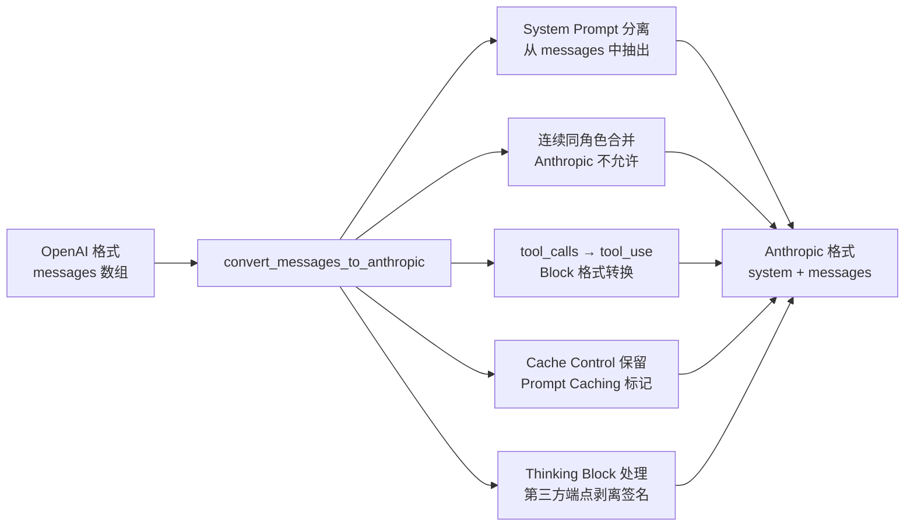
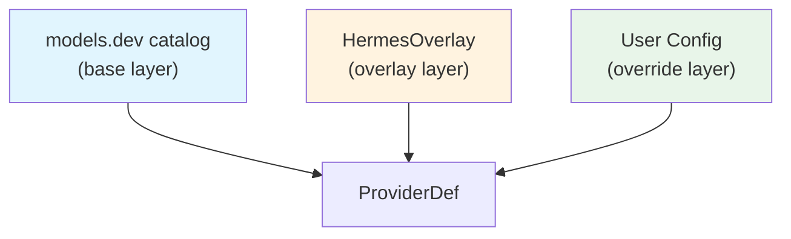
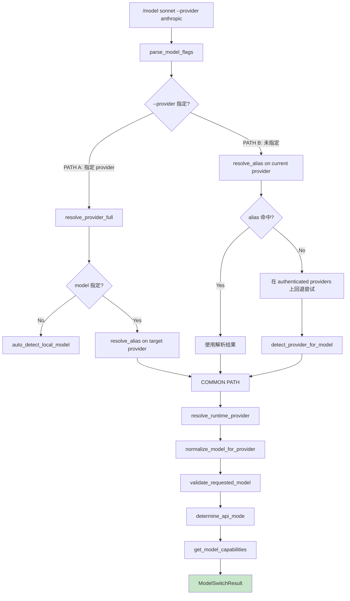
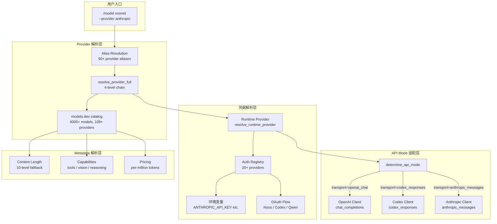
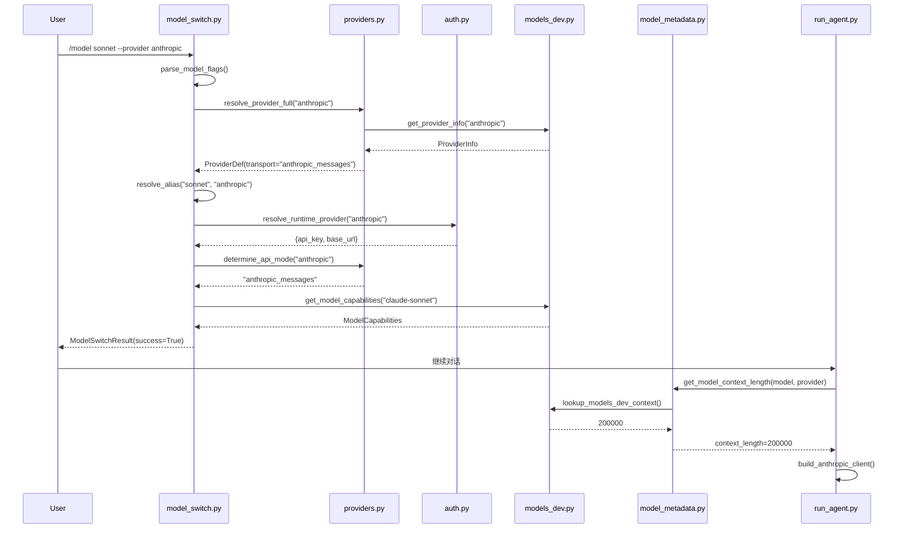

# 08 - 多模型适配

> **引导问题：** 一个 AI Agent 要同时支持 OpenAI、Anthropic、DeepSeek、Gemini、Kimi、通义千问等数十个模型提供商，每家的 API 协议不同、认证方式不同、模型能力不同、上下文长度不同——如何用一套统一架构把这些差异全部吸收掉，让用户只需一行 `/model sonnet --provider anthropic` 就能无缝切换？

## 8.1 问题空间

大模型领域的碎片化程度远超想象。仅 Hermes Agent 支持的 provider 就超过 **109 家**，涵盖 **4000+ 模型**。这些 provider 在以下维度各不相同：

| 差异维度 | 典型例子 |
|---------|---------|
| **传输协议** | OpenAI Chat Completions、Anthropic Messages、Codex Responses——三套完全不同的 JSON 结构 |
| **认证方式** | API Key、OAuth 设备授权码、OAuth 浏览器流程、外部进程认证——四种模式 |
| **上下文窗口** | 同一个 `claude-opus-4.6`，在 Anthropic 原生 API 是 1M，在 GitHub Copilot 是 128K |
| **模型命名** | 同一个模型可能叫 `claude-sonnet`、`anthropic/claude-sonnet-4-6`、`sonnet`——需要别名系统 |
| **HTTP 头部** | OpenRouter 需要 `HTTP-Referer`，Kimi 需要伪装 `User-Agent`，Copilot 需要专用认证头 |
| **消息格式** | Anthropic 不允许连续同角色消息，system prompt 必须单独传递，tool call 格式完全不同 |

Hermes Agent 的多模型适配架构就是为了解决这些问题而设计的。本章将从 API 协议层、Provider 路由层、Metadata 解析层和运行时切换层四个维度深入分析其实现。

### 核心源码文件

| 文件 | 行数 | 核心职责 |
|------|------|---------|
| `run_agent.py` | ~11,024 | API mode 检测、Client 初始化、Fallback chain |
| `hermes_cli/providers.py` | ~553 | Provider 定义三层合并、别名系统、transport 映射 |
| `hermes_cli/auth.py` | ~3,275 | 认证注册表、OAuth 流程、凭据持久化 |
| `hermes_cli/model_switch.py` | ~1,090 | 运行时模型切换管线、模型别名 |
| `agent/model_metadata.py` | ~1,102 | 上下文长度 10 级解析、URL→Provider 推断 |
| `agent/models_dev.py` | ~585 | models.dev 集成、ModelInfo 数据类、能力查询 |
| `agent/anthropic_adapter.py` | ~1,411 | Anthropic 原生适配、消息格式转换 |

---

## 8.2 三种 API 传输协议

Hermes Agent 将所有大模型 API 抽象为三种 **wire protocol**（传输协议），内部统一称为 `api_mode`：

| API Mode | 协议 | 代表性 Provider | 消息格式 |
|----------|------|----------------|---------|
| `chat_completions` | OpenAI Chat Completions | OpenRouter、DeepSeek、Gemini、大多数 provider | `messages: [{role, content}]` |
| `codex_responses` | OpenAI Codex Responses | OpenAI Codex、GitHub Copilot ACP | Codex 专有格式 |
| `anthropic_messages` | Anthropic Messages | Anthropic 原生、MiniMax | `system` 分离 + content blocks |

这三种协议的核心差异在于消息结构——Chat Completions 将 system prompt 放在 `messages` 数组中；Anthropic Messages 要求 `system` 单独传入；Codex Responses 则有专有的封装层。

### 8.2.1 API Mode 检测优先级链

当用户启动 agent 或切换模型时，系统需要自动判断应使用哪种协议。`run_agent.py:679-695` 实现了一条 **6 级检测优先级链**：

```python
# run_agent.py:679-695（精简展示）

# 1. 显式 api_mode 参数（最高优先级）
#    用户通过 --api-mode 手动指定

# 2. Provider 名称 → transport 映射
#    查询 TRANSPORT_TO_API_MODE 字典

# 3. Base URL 模式匹配
#    识别 api.anthropic.com 等已知域名

# 4. Model 前缀检测
#    anthropic/ 或 claude- 开头 → anthropic_messages

# 5. URL 以 /anthropic 结尾
#    自定义代理端点的后缀检测

# 6. 默认: chat_completions
```

这条检测链的设计体现了一个原则：**显式优于隐式，具体优于通用**。用户显式指定的 `api_mode` 永远拥有最高优先级；而当没有任何线索时，安全地回退到最通用的 Chat Completions 协议。

### 8.2.2 Transport → API Mode 映射

`hermes_cli/providers.py` 定义了 transport 到 API mode 的映射表，作为检测链中第二优先级的查找源：

```python
# hermes_cli/providers.py:270-274
TRANSPORT_TO_API_MODE: Dict[str, str] = {
    "openai_chat": "chat_completions",
    "anthropic_messages": "anthropic_messages",
    "codex_responses": "codex_responses",
}
```

每个已注册的 provider 都有一个 `transport` 字段。调用 `determine_api_mode()` 时，先查注册表拿到 transport，再映射到 API mode：

```python
# hermes_cli/providers.py:379-399
def determine_api_mode(provider: str, base_url: str = "") -> str:
    """Resolution order:
      1. Known provider → transport → TRANSPORT_TO_API_MODE
      2. URL heuristics for unknown / custom providers
      3. Default: 'chat_completions'
    """
    pdef = get_provider(provider)
    if pdef is not None:
        return TRANSPORT_TO_API_MODE.get(pdef.transport, "chat_completions")
    # URL-based heuristics
    if base_url:
        url_lower = base_url.rstrip("/").lower()
        if url_lower.endswith("/anthropic") or "api.anthropic.com" in url_lower:
            return "anthropic_messages"
        if "api.openai.com" in url_lower:
            return "codex_responses"
    return "chat_completions"
```

### 8.2.3 GPT-5.x 自动升级

一个有趣的特殊逻辑：当检测到模型为 GPT-5.x 系列或直连 OpenAI API 时，系统会自动将 `chat_completions` 升级为 `codex_responses`：

```python
# run_agent.py:714-724
if api_mode == "chat_completions" and (
    model.startswith("gpt-5") or "api.openai.com" in base_url
):
    api_mode = "codex_responses"
```

这是因为 OpenAI 的新一代模型（GPT-5.x）原生支持 Codex Responses API，该协议在 tool calling 和流式输出方面有更好的表现。系统在用户无感知的情况下自动升级，体现了**渐进增强**的设计理念。

---

## 8.3 OpenAI 兼容层

作为最通用的协议，Chat Completions 模式覆盖了绝大多数 provider。但"兼容"不意味着"相同"——不同 provider 在 HTTP 头部、认证方式、流式行为上仍有差异。

### 8.3.1 Client 初始化

`run_agent.py:896-991` 中，非 Anthropic 模式统一使用 OpenAI SDK 构建 client，但针对不同 provider 注入不同的配置：

```python
# run_agent.py:896-955（精简展示）
if api_key and base_url:
    # 显式凭据 → 直接构建 client
    client_kwargs = {"api_key": api_key, "base_url": base_url}

    # Provider-specific headers
    if "openrouter" in effective_base:
        client_kwargs["default_headers"] = {
            "HTTP-Referer": "https://hermes-agent.nousresearch.com",
            "X-OpenRouter-Title": "Hermes Agent",
        }
    elif "api.githubcopilot.com" in effective_base:
        client_kwargs["default_headers"] = copilot_default_headers()
    elif "api.kimi.com" in effective_base:
        client_kwargs["default_headers"] = {"User-Agent": "KimiCLI/1.30.0"}
else:
    # 无显式凭据 → 使用 centralized provider router
    from agent.auxiliary_client import resolve_provider_client
    _routed_client, _ = resolve_provider_client(
        self.provider or "auto", model=self.model, raw_codex=True)
```

### 8.3.2 Provider 专用 Headers

不同 provider 需要定制的 HTTP 头部，这是实际工程中最容易被忽视的细节：

| Provider | 自定义 Header | 目的 |
|----------|--------------|------|
| OpenRouter | `HTTP-Referer`、`X-OpenRouter-Title`、`X-OpenRouter-Categories` | 流量追踪与应用分类 |
| GitHub Copilot | `copilot_default_headers()` | Copilot 专用认证 |
| Kimi | `User-Agent: KimiCLI/1.30.0` | 伪装 Kimi CLI 客户端 |
| Qwen Portal | `_qwen_portal_headers()` | OAuth 关联 |
| Claude via OpenRouter | `x-anthropic-beta` | 细粒度 tool streaming |

### 8.3.3 Fine-Grained Tool Streaming

当通过 OpenRouter 使用 Claude 模型时，存在一个微妙的问题：Anthropic 默认会缓冲整个 tool call 的 JSON 参数，等构建完毕才一次性返回。如果 tool call 参数很大（比如写入一个长文件），这可能导致连接超时。

Hermes Agent 通过注入 beta header 解决了这个问题：

```python
# run_agent.py:964-974
if "openrouter" in _effective_base and "claude" in (self.model or "").lower():
    _FINE_GRAINED = "fine-grained-tool-streaming-2025-05-14"
    headers["x-anthropic-beta"] = _FINE_GRAINED
```

启用后，Anthropic 会逐 token 流式输出 tool call 参数，避免了缓冲超时。这类细节处理是生产级系统与演示项目的关键区别。

---

## 8.4 Anthropic 原生适配

Anthropic Messages API 与 OpenAI Chat Completions 有根本性的结构差异。Hermes Agent 通过一个专门的适配器层来处理这些差异。

### 8.4.1 专用 Client 构建

当 `api_mode` 为 `anthropic_messages` 时，系统构建独立的 Anthropic client，而非 OpenAI client：

```python
# run_agent.py:876-891
if self.api_mode == "anthropic_messages":
    from agent.anthropic_adapter import build_anthropic_client, resolve_anthropic_token

    # 仅原生 Anthropic provider 使用 ANTHROPIC_TOKEN 回退
    _is_native_anthropic = self.provider == "anthropic"
    effective_key = (
        (api_key or resolve_anthropic_token() or "")
        if _is_native_anthropic
        else (api_key or "")
    )
    self._anthropic_client = build_anthropic_client(effective_key, base_url)
    self.client = None  # 不需要 OpenAI client
```

这里有一个**关键的安全设计决策**：非原生 Anthropic provider（如 MiniMax 也使用 `anthropic_messages` 协议）**不会回退到 `ANTHROPIC_TOKEN`**。这防止了用户的 Anthropic API 密钥被意外发送到第三方端点。这个修复源自实际的生产 bug（#1739, #minimax-401），体现了**安全隔离优先**的设计原则。

### 8.4.2 Token 解析优先级

Anthropic 适配器有自己的 token 解析链，支持多种凭据来源：

```
ANTHROPIC_TOKEN
  → CLAUDE_CODE_OAUTH_TOKEN
    → Claude Code 凭据文件（支持自动刷新）
      → ANTHROPIC_API_KEY
```

这个链条的设计考虑了多种使用场景：直接购买 Anthropic API 的用户使用 `ANTHROPIC_API_KEY`；使用 Claude Code 订阅的用户通过 OAuth token 认证；而 `ANTHROPIC_TOKEN` 作为通用环境变量名具有最高优先级。

### 8.4.3 消息格式转换

`agent/anthropic_adapter.py` 中的 `convert_messages_to_anthropic()` 是整个适配层最复杂的函数（约 200 行），负责将 OpenAI 格式消息转换为 Anthropic 格式。它需要处理五个核心差异：



| 转换项 | OpenAI 格式 | Anthropic 格式 |
|--------|------------|---------------|
| System prompt | `{"role": "system", "content": "..."}` 在 messages 数组中 | 独立的 `system` 参数 |
| Tool call | `tool_calls: [{id, function: {name, arguments}}]` | `content: [{type: "tool_use", id, name, input}]` |
| 连续消息 | 允许连续 assistant 或 user 消息 | 必须交替出现 |
| Thinking | `reasoning` 字段 | `thinking` content block |

这种适配器设计的精妙之处在于：Hermes Agent 内部统一使用 OpenAI 格式作为「通用语」，只在最终发送 API 请求时才通过适配器转换为目标格式。这使得上层业务逻辑完全不需要关心底层使用的是哪种协议。

---

## 8.5 Model Metadata 注册表

要让模型切换真正无缝，系统需要知道每个模型的「元数据」——上下文窗口大小、是否支持 tool calling、是否支持 vision、定价信息等。Hermes Agent 设计了一套**三层数据源架构**来获取这些信息。

### 8.5.1 三层数据源

```mermaid
graph TB
    subgraph "Layer 1: models.dev 社区数据库"
        MD[4000+ 模型<br/>109+ Provider<br/>context window / cost / capabilities]
    end
    subgraph "Layer 2: OpenRouter Live API"
        OR[/api/v1/models endpoint<br/>1hr in-memory cache<br/>pricing / context_length / max_tokens]
    end
    subgraph "Layer 3: 内置 Hardcoded Defaults"
        HC[DEFAULT_CONTEXT_LENGTHS dict<br/>broad family patterns<br/>最后 fallback: 128K]
    end
    MD --> MERGE[三层合并]
    OR --> MERGE
    HC --> MERGE
    MERGE --> RESULT[最终 ModelInfo]
```

**第一层：models.dev 社区数据库** 是最丰富的数据源，涵盖 4000+ 模型的详细元数据。系统通过 `agent/models_dev.py` 集成这个数据库。

**第二层：OpenRouter Live API** 提供实时的模型信息，特别是定价和可用性数据。使用 1 小时的内存缓存减少 API 调用。

**第三层：内置默认值** 是最后的兜底方案，使用宽泛的模型家族模式匹配（如 "claude" 系列默认 200K），确保即使前两层数据缺失，系统仍能正常运行。

### 8.5.2 ModelInfo 数据类

`agent/models_dev.py` 定义了统一的模型信息结构：

```python
# agent/models_dev.py:46-104
@dataclass
class ModelInfo:
    id: str
    name: str
    family: str
    provider_id: str

    # Capabilities（能力标记）
    reasoning: bool = False           # 是否支持 reasoning/thinking
    tool_call: bool = False           # 是否支持 function calling
    attachment: bool = False          # 是否支持 vision（图片输入）
    temperature: bool = False         # 是否支持 temperature 调节
    structured_output: bool = False   # 是否支持 structured output
    open_weights: bool = False        # 是否开源权重

    # Modalities（模态）
    input_modalities: Tuple[str, ...] = ()
    output_modalities: Tuple[str, ...] = ()

    # Limits（限制）
    context_window: int = 0           # 上下文窗口大小
    max_output: int = 0              # 最大输出 token 数

    # Cost（成本，单位：USD/百万 token）
    cost_input: float = 0.0
    cost_output: float = 0.0
```

这个数据类的设计覆盖了模型选择的所有关键维度。当用户切换模型时，系统可以据此判断新模型是否支持当前使用的功能（如 tool calling、vision），并在不支持时给出警告。

### 8.5.3 models.dev 缓存策略

models.dev 数据的加载采用了**离线优先**的策略：

```python
# agent/models_dev.py:206-247
# Resolution order:
#   1. Bundled snapshot（随代码分发的离线快照）
#   2. Disk cache（~/.hermes/models_dev_cache.json）
#   3. Network fetch（https://models.dev/api.json）
#   4. Background refresh（每 60 分钟后台更新）
```

这套策略确保了：
- **离线可用**：打包的快照保证即使没有网络也能工作
- **自动更新**：后台每 60 分钟刷新一次，及时获取新模型信息
- **快速启动**：优先使用本地缓存，不阻塞启动流程

---

## 8.6 上下文长度自适应

上下文长度是模型适配中最关键的参数——它决定了对话能持续多久、能处理多大的文件、压缩策略何时触发。Hermes Agent 为此设计了一条**10 级回退解析链**。

### 8.6.1 十级回退链

```python
# agent/model_metadata.py:941-953
"""Resolution order:
0. Explicit config override    (model.context_length)
1. Persistent cache            (previously discovered via probing)
2. Active endpoint metadata    (/models for custom endpoints)
3. Local server query          (for local endpoints)
4. Anthropic /v1/models API    (API-key users only)
5. OpenRouter live API         metadata
6. Nous suffix-match           via OpenRouter cache
7. models.dev registry lookup  (provider-aware)
8. Thin hardcoded defaults     (broad family patterns)
9. Default fallback            (128K)
"""
```

让我们理解为什么需要 10 级。最直接的方式是查 models.dev 数据库（第 7 级），但这不够：

- **用户可能手动覆盖**（第 0 级）：某些 provider 对模型做了 context window 裁剪
- **探测结果需要持久化**（第 1 级）：对未知模型执行过一次探测后，缓存结果避免重复探测
- **本地模型需要实时查询**（第 2-3 级）：Ollama、LM Studio 等本地服务器的 context length 取决于加载参数
- **同模型不同 provider 有差异**（第 4-7 级）：前面提到的 `claude-opus-4.6` 在不同 provider 的 context limit 不同

### 8.6.2 Provider-Aware 解析

相同的模型在不同 provider 可能有完全不同的上下文限制。系统的解析是**provider-aware**的：

```python
# agent/model_metadata.py:1020-1035
effective_provider = provider
if not effective_provider or effective_provider in ("openrouter", "custom"):
    if base_url:
        inferred = _infer_provider_from_url(base_url)
        if inferred:
            effective_provider = inferred
```

即使用户没有显式指定 provider，系统也会从 base URL 推断出实际的 provider，然后查询该 provider 对应的 context limit。

### 8.6.3 URL → Provider 推断

`agent/model_metadata.py` 维护了一张 URL 到 provider 的映射表，支持 20+ provider 的自动识别：

```python
# agent/model_metadata.py:218-242
_URL_TO_PROVIDER: Dict[str, str] = {
    "api.openai.com": "openai",
    "api.anthropic.com": "anthropic",
    "api.z.ai": "zai",
    "api.moonshot.ai": "kimi-coding",
    "dashscope.aliyuncs.com": "alibaba",
    "openrouter.ai": "openrouter",
    "generativelanguage.googleapis.com": "gemini",
    "api.deepseek.com": "deepseek",
    "api.x.ai": "xai",
    # ... 共 20+ 条映射
}
```

### 8.6.4 Context Length 探测

当所有静态数据源都无法确定上下文长度时，系统会通过**降级探测**来发现实际限制：

```python
# agent/model_metadata.py:79-85
CONTEXT_PROBE_TIERS = [128_000, 64_000, 32_000, 16_000, 8_000]
MINIMUM_CONTEXT_LENGTH = 64_000  # 模型最低要求
```

探测策略是从最大值开始尝试，逐步降低，直到找到模型能接受的上下文长度。探测结果会被持久化缓存（第 1 级），后续不需要重复探测。

---

## 8.7 Provider 路由与解析

当用户输入一个 provider 名称时，系统需要将其解析为具体的 API 端点、认证凭据和 transport 类型。这个过程涉及多层查找和合并。

### 8.7.1 Provider 定义三层合并



**第一层 models.dev**：提供 base URL、环境变量名、展示名等基础信息。这是社区维护的数据，覆盖面最广。

**第二层 HermesOverlay**：补充 models.dev 缺少的 Hermes 特有元数据：

```python
# hermes_cli/providers.py:32-42
@dataclass(frozen=True)
class HermesOverlay:
    transport: str = "openai_chat"        # 传输协议类型
    is_aggregator: bool = False           # 是否为聚合器（如 OpenRouter）
    auth_type: str = "api_key"            # 认证类型
    extra_env_vars: Tuple[str, ...] = ()  # 额外环境变量
    base_url_override: str = ""           # URL 覆盖
    base_url_env_var: str = ""            # 自定义 URL 的环境变量
```

**第三层 User Config**：用户在 `config.yaml` 的 `providers:` 部分自定义的端点和覆盖项，拥有最高优先级。

### 8.7.2 四级 Provider 解析链

`hermes_cli/providers.py:497-553` 中的 `resolve_provider_full()` 实现了完整的解析流程：

```python
# hermes_cli/providers.py:497-553
def resolve_provider_full(name, user_providers, custom_providers):
    """Resolution chain:
    1. Built-in（models.dev + overlays 合并）
    2. User-defined providers（config.yaml 的 providers: 节）
    3. Saved custom providers（config.yaml 的 custom_providers: 节）
    4. Direct models.dev lookup（对未知别名的最后尝试）
    """
```

### 8.7.3 Alias 系统

为了让用户不必记住每个 provider 的规范名称，系统维护了一张 **90+ 条**的别名映射表：

```python
# hermes_cli/providers.py:170-252
ALIASES: Dict[str, str] = {
    "claude": "anthropic",
    "glm": "zai",        "z-ai": "zai",
    "kimi": "kimi-for-coding",
    "copilot": "github-copilot",
    "qwen": "alibaba",
    "grok": "xai",
    # ... 90+ entries
}
```

`normalize_provider()` 函数将用户输入的任意别名解析为规范的 provider ID：`"claude"` → `"anthropic"`，`"grok"` → `"xai"`。

### 8.7.4 Aggregator vs Direct Provider

Hermes Agent 区分两类 provider：

| 类型 | 模型 ID 格式 | 典型 Provider |
|------|-------------|--------------|
| **Aggregator（聚合器）** | `vendor/model-name`<br/>如 `anthropic/claude-opus-4-6` | OpenRouter、Vercel、HuggingFace |
| **Direct（直连）** | `model-name`<br/>如 `claude-opus-4-6` | Anthropic、DeepSeek、Gemini |

聚合器将多个 provider 的模型统一到一个 API 端点下，使用 `vendor/model-name` 格式区分来源。直连 provider 则直接对接模型厂商的 API。

---

## 8.8 凭据解析

### 8.8.1 四种认证类型

Hermes Agent 支持四种认证方式，覆盖了当前所有主流 AI API 的认证模型：

| Auth Type | 描述 | 代表 Provider | 实现方式 |
|-----------|------|--------------|---------|
| `api_key` | 环境变量 API Key | OpenRouter、DeepSeek、Anthropic | 读取环境变量 |
| `oauth_device_code` | OAuth 设备授权码 | Nous Portal | 终端显示授权码 → 浏览器确认 |
| `oauth_external` | 外部 OAuth 浏览器流程 | OpenAI Codex、Qwen OAuth | 打开浏览器 → 回调获取 token |
| `external_process` | 外部进程认证 | GitHub Copilot ACP | 启动外部进程获取 token |

### 8.8.2 Provider 认证注册表

`hermes_cli/auth.py` 中的 `PROVIDER_REGISTRY` 为每个 provider 定义了认证配置：

```python
# hermes_cli/auth.py:102-250
PROVIDER_REGISTRY: Dict[str, ProviderConfig] = {
    "nous": ProviderConfig(auth_type="oauth_device_code", ...),
    "openai-codex": ProviderConfig(auth_type="oauth_external", ...),
    "anthropic": ProviderConfig(
        auth_type="api_key",
        api_key_env_vars=("ANTHROPIC_API_KEY", "ANTHROPIC_TOKEN",
                          "CLAUDE_CODE_OAUTH_TOKEN"),
    ),
    "deepseek": ProviderConfig(
        auth_type="api_key",
        api_key_env_vars=("DEEPSEEK_API_KEY",),
        base_url_env_var="DEEPSEEK_BASE_URL",
    ),
    # ... 20+ providers
}
```

### 8.8.3 凭据回退链

对于 API Key 类 provider，凭据的解析遵循一条回退链：

```
1. 显式传入的 api_key 参数
   ↓ 未找到
2. Provider 特定环境变量（按 api_key_env_vars 顺序尝试）
   ↓ 未找到
3. base_url_env_var 环境变量（用于自定义端点）
   ↓ 未找到
4. 最后 fallback: OPENROUTER_API_KEY → OpenRouter
```

最后的 OpenRouter fallback 是一个巧妙的兜底设计：OpenRouter 是一个聚合器，支持几乎所有主流模型。如果用户配置了 OpenRouter API key，即使目标 provider 的专用 key 缺失，系统仍可通过 OpenRouter 路由请求。

### 8.8.4 Auth Store 持久化

认证状态持久化在 `~/.hermes/auth.json`，具备以下安全特性：

- **文件锁保护**：使用 `fcntl`（Unix）/ `msvcrt`（Windows）实现跨进程安全
- **OAuth token 自动刷新**：在 token 过期前提前刷新（带 skew 提前量）
- **Agent key 管理**：支持 Nous Portal agent key 的生成与刷新

---

## 8.9 运行时模型切换

当用户在交互过程中执行 `/model sonnet --provider anthropic` 时，系统需要在不中断会话的情况下完成模型切换。这个过程由 `hermes_cli/model_switch.py` 编排。

### 8.9.1 切换管线全景



切换管线分为两条路径：

- **PATH A**：用户显式指定了 provider，直接在该 provider 上解析模型名
- **PATH B**：未指定 provider，先在当前 provider 上尝试别名解析，失败则在所有已认证的 provider 上回退尝试

### 8.9.2 Model Alias 系统

`hermes_cli/model_switch.py` 维护了一套模型别名表，让用户可以用短名称指代模型：

```python
# hermes_cli/model_switch.py:105-154
MODEL_ALIASES: dict[str, ModelIdentity] = {
    "sonnet":   ModelIdentity("anthropic", "claude-sonnet"),
    "opus":     ModelIdentity("anthropic", "claude-opus"),
    "gpt5":     ModelIdentity("openai", "gpt-5"),
    "gemini":   ModelIdentity("google", "gemini"),
    "deepseek": ModelIdentity("deepseek", "deepseek-chat"),
    "grok":     ModelIdentity("x-ai", "grok"),
    "qwen":     ModelIdentity("qwen", "qwen"),
    "minimax":  ModelIdentity("minimax", "minimax"),
    "kimi":     ModelIdentity("moonshotai", "kimi"),
    "glm":      ModelIdentity("z-ai", "glm"),
    "mimo":     ModelIdentity("xiaomi", "mimo"),
    # ... 20+ aliases
}
```

每个别名同时绑定了 provider 和模型名，实现 `/model sonnet` 一步到位——系统自动知道 `sonnet` 意味着 `anthropic` provider 的 `claude-sonnet` 模型。

### 8.9.3 ModelSwitchResult

切换完成后，返回一个包含所有必要信息的结构化结果：

```python
# hermes_cli/model_switch.py:226-243
@dataclass
class ModelSwitchResult:
    success: bool
    new_model: str = ""
    target_provider: str = ""
    provider_changed: bool = False
    api_key: str = ""
    base_url: str = ""
    api_mode: str = ""              # 切换后的 wire protocol
    error_message: str = ""
    warning_message: str = ""
    capabilities: Optional[ModelCapabilities] = None
    model_info: Optional[ModelInfo] = None
```

这个结果包含了 agent 重新初始化所需的一切信息。`provider_changed` 标志告诉调用者是否需要重建 API client；`capabilities` 告诉上层当前模型支持哪些功能。

### 8.9.4 Fallback Chain

`run_agent.py` 还支持多 provider 的 fallback chain，当首选 provider 失败时自动切换：

```python
# run_agent.py:997-1006
# 支持两种格式:
# 1. 列表: [{"provider": "deepseek", "model": "deepseek-chat"}, ...]
# 2. 单个: {"provider": "deepseek", "model": "deepseek-chat"}
self._fallback_chain = [f for f in fallback_model if isinstance(f, dict)]
```

---

## 8.10 本地模型支持

Hermes Agent 不仅支持云端 API，还能自动识别和适配本地部署的模型服务器。

### 8.10.1 本地端点识别

系统通过多种方式识别本地端点：

```python
# agent/model_metadata.py:196-202
_LOCAL_HOSTS = ("localhost", "127.0.0.1", "::1", "0.0.0.0")
_CONTAINER_LOCAL_SUFFIXES = (
    ".docker.internal",
    ".containers.internal",
    ".lima.internal",
)
# 还检测 RFC-1918 private ranges (10.x, 172.16-31.x, 192.168.x)
```

### 8.10.2 服务器类型探测

检测到本地端点后，系统通过 endpoint probing 识别具体的服务器类型：

```python
# 探测顺序:
# 1. /api/v1/models → "lm-studio"
# 2. /api/tags（验证 "models" key）→ "ollama"
# 3. /v1/props（或 /props）→ "llamacpp"
# 4. /version → "vllm"
```

不同服务器类型有不同的能力和限制，识别后系统可以做针对性优化。

### 8.10.3 Provider Prefix 智能处理

本地模型引入了一个有趣的歧义问题：`deepseek:latest` 是 provider prefix（`deepseek` provider 的 `latest` 模型）还是 Ollama tag（`deepseek` 模型的 `latest` 版本）？

```python
# agent/model_metadata.py:50-67
def _strip_provider_prefix(model: str) -> str:
    """Strip recognised provider prefix from model string.
    
    "local:my-model"    → "my-model"      (provider prefix → strip)
    "qwen3.5:27b"       → "qwen3.5:27b"   (Ollama tag → preserve)
    "deepseek:latest"   → "deepseek:latest" (Ollama tag → preserve)
    """
```

系统维护了一个 50+ 条的 `_PROVIDER_PREFIXES` frozenset 和一个 Ollama tag 正则模式来消歧：

```python
_OLLAMA_TAG_PATTERN = re.compile(
    r"^(\d+\.?\d*b|latest|stable|q\d|fp?\d|instruct|chat|coder|vision|text)",
    re.IGNORECASE,
)
```

规则：只有当前缀在已知 provider 列表中**且**后缀不匹配 Ollama tag 模式时，才执行 prefix 剥离。

---

## 8.11 架构全景

将以上所有组件串联，Hermes Agent 的多模型适配架构可以用以下全景图概括：



---

## 8.12 设计模式总结

纵观整个多模型适配系统，可以提炼出以下设计模式：

### Strategy Pattern（策略模式）

三种 API mode 对应三种不同的 client 初始化和消息处理策略。`transport` 字段是策略选择器，运行时通过它 dispatch 到正确的实现。这使得新增一种 API 协议只需增加一个新的 transport 类型和对应的 client builder。

### Chain of Responsibility（责任链模式）

**Context Length 10 级解析链**和 **Provider 4 级解析链**都是典型的责任链模式实现。每一层尝试处理请求，如果自己无法处理（数据缺失），就透明地传递给下一层。这种设计让每一层的实现保持简单，同时整体系统具备极强的容错能力。

### Adapter Pattern（适配器模式）

`agent/anthropic_adapter.py` 是教科书级的适配器——将内部统一的 OpenAI 格式消息转换为 Anthropic 格式，处理系统提示分离、thinking block、role 合并等差异。上层业务代码完全不需要关心底层协议差异。

### Registry Pattern（注册表模式）

系统中共存多个注册表，各司其职：

| 注册表 | 所在文件 | 职责 |
|--------|---------|------|
| `PROVIDER_REGISTRY` | `auth.py` | 认证配置注册表 |
| `HERMES_OVERLAYS` | `providers.py` | Transport overlay 注册表 |
| `ALIASES` | `providers.py` | Provider 别名注册表 |
| `MODEL_ALIASES` | `model_switch.py` | 模型别名注册表 |
| `DEFAULT_CONTEXT_LENGTHS` | `model_metadata.py` | 上下文长度注册表 |
| `_URL_TO_PROVIDER` | `model_metadata.py` | URL→Provider 推断表 |

### Layered Merge Pattern（分层合并模式）

Provider 定义采用三层合并：`models.dev (base) + HermesOverlay (overlay) + UserConfig (override)`。每一层可以覆盖或补充上一层的数据，最终合并成 `ProviderDef`。这种设计让社区数据库提供广度，Hermes 自身提供深度，用户配置提供个性化。

### Security by Design（安全设计）

凭据隔离不是事后补丁，而是架构级别的设计。非原生 Anthropic provider 不会回退到 `ANTHROPIC_TOKEN`，防止凭据泄漏到第三方端点。这个设计源自真实的生产 bug，体现了「安全作为一等公民」的工程文化。

---

## 8.13 数据流序列图

最后，通过一个完整的序列图展示模型切换的端到端数据流：



---

## 8.14 本章小结

Hermes Agent 的多模型适配系统是一个精心设计的分层架构，解决了大模型碎片化带来的三个核心挑战：

**协议统一**：通过 `api_mode` 抽象将三种 wire protocol 统一到一个编程模型下。内部使用 OpenAI 格式作为「通用语」，只在 API 调用边界才通过适配器转换。关键在于 6 级自动检测链，让用户几乎不需要手动指定协议。

**信息完备**：通过三层数据源（models.dev + OpenRouter + hardcoded defaults）和 10 级上下文长度解析链，确保对任何模型都能获得足够的元数据来正确工作。provider-aware 的解析设计处理了「同模型不同限制」的现实问题。

**体验无缝**：90+ provider 别名、20+ 模型别名、4 级 provider 解析链、多 provider fallback chain——这些机制共同构成了一个目标：让用户用最少的输入完成模型切换，出错时自动回退，绝不死在半路。

从设计模式的角度看，这套系统是策略模式、责任链模式、适配器模式和注册表模式的经典组合。每种模式都不是为了炫技，而是在解决具体的工程问题。最让人印象深刻的是安全设计——凭据隔离不是 README 里的一行宣言，而是用代码和测试保证的架构约束，而且这个约束是被真实的生产 bug 驱动出来的。

> **下一章预告**：模型适配解决了「如何与不同 provider 对话」的问题，但 Agent 真正强大的地方在于它的工具系统。第九章将深入 MCP（Model Context Protocol）集成，看 Hermes Agent 如何通过标准化协议接入几乎无限的外部工具。
