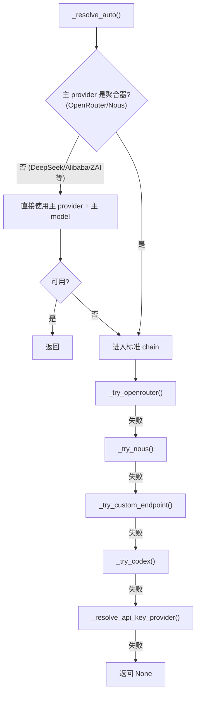
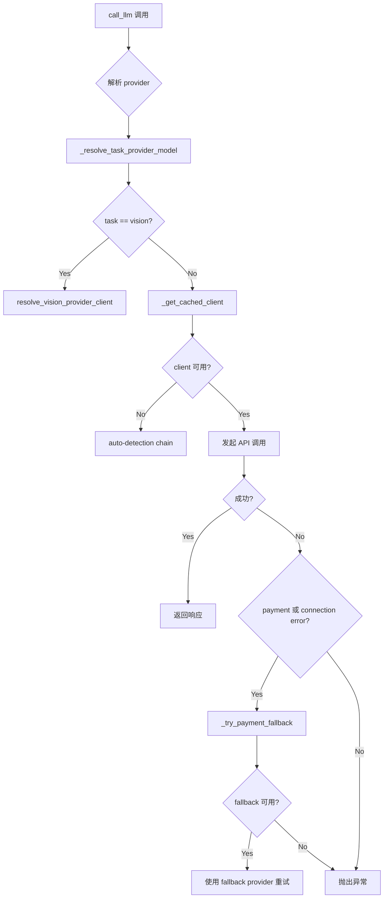
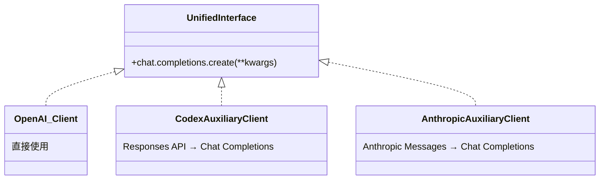
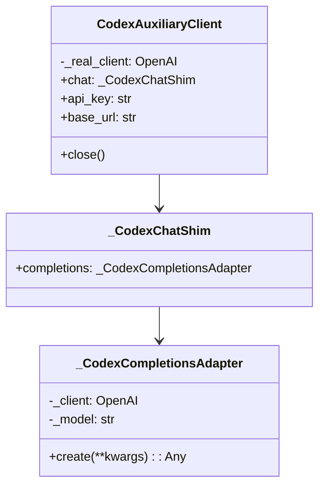
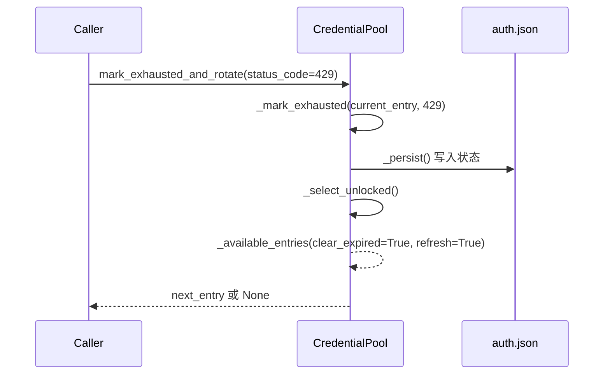
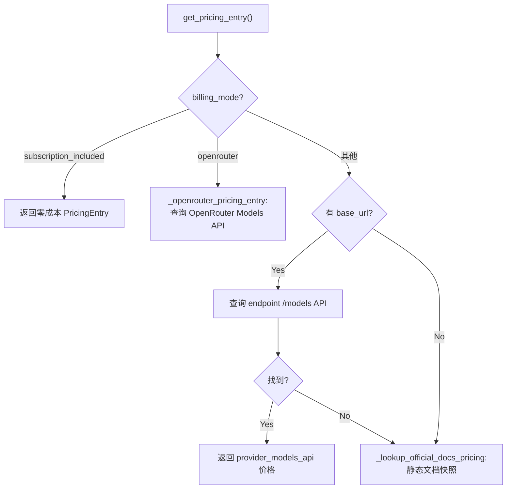
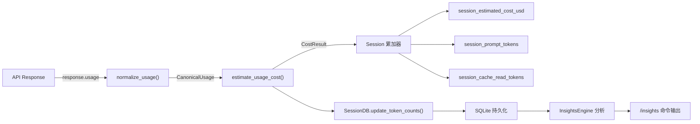

# 第九章 辅助客户端与成本控制

> **核心文件**：`auxiliary_client.py`、`credential_pool.py`、`usage_pricing.py`、`rate_limit_tracker.py`、`error_classifier.py`、`retry_utils.py`

Hermes Agent 的主对话循环只是冰山一角。在水面之下，还有大量**辅助 LLM 调用**在默默工作——上下文压缩、视觉分析、网页内容提取、会话搜索等。这些辅助任务分散在不同模块中，但它们共享同一套 provider 解析、错误处理和 fallback 逻辑。`auxiliary_client.py` 正是这套逻辑的统一入口，而围绕它构建的凭证池、定价引擎和速率追踪器，则构成了完整的成本控制体系。

本章将深入剖析这些组件的实现：从 provider chain 的责任链解析到 Codex/Anthropic 的适配器模式，从凭证轮转的四种策略到基于 Decimal 精度的成本计算，揭示一个生产级 AI Agent 如何在多 provider 环境下实现弹性调用与精确成本追踪。

---

## 9.1 辅助调用的统一入口：call_llm()

### 为什么需要辅助客户端

主对话循环使用 `run_agent.py` 中配置好的单一 provider，但辅助任务有不同的需求：

| 辅助任务 | 典型消费者 | 特殊需求 |
|----------|-----------|---------|
| 上下文压缩 | `context_compression` | 快速、低成本模型 |
| 视觉分析 | `vision_analyze` | 多模态模型 |
| 网页提取 | `web_extraction` | 长上下文窗口 |
| 会话搜索 | `session_search` | 支持工具调用 |
| 记忆刷写 | `flush_memories` | 支持 JSON mode |
| 浏览器视觉 | `browser_vision` | 截图理解能力 |
| MCP 工具调用 | `mcp_tool_call` | 通用能力 |

这些任务不应该被绑定到用户选择的主 provider 上。用户可能使用 DeepSeek 作为主模型（便宜、快速），但视觉任务需要能理解图片的模型。`call_llm()` 作为 **Facade**，为所有辅助消费者提供统一接口，隐藏 provider 解析、client 缓存、格式转换和 fallback 等全部复杂性。

### Provider 解析链

`call_llm()` 的核心在于其 **provider chain**——一个按优先级排列的 provider 列表。对于文本任务和视觉任务，解析链有所不同：

**文本任务解析顺序**：
```
1. OpenRouter     (OPENROUTER_API_KEY)
2. Nous Portal    (~/.hermes/auth.json 中的活跃 provider)
3. Custom endpoint (config.yaml model.base_url + OPENAI_API_KEY)
4. Codex OAuth    (gpt-5.3-codex via Responses API)
5. Native Anthropic
6. Direct API-key providers (Z.AI, Kimi, MiniMax 等)
7. None (无可用 provider)
```

**视觉任务解析顺序**：
```
1. Main provider  (如果支持视觉后端)
2. OpenRouter
3. Nous Portal
4. Codex OAuth    (gpt-5.3-codex 支持视觉)
5. Native Anthropic
6. Custom endpoint (Qwen-VL, LLaVA, Pixtral 等本地视觉模型)
7. None
```

视觉任务的关键差异是**优先尝试主 provider**——如果用户配置的主模型本身就支持视觉（如 Claude、GPT-4o），没有理由再去兜一大圈。

### Auto-Detection 双阶段策略

`_resolve_auto()` 函数执行两阶段解析：



阶段 1 的设计很聪明：如果用户的主 provider 不是聚合器（即不是 OpenRouter 或 Nous），直接复用用户的凭证即可。这样使用 Alibaba、DeepSeek、Z.AI 的用户不需要额外配置 OpenRouter key。

```python
# agent/auxiliary_client.py
def _get_provider_chain() -> List[tuple]:
    return [
        ("openrouter", _try_openrouter),
        ("nous", _try_nous),
        ("local/custom", _try_custom_endpoint),
        ("openai-codex", _try_codex),
        ("api-key", _resolve_api_key_provider),
    ]
```

### Payment Fallback 机制

当 provider 返回 HTTP 402（付费问题）或信用耗尽错误时，`call_llm()` 不会立即失败，而是自动尝试 chain 中的下一个 provider：

```python
# agent/auxiliary_client.py
def _is_payment_error(exc: Exception) -> bool:
    status = getattr(exc, "status_code", None)
    if status == 402:
        return True
    err_lower = str(exc).lower()
    if status in (402, 429, None):
        if any(kw in err_lower for kw in ("credits", "insufficient funds",
                                           "can only afford", "billing",
                                           "payment required")):
            return True
    return False
```

这种设计保证了辅助任务的**弹性**：即使当前 provider 余额不足，系统仍能通过备用 provider 完成任务，而不会中断用户的主对话流程。



---

## 9.2 API 适配器模式

辅助客户端面临的核心挑战是：所有消费者都使用 `client.chat.completions.create()` 接口，但不同 provider 的 API 格式各不相同。解决方案是**适配器模式**——将不同 API 统一包装为 OpenAI Chat Completions 接口。



### Codex 适配器：Responses API → Chat Completions

Codex OAuth token 只能访问 Responses API（`chatgpt.com/backend-api/codex`），但所有辅助消费者需要 Chat Completions 接口。适配器通过三层 shim 结构解决这个问题：



**内容格式转换**是适配的关键环节。`_convert_content_for_responses()` 将 Chat Completions 的消息格式转换为 Responses API 格式：

| Chat Completions 格式 | Responses API 格式 |
|----------------------|-------------------|
| `{"type": "text", ...}` | `{"type": "input_text", ...}` |
| `{"type": "image_url", "image_url": {"url": "..."}}` | `{"type": "input_image", "image_url": "..."}` |

**流式响应收集与 Backfill** 是另一个精巧的设计。`_CodexCompletionsAdapter.create()` 使用 streaming 收集响应，但 Codex 后端有时会返回空的 `response.output`。适配器的解决方案是在 streaming 过程中收集所有输出项，然后在最终响应为空时用收集到的数据回填：

```python
# agent/auxiliary_client.py
with self._client.responses.stream(**resp_kwargs) as stream:
    for _event in stream:
        _etype = getattr(_event, "type", "")
        if _etype == "response.output_item.done":
            collected_output_items.append(...)
        elif "output_text.delta" in _etype:
            collected_text_deltas.append(...)
    final = stream.get_final_response()

# Backfill：如果最终响应的 output 为空，用收集的数据回填
if isinstance(_output, list) and not _output:
    if collected_output_items:
        final.output = list(collected_output_items)
```

**Usage 统一化**确保 token 统计的一致性。Codex Responses API 返回 `input_tokens / output_tokens`，适配器将其转换为 Chat Completions 格式的 `prompt_tokens / completion_tokens`：

```python
usage = SimpleNamespace(
    prompt_tokens=getattr(resp_usage, "input_tokens", 0),
    completion_tokens=getattr(resp_usage, "output_tokens", 0),
    total_tokens=getattr(resp_usage, "total_tokens", 0),
)
```

### Anthropic 适配器：Messages API → Chat Completions

`_AnthropicCompletionsAdapter` 将 Anthropic Messages API 包装为 Chat Completions 接口：

```python
# agent/auxiliary_client.py
def create(self, **kwargs) -> Any:
    from agent.anthropic_adapter import build_anthropic_kwargs, normalize_anthropic_response
    anthropic_kwargs = build_anthropic_kwargs(
        model=model, messages=messages, tools=tools,
        max_tokens=max_tokens, reasoning_config=None,
        tool_choice=normalized_tool_choice, is_oauth=self._is_oauth,
    )
    response = self._client.messages.create(**anthropic_kwargs)
    assistant_message, finish_reason = normalize_anthropic_response(response)
    # 包装为 SimpleNamespace 模拟 OpenAI response
```

值得注意的是 `AnthropicAuxiliaryClient` 同时支持 API key 和 OAuth token 两种认证方式。OAuth 来源包括 Claude Code 的凭证（`~/.claude/.credentials.json`），`is_oauth` 参数会传递给 `build_anthropic_kwargs` 影响请求格式。

---

## 9.3 凭证池管理与 Key 轮转

### PooledCredential 数据模型

`CredentialPool` 管理着一组可互换的凭证，每个凭证用 `PooledCredential` 数据类表示：

```python
# agent/credential_pool.py
@dataclass
class PooledCredential:
    provider: str
    id: str
    label: str
    auth_type: str           # "oauth" | "api_key"
    priority: int
    source: str              # "manual" | "device_code" | "claude_code"
    access_token: str
    refresh_token: Optional[str]
    last_status: Optional[str]       # "ok" | "exhausted"
    last_status_at: Optional[float]
    last_error_code: Optional[int]   # HTTP status code
    last_error_reason: Optional[str]
    last_error_message: Optional[str]
    last_error_reset_at: Optional[float]
    base_url: Optional[str]
    request_count: int = 0
    extra: Dict[str, Any] = None     # 额外字段 round-trip
```

这个模型不仅记录凭证本身，还追踪运行时状态：最后一次成功/失败的时间、错误码、使用次数。这些状态数据是选择策略和 cooldown 机制的决策依据。

### 四种选择策略

凭证池提供四种选择策略，实现了经典的**策略模式**：

| 策略 | 常量 | 行为 | 适用场景 |
|------|------|------|---------|
| `fill_first` | 默认 | 始终优先选择最高优先级凭证 | 有主备之分的场景 |
| `round_robin` | 轮转 | 每次选择后将当前凭证移到末尾 | 均匀分摊使用量 |
| `random` | 随机 | 随机选择可用凭证 | 避免模式化的请求分布 |
| `least_used` | 最少使用 | 选择 `request_count` 最小的凭证 | 追求绝对均衡 |

`_select_unlocked()` 的实现优雅而紧凑：

```python
# agent/credential_pool.py
def _select_unlocked(self) -> Optional[PooledCredential]:
    available = self._available_entries(clear_expired=True, refresh=True)
    if not available:
        return None
    if self._strategy == STRATEGY_RANDOM:
        return random.choice(available)
    if self._strategy == STRATEGY_LEAST_USED:
        return min(available, key=lambda e: e.request_count)
    if self._strategy == STRATEGY_ROUND_ROBIN:
        entry = available[0]
        # 将已选条目移到末尾，重新编号优先级
        rotated = [c for c in self._entries if c.id != entry.id]
        rotated.append(replace(entry, priority=len(self._entries) - 1))
        self._entries = [replace(c, priority=idx) for idx, c in enumerate(rotated)]
        self._persist()
        return entry
    # FILL_FIRST: 直接返回第一个可用
    return available[0]
```

Round-robin 策略的实现值得注意：选择后不仅将条目移到列表末尾，还重新编号所有条目的优先级，并立即持久化。这确保了即使进程重启，轮转状态也不会丢失。

### Exhaustion 与 Cooldown 机制

当凭证遇到 429（速率限制）或 402（付费问题）错误时，会被标记为"exhausted"并进入 cooldown：

```python
# agent/credential_pool.py
EXHAUSTED_TTL_429_SECONDS = 60 * 60      # 1 小时
EXHAUSTED_TTL_DEFAULT_SECONDS = 60 * 60  # 1 小时
```

如果 provider 在响应中提供了精确的 `reset_at` 时间戳，系统会优先使用该值（支持 epoch seconds、epoch milliseconds 和 ISO-8601 三种格式），否则使用默认 1 小时 cooldown。

`mark_exhausted_and_rotate()` 是整个流程的核心：



关键设计：`_available_entries(clear_expired=True)` 在选择时会自动检查已有 exhausted 凭证是否已过 cooldown 期，如果过了就自动恢复为可用状态。这是一种 **TTL-based 自愈机制**。

### Lease 并发控制

`acquire_lease()` / `release_lease()` 实现了软并发限制。每个凭证有最大并发数上限（`DEFAULT_MAX_CONCURRENT_PER_CREDENTIAL`），选择逻辑优先选择活跃 lease 最少的凭证。当所有凭证都超出 cap 时，系统不会阻塞，而是返回 lease 最少的那个——这是**软限制**而非硬限制，保证系统始终可用。

### OAuth Token 刷新

`_refresh_entry()` 支持三种 OAuth provider 的 token 自动刷新：

1. **Anthropic** — 通过 `refresh_anthropic_oauth_pure()`，支持从 `~/.claude/.credentials.json` 同步
2. **OpenAI Codex** — 通过 `refresh_codex_oauth_pure()`，支持从 `~/.codex/auth.json` 同步
3. **Nous** — 通过 `refresh_nous_oauth_from_state()`，包括 agent key mint 机制

刷新后的 token 会同步写回 auth store，防止多进程竞争：

```python
# agent/credential_pool.py
self._sync_device_code_entry_to_auth_store(updated)
if self.provider == "openai-codex":
    _write_codex_cli_tokens(updated.access_token, updated.refresh_token, ...)
```

---

## 9.4 定价引擎

### 数据模型四件套

定价引擎围绕四个核心数据类构建：

```python
# agent/usage_pricing.py
@dataclass(frozen=True)
class CanonicalUsage:
    input_tokens: int = 0
    output_tokens: int = 0
    cache_read_tokens: int = 0
    cache_write_tokens: int = 0
    reasoning_tokens: int = 0
    request_count: int = 1

@dataclass(frozen=True)
class BillingRoute:
    provider: str           # "anthropic", "openai", "openrouter" 等
    model: str
    base_url: str = ""
    billing_mode: str = "unknown"   # "subscription_included", "official_docs_snapshot" 等

@dataclass(frozen=True)
class PricingEntry:
    input_cost_per_million: Optional[Decimal]
    output_cost_per_million: Optional[Decimal]
    cache_read_cost_per_million: Optional[Decimal]
    cache_write_cost_per_million: Optional[Decimal]
    request_cost: Optional[Decimal]
    source: CostSource      # "provider_models_api", "official_docs_snapshot" 等

@dataclass(frozen=True)
class CostResult:
    amount_usd: Optional[Decimal]
    status: CostStatus       # "actual", "estimated", "included", "unknown"
    source: CostSource
    label: str
```

所有数据类都使用 `frozen=True`，保证不可变性——这是纯计算模块的正确选择。

### Usage 标准化

不同 API 的 token 计数格式差异巨大。`normalize_usage()` 将三种格式统一为 `CanonicalUsage`：

| API 格式 | Input | Output | Cache Read | Cache Write |
|----------|-------|--------|------------|-------------|
| **Anthropic Messages** | `input_tokens` | `output_tokens` | `cache_read_input_tokens` | `cache_creation_input_tokens` |
| **Codex Responses** | `input_tokens - cached` | `output_tokens` | `input_tokens_details.cached_tokens` | `input_tokens_details.cache_creation_tokens` |
| **OpenAI Chat Completions** | `prompt_tokens - cached` | `completion_tokens` | `prompt_tokens_details.cached_tokens` | `prompt_tokens_details.cache_write_tokens` |

> ⚠️ **关键细节**：Codex 和 OpenAI 的 `input_tokens` / `prompt_tokens` **包含** cache tokens，需要减去才能得到真正的"新增"输入 token 数。Anthropic 则不包含，其 `input_tokens` 已经是净值。

### 三层定价查找

`get_pricing_entry()` 使用三层查找策略：



**第一层：subscription_included**。如 OpenAI Codex（ChatGPT Plus/Pro 用户），模型使用包含在订阅中，直接返回零成本。

**第二层：Provider Models API**。向 OpenRouter 或自定义 endpoint 的 `/models` API 查询实时定价。

**第三层：Official Docs Snapshot**。`_OFFICIAL_DOCS_PRICING` 硬编码了主要模型的文档标价，作为最终 fallback：

- **Anthropic**: claude-opus-4, claude-sonnet-4, claude-3.5-sonnet, claude-3-opus
- **OpenAI**: gpt-4o, gpt-4o-mini, gpt-4.1, gpt-4.1-mini, gpt-4.1-nano, o3, o3-mini
- **DeepSeek**: deepseek-chat, deepseek-reasoner
- **Google**: gemini-2.5-pro, gemini-2.5-flash, gemini-2.0-flash

### 成本计算

`estimate_usage_cost()` 使用 `Decimal` 精度计算，避免浮点误差：

```
cost = (input × input_rate + output × output_rate + 
        cache_read × cache_read_rate + cache_write × cache_write_rate) / 1,000,000
        + request_count × request_cost
```

---

## 9.5 Rate Limit 追踪与退避策略

### Header 解析

`rate_limit_tracker.py` 解析 API 响应中的 12 种标准 `x-ratelimit-*` header，提取四个维度的配额信息：

```python
# agent/rate_limit_tracker.py
@dataclass
class RateLimitBucket:
    limit: int = 0          # 配额上限
    remaining: int = 0      # 剩余配额
    reset_seconds: float    # 重置倒计时
    captured_at: float      # 捕获时间戳

@dataclass
class RateLimitState:
    requests_min: RateLimitBucket   # RPM (Requests Per Minute)
    requests_hour: RateLimitBucket  # RPH (Requests Per Hour)
    tokens_min: RateLimitBucket     # TPM (Tokens Per Minute)
    tokens_hour: RateLimitBucket    # TPH (Tokens Per Hour)
```

### 使用率告警

当任何 bucket 的使用率 ≥ 80% 时，系统自动显示告警：

```python
for label, bucket in [...]:
    if bucket.limit > 0 and bucket.usage_pct >= 80:
        warnings.append(f"⚠ {label} at {bucket.usage_pct:.0f}% — resets in {reset}")
```

终端输出包含 ASCII 进度条，直观展示配额使用情况：

```
Provider Rate Limits (captured just now):
  Requests/min   [████████░░░░░░░░░░░░] 40.0%  4/10 used  (6 left, resets in 32s)
```

### Jittered Backoff

`retry_utils.py` 实现了去相关抖动指数退避（decorrelated jittered exponential backoff）：

```python
# agent/retry_utils.py
def jittered_backoff(
    attempt: int,
    base_delay: float = 5.0,
    max_delay: float = 120.0,
    jitter_ratio: float = 0.5,
) -> float:
```

算法特点：
- 使用 **monotonic counter + time** 作为随机种子，避免多线程 thundering herd 问题
- 基础延迟：`delay = base_delay × 2^attempt`
- 添加 `[-jitter_ratio, +jitter_ratio]` 范围的随机抖动
- 输出范围：`[5s, 120s]`

---

## 9.6 错误分类器

### FailoverReason 枚举

`error_classifier.py` 定义了 13 种错误分类，覆盖了 LLM API 调用中可能遇到的所有失败模式：

```python
class FailoverReason(enum.Enum):
    auth                  # 401/403 认证失败
    billing               # 402 付费/配额耗尽
    rate_limit            # 429 速率限制
    overloaded            # 503/529 过载
    server_error          # 500/502 服务器错误
    timeout               # 连接超时
    context_overflow      # 上下文超限
    payload_too_large     # 413 负载过大
    model_not_found       # 404 模型不存在
    format_error          # 400 格式错误
    thinking_signature    # Anthropic thinking 签名无效
    long_context_tier     # Anthropic 长上下文权限
    unknown               # 未知错误
```

### ClassifiedError 与恢复建议

分类器不仅识别错误类型，还提供结构化的**恢复建议**：

```python
@dataclass
class ClassifiedError:
    reason: FailoverReason
    status_code: Optional[int]
    message: str
    retryable: bool = False
    should_compress: bool = False          # 建议压缩上下文
    should_rotate_credential: bool = False  # 建议轮转凭证
    should_fallback: bool = False           # 建议 fallback 到其他 provider
```

例如：
- `context_overflow` → `should_compress=True`（触发上下文压缩）
- `billing` / `rate_limit` → `should_rotate_credential=True`（触发凭证轮转）
- `overloaded` / `server_error` → `retryable=True, should_fallback=True`（重试或切换 provider）

### 七步分类管线

分类管线按优先级执行七步检测：

1. **Provider-specific patterns** — Anthropic thinking signature、long context tier 等特有错误
2. **HTTP status code** — 401/402/403/404/413/429/400/500/502/503 映射
3. **Error code** — API 返回的具体 error code
4. **Message pattern matching** — billing/quota/context 关键词匹配
5. **Server disconnect + large session** — 当服务器断开连接且 session 较大时，启发式判定为上下文溢出
6. **Transport/timeout** — 连接错误、DNS 失败、TLS 错误
7. **Fallback: unknown** — 兜底分类

---

## 9.7 主循环中的成本追踪

### Session 级 Token 累计

`AIAgent.__init__()` 初始化了完整的 session 级计数器：

```python
# run_agent.py
self.session_prompt_tokens = 0
self.session_completion_tokens = 0
self.session_total_tokens = 0
self.session_api_calls = 0
self.session_input_tokens = 0
self.session_output_tokens = 0
self.session_cache_read_tokens = 0
self.session_cache_write_tokens = 0
self.session_reasoning_tokens = 0
```

### 每次 API 调用后的处理流程

每次 API 调用成功后，系统执行五步成本追踪：

1. **标准化 usage** — `normalize_usage(response.usage, provider=..., api_mode=...)`
2. **累加 session 计数器** — prompt/completion/total/input/output/cache_read/cache_write/reasoning
3. **成本估算** — `estimate_usage_cost(model, canonical_usage, provider=..., base_url=...)`
4. **持久化到 SessionDB** — `update_token_counts()` 写入 SQLite，支持 `/insights` 分析
5. **Cache hit 日志** — 显示 cache read/write 统计

```python
# run_agent.py
cost_result = estimate_usage_cost(
    self.model, canonical_usage,
    provider=self.provider, base_url=self.base_url,
    api_key=getattr(self, "api_key", ""),
)
if cost_result.amount_usd is not None:
    self.session_estimated_cost_usd += float(cost_result.amount_usd)
self.session_cost_status = cost_result.status
self.session_cost_source = cost_result.source
```

### 完整数据流



### Auxiliary vs Main：调用差异对比

| 维度 | Main Conversation | Auxiliary Client |
|------|-------------------|-----------------|
| **入口** | `client.chat.completions.create()` 直接调用 | `call_llm()` / `async_call_llm()` 统一入口 |
| **Provider 解析** | 启动时配置，运行时固定 | 每次调用动态解析，支持 per-task override |
| **错误处理** | 完整 retry 循环 + error_classifier | payment/connection fallback chain |
| **Token 追踪** | session 级累计，写入 SessionDB | 不追踪（由调用者处理） |
| **Client 缓存** | 一次创建，复用 | `_get_cached_client()` thread-safe 缓存 |
| **Streaming** | 支持 streaming response | 非 streaming（除 Codex adapter 内部） |
| **Tool calling** | 完整工具循环 | 有限工具支持 |
| **Config** | `config.yaml model.*` | `config.yaml auxiliary.*` per-task |

---

## 9.8 线程安全设计

在多线程环境下（如并发的辅助任务），以下机制保证了数据一致性：

| 组件 | 保护机制 | 保护对象 |
|------|---------|---------|
| `CredentialPool._lock` | `threading.Lock` | 凭证选择/轮转操作 |
| `_auth_store_lock()` | 文件级锁 | `auth.json` 读写 |
| `_get_cached_client()` | Thread-safe 缓存 | Client 实例复用 |
| `jittered_backoff()` | Monotonic counter | 防止 thundering herd |

`CredentialPool` 的 `_lock` 特别重要：`_select_unlocked()` 在选择凭证后可能修改优先级列表（round_robin），如果不加锁，两个线程可能同时选择同一个凭证并产生冲突的优先级更新。

---

## 9.9 配置层级

辅助客户端支持 per-task 的精细配置：

```yaml
# config.yaml
auxiliary:
  vision:
    provider: auto          # 或 "openrouter", "nous", "anthropic" 等
    model: null             # 覆盖默认模型
    timeout: 60             # 请求超时
  compression:
    provider: auto
    model: null
  web_extract:
    provider: auto
  session_search:
    provider: auto
  flush_memories:
    provider: auto
  
credential_pool_strategies:
  openrouter: fill_first    # 凭证选择策略
  nous: round_robin
  anthropic: least_used
```

当 `provider: auto` 时，系统使用前述的 auto-detection chain。用户也可以为特定任务指定固定 provider——例如将视觉任务固定到 Anthropic（Claude 的视觉能力出色），而将压缩任务指定到成本更低的 OpenRouter。

---

## 9.10 Provider 特有细节

### Nous Portal

- 支持 Free-tier 检测 → 自动使用 `mimo-v2-omni`（视觉）/ `mimo-v2-pro`（文本）
- Agent key mint 机制实现免密认证
- 产品归因：`NOUS_EXTRA_BODY = {"tags": ["product=hermes-agent"]}`

### OpenRouter

- 应用归因 headers：`HTTP-Referer`、`X-OpenRouter-Title`、`X-OpenRouter-Categories`
- 默认辅助模型：`google/gemini-3-flash-preview`
- 通过 Models API 获取实时定价（定价引擎第二层）

### Codex

- 默认模型：`gpt-5.2-codex`（`gpt-5.3-codex` 可能被 ChatGPT-backed 账户拒绝）
- Base URL：`https://chatgpt.com/backend-api/codex`
- 不支持 `max_output_tokens` 和 `temperature` 参数
- Token 来源优先级：pool → auth.json → `~/.codex/auth.json`

### API-Key Providers

各 provider 的默认辅助模型映射：

| Provider | 默认辅助模型 |
|----------|------------|
| Gemini | `gemini-3-flash-preview` |
| Z.AI | `glm-4.5-flash` |
| Kimi | `kimi-k2-turbo-preview` |
| MiniMax | `MiniMax-M2.7` |
| Anthropic | `claude-haiku-4-5-20251001` |

Provider 别名统一化通过 `_normalize_aux_provider()` 和 `_PROVIDER_ALIASES` 实现：

```python
# "google" → "gemini", "claude" → "anthropic", 
# "moonshot" → "kimi-coding", "z.ai" → "zai"
```

---

## 9.11 设计模式总结

本章涉及的组件综合运用了多种经典设计模式：

| 模式 | 应用 | 效果 |
|------|------|------|
| **Adapter** | Codex/Anthropic → Chat Completions | 统一接口，消费者无感 |
| **Chain of Responsibility** | Provider 解析链 `_try_*` | 弹性 fallback，逐一尝试 |
| **Strategy** | 凭证池四种选择策略 | 同一接口，不同行为 |
| **Facade** | `call_llm()` 统一入口 | 隐藏复杂性 |
| **TTL-based Cooldown** | 凭证 exhaustion 自愈 | 无需手动干预 |
| **Type Normalization** | Provider 别名映射 | 消除用户输入歧义 |

---

## 本章小结

本章剖析了 Hermes Agent 的辅助调用与成本控制体系。几个核心要点：

1. **`call_llm()` 是所有辅助调用的 Facade**——它隐藏了 provider 解析、client 缓存、格式转换和 fallback 的全部复杂性，让消费者只需关心"发什么消息、期望什么响应"。

2. **适配器模式统一了三种 API**——OpenAI Chat Completions（直接使用）、Codex Responses API 和 Anthropic Messages API 被统一包装为 `chat.completions.create()` 接口。Codex 适配器的流式响应收集与 backfill 机制尤其精巧。

3. **凭证池实现了四种选择策略和自动 cooldown**——exhausted 凭证会自动在 TTL 过期后恢复，round_robin 策略的优先级重编号和持久化保证了跨重启的状态一致性。

4. **定价引擎使用三层查找和 Decimal 精度计算**——从实时 API 查询到静态文档快照，确保在各种场景下都能提供成本估算。`normalize_usage()` 处理了三种 API 格式的微妙差异（尤其是 cache token 的包含/不包含问题）。

5. **完整的成本数据流**从 API 响应出发，经过标准化、估算、累加、持久化，最终流向 InsightsEngine，为用户提供历史成本分析。

这些组件共同构成了一个生产级的多 provider 弹性调用框架——在任何单一 provider 出现问题时，系统都能自动切换到备选方案，同时精确追踪每一次调用的成本。
