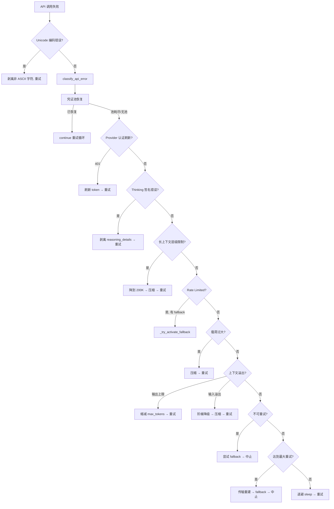
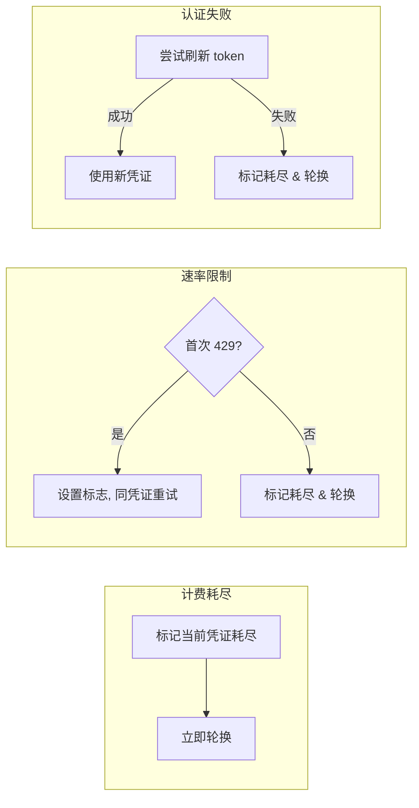
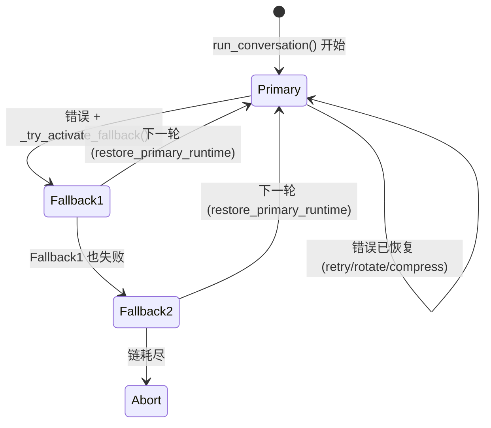
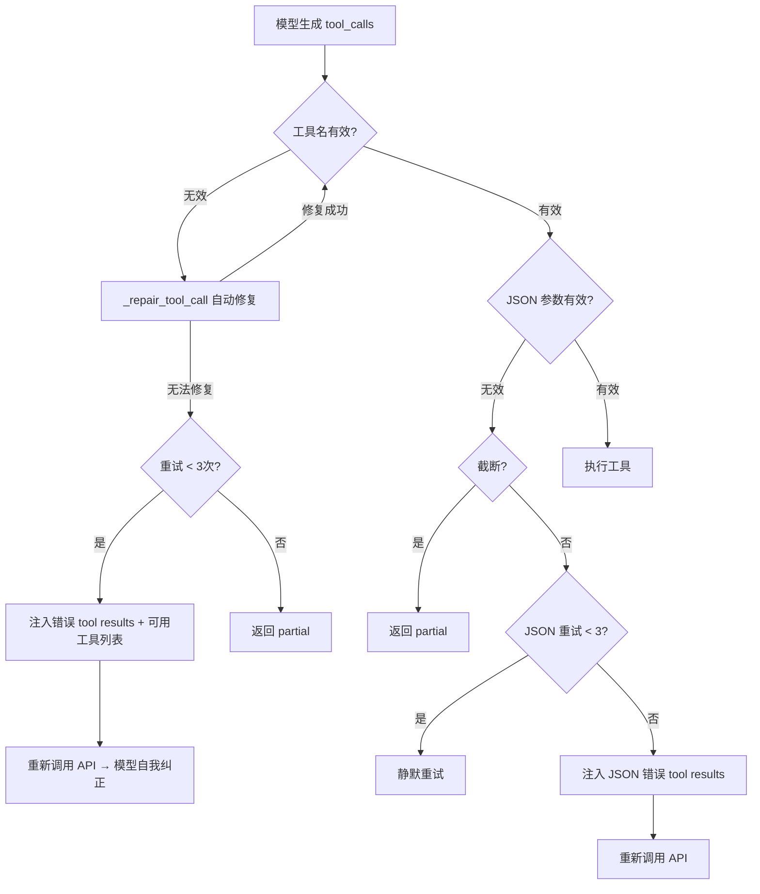

# 第10章 错误处理与韧性

> *"永远尝试下一个恢复策略，而不是立即失败。"*
> — Hermes Agent 错误处理的设计哲学

## 10.1 引言

一个面向真实世界的 AI Agent 系统，必须面对各种不确定性：API 超时、模型服务过载、credential 额度耗尽、上下文溢出……如果每次遇到错误都直接崩溃，用户体验将是灾难性的。

Hermes Agent 的错误处理架构呈**多层洋葱模型**：

```
┌─────────────────────────────────────┐
│  L4  优雅降级 (Context Compression) │
│  ┌─────────────────────────────────┐│
│  │  L3  模型回退 (Fallback Chain)  ││
│  │  ┌─────────────────────────────┐││
│  │  │  L2  凭证轮换 (Credential)  │││
│  │  │  ┌─────────────────────────┐│││
│  │  │  │  L1  错误分类 + 重试    ││││
│  │  │  └─────────────────────────┘│││
│  │  └─────────────────────────────┘││
│  └─────────────────────────────────┘│
└─────────────────────────────────────┘
```

每一层都有明确的职责边界和升级规则——只有在当前层无法恢复时，才会将控制权交给上一层。本章将从最内层开始，逐层剖析这个精巧的错误恢复体系。

---

## 10.2 错误分类系统

### 10.2.1 FailoverReason：14 种故障原因

`agent/error_classifier.py` 的核心是一个涵盖 14 种故障原因的枚举，这是整个错误处理系统的"语言"：

```python
class FailoverReason(enum.Enum):
    # 认证 / 授权
    auth = "auth"                          # 401/403 — 可刷新/轮换
    auth_permanent = "auth_permanent"      # 刷新后仍失败 — 中止

    # 计费 / 配额
    billing = "billing"                    # 402 或额度耗尽 — 立即轮换
    rate_limit = "rate_limit"              # 429 或限速 — 退避后轮换

    # 服务端
    overloaded = "overloaded"              # 503/529 — 服务过载
    server_error = "server_error"          # 500/502 — 内部错误

    # 传输
    timeout = "timeout"                    # 连接/读取超时 — 重建客户端

    # 上下文 / 载荷
    context_overflow = "context_overflow"  # 上下文过大 — 压缩
    payload_too_large = "payload_too_large"  # 413 — 压缩载荷

    # 模型
    model_not_found = "model_not_found"    # 404 / 模型无效 — 回退

    # 请求格式
    format_error = "format_error"          # 400 错误请求 — 中止或剥离

    # Provider 特有
    thinking_signature = "thinking_signature"  # Anthropic thinking 块签名
    long_context_tier = "long_context_tier"    # Anthropic 长上下文层级

    # 兜底
    unknown = "unknown"                    # 无法分类 — 退避重试
```

**设计亮点**：将 14 种原因映射到 4 类恢复动作（retry / rotate / fallback / compress），而不是让调用方自己判断 HTTP 状态码。这实现了分类逻辑与恢复逻辑的彻底解耦。

### 10.2.2 ClassifiedError：携带恢复提示的分类结果

分类器的输出不只是一个枚举值，而是一个携带**恢复动作提示（recovery action hints）**的数据类：

```python
@dataclass
class ClassifiedError:
    reason: FailoverReason
    status_code: Optional[int] = None
    provider: Optional[str] = None
    model: Optional[str] = None
    message: str = ""
    error_context: Dict[str, Any] = field(default_factory=dict)

    # Recovery action hints
    retryable: bool = True
    should_compress: bool = False
    should_rotate_credential: bool = False
    should_fallback: bool = False
```

四个 boolean 字段构成了一个 **recovery action vector**。retry loop 只需检查这些提示即可执行对应动作，不必重复判断错误类型。这是 **Command 模式**的变体——分类器做决策，执行器只看指令。

### 10.2.3 七级分类流水线

`classify_api_error()` 实现了一条七级优先级流水线，从最具体到最模糊逐步匹配：

| 优先级 | 阶段 | 说明 |
|--------|------|------|
| 1 | Provider 特定模式 | Anthropic thinking signature、long context tier |
| 2 | HTTP 状态码 | `_classify_by_status()` — 按 401/402/.../529 分发 |
| 3 | 错误码 | 从 response body 提取结构化 error code |
| 4 | 消息模式匹配 | 无状态码时的文本匹配（8 组预定义 pattern） |
| 5 | 断连 + 大会话启发 | disconnect + token > 60% context → 推断为 context_overflow |
| 6 | 传输层启发 | 错误类型名在 `_TRANSPORT_ERROR_TYPES` 集合中 |
| 7 | 兜底: unknown | retryable=True，退避重试 |

**三个值得注意的细节：**

**OpenRouter 内层解析**：OpenRouter 将上游错误包裹在 `{error: {metadata: {raw: "..."}}}` 结构中。分类器会递归解析内层 JSON，确保真实错误信息（如 "context length exceeded"）不被外层包装掩盖。

**400 多路复用**：HTTP 400 是最复杂的状态码——在不同 provider 中可能表示 context overflow、model not found、rate limit、billing、甚至 auth 错误。`_classify_400()` 通过精细的 pattern matching 进行消歧义。

**断连启发式**：没有状态码的 server disconnect，如果 `approx_tokens > context_length * 0.6` 或 `> 120000` 或 `num_messages > 200`，则推断为 context overflow 而非传输错误。虽然不是 100% 准确，但比默认的"重试"策略更有效。

### 10.2.4 八组 Pattern 表

错误消息匹配使用预定义的 pattern 列表，覆盖了主流 LLM provider 的错误格式：

```python
_BILLING_PATTERNS           # 10 patterns: "insufficient credits", "payment required", ...
_RATE_LIMIT_PATTERNS        # 10 patterns: "rate limit", "too many requests", ...
_USAGE_LIMIT_PATTERNS       # 4 patterns: 需要消歧义
_USAGE_LIMIT_TRANSIENT_SIGNALS  # 7 patterns: "try again", "retry", ...
_CONTEXT_OVERFLOW_PATTERNS  # 17 patterns: 包含 vLLM/Ollama/llama.cpp/中文错误
_MODEL_NOT_FOUND_PATTERNS   # 7 patterns
_AUTH_PATTERNS              # 8 patterns
_TRANSPORT_ERROR_TYPES      # 13 type names (frozenset for O(1) lookup)
```

特别值得一提的是 `_CONTEXT_OVERFLOW_PATTERNS` 包含 17 种模式，覆盖了 OpenAI、Anthropic、vLLM、Ollama、llama.cpp 等多个推理引擎的错误格式，甚至包含中文错误消息。

---

## 10.3 重试策略

### 10.3.1 抖动退避算法

`agent/retry_utils.py` 仅 57 行，实现了**去相关抖动指数退避（decorrelated jittered exponential backoff）**：

```python
def jittered_backoff(
    attempt: int,
    *,
    base_delay: float = 5.0,
    max_delay: float = 120.0,
    jitter_ratio: float = 0.5,
) -> float:
    delay = min(base_delay * (2 ** (attempt - 1)), max_delay)
    seed = (time.time_ns() ^ (tick * 0x9E3779B9)) & 0xFFFFFFFF
    rng = random.Random(seed)
    jitter = rng.uniform(0, jitter_ratio * delay)
    return delay + jitter
```

几个精妙之处：

- **`0x9E3779B9`** 是黄金比例的 32 位定点值，用于 hash 分散。配合进程级单调计数器和时间戳的 XOR，确保即使在时钟精度低的环境（如 Docker 容器）中，并发重试也不会同步——这防止了**雷群效应（thundering herd）**。
- 实际调用处使用更激进的参数：`base_delay=2.0, max_delay=60.0`，第 1/2/3/4 次重试分别约 2/4/8/16 秒加抖动。
- 优先使用服务端返回的 `Retry-After` header，并用 `min(..., 120)` 防止服务端返回离谱的大值。

### 10.3.2 可中断 Sleep

退避等待不是一个简单的 `time.sleep(wait_time)`，而是 **200ms 增量循环**：

```python
sleep_end = time.time() + wait_time
while time.time() < sleep_end:
    if self._interrupt_requested:
        # 立即返回
        break
    time.sleep(0.2)  # 每 200ms 检查一次中断
    # 每 30s touch activity，防止 gateway 超时
    if _backoff_touch_counter % 150 == 0:
        self._touch_activity(...)
```

这解决了两个实际问题：
1. 用户 Ctrl+C 可在 200ms 内响应，不必等完整个退避周期
2. Gateway 模式下定期 touch activity 保活，避免因退避等待被误判为会话超时

---

## 10.4 多层恢复链

### 10.4.1 完整恢复流程

当 API 调用失败时，系统执行一条严格优先级的恢复链。每一步成功后 `continue` 回到重试循环顶部：



让我们逐层深入。

### 10.4.2 凭证池恢复

`_recover_with_credential_pool()` 根据错误类型实施三种策略：



| 错误原因 | 策略 | 说明 |
|----------|------|------|
| `billing` | 立即轮换 | `pool.mark_exhausted_and_rotate()` — 标记当前凭证为耗尽状态 |
| `rate_limit` | 先等后轮换 | 第一次设 `has_retried_429=True` 给一次重试机会；第二次才轮换 |
| `auth` | 先刷新后轮换 | `pool.try_refresh_current()` 尝试刷新 token；失败后再轮换 |

关键细节：`_swap_credential(next_entry)` 原子性地替换 api_key、base_url 并重建 OpenAI client，确保状态一致性。

### 10.4.3 传输层恢复

当最大重试次数耗尽后，在触发 fallback 之前，系统会尝试**传输层恢复**——关闭旧的 HTTP client 并从 `_primary_runtime` 快照重建新 client：

```python
# 仅对传输错误 (ReadTimeout, ConnectError, ...)
# 排除聚合类 provider (OpenRouter, Nous)
# 关闭旧 client → 从快照重建 → 重置 retry_count
```

**排除逻辑**：OpenRouter/Nous 等代理服务自带重试基础设施，重建本地 client 无意义。

---

## 10.5 模型回退链

### 10.5.1 递归前进式回退

`_try_activate_fallback()` 实现了 **Chain of Responsibility** 模式的递归回退：

```python
def _try_activate_fallback(self) -> bool:
    if self._fallback_index >= len(self._fallback_chain):
        return False  # 链耗尽

    fb = self._fallback_chain[self._fallback_index]
    self._fallback_index += 1

    if not fb_provider or not fb_model:
        return self._try_activate_fallback()  # 跳过无效项，递归下一个

    fb_client, _ = resolve_provider_client(fb_provider, model=fb_model, ...)
    if fb_client is None:
        return self._try_activate_fallback()  # provider 未配置，递归下一个

    # 原地替换运行时状态
    self.model = fb_model
    self.provider = fb_provider
    self._fallback_activated = True

    # 同步更新 context compressor 的 context_length
    self.context_compressor.update_model(...)
```

每个 fallback entry 都有机会处理请求：空 provider/model、未配置的 provider、构建失败——都会自动跳到下一个。如果回退到 Anthropic，会构建原生 Anthropic client 而非 OpenAI 兼容 client。

### 10.5.2 三种触发场景

| 场景 | 条件 | 行为 |
|------|------|------|
| Rate limit + pool 耗尽 | 429 且凭证池无可用凭证 | **跳过退避**，立即切换 |
| 不可重试的客户端错误 | 4xx（非 rate/billing/context） | 尝试 fallback，失败则中止 |
| 最大重试耗尽 | 传输重建后仍失败 | fallback → 中止 |

### 10.5.3 Turn-Scoped 回退：自动恢复主模型

一个非常重要的设计决策是 fallback 是 **turn-scoped** 的：



每次 `run_conversation()` 开头调用 `_restore_primary_runtime()`，从 `_primary_runtime` 快照恢复所有状态——model、provider、base_url、client、compressor——并重置 fallback 标记。

**设计哲学**：单次失败不应永久钉死在 fallback provider。如果主模型恢复正常，下一轮会自动回归。这类似于 RAII / scoped resource 模式，防止瞬态故障永久改变系统行为。

---

## 10.6 工具错误处理与自我纠正

### 10.6.1 双层 Error Boundary

工具执行的异常通过两层保护被转化为模型可理解的错误消息：

**第一层：Registry Dispatch**
```python
def dispatch(self, name: str, args: dict, **kwargs) -> str:
    entry = self.get_entry(name)
    if not entry:
        return json.dumps({"error": f"Unknown tool: {name}"})
    try:
        return entry.handler(args, **kwargs)
    except Exception as e:
        return json.dumps({"error": f"Tool execution failed: {type(e).__name__}: {e}"})
```

**第二层：handle_function_call()**
```python
def handle_function_call(function_name, function_args, ...):
    try:
        result = registry.dispatch(function_name, function_args, ...)
        return result
    except Exception as e:
        return json.dumps({"error": f"Error executing {function_name}: {str(e)}"})
```

**Error Boundary 模式**保证了：工具 crash 不会杀死 agent 循环，模型能看到错误信息并自我纠正。

### 10.6.2 工具名称自动修复

模型有时会输出错误的工具名称。`_repair_tool_call()` 实现三级修复：

```python
def _repair_tool_call(self, tool_name: str) -> str | None:
    # 1. 大小写规范化
    if tool_name.lower() in self.valid_tool_names:
        return tool_name.lower()
    # 2. 字符规范化 (连字符/空格 → 下划线)
    normalized = tool_name.lower().replace("-", "_").replace(" ", "_")
    if normalized in self.valid_tool_names:
        return normalized
    # 3. 模糊匹配 (difflib, cutoff=0.7)
    matches = get_close_matches(lowered, self.valid_tool_names, n=1, cutoff=0.7)
    if matches:
        return matches[0]
    return None
```

### 10.6.3 自我纠正循环

当工具名无法自动修复时，系统进入自我纠正流程：



JSON 参数修复的关键策略：

1. **空字符串 → `{}`**：处理常见的模型 quirk
2. **截断检测**：不以 `}` 或 `]` 结尾 → 判为流截断，直接返回 partial
3. **静默重试**：前 3 次不注入错误消息，直接重新调用 API
4. **恢复注入**：第 3 次失败后注入 tool error result，给模型反馈

---

## 10.7 上下文溢出自动恢复

### 10.7.1 输入 vs 输出区分

上下文溢出有两种完全不同的类型，恢复方法也截然不同：

| 类型 | 错误信号 | 恢复方法 |
|------|----------|----------|
| **输入溢出** | "prompt too long" | 解析限制 → 缩小 context_length → compress |
| **输出上限** | "max_tokens too large" | 解析可用 token → 设置 `_ephemeral_max_output_tokens` |

```python
available_out = parse_available_output_tokens_from_error(error_msg)
if available_out is not None:
    # 输出上限问题 — 缩小 max_tokens，不动 context_length
    safe_out = max(1, available_out - 64)
    self._ephemeral_max_output_tokens = safe_out
else:
    # 输入溢出 — 缩小 context_length + compress
    parsed_limit = parse_context_limit_from_error(error_msg)
    if parsed_limit and parsed_limit < old_ctx:
        new_ctx = parsed_limit
    else:
        new_ctx = get_next_probe_tier(old_ctx)
```

### 10.7.2 Context Probing Tiers

当 API 未返回具体限制时，系统使用预定义的探测阶梯逐级下降：

```
1M → 200K → 128K → 64K → 32K → 16K → 8K → 4K
```

持久化控制策略：
- 从 error message 解析出的限制 → 可缓存（`_context_probe_persistable = True`）
- 阶梯猜测的限制 → 仅内存（`_context_probe_persistable = False`）

### 10.7.3 Anthropic 长上下文层级门控

Anthropic 有一种特殊的 429 错误："extra usage required for long context requests"。这**不是**普通的 rate limit——重试和换凭证都没用。系统将 context_length 强制降到 200K（标准层级），触发压缩，但设 `_context_probe_persistable = False`——用户开通 extra usage 后应自动恢复。

---

## 10.8 优雅降级模式

### 10.8.1 压缩失败冷却

Context compressor 的 summary 生成失败时，启动类似**熔断器（Circuit Breaker）**的冷却机制：

```python
# Summary 生成失败 → 5 分钟冷却期
self._summary_failure_cooldown_until = time.time() + 300
```

在冷却期内，`compress()` 跳过 summary 生成，只做简单的 message 裁剪。这避免了反复调用失败的 API 浪费配额。

### 10.8.2 防抖动保护

`_ineffective_compression_count` 追踪压缩效果——当压缩节省不到 10% 时递增。这防止了系统在无效压缩上反复消耗 API 调用配额。配合 `max_compression_attempts` 限制总压缩次数，超过后返回 `compression_exhausted: True`，附带 `/new` 和 `/compress` 操作建议。

### 10.8.3 大会话 400 错误的 Persistence 规避

```python
if status_code == 400 and (approx_tokens > 50000 or len(api_messages) > 80):
    # 跳过 persist — 防止追加失败的 user message 导致 session 越来越大
    # 避免 "persists failed message → 更大 → 同样错误" 的死循环
    pass
```

### 10.8.4 流断开指导

检测到 SSE stream 断开模式时，系统不仅重试，还给出可操作建议——建议用户让模型使用 `execute_code` + `open()` 写大文件，而不是在聊天中生成超长输出。

---

## 10.9 识别的设计模式总结

本章揭示的错误处理架构运用了多种经典设计模式的变体：

| 模式 | 应用位置 | 说明 |
|------|----------|------|
| **Classifier → Action Hints** | `ClassifiedError` | 分类与恢复分离，新增错误类型只需改分类器 |
| **Chain of Responsibility** | `_try_activate_fallback()` | 递归跳过无效项，逐个尝试 fallback |
| **Scoped Resource (RAII)** | Turn-scoped fallback | fallback 在 turn 结束后自动恢复主模型 |
| **Error Boundary** | Registry dispatch + handle_function_call | 两层隔离，异常变为 JSON 错误消息 |
| **Progressive Degradation** | Context overflow 恢复 | 解析限制 → 阶梯下降 → 压缩 → abort |
| **Decorrelated Retry** | `jittered_backoff()` | 黄金比例 hash + 单调计数器防雷群效应 |
| **Circuit Breaker** | Summary failure cooldown | 失败后 5 分钟跳过，避免反复调用失败 API |
| **Heuristic Classification** | Disconnect + 大会话 | 实用的启发式推断 context overflow |

---

## 10.10 数据流总结

将整个错误处理系统的数据流压缩为一张图：

```
classify_api_error(error, provider, model, tokens, ctx_length)
    ↓
ClassifiedError { reason, retryable, should_compress, should_rotate, should_fallback }
    ↓
_recover_with_credential_pool(classified.reason)  →  rotate/refresh credential
    ↓ (if not recovered)
Rate-limit → eager fallback (skip backoff)
Context overflow → parse limit → probe tier → compress
Non-retryable → fallback → abort
Max retries → transport rebuild → fallback → abort
Default → jittered_backoff → interruptible_sleep → retry
```

---

## 10.11 本章小结

Hermes Agent 的错误处理架构体现了一种**"永不放弃"**的设计哲学：

1. **结构化分类**：14 种 FailoverReason + 4 维 recovery action vector，将混乱的 HTTP 错误码转化为清晰的恢复指令
2. **分层恢复**：从凭证轮换到传输重建到模型回退到上下文压缩，每一层都尽最大努力恢复
3. **智能退避**：去相关抖动退避 + 可中断 sleep + Retry-After 尊重，兼顾恢复速度和系统友好
4. **Turn-scoped fallback**：瞬态故障不会永久改变系统行为，下一轮自动恢复主模型
5. **工具自我纠正**：三级名称修复 + JSON 参数修复 + 自我纠正循环，给模型自动改错的机会
6. **优雅降级**：压缩失败冷却、防抖动保护、大会话 persistence 规避，防止恢复操作本身造成更大问题

从 credential rotation 到 transport rebuild 到 provider fallback 到 context compression，每一步都在尽最大努力避免将错误暴露给用户。只有在所有策略都耗尽后才会 abort——这正是一个生产级 AI Agent 系统应有的韧性。
