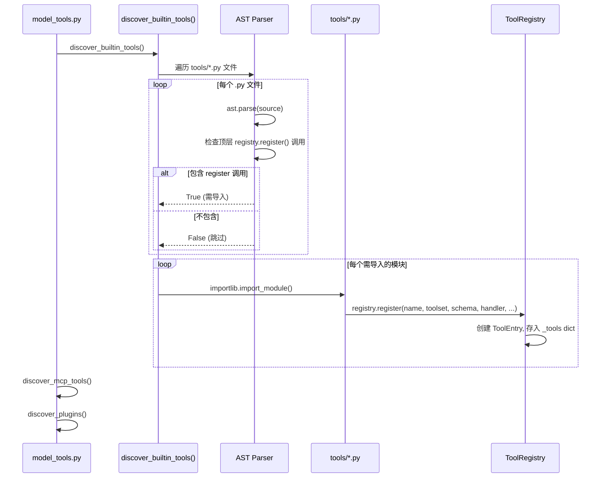
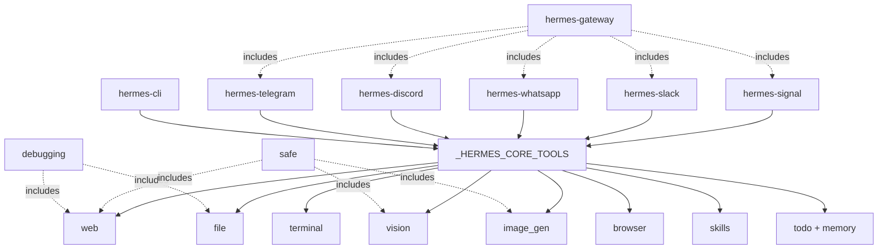

# 第 11 章 工具注册表设计

> **核心文件**：`tools/registry.py`（482 行）、`toolsets.py`（702 行）、`model_tools.py`（562 行）
>
> **关键词**：AST 自发现、ToolEntry \_\_slots\_\_、toolset 分组、import chain、dispatch

## 11.1 引言：为什么需要中央注册表？

一个成熟的 AI Agent 可能同时加载 50 多个工具——文件读写、终端执行、Web 搜索、浏览器控制、MCP 远程工具……面对如此庞大的工具集合，系统需要一个统一的地方来回答三个核心问题：

1. **有哪些工具可用？** → 发现（Discovery）
2. **每个工具长什么样？** → Schema 生成（Definition）
3. **调用某个工具时执行什么代码？** → 调度（Dispatch）

Hermes Agent 的答案是 **中央注册表模式（Central Registry）**。这是一个经典的 Service Locator 变体，所有工具在模块导入时自行注册到全局 `ToolRegistry` 实例中，而上层编排代码只需查询注册表即可。

整个工具系统的三层架构如下：

```
tools/registry.py   → 注册表核心（无外部依赖，循环安全）
tools/*.py           → 每个工具文件，import 时自注册
model_tools.py       → 编排层：触发发现、查询注册表、向 LLM 提供 tool definitions
```

本章将从数据结构、发现机制、分组系统、调度流程四个维度，全面剖析这一设计。

## 11.2 ToolEntry：注册表的原子单元

### 11.2.1 数据结构

每一个注册到系统中的工具，在注册表里对应一个 `ToolEntry` 实例。它使用 `__slots__` 优化，精确定义了 10 个固定字段：

```python
# tools/registry.py:76-97
class ToolEntry:
    """Metadata for a single registered tool."""

    __slots__ = (
        "name", "toolset", "schema", "handler", "check_fn",
        "requires_env", "is_async", "description", "emoji",
        "max_result_size_chars",
    )
```

### 11.2.2 字段详解

| 字段 | 类型 | 用途 |
|------|------|------|
| `name` | `str` | 工具唯一名称，如 `"terminal"`, `"read_file"` |
| `toolset` | `str` | 所属 toolset 名称，如 `"file"`, `"terminal"`, `"mcp-github"` |
| `schema` | `dict` | OpenAI function calling 格式的 JSON Schema |
| `handler` | `Callable` | 实际执行函数，接收 `(args, **kwargs)` |
| `check_fn` | `Callable` | 可用性检查函数，返回 `bool`；`None` 表示始终可用 |
| `requires_env` | `list` | 所需环境变量列表，如 `["OPENAI_API_KEY"]`（仅 UI 展示用） |
| `is_async` | `bool` | handler 是否为 async 函数 |
| `description` | `str` | 工具描述文本 |
| `emoji` | `str` | UI 显示用 emoji，如 `"💻"`, `"📖"` |
| `max_result_size_chars` | `int\|float\|None` | 结果大小限制，`float('inf')` 表示无限制 |

### 11.2.3 为什么用 \_\_slots\_\_？

这个设计选择看似微小，实则精妙：

- **内存节省**：每个 `ToolEntry` 不需要创建 `__dict__`，当注册 50+ 工具时节省可观内存
- **访问速度**：slot 访问比 dict 查找快约 35%（CPython 实现细节）
- **防止拼写错误**：无法动态添加未声明的属性，`entry.naem = "x"` 会立即抛出 `AttributeError`

这是 **Flyweight 模式** 的典型应用——当系统中存在大量结构相同的小对象时，通过减少每个对象的内存开销来优化整体性能。

## 11.3 Registry 单例与线程安全

### 11.3.1 模块级单例

```python
# tools/registry.py:437
registry = ToolRegistry()  # 模块级单例
```

Hermes Agent 没有使用 `__new__` 覆写或 metaclass 等复杂的单例实现，而是采用最朴素的 **模块级变量** 方式。所有消费者通过 `from tools.registry import registry` 导入同一个实例。这种方式简洁、可测试，且与 Python 的模块缓存机制天然契合。

### 11.3.2 可重入锁

```python
# tools/registry.py:103-110
class ToolRegistry:
    def __init__(self):
        self._tools: Dict[str, ToolEntry] = {}
        self._toolset_checks: Dict[str, Callable] = {}
        self._toolset_aliases: Dict[str, str] = {}
        self._lock = threading.RLock()  # 可重入锁
```

注意使用的是 `RLock`（可重入锁）而非普通 `Lock`。原因是 MCP 动态刷新时可能在持锁状态下触发嵌套的注册调用，普通 `Lock` 会导致死锁。

### 11.3.3 Copy-on-Read 快照机制

```python
# tools/registry.py:112-123
def _snapshot_state(self) -> tuple[List[ToolEntry], Dict[str, Callable]]:
    """Return a coherent snapshot of registry entries and toolset checks."""
    with self._lock:
        return list(self._tools.values()), dict(self._toolset_checks)
```

这是一个值得学习的并发模式：**读操作先获取快照（浅拷贝），然后在快照上迭代**。这样做的好处是：

1. 读者看到的是一致状态（快照时刻的原子视图）
2. 快照完成后立即释放锁，不阻塞写者
3. 后续耗时操作（如调用 `check_fn`）在锁外执行

### 11.3.4 核心 API 一览

| 方法 | 用途 |
|------|------|
| `register()` | 注册工具（模块导入时调用） |
| `deregister()` | 移除工具（MCP 动态刷新用） |
| `get_entry(name)` | 按名称获取 ToolEntry |
| `get_definitions(tool_names, quiet)` | 获取 OpenAI 格式 schema（带可用性过滤） |
| `dispatch(name, args, **kwargs)` | 执行工具 handler |
| `get_schema(name)` | 获取原始 schema（不检查可用性） |
| `get_all_tool_names()` | 所有已注册工具名 |
| `get_tool_to_toolset_map()` | `{tool: toolset}` 映射 |
| `check_toolset_requirements()` | 检查所有 toolset 的可用性 |
| `register_toolset_alias()` | 注册 toolset 别名（MCP 用） |
| `get_max_result_size(name)` | 获取结果大小限制 |

## 11.4 AST 自发现机制

这是工具注册表中最精巧的设计之一——使用 **AST 静态分析** 在不执行代码的情况下判断哪些模块包含工具注册。

### 11.4.1 静态分析检测

```python
# tools/registry.py:28-53
def _is_registry_register_call(node: ast.AST) -> bool:
    """Return True when *node* is a ``registry.register(...)`` call."""
    if not isinstance(node, ast.Expr) or not isinstance(node.value, ast.Call):
        return False
    func = node.value.func
    return (
        isinstance(func, ast.Attribute)
        and func.attr == "register"
        and isinstance(func.value, ast.Name)
        and func.value.id == "registry"
    )

def _module_registers_tools(module_path: Path) -> bool:
    """只检查模块顶层语句，忽略函数内部的 register 调用"""
    try:
        source = module_path.read_text(encoding="utf-8")
        tree = ast.parse(source, filename=str(module_path))
    except (OSError, SyntaxError):
        return False
    return any(_is_registry_register_call(stmt) for stmt in tree.body)
```

关键设计决策：**只检查 `tree.body`（模块顶层语句）**。如果某个模块在函数内部调用了 `registry.register()`，它不会被识别为工具定义文件。这精确地区分了"工具定义文件"和"辅助模块"。

### 11.4.2 发现流程

```python
# tools/registry.py:56-73
def discover_builtin_tools(tools_dir=None) -> List[str]:
    tools_path = Path(tools_dir) if tools_dir else Path(__file__).resolve().parent
    module_names = [
        f"tools.{path.stem}"
        for path in sorted(tools_path.glob("*.py"))
        if path.name not in {"__init__.py", "registry.py", "mcp_tool.py"}
        and _module_registers_tools(path)  # AST 预筛选
    ]
    imported = []
    for mod_name in module_names:
        try:
            importlib.import_module(mod_name)  # 执行模块，触发 register()
            imported.append(mod_name)
        except Exception as e:
            logger.warning("Could not import tool module %s: %s", mod_name, e)
    return imported
```

### 11.4.3 设计亮点分析

1. **排除文件**：`__init__.py`（包初始化）、`registry.py`（自身）、`mcp_tool.py`（MCP 有独立发现路径）
2. **AST 预筛选**：避免导入不含注册调用的辅助模块（如 `approval.py`、`process_registry.py`），减少不必要的副作用
3. **`sorted()`**：确保发现顺序确定性，不依赖文件系统遍历顺序
4. **容错设计**：单个模块导入失败只打日志，不影响其他模块

下图展示了完整的工具发现与注册流程：



## 11.5 Import Chain 与循环依赖避免

工具系统的导入链被精心设计为严格的单向依赖：

```
tools/registry.py  (无任何项目内导入)
       ↑
tools/*.py  (import from tools.registry at module level)
       ↑
model_tools.py  (imports tools.registry + 所有 tool modules)
       ↑
run_agent.py, cli.py, batch_runner.py
```

**核心规则**：`registry.py` 不导入任何工具文件或 `model_tools.py`。这保证了：

- 工具文件可以安全地在模块级调用 `registry.register()`
- `model_tools.py` 作为唯一的"发现触发点"

但有一个例外——`dispatch()` 需要处理异步 handler 时，使用**延迟导入**打破循环：

```python
# tools/registry.py:304
if entry.is_async:
    from model_tools import _run_async  # 延迟导入避免循环
    return _run_async(entry.handler(args, **kwargs))
```

这个延迟导入只在第一次调用异步工具时执行。之后 Python 模块缓存会直接返回已加载的模块，不产生额外开销。

## 11.6 Toolset 分组系统

### 11.6.1 分组概述

单个工具是原子，但用户和系统通常以**工具集（Toolset）** 为单位管理——启用/禁用某一类功能、检查某一类工具的可用性。Hermes Agent 在 `toolsets.py` 中定义了丰富的 Toolset 体系。

### 11.6.2 Toolset 定义结构

每个 toolset 包含三个字段：

```python
TOOLSETS = {
    "web": {
        "description": "Web research and content extraction tools",
        "tools": ["web_search", "web_extract"],
        "includes": []     # 叶子节点
    },
    "debugging": {
        "tools": ["terminal", "process"],
        "includes": ["web", "file"]  # 复合 toolset！
    },
}
```

`includes` 字段使 Toolset 具备了**组合（Composite）** 能力，形成层级结构。

### 11.6.3 Toolset 分类

| 类别 | 示例 | 特点 |
|------|------|------|
| 基础叶子节点 | `web`, `file`, `terminal`, `vision` | `includes: []` |
| 复合节点 | `debugging`, `safe` | 通过 `includes` 组合其他 toolset |
| 平台节点 | `hermes-cli`, `hermes-telegram` | 引用 `_HERMES_CORE_TOOLS` |
| 超级节点 | `hermes-gateway` | 通过 `includes` 包含所有平台 |
| 特殊节点 | `hermes-acp`, `hermes-api-server` | 自定义列表（去掉 UI 专用工具） |
| 动态节点 | `mcp-*` | 由 MCP 发现动态创建 |

下图展示了 Toolset 之间的层级关系：



### 11.6.4 递归解析与环检测

```python
# toolsets.py:447-497
def resolve_toolset(name, visited=None):
    if name in {"all", "*"}:  # 特殊通配
        # 解析所有 toolset
    if name in visited:       # 环检测 / 钻石依赖去重
        return []
    visited.add(name)
    toolset = get_toolset(name)
    tools = set(toolset.get("tools", []))
    for included_name in toolset.get("includes", []):
        tools.update(resolve_toolset(included_name, visited))
    return sorted(tools)
```

`visited` 集合同时解决了两个问题：

- **环检测**：如果 A includes B，B includes A，不会无限递归
- **钻石依赖去重**：如果 C includes A 和 B，而 A、B 都 include D，D 的工具只会出现一次

### 11.6.5 MCP 动态 Toolset

MCP 工具通过运行时注册创建新的 toolset：

```python
# tools/mcp_tool.py:1877-1885
registry.register(
    name=tool_name_prefixed,      # 添加前缀避免冲突
    toolset=toolset_name,          # "mcp-{server_name}"
    schema=schema,
    handler=_make_tool_handler(name, mcp_tool.name, server.tool_timeout),
    check_fn=_make_check_fn(name), # 闭包：检查 MCP server 连接
    is_async=False,
    description=schema["description"],
)
registry.register_toolset_alias(name, toolset_name)  # 友好别名
```

`_get_plugin_toolset_names()` 通过差集运算发现这些动态 toolset——它们存在于 registry 中但不在 `TOOLSETS` 字典里。

## 11.7 工具可用性检查

### 11.7.1 check_fn 机制

并非所有注册的工具都始终可用。例如：Web 搜索需要 API Key，浏览器工具需要 Playwright 安装。`check_fn` 提供了灵活的可用性检查：

```python
# tools/registry.py:125-133
def _evaluate_toolset_check(self, toolset, check):
    if not check:
        return True  # 无 check = 始终可用
    try:
        return bool(check())
    except Exception:
        logger.debug("Toolset %s check raised; marking unavailable", toolset)
        return False  # 异常 = 不可用（而非崩溃）
```

**重要设计**：`check_fn` 抛出异常时标记为不可用而非让程序崩溃。这意味着即使某个工具的依赖库有 bug，也不会影响整个系统。

### 11.7.2 check_fn 缓存优化

`get_definitions()` 中对相同 `check_fn` 只调用一次：

```python
# tools/registry.py:265-281
check_results: Dict[Callable, bool] = {}
for name in sorted(tool_names):
    entry = entries_by_name.get(name)
    if entry.check_fn:
        if entry.check_fn not in check_results:  # 缓存！
            check_results[entry.check_fn] = bool(entry.check_fn())
        if not check_results[entry.check_fn]:
            continue
```

同一 toolset 的多个工具共享同一个 `check_fn` 引用（如 `file` toolset 的 4 个工具）。通过以函数对象为 key 缓存检查结果，一次调用即可确定整个 toolset 的可用性。

## 11.8 Schema 收集与动态修改

### 11.8.1 三种过滤模式

`model_tools.py` 中的 `get_tool_definitions()` 是 schema 的最终出口，支持三种工具集过滤模式：

```python
# model_tools.py:217-255
if enabled_toolsets is not None:
    # 白名单模式：只包含指定 toolset
    for toolset_name in enabled_toolsets:
        tools_to_include.update(resolve_toolset(toolset_name))

elif disabled_toolsets:
    # 黑名单模式：包含所有，排除指定
    for ts_name in get_all_toolsets():
        tools_to_include.update(resolve_toolset(ts_name))
    for toolset_name in disabled_toolsets:
        tools_to_include.difference_update(resolve_toolset(toolset_name))

else:
    # 全量模式：包含所有 toolset
    for ts_name in get_all_toolsets():
        tools_to_include.update(resolve_toolset(ts_name))
```

### 11.8.2 防幻觉的动态 Schema 重写

这是整个工具系统中最具创意的设计之一——根据运行时可用性**动态修改工具的 schema 描述**，防止 LLM 产生幻觉。

**问题场景**：`execute_code` 工具的 schema description 中列出了 sandbox 内可用的工具（如 "web_search is available"）。如果 `web_search` 实际不可用（API key 缺失或 toolset 被禁），LLM 可能会在 sandbox 中尝试调用，导致失败。

**解决方案**：

```python
# model_tools.py:276-283
if "execute_code" in available_tool_names:
    from tools.code_execution_tool import SANDBOX_ALLOWED_TOOLS, build_execute_code_schema
    sandbox_enabled = SANDBOX_ALLOWED_TOOLS & available_tool_names
    dynamic_schema = build_execute_code_schema(sandbox_enabled)
    # 替换 filtered_tools 中的 execute_code schema
```

类似地，`browser_navigate` 的描述中包含 "prefer web_search or web_extract"，但如果这些工具不可用，这段文字会被自动移除：

```python
# model_tools.py:289-303
if "browser_navigate" in available_tool_names:
    web_tools_available = {"web_search", "web_extract"} & available_tool_names
    if not web_tools_available:
        desc = desc.replace(
            " For simple information retrieval, prefer web_search or web_extract (faster, cheaper).",
            "",
        )
```

**启示**：Schema 不是静态文档，而是根据运行时环境动态生成的"合同"。通过确保 schema 描述与实际能力完全一致，减少了 LLM 的试错成本。

## 11.9 工具调度流程

### 11.9.1 registry.dispatch()

```python
# tools/registry.py:292-309
def dispatch(self, name, args, **kwargs):
    entry = self.get_entry(name)
    if not entry:
        return json.dumps({"error": f"Unknown tool: {name}"})
    try:
        if entry.is_async:
            from model_tools import _run_async
            return _run_async(entry.handler(args, **kwargs))
        return entry.handler(args, **kwargs)
    except Exception as e:
        logger.exception("Tool %s dispatch error: %s", name, e)
        return json.dumps({"error": f"Tool execution failed: {type(e).__name__}: {e}"})
```

### 11.9.2 handle_function_call() 完整流程

`handle_function_call()` 是 `dispatch()` 的上层编排，包含完整的预处理和后处理链：

```python
# model_tools.py:421-533
def handle_function_call(function_name, function_args, task_id=None, ...):
    # 1. 参数类型强制转换
    function_args = coerce_tool_args(function_name, function_args)
    
    # 2. Agent-loop 工具短路
    if function_name in _AGENT_LOOP_TOOLS:  # todo, memory, delegate_task...
        return json.dumps({"error": "must be handled by agent loop"})
    
    # 3. Plugin pre_tool_call hook（可阻止执行）
    block_message = get_pre_tool_call_block_message(...)
    
    # 4. Read-loop tracker 通知
    if function_name not in _READ_SEARCH_TOOLS:
        notify_other_tool_call(task_id)
    
    # 5. 实际 dispatch
    result = registry.dispatch(function_name, function_args, task_id=task_id, ...)
    
    # 6. Plugin post_tool_call hook
    invoke_hook("post_tool_call", tool_name=function_name, result=result, ...)
    
    return result
```

完整的数据流如下图所示：

```mermaid
flowchart TB
    LLM[LLM Response<br/>tool_call] --> HFC[handle_function_call]
    HFC --> COERCE[coerce_tool_args<br/>类型强制转换]
    COERCE --> AGENT{Agent-loop<br/>工具?}
    AGENT -->|todo/memory/...| STUB[返回 stub error<br/>由 agent loop 处理]
    AGENT -->|普通工具| HOOK[pre_tool_call hook]
    HOOK -->|blocked| BLOCK[返回 block error]
    HOOK -->|allowed| DISPATCH[registry.dispatch]
    DISPATCH --> ENTRY{ToolEntry<br/>存在?}
    ENTRY -->|No| ERR[返回 unknown tool error]
    ENTRY -->|Yes| ASYNC{is_async?}
    ASYNC -->|Yes| BRIDGE[_run_async bridge]
    ASYNC -->|No| EXEC[handler&#40;args&#41;]
    BRIDGE --> EXEC
    EXEC -->|Success| RESULT[JSON result string]
    EXEC -->|Exception| WRAP[包装为 JSON error]
    RESULT --> POST[post_tool_call hook]
    WRAP --> POST
```



### 11.9.3 参数类型强制转换

LLM 返回的参数经常有类型错误——最常见的是把整数写成字符串（`"42"` 而不是 `42`）、把布尔值写成字符串（`"true"` 而不是 `true`）。`coerce_tool_args()` 根据 schema 定义自动修正：

```python
# model_tools.py:334-370
def coerce_tool_args(tool_name, args):
    schema = registry.get_schema(tool_name)
    properties = schema.get("parameters", {}).get("properties")
    for key, value in args.items():
        if isinstance(value, str):
            prop_schema = properties.get(key)
            expected = prop_schema.get("type")
            args[key] = _coerce_value(value, expected)
    return args
```

支持 `integer`、`number`、`boolean` 以及联合类型 `["integer", "string"]`。这个看似简单的函数，实际上显著提高了工具调用的成功率。

## 11.10 注册防护与冲突处理

### 11.10.1 注册冲突检测

当两个不同 toolset 试图注册同名工具时，系统的处理策略取决于来源：

```python
# tools/registry.py:191-213
def register(self, name, toolset, schema, handler, ...):
    existing = self._tools.get(name)
    if existing and existing.toolset != toolset:
        both_mcp = (
            existing.toolset.startswith("mcp-")
            and toolset.startswith("mcp-")
        )
        if both_mcp:
            # MCP-to-MCP 覆写允许（server refresh 场景）
            logger.debug(...)
        else:
            # 拒绝：防止 plugin/MCP 覆盖内置工具
            logger.error("Tool registration REJECTED: ...")
            return
```

**设计意图**：内置工具的行为必须稳定可预测，不允许被外部扩展意外覆盖。但 MCP server 刷新时同名工具覆写是合理的（nuke-and-repave 策略）。

### 11.10.2 deregister() 清理逻辑

```python
# tools/registry.py:229-252
def deregister(self, name):
    entry = self._tools.pop(name, None)
    # 如果 toolset 中没有其他工具了，清理 check 和 alias
    toolset_still_exists = any(e.toolset == entry.toolset for e in self._tools.values())
    if not toolset_still_exists:
        self._toolset_checks.pop(entry.toolset, None)
        self._toolset_aliases = {
            alias: target for alias, target in self._toolset_aliases.items()
            if target != entry.toolset
        }
```

当一个 toolset 的最后一个工具被移除时，相关的 `check_fn` 和别名也一并清理，避免内存泄漏和状态不一致。

### 11.10.3 标准化辅助函数

```python
# tools/registry.py:456-482
def tool_error(message, **extra) -> str:
    """标准化错误格式"""
    return json.dumps({"error": str(message)}, ensure_ascii=False)

def tool_result(data=None, **kwargs) -> str:
    """标准化结果格式"""
    return json.dumps(data or kwargs, ensure_ascii=False)
```

这两个辅助函数消除了工具文件中大量重复的 `json.dumps({"error": msg})` 样板代码，统一了 handler 的返回格式。

## 11.11 注册实战：内置 vs MCP

### 11.11.1 内置工具注册

```python
# tools/file_tools.py:796-799
registry.register(name="read_file", toolset="file", schema=READ_FILE_SCHEMA,
    handler=_handle_read_file, check_fn=_check_file_reqs, emoji="📖",
    max_result_size_chars=float('inf'))
registry.register(name="write_file", toolset="file", schema=WRITE_FILE_SCHEMA,
    handler=_handle_write_file, check_fn=_check_file_reqs, emoji="✍️",
    max_result_size_chars=100_000)
```

内置工具的特点：
- **模块级调用**：在文件被 `importlib.import_module()` 导入时立即执行
- **共享 check_fn**：同一 toolset 的工具使用相同的可用性检查函数
- **明确的大小限制**：`read_file` 允许无限大结果，`write_file` 限制为 100K 字符

### 11.11.2 MCP 动态注册

```python
# tools/mcp_tool.py:1877-1885
registry.register(
    name=tool_name_prefixed,      # 添加前缀避免冲突
    toolset=toolset_name,          # "mcp-{server_name}"
    schema=schema,
    handler=_make_tool_handler(name, mcp_tool.name, server.tool_timeout),
    check_fn=_make_check_fn(name), # 闭包：检查 MCP server 连接
    is_async=False,
    description=schema["description"],
)
registry.register_toolset_alias(name, toolset_name)  # 友好别名
```

MCP 注册的特点：
- **运行时注册**：不在模块导入时，而是 MCP server 连接成功后
- **前缀避冲突**：工具名添加服务器前缀，防止不同 MCP server 的同名工具冲突
- **闭包 handler**：`_make_tool_handler()` 捕获 server 信息，创建专属 handler
- **友好别名**：`registry.register_toolset_alias("github", "mcp-github")`，用户可以用短名称引用

## 11.12 设计模式总结

| 模式 | 应用位置 | 说明 |
|------|----------|------|
| **Service Locator / Registry** | `ToolRegistry` | 中央注册表，按名称查找 handler 和 schema |
| **Self-Registration** | 各 `tools/*.py` | 模块导入时自动注册，零配置 |
| **AST Pre-screening** | `_module_registers_tools()` | 不执行代码即判断是否需要导入 |
| **Copy-on-Read (Snapshot)** | `_snapshot_state()` | 读操作获取一致快照，避免持锁迭代 |
| **Module Singleton** | `registry = ToolRegistry()` | 模块级变量实现单例 |
| **Lazy Import** | `dispatch()` 中导入 `_run_async` | 打破循环依赖 |
| **Guard Clause** | `register()` 冲突检测 | 防止 MCP/plugin 覆盖内置工具 |
| **Nuke-and-Repave** | `deregister()` + MCP refresh | 移除旧工具后重新注册 |
| **Composite Pattern** | Toolset `includes` | toolset 可包含其他 toolset |
| **Strategy Pattern** | `check_fn` | 每个 toolset 可注入不同的可用性检查策略 |
| **Adapter Pattern** | `_run_async` | 统一同步/异步 handler 接口 |
| **Flyweight** | `__slots__` on ToolEntry | 减少大量工具对象的内存开销 |
| **Dynamic Schema Rewriting** | `get_tool_definitions()` | 根据运行时可用性修改 schema 内容 |

## 11.13 本章小结

Hermes Agent 的工具注册表是一个精心设计的中央协调层。让我们回顾核心要点：

1. **AST 发现是零成本抽象**：通过静态分析避免导入不含工具的模块，比遍历所有模块再过滤更高效，也更安全

2. **Schema 是真理之源**：所有 handler、check_fn、元数据都与 schema 一起注册到同一个 `ToolEntry` 中，不存在分散的映射表

3. **防幻觉 Schema 重写**：`execute_code` 和 `browser_navigate` 的动态 schema 修改确保 LLM 只看到真正可用的工具信息

4. **参数自动修正**：`coerce_tool_args` 处理 LLM 常见的类型错误（`"42"` → `42`），提高系统鲁棒性

5. **层次化 Toolset 设计**：通过 `includes` 实现 Composite 模式，`_HERMES_CORE_TOOLS` 单一定义确保所有平台（CLI、Telegram、Discord 等）工具集一致

6. **MCP 冲突保护**：内置工具不可被外部覆盖，但 MCP-to-MCP 覆写允许，在安全性和灵活性之间取得平衡

7. **双层错误保护**：`dispatch()` 和 `handle_function_call()` 各自捕获异常，确保任何工具执行失败都不会导致 Agent 崩溃

这套设计让 Hermes Agent 能够优雅地管理从 4 个到 400 个工具的扩展，同时保持启动速度、运行稳定性和开发者友好性。下一章我们将深入探讨这些工具中最核心的一类——终端与文件操作工具的实现细节。
