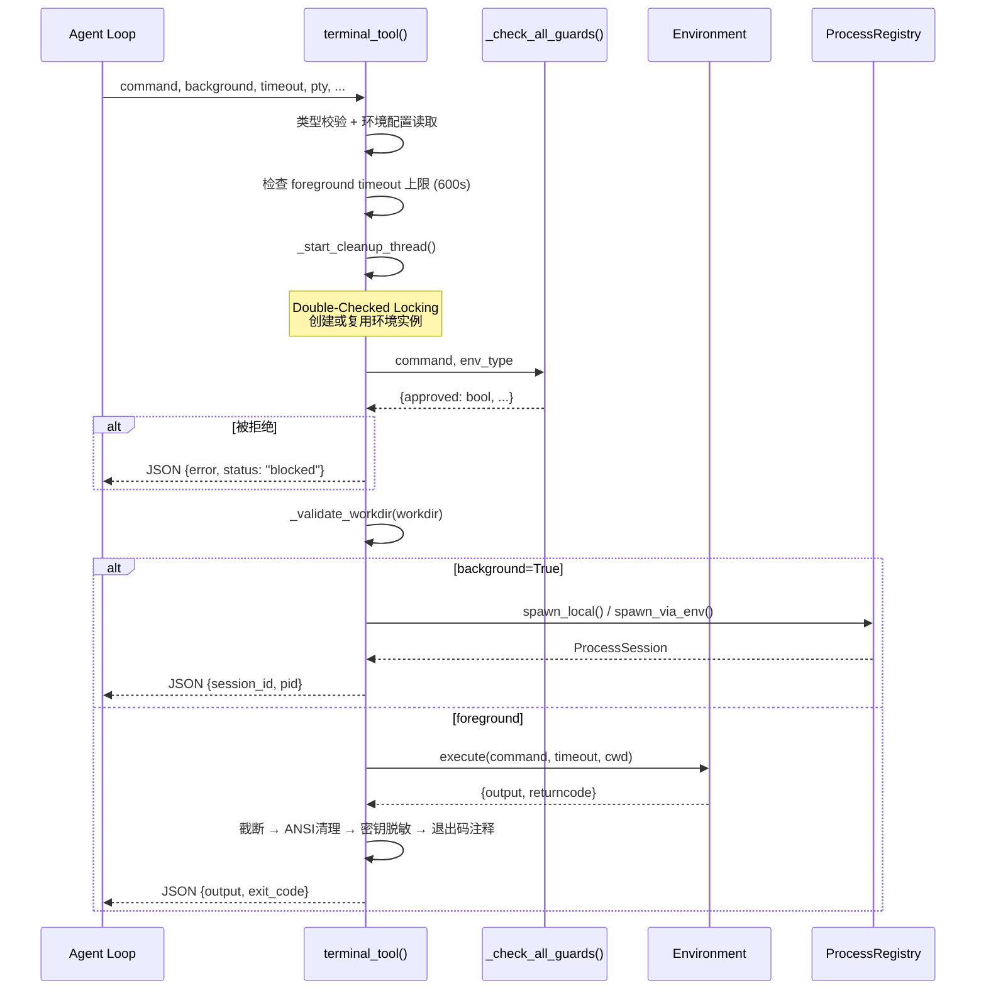
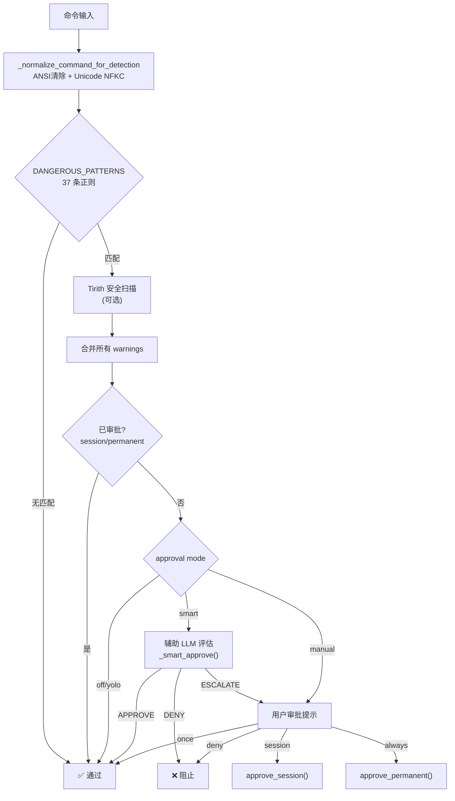
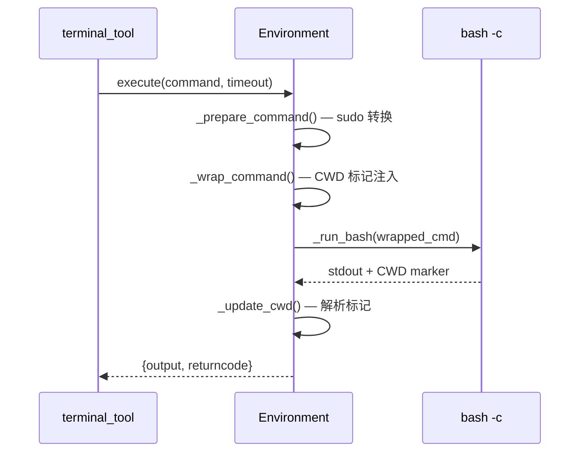
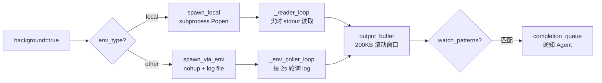
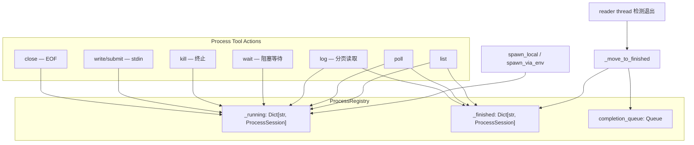
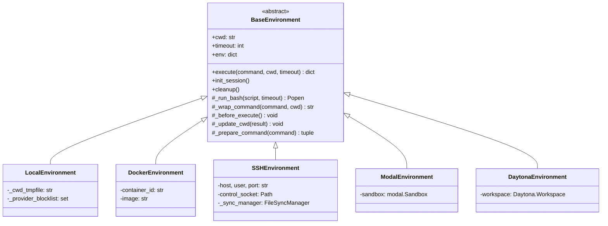

# 第12章 终端工具深度剖析

> *"终端是 Agent 通往操作系统世界的桥梁——也是最危险的通道。"*

Terminal 工具是 Hermes Agent 中最复杂的单体工具，主文件 `terminal_tool.py` 超过 1700 行代码，连同 `process_registry.py`（1172 行）和 `approval.py`（926 行），共同构成了一个约 4000 行的命令执行子系统。它不只是 "执行 shell 命令" 这么简单——它是一个完整的沙箱化、安全审批、多后端命令执行平台。

本章将逐层拆解这个子系统的内部机制：从命令的安全检查到执行调度，从前台/后台的二元模式到七种执行后端的策略模式，从 PTY 伪终端到 crash recovery。

## 12.1 架构总览

Terminal 子系统采用经典的三层架构：

```
┌──────────────────────────────────────────────────────────────┐
│  Tool Schema Layer (terminal_tool.py:1683-1749)              │
│  TERMINAL_SCHEMA + _handle_terminal → registry.register      │
├──────────────────────────────────────────────────────────────┤
│  Orchestration Layer (terminal_tool.py:1105-1527)            │
│  terminal_tool() — 安全检查、环境管理、前台/后台调度         │
├──────────────────────────────────────────────────────────────┤
│  Environment Layer (tools/environments/)                     │
│  BaseEnvironment → Local | Docker | SSH | Modal | ...        │
└──────────────────────────────────────────────────────────────┘
```

**Schema 层**负责定义 JSON Schema 和工具注册；**编排层**是核心逻辑所在，处理安全检查、环境创建、执行调度和输出后处理；**环境层**通过策略模式支持七种不同的执行后端。

### 关键设计模式

| 模式 | 位置 | 说明 |
|------|------|------|
| **Strategy Pattern** | `environments/` | `BaseEnvironment` ABC + 多种后端实现 |
| **Singleton Registry** | `process_registry.py:1083` | 模块级单例 `process_registry = ProcessRegistry()` |
| **Double-Checked Locking** | `terminal_tool.py:1204-1226` | 环境创建的线程安全 |
| **Observer/Watch** | `process_registry.py:151-227` | `watch_patterns` 配合速率限制 |
| **Template Method** | `base.py:519-558` | `execute()` 固定流程，子类覆盖 `_run_bash` |
| **Checkpoint/Recovery** | `process_registry.py:1002-1079` | JSON 序列化进程状态 |

## 12.2 命令执行生命周期

一条命令从进入 `terminal_tool()` 到返回结果，经历了一条精心设计的处理管线。

### 完整调用链



### 函数签名

```python
def terminal_tool(
    command: str,
    background: bool = False,
    timeout: Optional[int] = None,
    task_id: Optional[str] = None,
    force: bool = False,            # 内部参数，不暴露给 model
    workdir: Optional[str] = None,
    pty: bool = False,
    notify_on_complete: bool = False,
    watch_patterns: Optional[List[str]] = None,
) -> str:   # 返回 JSON 字符串
```

注意 `force` 参数是内部使用的——它不出现在 Tool Schema 中，不会暴露给 LLM，但允许系统内部跳过安全检查。

### 环境配置系统

`_get_env_config()` 从环境变量组装完整的执行配置：

| 环境变量 | 默认值 | 说明 |
|----------|--------|------|
| `TERMINAL_ENV` | `local` | 后端类型 |
| `TERMINAL_CWD` | `os.getcwd()` | 工作目录 |
| `TERMINAL_TIMEOUT` | `180` | 默认超时（秒）|
| `TERMINAL_LIFETIME_SECONDS` | `300` | 沙箱空闲生存期 |
| `TERMINAL_CONTAINER_CPU` | `1` | 容器 CPU 核数 |
| `TERMINAL_CONTAINER_MEMORY` | `5120` | 容器内存 (MB) |
| `TERMINAL_MAX_FOREGROUND_TIMEOUT` | `600` | 前台超时硬上限 |

当模型请求超过 600 秒的前台超时时，系统会直接拒绝并引导使用 `background=true`。

## 12.3 安全审批系统

安全审批是 Terminal 工具最关键的子系统之一。它实现了三层纵深防御，防止 Agent 执行破坏性命令。

### 三层安全检查架构



### 危险命令模式库

`DANGEROUS_PATTERNS` 包含 37 条精心编写的正则表达式，覆盖多个风险类别：

| 类别 | 示例模式 | 风险描述 |
|------|----------|----------|
| 文件系统破坏 | `rm -r`, `find -delete`, `mkfs` | 递归删除、格式化磁盘 |
| 权限危险 | `chmod 777`, `chown -R root` | 全局可写、root 所有权 |
| SQL 危险 | `DROP TABLE`, `DELETE FROM` (无 WHERE) | 数据库破坏 |
| 远程执行 | `curl\|sh`, `python -e` | 管道执行不可信代码 |
| 自我保护 | `pkill hermes`, `hermes gateway stop` | 防止 Agent 杀死自身 |
| Git 危险 | `git reset --hard`, `git push --force` | 不可逆版本控制操作 |
| 系统文件 | `> /etc/`, `tee /etc/` | 覆写系统配置 |

### 反绕过措施

安全检查不是简单的字符串匹配——它包含一套完整的反绕过机制：

```python
def _normalize_command_for_detection(command: str) -> str:
    # 1. 剥离 ANSI escape 序列 — 防止 \e[8m 隐藏字符
    command = strip_ansi(command)
    # 2. 清除 Null bytes — 防止 C-string 截断攻击
    command = command.replace('\x00', '')
    # 3. Unicode NFKC 归一化 — 防止全角字符绕过
    #    例如 ｒｍ -ｒｆ / → rm -rf /
    command = unicodedata.normalize('NFKC', command)
    return command
```

这种多层归一化确保攻击者无法通过编码技巧绕过安全检查。

### 审批状态的四级范围

| 级别 | 存储位置 | 生命周期 | 说明 |
|------|----------|----------|------|
| `once` | 无持久化 | 单次命令 | 仅允许本次执行 |
| `session` | 内存 `_session_approved` | 当前会话 | 同类命令免审批 |
| `always` | `config.yaml` allowlist | 永久 | 写入配置文件 |
| `yolo` | 内存 `_session_yolo` | 当前会话 | 所有命令免审批 |

### 容器环境免检

一个重要的设计决策——沙箱环境中的命令跳过审批：

```python
if env_type in ("docker", "singularity", "modal", "daytona"):
    return {"approved": True, "message": None}
```

**理由**：Docker、Singularity 等环境本身就是隔离沙箱，其中的破坏性操作不会影响宿主机。这是安全性与可用性的平衡。

### Smart Approval：LLM 辅助审批

`_smart_approve()` 使用辅助 LLM 自动评估命令风险：

```python
def _smart_approve(command: str, description: str) -> str:
    """返回 'approve' / 'deny' / 'escalate'"""
    client, model = get_text_auxiliary_client(task="approval")
    # temperature=0, max_tokens=16
    # LLM 扮演安全审查员角色
    # 三种输出: APPROVE (安全) / DENY (拒绝) / ESCALATE (需人工)
```

这种设计灵感来自 OpenAI Codex 的 Smart Approvals——用小模型快速筛选明显安全/危险的命令，只在不确定时升级到人工审批。

### Gateway 阻塞审批

在 Gateway 模式下，审批通过队列机制实现同步等待：

```python
class _ApprovalEntry:
    event: threading.Event   # 阻塞直到用户响应
    data: dict               # 命令信息
    result: Optional[str]    # "once"/"session"/"always"/"deny"

# 每个 session 有独立队列，支持并发子代理
_gateway_queues: dict[str, list[_ApprovalEntry]]
```

## 12.4 前台 vs 后台执行

Terminal 工具的两种执行模式有着截然不同的实现路径。

### 前台模式



**关键特性：**

- **Spawn-per-call**：每条命令启动新的 `bash` 进程，不维护长期 shell 会话
- **Session Snapshot**：首次 `init_session()` 捕获 `env -0` 输出，后续命令前重放 `export` 恢复环境
- **CWD 持久化**：每条命令末尾注入 `echo _cwd_marker $(pwd)`，从输出中提取新的工作目录
- **重试机制**：失败命令有 3 次重试（指数退避 2/4/8 秒），但超时错误不重试

**输出后处理管线：**

```
原始输出
  ↓ 截断: >50KB 时保留 40% 头部 + 60% 尾部
  ↓ ANSI 清理: strip_ansi() 去除终端格式码
  ↓ 密钥脱敏: redact_sensitive_text() 屏蔽 API key
  ↓ 退出码注释: _interpret_exit_code() 添加语义说明
最终 JSON 输出
```

头尾 40/60 的分割比例是经验值：错误信息往往出现在开头（编译错误、权限拒绝），而最新进展在末尾（测试结果、构建产物）。

### 后台模式



后台模式根据环境类型分为两条路径：

**本地后台 (`spawn_local`)**：
- `subprocess.Popen` + `os.setsid` 创建新进程组
- 独立 reader 线程实时读取 stdout（4KB chunk）
- 支持 PTY 模式（`ptyprocess.PtyProcess`）
- 设置 `PYTHONUNBUFFERED=1` 确保 Python 输出不缓冲

**非本地后台 (`spawn_via_env`)**：

```bash
# 生成的包装命令
mkdir -p /tmp && \
( nohup bash -lc 'actual_command' > /tmp/hermes_bg_proc_xxx.log 2>&1; \
  rc=$?; printf '%s\n' "$rc" > /tmp/hermes_bg_proc_xxx.exit ) & \
echo $! > /tmp/hermes_bg_proc_xxx.pid && cat /tmp/hermes_bg_proc_xxx.pid
```

通过三个文件实现远程进程管理：`.log`（输出）、`.pid`（进程 ID）、`.exit`（退出码）。Poller 线程每 2 秒读取 log 文件内容。

## 12.5 后台进程注册表

`ProcessRegistry` 是后台进程的中央管理器，以模块级单例形式存在。

### ProcessSession 数据模型

```python
@dataclass
class ProcessSession:
    id: str                    # "proc_xxxxxxxxxxxx" (UUID hex[:12])
    command: str               # 原始命令
    task_id: str               # 任务隔离键
    pid: Optional[int]         # OS 进程 ID
    process: Optional[Popen]   # 本地 Popen 句柄
    env_ref: Any               # 环境对象引用
    exited: bool               # 是否已完成
    exit_code: Optional[int]   # 退出码
    output_buffer: str         # 滚动输出 (200KB)
    detached: bool             # crash 恢复后无管道
    pid_scope: str             # "host" 或 "sandbox"
    notify_on_complete: bool   # 完成时通知
    watch_patterns: List[str]  # 输出监控模式
    _pty: Any                  # ptyprocess 句柄
    _lock: threading.Lock      # 线程安全锁
```

### 注册表操作



Process Tool 提供八种操作：

| Action | 说明 | 关键逻辑 |
|--------|------|----------|
| `list` | 列出所有进程 | 合并 `_running` + `_finished`，可按 task_id 过滤 |
| `poll` | 检查状态 + 新输出 | 返回最后 2000 字符，标记已读 |
| `log` | 分页读取完整输出 | 支持 `offset`/`limit` 参数 |
| `wait` | 阻塞等待完成 | 支持中断检测 + 超时 |
| `kill` | 终止进程 | PTY→terminate, Popen→killpg, Env→kill PID |
| `write` | 写入 stdin（无换行）| PTY 通过 pty handle，Popen 通过 stdin pipe |
| `submit` | 写入 + Enter | `write_stdin(data + "\n")` |
| `close` | 关闭 stdin/EOF | PTY→`sendeof()`, Popen→`stdin.close()` |

### Watch Pattern 速率限制

Watch pattern 是一个强大的功能——Agent 可以监控后台进程输出中的特定字符串。但高频输出可能淹没通知系统，因此实现了多级速率限制：

```python
WATCH_MAX_PER_WINDOW = 8          # 每窗口最多 8 条通知
WATCH_WINDOW_SECONDS = 10         # 10 秒滚动窗口
WATCH_OVERLOAD_KILL_SECONDS = 45  # 持续过载 45s 后永久禁用
```

如果某个进程在 45 秒内持续触发超限通知，watch 功能会被永久禁用，并发送一条 `watch_disabled` 通知。

### 资源限制与 Crash Recovery

```python
MAX_OUTPUT_CHARS = 200_000        # 200KB 滚动输出缓冲
FINISHED_TTL_SECONDS = 1800       # 完成进程保留 30 分钟
MAX_PROCESSES = 64                # 最大并发跟踪 (LRU 淘汰)
```

**Crash Recovery** 机制：在 Gateway 模式下，每次 spawn/kill 都将进程状态写入 `~/.hermes/processes.json`。重启后：

1. 读取 checkpoint 文件
2. 只恢复 `pid_scope=="host"` 的进程（sandbox 内的 PID 在宿主重启后无意义）
3. 通过 `os.kill(pid, 0)` 检查进程是否存活
4. 标记为 `detached=True`——无法再读取输出，但可以报告状态和终止进程

## 12.6 执行环境后端体系

### BaseEnvironment 抽象基类



### Spawn-per-call 执行模型

这是理解 Terminal 工具的核心：**每个 `execute()` 调用都启动全新的 `bash` 进程**。没有持久 shell session。

这带来了一个显著问题——命令间如何保持状态？

1. **环境变量**：首次 `init_session()` 捕获 `env -0` 完整环境快照，后续命令前通过 `export` 批量重放
2. **工作目录**：每条命令末尾注入 `echo _cwd_marker $(pwd)`，从输出中解析新 CWD
3. **代价**：无法保留 shell 函数、别名、局部变量——这是简单性与可靠性的取舍

### 各后端特点对比

| 后端 | `_run_bash` 实现 | 安全检查 | 文件同步 |
|------|-----------------|----------|----------|
| **Local** | `subprocess.Popen` | ✅ 完整审批 | N/A（本机）|
| **Docker** | `docker exec` | ❌ 容器免检 | bind mount |
| **SSH** | `ssh user@host bash -c` | ✅ 完整审批 | FileSyncManager (scp) |
| **Modal** | Modal Sandbox API | ❌ 容器免检 | Modal Volume |
| **Singularity** | `singularity exec` | ❌ 容器免检 | bind mount |
| **Daytona** | Daytona SDK | ❌ 容器免检 | Daytona Volume |

### LocalEnvironment 安全隔离

本地环境有一项重要的安全措施——**Provider 环境变量屏蔽**：

```python
_HERMES_PROVIDER_ENV_BLOCKLIST = _build_provider_env_blocklist()
# 包含 60+ 个敏感 env vars:
# OPENAI_API_KEY, ANTHROPIC_API_KEY, TELEGRAM_TOKEN,
# DISCORD_TOKEN, SLACK_BOT_TOKEN, AWS_SECRET_ACCESS_KEY, ...
```

这防止 Agent 执行的命令泄漏 API 密钥。进程组管理方面，`os.setsid()` 创建新进程组，cleanup 时先发 `SIGTERM`，5 秒后 `SIGKILL`。

### SSH 连接复用

SSH 后端使用 OpenSSH ControlMaster 实现连接持久化：

```python
cmd.extend(["-o", "ControlPath=path/to/socket"])
cmd.extend(["-o", "ControlMaster=auto"])
cmd.extend(["-o", "ControlPersist=300"])  # 300 秒保持
```

首次连接建立 TCP 通道并缓存 socket，后续命令复用同一连接，避免每条命令都要 SSH 握手。

## 12.7 PTY 伪终端模式

PTY 模式用于需要终端交互的工具（如 Python REPL、Codex CLI、`gh auth login`）。

### 实现机制

```python
if use_pty:
    from ptyprocess import PtyProcess
    pty_proc = PtyProcess.spawn(
        [user_shell, "-lic", command],
        cwd=session.cwd,
        env=pty_env,
        dimensions=(30, 120),  # 30行 x 120列
    )
    session._pty = pty_proc
    # 启动 _pty_reader_loop 线程
```

### PTY vs Pipe 对比

| 特性 | PTY 模式 | Pipe 模式（默认）|
|------|----------|-----------------|
| 交互能力 | ✅ 完整终端交互 | ✅ 有限交互 |
| 颜色/格式 | ✅ 完整终端控制码 | ❌ 无终端 |
| `isatty()` | `True` | `False` |
| stdin 写入 | 通过 pty handle | 通过 pipe |
| EOF 发送 | `sendeof()` | `stdin.close()` |
| 降级机制 | ptyprocess 不可用时自动降为 Pipe | 默认模式 |

### 特殊命令检测

某些命令在 PTY 下行为异常，需要自动禁用：

```python
def _command_requires_pipe_stdin(command: str) -> bool:
    """gh auth login --with-token 需要 pipe stdin"""
    normalized = " ".join(command.lower().split())
    return normalized.startswith("gh auth login") and "--with-token" in normalized
```

`gh auth login --with-token` 期望从 pipe 读取 token，但 PTY 模式下它会等待 TTY 键盘输入。

## 12.8 Sudo 处理与 Workdir 安全

### Sudo 命令重写

当检测到 `sudo` 命令且 `SUDO_PASSWORD` 环境变量可用时，Terminal 会自动改写命令：

```python
# 原始命令
sudo apt install python3

# 重写为
sudo -S -p '' apt install python3
# -S: 从 stdin 读取密码（而非 TTY）
# -p '': 不输出密码提示
```

密码来源优先级：`SUDO_PASSWORD` 环境变量 → `_cached_sudo_password` 会话缓存 → 交互式提示（仅 `HERMES_INTERACTIVE=1`，45 秒超时）。

### Workdir 注入防护

```python
_WORKDIR_SAFE_RE = re.compile(r'^[A-Za-z0-9/_\-.~ +@=,]+$')
```

Workdir 参数使用 **allowlist** 验证，只允许安全字符。这比 denylist（试图拦截 `;`, `|`, `` ` `` 等）更可靠——任何未明确允许的字符都会被拒绝，彻底阻断通过 workdir 参数的 shell 注入。

## 12.9 环境生命周期管理

```python
_active_environments: Dict[str, Any] = {}  # task_id → Environment
_last_activity: Dict[str, float] = {}       # task_id → timestamp
```

**清理线程**每 60 秒运行一次，清理超过 `lifetime_seconds`（默认 300 秒）未活动的沙箱环境。但有一个关键豁免：**有活跃后台进程的沙箱不会被清理**。

清理操作在锁外执行——因为 Docker/Modal 的 cleanup 可能耗时 10-15 秒，持锁等待会导致其他命令阻塞。`atexit` 注册了 `_atexit_cleanup()` 确保进程退出时全面清理。

### Per-Task 环境覆盖

为 RL 训练（Atropos）场景设计，允许为特定 task_id 指定自定义环境：

```python
def register_task_env_overrides(task_id: str, overrides: Dict[str, Any]):
    """覆盖: modal_image, docker_image, cwd"""
    _task_env_overrides[task_id] = overrides
```

## 12.10 工具注册与退出码语义

### Tool Schema 注册

```python
registry.register(
    name="terminal", toolset="terminal",
    schema=TERMINAL_SCHEMA, handler=_handle_terminal,
    check_fn=check_terminal_requirements,
    emoji="💻",
    max_result_size_chars=100_000,
)
```

`TERMINAL_TOOL_DESCRIPTION`（500+ 字符）包含明确的使用指南，引导 LLM 正确使用工具：

- ❌ 不要用 `cat/head/tail` 读文件——用 `read_file`
- ❌ 不要用 `grep/find` 搜索——用 `search_files`
- ❌ 不要用 `sed/awk` 编辑——用 `patch`
- ✅ 用于 builds, installs, git, processes, scripts, network

### 退出码语义注释

`_interpret_exit_code()` 为常见命令的非零退出码添加人类可读的说明，防止 Agent 误把正常行为当作错误：

```python
semantics = {
    "grep":  {1: "No matches found (not an error)"},
    "diff":  {1: "Files differ (expected, not an error)"},
    "test":  {1: "Condition evaluated to false"},
    "curl":  {6: "Could not resolve host", 28: "Operation timed out"},
    "git":   {1: "Non-zero exit (often normal)"},
}
```

这个小功能避免了 Agent 在 `grep` 无结果时浪费回合去 "修复" 不存在的错误。

## 12.11 全局中断机制

```python
from tools.interrupt import is_interrupted, _interrupt_event
```

当用户发送新消息时，`_interrupt_event` 被设置。Terminal tool 的前台执行和 `ProcessRegistry.wait()` 都会检查此事件，立即终止长时间运行的操作。这确保用户始终能 "打断" Agent 的命令执行。

## 12.12 设计洞察与总结

### 安全性分层的智慧

安全检查在**编排层**而非**环境层**执行。这意味着所有后端共享同一套检查逻辑，而容器后端可以直接豁免（因为已在沙箱中）。审批状态按 session 管理，与后端无关。

### 输出管理的务实主义

50KB 前台截断 + 200KB 后台缓冲 + ANSI 清理 + 密钥脱敏，形成完整的输出净化管线。这不是过度工程——每一步都解决了真实的问题：LLM 上下文窗口有限、终端控制码浪费 token、API key 泄漏到日志中。

### 后台进程的两种模式

本地 spawn 有完整的 stdout pipe，支持实时读取和 stdin 交互；非本地 spawn 通过 log 文件轮询实现，功能受限但保证命令在正确的沙箱上下文中运行。这是**可用性与正确性的平衡**。

### 本章要点

1. **Terminal 工具是三层架构**：Schema 注册 → 编排调度 → 环境执行
2. **安全审批采用纵深防御**：37 条正则 + 反绕过归一化 + Smart Approval + 容器免检
3. **Spawn-per-call 模型**简单可靠，通过 CWD marker 和环境快照实现状态持久化
4. **后台进程注册表**是完整的进程管理器，支持 8 种操作、watch pattern、crash recovery
5. **七种执行后端**通过策略模式统一接口，每种都有特定的安全/同步策略
6. **输出后处理管线**（截断→清理→脱敏→注释）保证 Agent 看到干净、安全、有用的结果
