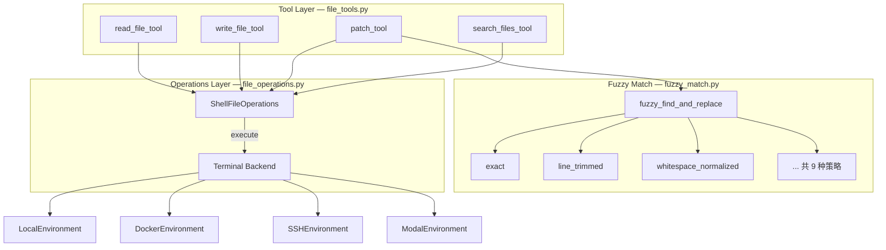
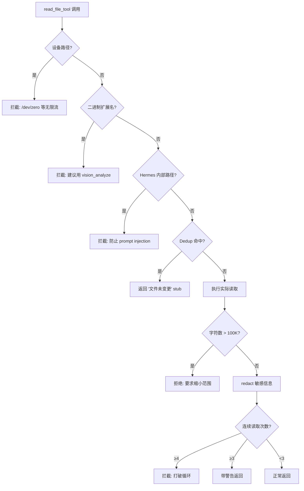
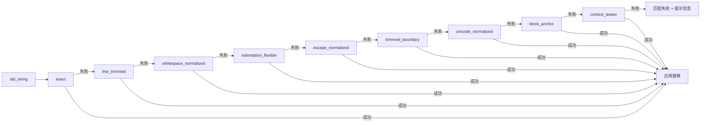
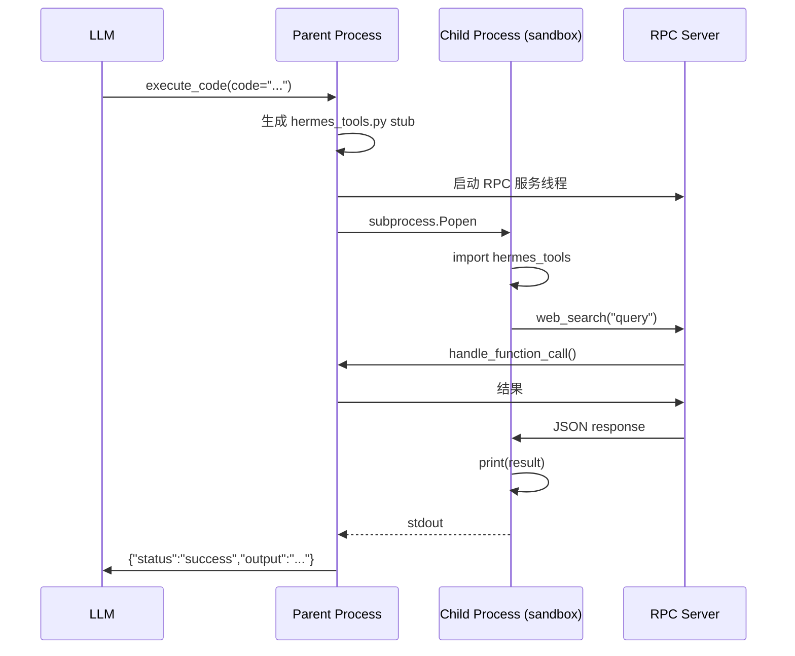
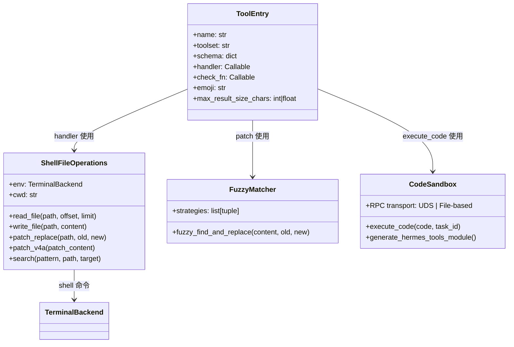

# 第 13 章 文件与代码工具

> **核心文件**: `tools/file_tools.py`、`tools/file_operations.py`、`tools/fuzzy_match.py`、`tools/code_execution_tool.py`
> **关键词**: 文件读写、搜索、patch 策略、模糊匹配、代码沙箱、RPC

AI Agent 的核心价值在于**行动**——而行动最常见的形式就是读写文件和执行代码。Hermes Agent 围绕这两类操作构建了一套精密的工具体系：文件工具负责安全可靠地读写和搜索文件，代码执行工具则通过沙箱化的子进程让 LLM 编写并运行 Python 脚本。本章将深入剖析这套工具的实现，理解它如何在"让 LLM 高效工作"和"防止失控"之间取得平衡。

## 13.1 三层架构总览

Hermes Agent 的文件与代码工具体系由三层构成：



- **Tool Layer**：面向 LLM 的高层接口，负责参数校验、安全检查、结果格式化
- **Operations Layer**：通过 shell 命令实现的跨后端文件操作（`ShellFileOperations`）
- **Fuzzy Match Layer**：9 策略模糊匹配引擎，专门解决 LLM 生成代码的空白/缩进差异问题

所有工具通过 `tools/registry.py` 的 `registry.register()` 统一注册，遵循统一的 handler 签名 `(args: dict, **kwargs) -> str` 和 JSON 返回格式。

### Shell 命令抽象：跨后端的关键

一个值得注意的设计决策是：**所有文件操作通过 shell 命令执行，不直接使用 Python 文件 I/O**。

```python
# file_operations.py:322-328
class ShellFileOperations(FileOperations):
    """File operations implemented via shell commands.
    Works with ANY terminal backend that has execute(command, cwd) method.
    This includes local, docker, singularity, ssh, modal, and daytona environments."""
```

这使得同一套工具代码可以无缝跨越 local/docker/ssh/modal 后端——只需要底层环境实现 `execute(command, cwd)` 方法即可。

## 13.2 read_file — 智能文件读取

### 核心接口

```python
# file_tools.py:282
def read_file_tool(path: str, offset: int = 1, limit: int = 500,
                   task_id: str = "default") -> str:
```

`read_file` 并非简单的文件读取——它集成了一整套防御机制，保护 Agent 的 context window 不被滥用。

### 特性一览

| 特性 | 实现方式 | 代码位置 |
|------|----------|----------|
| 分页读取 | `sed -n '{offset},{end_line}p'` | file_operations.py:528-529 |
| 行号标注 | `{i:6d}\|{line}` 格式化 | file_operations.py:400-409 |
| 二进制检测 | 扩展名 + 内容分析 (30% 非打印字符) | file_operations.py:377-393 |
| 字符数上限 | 100K chars (≈25-35K tokens) | file_tools.py:28, 374 |
| 设备路径拦截 | `/dev/zero`, `/dev/random` 等 | file_tools.py:62-90 |
| 敏感文件拦截 | Hermes 内部缓存路径 | file_tools.py:311-328 |
| 去重 (Dedup) | mtime 比较避免重复读 | file_tools.py:330-357 |
| 循环检测 | 连续读同一区域 ≥3 次警告, ≥4 次拦截 | file_tools.py:429-445 |
| 相似文件建议 | 基于文件名评分 (0-100) | file_operations.py:557-607 |
| 敏感信息脱敏 | `redact_sensitive_text()` | file_tools.py:389-391 |

### 安全防护链

`read_file` 在返回内容之前需要通过一条多级过滤链：



这条链每一级都在防止不同类型的问题：

- **设备路径拦截**：防止 LLM 读取 `/dev/zero` 等无限流设备，导致 hang
- **二进制检测**：防止二进制垃圾污染 context window
- **内部路径保护**：Hermes 自己的缓存（如系统提示词）被拦截，防止 prompt injection
- **Dedup**：同一个文件没变化就不重复读取，节省 token
- **循环检测**：LLM 陷入反复读同一文件的死循环时及时打断

### Dedup 机制的精妙之处

去重不是简单地记录"读过的文件"——它通过 `mtime`（文件修改时间）来判断文件是否有变化：

```python
# file_tools.py:133-149
# Per task_id:
#   "dedup": dict mapping (resolved_path, offset, limit) → mtime float
#   "read_timestamps": dict mapping resolved_path → mtime float
```

如果 `(path, offset, limit)` 组合之前读过，且 `mtime` 没变，直接返回"文件未变更"的 stub，大幅节省 token 消耗。

两个关键的重置时机：
- **Context compression 后**：`reset_file_dedup()` 清空缓存，因为原始内容已被摘要化，LLM 的上下文中不再有完整文件内容
- **其他工具调用后**：`notify_other_tool_call()` 重置连续读取计数，防止误判（LLM 可能合理地在执行其他操作后需要重新读取）

## 13.3 write_file — 安全写入

```python
# file_tools.py:541
def write_file_tool(path: str, content: str, task_id: str = "default") -> str:
```

`write_file` 是完全覆写语义——它通过 `cat > {path}` 配合 stdin pipe 传输内容，这个设计绕过了操作系统的 `ARG_MAX` 限制（命令行参数长度上限），可以安全地写入大文件。

### 敏感路径双重保护

```python
# file_tools.py:95-99
_SENSITIVE_PATH_PREFIXES = (
    "/etc/", "/boot/", "/usr/lib/systemd/",
    "/private/etc/", "/private/var/",
)
_SENSITIVE_EXACT_PATHS = {"/var/run/docker.sock", "/run/docker.sock"}
```

写入前同时检查 `os.path.realpath`（解析符号链接后的路径）和 `os.path.normpath`（规范化但不解析符号链接），实现**双重防护**——防止通过符号链接绕过路径限制。

### Staleness 检测

```python
# file_tools.py:510-538
def _check_file_staleness(filepath: str, task_id: str) -> str | None:
    """如果文件在 agent 最后一次 read 后被修改，返回警告"""
```

如果文件在 LLM 上次 read 和本次 write 之间被外部修改（例如用户手动编辑），write 结果中会附加 `_warning`。但关键设计：**不阻止写入**——这是故意的，因为很多情况下这不是错误，阻止反而会导致 LLM 进入困惑循环。

## 13.4 search_files — 代码搜索引擎

### 双模式搜索

```python
# file_tools.py:622-687
def search_files_tool(pattern: str, target: str = "content", ...) -> str:
```

| 模式 | target 参数 | 底层命令 | 功能 |
|------|-------------|----------|------|
| Content 搜索 | `"content"` | `rg` / `grep` | 文件内容正则搜索 |
| File 搜索 | `"files"` | `rg --files` / `find` | 按文件名 glob 查找 |

### Ripgrep 优先，优雅降级

Content 搜索优先使用 `rg`（ripgrep），它默认忽略 `.gitignore` 中列出的文件，速度也远快于 `grep`：

```python
cmd_parts = ["rg", "--line-number", "--no-heading", "--with-filename"]
```

支持三种输出模式：
- `content`：匹配行 + 行号 + 文件路径（默认）
- `files_only`：仅返回匹配的文件路径（`-l` 标志）
- `count`：每文件匹配计数（`-c` 标志）

File 搜索的降级链：`rg --files --sortr=modified`（rg 13+ 按修改时间排序）→ 无排序的 `rg --files` → `find` 命令。每一步失败都静默回退到下一级。

### 跨平台正则解析

输出解析器需要处理 Windows 路径中的驱动器号（`C:\`）：

```python
# file_operations.py:1085-1086
_match_re = re.compile(r'^([A-Za-z]:)?(.*?):(\d+):(.*)$')  # 匹配行
_ctx_re = re.compile(r'^([A-Za-z]:)?(.*?)-(\d+)-(.*)$')    # 上下文行
```

每行内容截断到 500 字符，防止单行超长内容（如压缩的 JSON）撑爆 context。

## 13.5 patch — 9 策略模糊匹配的编辑引擎

`patch` 是 Hermes Agent 最精巧的工具之一。它提供两种编辑模式：

| 模式 | 参数 | 功能 |
|------|------|------|
| Replace | `path`, `old_string`, `new_string` | 单文件查找替换 |
| V4A Patch | `patch`（多文件 patch 字符串） | 批量多文件编辑 |

### 为什么需要模糊匹配？

LLM 生成的 `old_string` 经常有细微差异：
- 多余或缺少的空格/缩进
- Smart quotes（`""`）替代 straight quotes（`""`）
- Tab 和空格混用
- Unicode 字符变体

硬编码的精确匹配会导致大量 patch 失败。Hermes 的解决方案是受 OpenCode 启发的 **9 策略渐进式匹配链**。

### 9 策略匹配链

```python
# fuzzy_match.py:73-83
strategies = [
    ("exact", _strategy_exact),                    # 1. 精确字符串匹配
    ("line_trimmed", _strategy_line_trimmed),       # 2. 行级别去除前后空白
    ("whitespace_normalized", _strategy_whitespace_normalized),  # 3. 多空格/tab 折叠
    ("indentation_flexible", _strategy_indentation_flexible),    # 4. 完全忽略缩进
    ("escape_normalized", _strategy_escape_normalized),          # 5. 转义字符规范化
    ("trimmed_boundary", _strategy_trimmed_boundary),            # 6. 首尾行空白修剪
    ("unicode_normalized", _strategy_unicode_normalized),        # 7. Unicode 规范化
    ("block_anchor", _strategy_block_anchor),       # 8. 首尾行锚定 + 中间相似度
    ("context_aware", _strategy_context_aware),     # 9. 50% 行相似度阈值
]
```



**设计理念**：从最精确到最模糊，逐级放宽条件。越早命中越好（精确度高），但宁可用模糊匹配成功也不要完全失败。

### Unicode 规范化细节

LLM 输出中经常出现的 Unicode 变体：

```python
UNICODE_MAP = {
    "\u201c": '"', "\u201d": '"',   # smart double quotes → "
    "\u2018": "'", "\u2019": "'",   # smart single quotes → '
    "\u2014": "--", "\u2013": "-",  # em/en dashes
    "\u2026": "...", "\u00a0": " ", # ellipsis, non-breaking space
}
```

### 替换的从后往前策略

当 `replace_all=True` 时可能找到多个匹配位置。替换采用从后往前的顺序，保证前面位置的字符偏移不受影响：

```python
# fuzzy_match.py:104-124
def _apply_replacements(content, matches, new_string):
    sorted_matches = sorted(matches, key=lambda x: x[0], reverse=True)
    for start, end in sorted_matches:
        result = result[:start] + new_string + result[end:]
```

### V4A Patch 格式

用于批量多文件编辑的 V4A 格式：

```
*** Begin Patch
*** Update File: path/to/file.py
@@ context hint @@
 context line
-removed line
+added line
*** Add File: new_file.py
+new content
*** Delete File: old_file.py
*** End Patch
```

由 `tools/patch_parser.py` 解析，支持 Update/Add/Delete 三种操作。

### 自动语法检查

每次 patch 后自动运行语法检查（lint）：

```python
# file_operations.py:814-844
def _check_lint(self, path: str) -> LintResult:
    ext = os.path.splitext(path)[1].lower()
    if ext not in LINTERS:
        return LintResult(skipped=True)
    # 运行对应 linter，timeout=30s
    result = self._exec(cmd, timeout=30)
```

lint 结果会返回给 LLM，让它自行决定是否修复语法错误——这比阻止写入更优雅。

### 匹配失败时的提示

```python
# file_tools.py:615-616
if result_dict.get("error") and "Could not find" in str(result_dict["error"]):
    result_json += "\n\n[Hint: old_string not found. Use read_file to verify ...]"
```

引导 LLM 先读取文件确认实际内容，而非反复猜测。

## 13.6 execute_code — 代码沙箱与 PTC

`execute_code` 实现了 **Programmatic Tool Calling (PTC)** — LLM 编写 Python 脚本，通过 RPC 调用 Hermes 工具，将多步工具链压缩为单次推理轮次。

### 执行流程



### 两种 RPC 传输协议

| 特性 | UDS (Local) | File-based RPC (Remote) |
|------|-------------|------------------------|
| 传输方式 | Unix Domain Socket | 文件系统请求/响应 |
| 适用后端 | local | docker, ssh, modal |
| 连接方式 | `AF_UNIX` socket | 轮询 req_/res_ 文件 |
| 环境变量 | `HERMES_RPC_SOCKET` | `HERMES_RPC_DIR` |
| 序列化 | JSON over newline-delimited TCP | JSON 文件 + base64 |

Local 模式使用高效的 Unix Domain Socket；远程环境无法直接使用 socket，退化为基于文件系统的轮询——在 Docker 容器或 SSH 远程主机中，通过写入请求文件、等待响应文件的方式实现 RPC。

> **macOS 特殊处理**：macOS 的 UDS 路径长度有限制（104 字节），当 tmpdir 路径过长时（如 `/var/folders/...`），代码会回退到使用 `/tmp` 目录。

### 沙箱安全

**仅 7 个工具可用**：

```python
# code_execution_tool.py:56-64
SANDBOX_ALLOWED_TOOLS = frozenset([
    "web_search", "web_extract",
    "read_file", "write_file", "search_files",
    "patch", "terminal",
])
```

`terminal` 受限：禁止 `background`、`pty`、`notify_on_complete`、`watch_patterns` 参数——不能启动后台进程或交互式终端。

**环境变量过滤**：

```python
_SAFE_ENV_PREFIXES = ("PATH", "HOME", "USER", "LANG", "LC_", "TERM", ...)
_SECRET_SUBSTRINGS = ("TOKEN", "SECRET", "PASSWORD", "CREDENTIAL", ...)
```

仅传递安全前缀的环境变量，阻止包含密钥类关键词的变量泄露到子进程。技能声明的 `env_passthrough` 可以创建例外。

**资源限制**：

| 限制项 | 默认值 | 说明 |
|--------|--------|------|
| 超时时间 | 300 秒 (5 分钟) | `DEFAULT_TIMEOUT` |
| 工具调用次数 | 50 次 | `DEFAULT_MAX_TOOL_CALLS` |
| stdout 上限 | 50 KB | `MAX_STDOUT_BYTES` |
| stderr 上限 | 10 KB | `MAX_STDERR_BYTES` |

### hermes_tools.py 动态代码生成

`generate_hermes_tools_module()` 为子进程动态生成一个 Python 模块：

```python
# 生成的 stub 示例
def read_file(path: str, offset: int = 1, limit: int = 500):
    """Read a file (1-indexed lines). Returns dict with "content" and "total_lines"."""
    return _call('read_file', {'path': path, 'offset': offset, 'limit': limit})
```

还内置了三个便利函数：
- `json_parse(text)` — `strict=False` 的 `json.loads`
- `shell_quote(s)` — `shlex.quote` 封装
- `retry(fn, max_attempts=3, delay=2)` — 指数退避重试

Schema 的 `description` 也根据当前启用的工具**动态生成**——如果 web 工具被禁用，description 中不会提及 `web_search`，避免 LLM 尝试调用不存在的工具。

### Head+Tail 截断策略

当 stdout 超过 50KB 时，不是简单地截断尾部：

```python
# code_execution_tool.py:1048-1049
_STDOUT_HEAD_BYTES = int(MAX_STDOUT_BYTES * 0.4)   # 40% head (20KB)
_STDOUT_TAIL_BYTES = MAX_STDOUT_BYTES - _STDOUT_HEAD_BYTES  # 60% tail (30KB)
```

保留 40% 头部（看到开头信息/错误）和 60% 尾部（看到最终 `print()` 结果），中间插入截断通知。这保证了 LLM 刻意 `print()` 的结果不会丢失。

### 进程管理

```python
proc = subprocess.Popen(
    [sys.executable, "script.py"],
    cwd=tmpdir, env=child_env,
    stdout=subprocess.PIPE, stderr=subprocess.PIPE,
    stdin=subprocess.DEVNULL,
    preexec_fn=os.setsid,  # 创建进程组便于清理
)
```

`os.setsid` 创建新的进程组，超时时通过 `_kill_process_group()` 先 SIGTERM（优雅关闭），5 秒后升级到 SIGKILL（强制杀死）。输出经过 ANSI escape 序列剥离和敏感信息脱敏后再返回给 LLM。

## 13.7 工具注册模式

所有文件工具注册在 `"file"` toolset 下：

```python
# file_tools.py:796-799
registry.register(name="read_file", toolset="file", schema=READ_FILE_SCHEMA,
    handler=_handle_read_file, check_fn=_check_file_reqs, emoji="📖",
    max_result_size_chars=float('inf'))  # read_file 无大小限制（已有内置 100K 限制）

registry.register(name="write_file", toolset="file", ..., emoji="✍️",
    max_result_size_chars=100_000)

registry.register(name="patch", toolset="file", ..., emoji="🔧",
    max_result_size_chars=100_000)

registry.register(name="search_files", toolset="file", ..., emoji="🔎",
    max_result_size_chars=100_000)
```

`execute_code` 注册在独立的 `"code_execution"` toolset：

```python
registry.register(
    name="execute_code", toolset="code_execution",
    handler=lambda args, **kw: execute_code(
        code=args.get("code", ""),
        task_id=kw.get("task_id"),
        enabled_tools=kw.get("enabled_tools")),
    check_fn=check_sandbox_requirements,  # POSIX only
    emoji="🐍",
    max_result_size_chars=100_000,
)
```

注意 `read_file` 的 `max_result_size_chars=float('inf')`——因为它已有内置的 100K 字符限制，不需要注册表再截断一次。

## 13.8 错误处理与 Edge Cases

### 关键 Edge Cases 一览

| 场景 | 处理方式 |
|------|----------|
| macOS UDS 路径过长 | 使用 `/tmp` 而非 `/var/folders/...` |
| ARG_MAX 限制 | stdin pipe 替代命令行参数 |
| BSD find 兼容 | 检测 `-printf` 失败后 fallback |
| rg 版本差异 | `--sortr` 失败后 retry 无排序版 |
| Windows 路径 | regex 处理 drive letter (`C:\`) |
| 环境被清理 | 文件操作缓存失效后重新创建 |
| 写保护路径 | 双重检查 realpath + normpath |

### 预期异常与意外异常的区分

```python
# file_tools.py:121-127
def _is_expected_write_exception(exc: Exception) -> bool:
    """Return True for expected write denials that should not hit error logs."""
    if isinstance(exc, PermissionError): return True
    if isinstance(exc, OSError) and exc.errno in _EXPECTED_WRITE_ERRNOS: return True
```

权限拒绝是正常业务流程（用户试图写入只读文件），不应该触发错误日志告警。这种区分避免了日志噪音，让真正的系统错误更容易被发现。

## 13.9 设计模式总结



本章涉及的核心设计模式：

| 模式 | 应用 |
|------|------|
| **Strategy Pattern** | 9 策略模糊匹配链，按顺序尝试 |
| **Adapter Pattern** | ShellFileOperations 适配不同终端后端 |
| **Pipeline Filter** | read_file 安全检查链 (device→binary→internal→dedup→size) |
| **Bridge Pattern** | UDS / File-based RPC 两种传输实现 |
| **Code Generation** | hermes_tools.py stub 动态生成 |
| **Double-Checked Locking** | `_get_file_ops` 环境创建 |
| **Head+Tail Buffer** | stdout 截断保留首尾 |
| **Registry Pattern** | 统一工具注册 + schema |

## 本章小结

Hermes Agent 的文件与代码工具体系展现了几个深层次的架构洞察：

1. **Shell 命令抽象是跨后端的关键**：不使用 Python 文件 I/O，而是通过 shell 命令操作文件，使得同一套代码可以在 local/docker/ssh/modal 上无缝运行。

2. **Context Window 是最珍贵的资源**：100K 字符上限、dedup、循环检测、大文件提示——多层机制保护 LLM 的 context window 不被浪费。

3. **渐进式容错**：fuzzy_match 的 9 策略链体现了对 LLM 输出不确定性的深入理解——从精确匹配逐渐放宽到模糊匹配，在准确性和鲁棒性之间取得平衡。

4. **沙箱隔离**：execute_code 通过 RPC 间接调用工具，子进程无法直接访问 API 密钥或 agent 内部状态，实现了安全隔离。

5. **防御性设计**：从设备路径拦截到敏感路径双重检查，从环境变量过滤到输出脱敏，每一层都假设"最坏情况可能发生"并提前防护。

这套工具体系的设计哲学可以概括为：**让 LLM 高效工作的同时，确保它不会伤害系统或浪费资源**。
