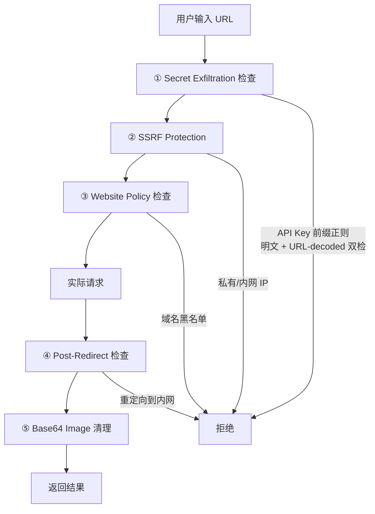
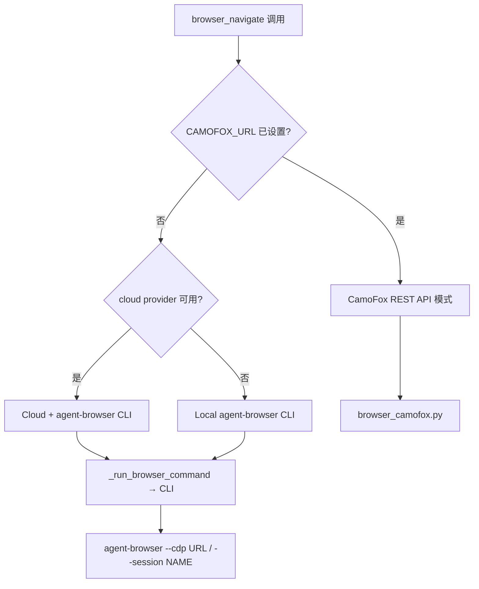
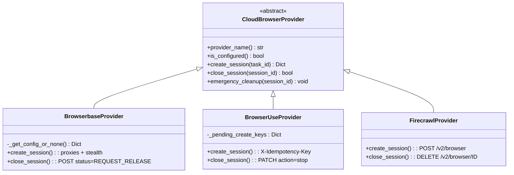
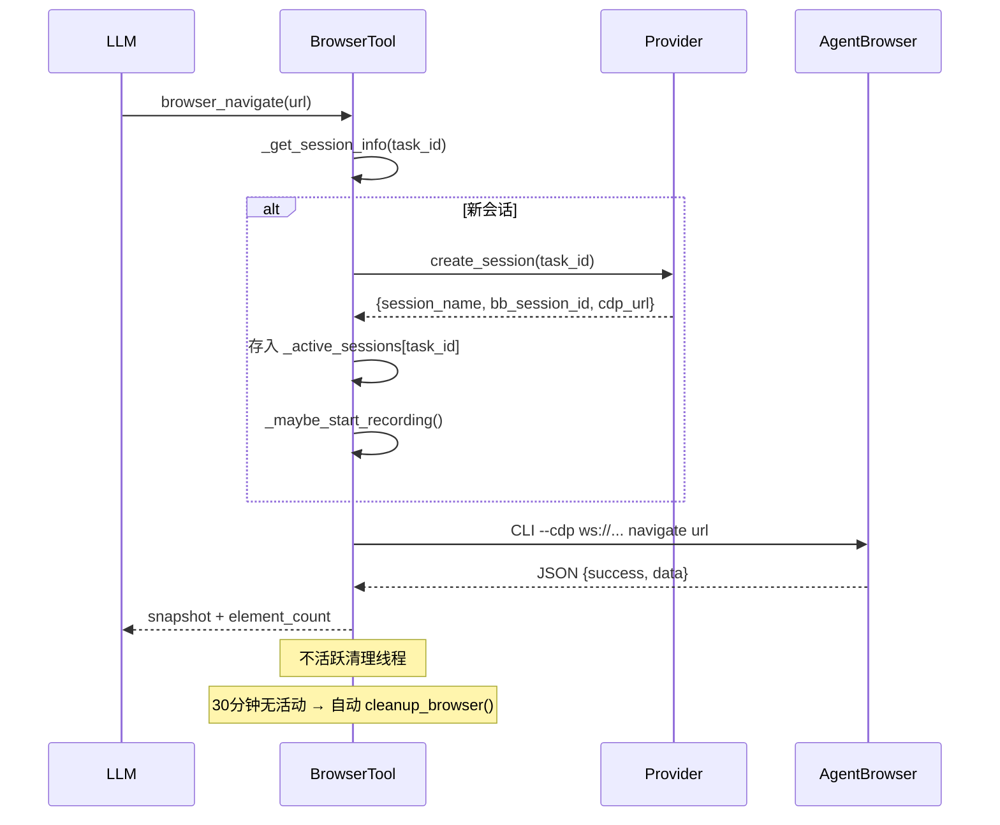
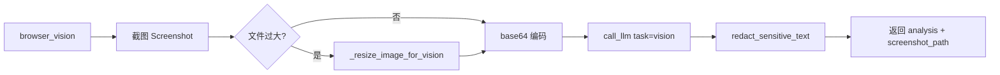
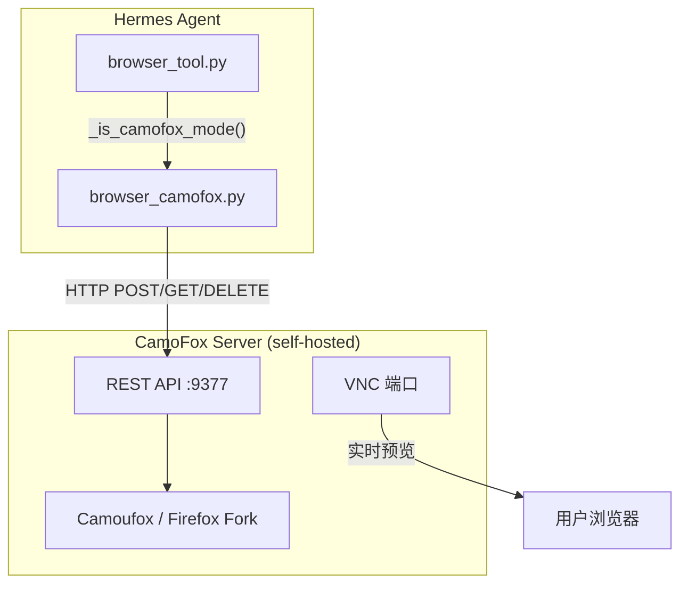
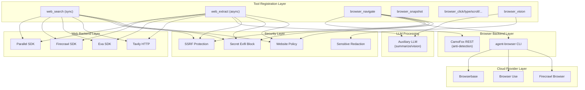

# 第14章 Web 与浏览器工具

> **核心文件**：`tools/web_tools.py`（2100行）、`tools/browser_tool.py`（2393行）、`tools/browser_camofox.py`（592行）、`tools/browser_providers/*.py`

Hermes Agent 的 Web 能力是连接 LLM 与真实互联网世界的桥梁。它分为两大子系统：**Web 搜索/提取**（轻量 API 调用，负责搜索引擎查询和网页内容提取）和**浏览器自动化**（完整浏览器控制，负责需要交互的复杂网页操作）。两个子系统各自拥有多后端架构和独立的工具注册入口，共同构成了一套功能完备、安全可靠的 Web 工具链。

本章将从搜索后端的抽象设计入手，逐步深入到浏览器自动化的会话管理、云服务提供商抽象、CamoFox 反检测方案，以及贯穿始终的安全防护机制。

---

## 14.1 Web 搜索/提取子系统

`web_tools.py` 是 Hermes Agent 搜索和内容提取的核心模块。它通过统一的工具接口，将四种不同的搜索后端封装成一致的 API，并提供 LLM 驱动的内容压缩流水线。

### 14.1.1 四后端抽象

Hermes 支持四种搜索后端，每种都有独特的优势和 API 风格：

| 后端 | API Key 环境变量 | 搜索 | 提取 | 爬取 | 特色 |
|---|---|---|---|---|---|
| **Parallel** | `PARALLEL_API_KEY` | ✅ 三模式 | ✅ 异步 fallback | ❌ | SDK `Parallel`/`AsyncParallel` |
| **Firecrawl** | `FIRECRAWL_API_KEY` | ✅ | ✅ scrape | ✅ | 支持 Nous 托管网关 |
| **Exa** | `EXA_API_KEY` | ✅ highlights | ✅ `get_contents` | ❌ | 语义搜索 |
| **Tavily** | `TAVILY_API_KEY` | ✅ body auth | ✅ `/extract` | ✅ `/crawl` | 纯 HTTP，无 SDK |

后端选择由 `_get_backend()` 函数控制，遵循明确的优先级链：

```
config.yaml → web.backend（显式指定）
  ↓ fallback
按环境变量优先级自动检测：firecrawl > parallel > tavily > exa
  ↓ default
"firecrawl"（向后兼容）
```

这种设计意味着用户只需设置一个环境变量，系统就能自动选择正确的后端——零配置即可工作。

### 14.1.2 Firecrawl 客户端与 Nous 网关

Firecrawl 后端有一个特殊的**双路径初始化**机制，这是 Nous 商业生态的一个缩影：

```python
def _get_firecrawl_client():
    # 路径 1：直接配置（用户自己的 API Key）
    direct_config = _get_direct_firecrawl_config()
    if direct_config:
        kwargs, cache_key = direct_config
    else:
        # 路径 2：Nous 托管网关（订阅用户专属）
        managed = resolve_managed_tool_gateway("firecrawl", ...)
        kwargs = {"api_key": managed.nous_user_token,
                  "api_url": managed.gateway_origin}
    
    # 客户端缓存 + 配置指纹比对
    if _firecrawl_client and _firecrawl_client_config == client_config:
        return _firecrawl_client
    return Firecrawl(**kwargs)
```

缓存键是一个 `(mode, url, api_key)` 元组。当用户在运行时切换配置时，系统会检测到配置指纹变化并自动重建客户端——实现了**热切换**而无需重启。

### 14.1.3 搜索结果归一化

四种后端的原始响应格式各不相同，但工具层向 LLM 暴露的始终是统一结构：

```json
{
  "success": true,
  "data": {
    "web": [
      {"title": "...", "url": "...", "description": "...", "position": 1}
    ]
  }
}
```

关键的归一化函数各司其职：

- **`_normalize_tavily_search_results()`** — 将 Tavily 的 `results[].content` 映射为标准的 `description` 字段
- **`_extract_web_search_results()`** — 处理 Firecrawl SDK/网关的多种响应形态（`data.web`、`data.results`、`web`、`results`）
- **`_to_plain_object()`** — 将 Pydantic model 降级为普通 dict，确保 JSON 序列化兼容

这种归一化层的存在，意味着添加第五种后端只需实现三个适配函数，而不需要修改任何上层代码。

### 14.1.4 LLM 内容压缩流水线

`web_extract_tool` 提取的原始网页内容可能非常庞大。为了适配 LLM 的上下文窗口，系统实现了一套智能压缩流水线：

```
              ┌──────────────┐
    raw       │  Size Check  │
    content ──│ >2M: refuse  │
              │ >500k: chunk │
              │ <5k: skip    │
              └──────┬───────┘
                     │
         ┌───────────┴───────────┐
         │ Normal (<500k)        │ Large (>500k)
         │                       │
    ┌────▼────┐          ┌───────▼────────┐
    │ Single  │          │  Chunk (100k)  │
    │ LLM     │          │  → parallel    │
    │ Call    │          │    summarize   │
    └────┬────┘          └───────┬────────┘
         │                       │
         │               ┌───────▼────────┐
         │               │   Synthesize   │
         │               │   summaries    │
         │               └───────┬────────┘
         │                       │
    ┌────▼───────────────────────▼────┐
    │  Output cap: 5000 chars        │
    │  Fallback: truncated raw on err│
    └────────────────────────────────┘
```

**关键阈值常量**：

| 常量 | 值 | 说明 |
|---|---|---|
| `MAX_CONTENT_SIZE` | 2,000,000 | 超过 2M 字符直接拒绝 |
| `CHUNK_THRESHOLD` | 500,000 | 超过 500k 触发分块 |
| `CHUNK_SIZE` | 100,000 | 每块 100k 字符 |
| `MAX_OUTPUT_SIZE` | 5,000 | 最终输出硬限制 |
| `DEFAULT_MIN_LENGTH_FOR_SUMMARIZATION` | 5,000 | 低于此不压缩 |

压缩使用**辅助模型**（auxiliary model），通过 `_resolve_web_extract_auxiliary()` 解析。系统会检测是否在 Nous Portal 环境中运行，并自动附加标签用于计费追踪。

**错误恢复**是这个流水线的亮点：当 LLM 压缩失败时，系统不会返回无用的错误消息，而是 fallback 到截断的原始内容（前 5000 字符）。对于用户来说，获得一些信息总比完全失败好得多。

### 14.1.5 安全防护层

Web 工具的安全设计体现了**多层防御**（Defense in Depth）思想：



六层安全检查的设计意图：

1. **Secret exfiltration** — URL 中嵌入 API Key 的攻击，同时检查明文和 URL-decoded 版本
2. **SSRF protection** — `is_safe_url()` 过滤私有和内网地址
3. **Website policy** — 基于配置的域名白名单/黑名单
4. **Post-redirect check** — Firecrawl 抓取后检查 `metadata.sourceURL`（最终跳转 URL）
5. **Base64 image cleaning** — 删除内联 base64 图片以减少 token 消耗
6. **Interrupt check** — 每个后端入口检查 `is_interrupted()`，支持取消长时间操作

### 14.1.6 工具注册

Web 子系统注册了两个工具，值得注意的是它们在同步/异步处理上的差异：

```python
# web_search — 同步调用
registry.register(
    name="web_search", toolset="web",
    handler=lambda args, **kw: web_search_tool(args.get("query", ""), limit=5),
    check_fn=check_web_api_key,
    max_result_size_chars=100_000,
)

# web_extract — 异步调用，URL 数量上限为 5
registry.register(
    name="web_extract", toolset="web",
    handler=lambda args, **kw: web_extract_tool(args.get("urls", [])[:5], "markdown"),
    is_async=True,
    max_result_size_chars=100_000,
)
```

> **有趣的发现**：代码中还存在 `web_crawl_tool`，支持 Tavily 和 Firecrawl 后端的爬取功能，但**并未注册到 registry**。这意味着 LLM 无法直接调用它。推测原因是爬取整个站点的资源消耗过大，或者功能尚未稳定。

---

## 14.2 浏览器自动化子系统

当简单的搜索和内容提取无法满足需求——比如需要登录、填写表单、处理动态加载的页面——Hermes 就需要一个真正的浏览器。`browser_tool.py` 提供了完整的浏览器自动化能力。

### 14.2.1 双模式架构

浏览器工具运行在两种互斥模式之一：



**CamoFox 模式**优先级最高——如果设置了 `CAMOFOX_URL` 环境变量，所有浏览器操作都通过 CamoFox 的 REST API 完成，绕过 `agent-browser` CLI。否则，系统通过 `agent-browser` CLI 驱动浏览器，CLI 可以连接本地浏览器实例或云端浏览器会话。

### 14.2.2 Cloud Provider 抽象层

三个云浏览器提供商共享统一的抽象接口：



Provider 选择也遵循显式优先、自动检测兜底的模式：

```
config["browser"]["cloud_provider"] (显式名称)
  → _PROVIDER_REGISTRY 查找
  → fallback 1: BrowserUse (if configured)
  → fallback 2: Browserbase (if configured)
  → None (本地模式)

config == "local" → 直接返回 None
```

### 14.2.3 三大 Provider 对比与特色

| Provider | 认证方式 | 创建会话 | 关闭会话 | 特色功能 |
|---|---|---|---|---|
| **Browserbase** | `BROWSERBASE_API_KEY` + `PROJECT_ID` | `POST /v1/sessions` | `POST status=REQUEST_RELEASE` | proxies, advancedStealth, keepAlive; 402 降级 |
| **Browser Use** | `BROWSER_USE_API_KEY` 或 Nous 网关 | `POST /browsers` | `PATCH action=stop` | 幂等键防重复创建 |
| **Firecrawl** | `FIRECRAWL_API_KEY` | `POST /v2/browser` | `DELETE /v2/browser/ID` | TTL 会话（默认 300s），最简实现 |

两个值得关注的设计细节：

**Browserbase 402 降级**：创建会话时，先尝试开启所有付费功能（proxies + keepAlive），如果账户额度不足（HTTP 402），逐步移除付费功能重试：

```
create_session(proxies=true, keepAlive=true)
  → 402? retry without keepAlive
  → 402? retry without proxies
```

**Browser Use 幂等键**：网络不稳定时，客户端可能超时后重试，导致创建重复会话。Browser Use 通过 `X-Idempotency-Key` 头解决此问题——相同的 key 不会创建新会话。key 的生命周期管理也很讲究：409 冲突时保留 key（操作正在进行），5xx 错误时保留 key（供重试），成功或其他错误时清除 key。

### 14.2.4 会话生命周期

浏览器会话的完整生命周期如下：



**会话命名规则**体现了不同模式的身份需求：

| 模式 | 命名模板 | 示例 |
|---|---|---|
| 本地 | `h_{uuid[:10]}` | `h_a3b2c1d4e5` |
| CDP 直连 | `cdp_{uuid[:10]}` | `cdp_f6g7h8i9j0` |
| 云端 | `hermes_{task_id}_{uuid[:8]}` | `hermes_task42_k1l2m3n4` |

会话状态通过两个字典管理，使用 `_cleanup_lock` 保证线程安全：

- `_active_sessions: Dict[task_id, session_info]` — 活跃会话信息
- `_session_last_activity: Dict[task_id, float]` — 最后活动时间戳

`_get_session_info()` 使用**双重检查锁定**模式（double-check locking），避免在并发场景下创建重复会话。

### 14.2.5 CLI 适配器

`_run_browser_command()` 是连接 Python 层与 `agent-browser` CLI 的桥梁：

```python
def _run_browser_command(task_id, command, args, timeout=None):
    session_info = _get_session_info(task_id)
    cmd = [agent_browser_path, command, *args]
    
    if session_info["cdp_url"]:      # Cloud mode
        cmd += ["--cdp", session_info["cdp_url"]]
    else:                             # Local mode
        cmd += ["--session", session_info["session_name"]]
    
    # 每个任务独立的 socket 目录，实现隔离
    socket_dir = f"{tmpdir}/agent-browser-{session_name}"
    env["AGENT_BROWSER_SOCKET_DIR"] = socket_dir
    
    result = subprocess.run(cmd, capture_output=True, timeout=timeout)
    return json.loads(result.stdout)
```

通过子进程调用 CLI 而非直接集成浏览器库，实现了**进程级隔离**——浏览器崩溃不会拖垮 Agent 主进程。

### 14.2.6 导航安全层

`browser_navigate()` 是最复杂的工具函数，包含六层安全检查：

```
URL 输入
  ↓
① Secret exfiltration 检查 — _PREFIX_RE on url + unquote(url)
  ↓
② SSRF pre-navigation 检查（仅云模式）— is_safe_url()
  ↓
③ Website policy 检查 — check_website_access()
  ↓
④ 实际导航（camofox 或 agent-browser）
  ↓
⑤ SSRF post-redirect 检查 — 重定向后检查最终 URL
   → 若阻断: navigate("about:blank") 清除内容
  ↓
⑥ Bot 检测 — title 匹配: "access denied", "captcha", "cloudflare"...
```

注意第⑤步的**事后检查**：即使导航前的 URL 安全，重定向可能将浏览器带到内网地址。此时系统会立即导航到 `about:blank` 清除已加载的敏感内容。

### 14.2.7 十个注册工具

浏览器子系统共注册了 10 个工具，覆盖了浏览器操作的完整语义：

| # | 工具名 | 参数 | 说明 |
|---|---|---|---|
| 1 | `browser_navigate` | `url` | 导航到 URL，自动返回 snapshot |
| 2 | `browser_snapshot` | `full?` | 获取页面无障碍树快照 |
| 3 | `browser_click` | `ref` | 按引用 ID 点击元素 |
| 4 | `browser_type` | `ref, text` | 在输入框中输入文本 |
| 5 | `browser_scroll` | `direction` | 上/下滚动页面 |
| 6 | `browser_back` | — | 浏览器返回 |
| 7 | `browser_press` | `key` | 按下键盘键 |
| 8 | `browser_get_images` | — | 获取页面所有图片列表 |
| 9 | `browser_vision` | `question, annotate?` | 截图 + Vision AI 分析 |
| 10 | `browser_console` | `clear?, expression?` | 控制台日志 / JS 执行 |

所有工具共享同一个 `check_fn=check_browser_requirements`，通过 `_BROWSER_SCHEMA_MAP` 统一管理参数 schema。

### 14.2.8 Vision 工具与 Snapshot 压缩

**Vision 工具**让 LLM "看到"页面的视觉呈现：



Vision 的设计细节：
- `annotate=True` 时在截图上叠加 `[N]` 标签，N 对应可交互元素的 ref `@eN`
- 截图保存到 `browser_screenshots/`，24 小时自动清理
- 即使 Vision LLM 调用失败，截图文件仍然保留，用户可通过 `MEDIA:<path>` 分享
- 可配置超时：`auxiliary.vision.timeout`（默认 120s）

**Snapshot 压缩**处理无障碍树（accessibility tree）过大的情况：
- 超过 `SNAPSHOT_SUMMARIZE_THRESHOLD`（8000 chars）时触发
- 使用辅助 LLM 提取与用户任务相关的内容（先经过 `redact_sensitive_text()` 脱敏）
- 失败时 fallback 到简单截断

---

## 14.3 CamoFox 反检测浏览器

### 14.3.1 架构概述

CamoFox 是一个自托管的 Node.js 服务，封装了 Camoufox——Firefox 的 C++ 指纹欺骗分支。它通过 REST API 提供与 `browser_tool.py` 一一映射的操作，专门用于需要绕过 Bot 检测的场景。



启用方式很简单：`CAMOFOX_URL=http://localhost:9377`

### 14.3.2 会话管理与身份模型

CamoFox 使用基于 `userId` + `tabId` 的会话模型，支持两种身份模式：

| 模式 | 配置 | userId 生成 | 持久性 |
|---|---|---|---|
| 临时（Ephemeral） | 默认 | `hermes_{random_uuid[:10]}` | 任务结束销毁 |
| 托管持久（Managed） | `browser.camofox.managed_persistence=true` | `hermes_{uuid5(profile_path)[:10]}` | 跨任务保留 |

托管持久模式使用**确定性身份**生成，基于 `uuid5` 和 profile 路径计算：

```python
def get_camofox_identity(task_id):
    scope_root = str(get_camofox_state_dir())  # ~/.hermes/browser_auth/camofox
    user_digest = uuid5(NAMESPACE_URL, f"camofox-user:{scope_root}").hex[:10]
    session_digest = uuid5(NAMESPACE_URL, f"camofox-session:{scope_root}:{task_id}").hex[:16]
    return {"user_id": f"hermes_{user_digest}", "session_key": f"task_{session_digest}"}
```

这意味着同一台机器上的 Hermes Agent 总是获得相同的 `user_id`，从而在 CamoFox 服务端保留了浏览器 profile（cookies、localStorage 等），实现了**跨任务的身份持久化**。

### 14.3.3 REST API 映射

CamoFox 的 REST API 设计简洁直接：

| 浏览器操作 | HTTP 方法 | 端点 | 说明 |
|---|---|---|---|
| 健康检查 | `GET` | `/health` | 返回 `vncPort`（缓存） |
| 创建标签 | `POST` | `/tabs` | `userId` + `sessionKey` + `url` |
| 导航 | `POST` | `/tabs/{tabId}/navigate` | `url` 参数 |
| 快照 | `GET` | `/tabs/{tabId}/snapshot` | 无障碍树 |
| 点击 | `POST` | `/tabs/{tabId}/click` | `ref` 参数 |
| 输入 | `POST` | `/tabs/{tabId}/type` | `ref` + `text` |
| 截图 | `GET` | `/tabs/{tabId}/screenshot` | 返回二进制 PNG |
| 关闭会话 | `DELETE` | `/sessions/{userId}` | 销毁服务端会话 |

### 14.3.4 VNC 实时预览

CamoFox 可选暴露 VNC 端口，Hermes 在首次 `/health` 调用时自动发现并缓存：

```python
_vnc_url: Optional[str] = None
_vnc_url_checked = False  # 全进程只探测一次

def check_camofox_available():
    resp = requests.get(f"{url}/health")
    vnc_port = resp.json().get("vncPort")  # e.g. 5900
    _vnc_url = f"http://{host}:{vnc_port}"
```

导航成功后，返回结果中附带 `vnc_url` 和 `vnc_hint`，方便用户实时观看浏览器操作。

### 14.3.5 软清理 vs 硬清理

CamoFox 的清理策略区分了两个层次：

```python
def cleanup_browser(task_id):
    if _is_camofox_mode():
        # 先尝试软清理（托管持久模式）
        if not camofox_soft_cleanup(task_id):  # managed → True，只清内存
            camofox_close(task_id)              # ephemeral → DELETE /sessions/
```

- **软清理**：仅释放 Python 进程内存中的 `_sessions` 条目，保留 CamoFox 服务端的 browser profile（cookies 等）
- **硬清理**：调用 `DELETE /sessions/{userId}` 销毁服务端会话。即使 HTTP 失败也返回 `success=True`（best-effort 设计）

---

## 14.4 整体架构

下图展示了 Web 与浏览器工具的完整架构：



---

## 14.5 设计模式总结

Hermes 的 Web 工具链体现了多个经典设计模式的工程化实践：

### 策略模式（Strategy Pattern）

Web 后端和 Browser Provider 均使用策略模式：通过配置选择具体实现，上层代码对底层 API 差异完全无感知。这使得添加新的搜索引擎或云浏览器服务商只需实现一个新的策略类。

### 惰性初始化（Lazy Initialization）

所有外部客户端（Firecrawl、Parallel、Exa、Cloud Provider）均采用 `_client = None` + 首次使用时创建的模式，避免启动时不必要的网络调用和依赖加载。这对 CLI 工具的启动速度至关重要。

### 优雅降级（Graceful Degradation）

系统在多个层面实现了优雅降级：

| 场景 | 降级策略 |
|---|---|
| Browserbase 402 (额度不足) | 移除付费功能重试 |
| LLM 压缩失败 | 截断原始内容 |
| CamoFox console 不支持 | 返回空列表 + 提示 |
| Vision 截图过大 | 自动缩放重试 |

### 线程安全

多个锁保护关键资源：

- `_cleanup_lock` — 保护 `_active_sessions` 和 `_session_last_activity`
- `_sessions_lock` — 保护 CamoFox 会话映射
- `_pending_create_keys_lock` — 保护 Browser Use 幂等键
- 双重检查锁定模式 — 用于 `_get_session_info()`

### 资源清理

四层清理保障确保不会泄漏浏览器会话：

1. **不活跃超时**（30 分钟无活动）→ 自动清理
2. **`atexit.register()`** → 进程退出清理
3. **`emergency_cleanup()`** → signal handler 安全清理
4. **文件老化删除** — 截图 24h、录制 72h 自动清理

---

## 14.6 关键常量速查

| 常量 | 值 | 文件 | 用途 |
|---|---|---|---|
| `MAX_CONTENT_SIZE` | 2,000,000 | web_tools.py | 拒绝处理阈值 |
| `CHUNK_THRESHOLD` | 500,000 | web_tools.py | 分块处理阈值 |
| `CHUNK_SIZE` | 100,000 | web_tools.py | 每块大小 |
| `MAX_OUTPUT_SIZE` | 5,000 | web_tools.py | 输出硬限制 |
| `max_result_size_chars` | 100,000 | registry | 工具返回值上限 |
| `_SNAPSHOT_MAX_CHARS` | 80,000 | browser_camofox.py | CamoFox 快照分页 |
| `SNAPSHOT_SUMMARIZE_THRESHOLD` | 8,000 | browser_tool.py | 快照压缩触发 |
| `_DEFAULT_TIMEOUT` | 30s | browser_camofox.py | HTTP 请求超时 |
| `vision_timeout` | 120s | browser_tool.py | Vision LLM 超时 |
| Inactivity timeout | 30 min | browser_tool.py | 自动清理阈值 |
| Screenshot max age | 24h | browser_tool.py | 自动删除 |
| Recording max age | 72h | browser_tool.py | 自动删除 |
| Firecrawl TTL | 300s | firecrawl.py | 会话存活时间 |

---

## 14.7 本章小结

Hermes Agent 的 Web 与浏览器工具链是一个设计精良的多层系统：

1. **搜索/提取层** — 四后端抽象（Parallel、Firecrawl、Exa、Tavily），统一的结果归一化，LLM 驱动的智能内容压缩
2. **浏览器自动化层** — 双模式架构（CamoFox REST vs agent-browser CLI），三云 Provider 抽象（Browserbase、Browser Use、Firecrawl），完善的会话生命周期管理
3. **反检测层** — CamoFox 基于 Firefox 指纹欺骗，支持持久身份和 VNC 实时预览
4. **安全层** — 六层纵深防御，从 Secret Exfiltration 到 Post-Redirect SSRF 检查

贯穿整个系统的设计哲学是**策略模式 + 优雅降级 + 多层防御**。每一层都为上层提供稳定的抽象，每一个失败路径都有合理的 fallback，每一个安全检查点都有冗余的防护。这种工程化的严谨性，使得 Hermes Agent 能够在复杂的真实网络环境中可靠地运行。

下一章我们将深入研究 Hermes Agent 的文件系统工具，了解它如何安全地与本地文件系统交互。
