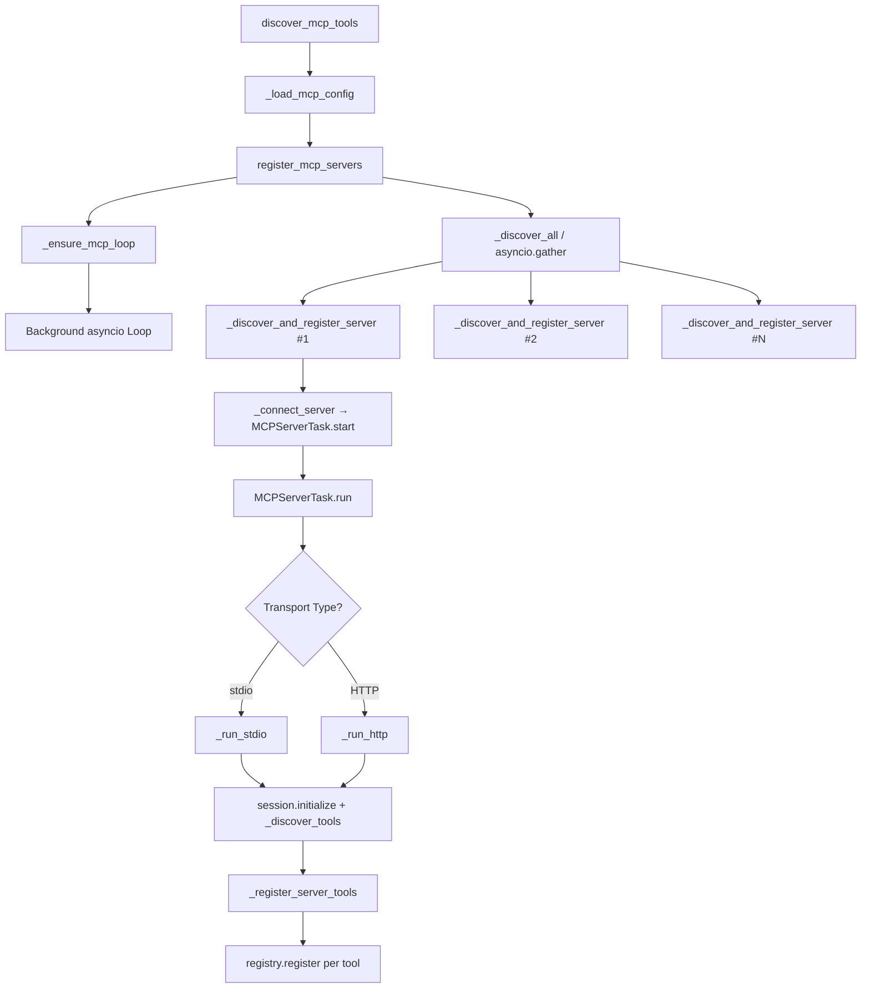
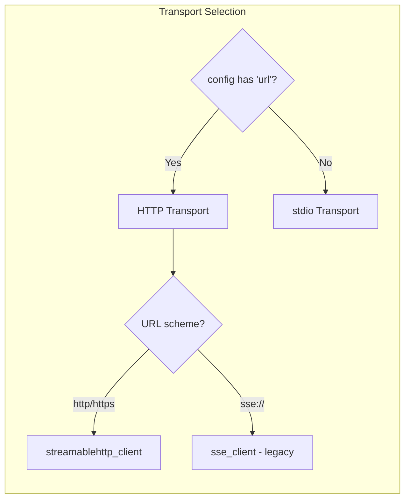
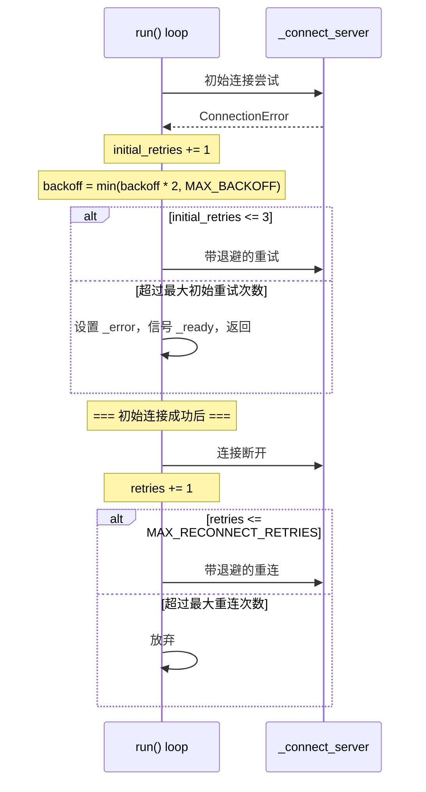
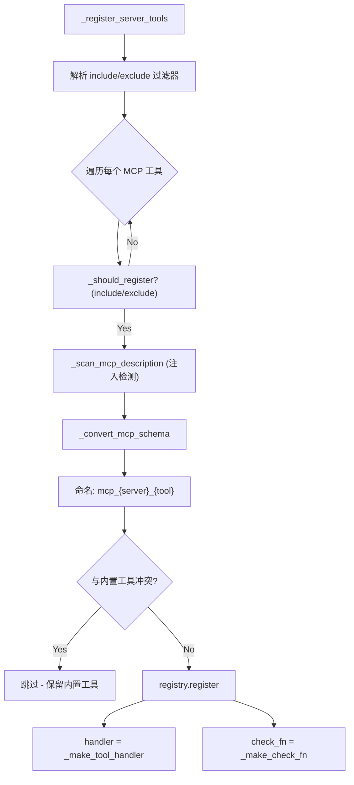
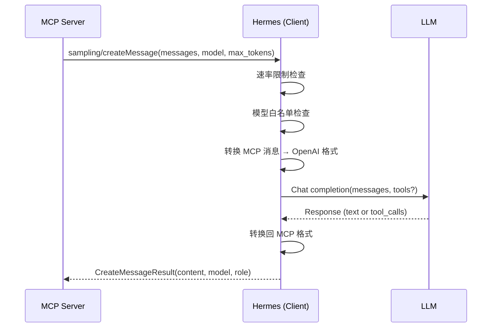
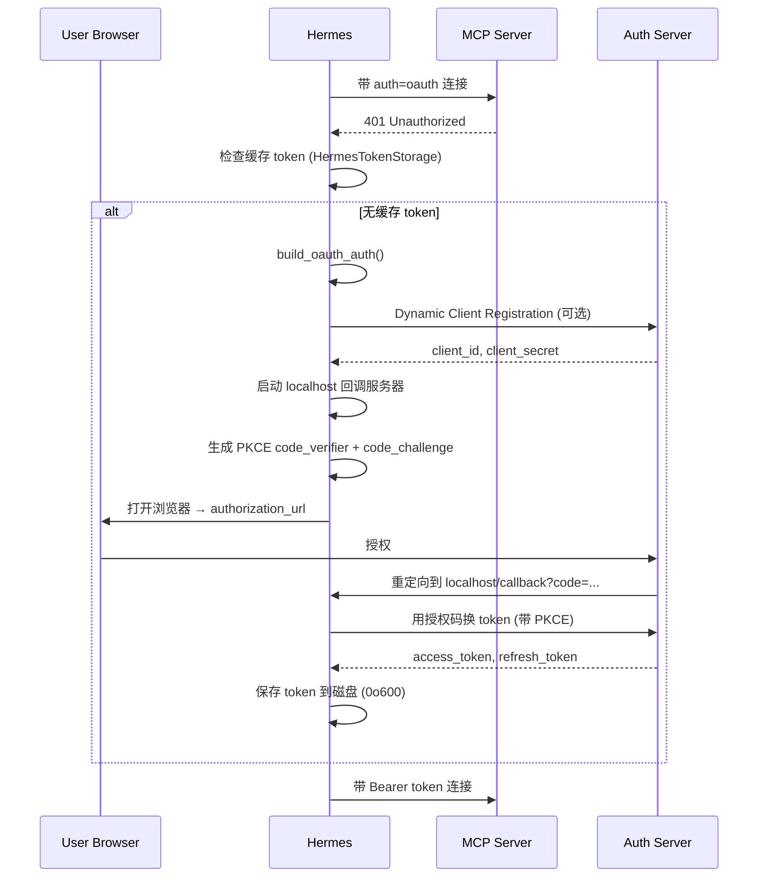
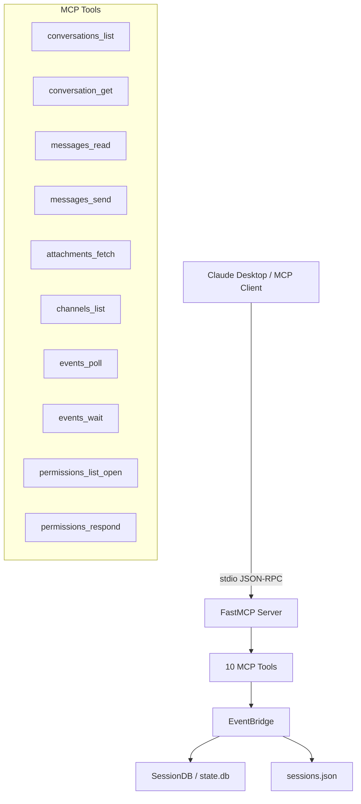
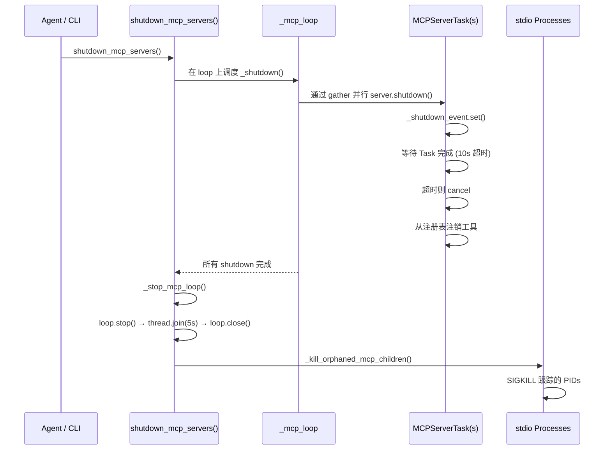

# 第15章 MCP 协议实现

> **核心文件**：`tools/mcp_tool.py`（2273 行）、`tools/mcp_oauth.py`（482 行）、`mcp_serve.py`（867 行）、`acp_adapter/`（7 个文件）  
> **关键词**：MCP 客户端/服务端双向实现、server lifecycle、tool discovery、transport 抽象、OAuth 认证、ACP 适配器

## 15.1 概述：双向 MCP/ACP 架构

Model Context Protocol（MCP）是 Anthropic 提出的开放协议，定义了 AI 代理与外部工具服务器之间的标准通信方式。Hermes 对 MCP 的实现不是简单的"接入"，而是一个**完整的双向架构**——既能作为客户端消费外部 MCP 服务器的工具，也能将自身暴露为 MCP 服务器供外部客户端调用。

这个双向架构由三大模块构成：

| 角色 | 入口文件 | 功能 |
|------|----------|------|
| **MCP 客户端** | `tools/mcp_tool.py` | 连接外部 MCP 服务器，发现并调用它们的工具、资源和提示 |
| **MCP 服务端** | `mcp_serve.py` | 通过 `hermes mcp serve` 将 Hermes 暴露为 MCP 服务器（如供 Claude Desktop 使用） |
| **ACP 适配器** | `acp_adapter/` | 实现 Agent Communication Protocol，让 VS Code / Zed / JetBrains 等 IDE 内嵌 Hermes |

```
                    ┌─────────────────────────────────┐
                    │          Hermes Agent            │
                    │                                  │
  MCP Client ──────▶│  tools/mcp_tool.py               │
  (外部 MCP 服务器) │  tools/mcp_oauth.py              │
                    │                                  │
  MCP Server ◀──────│  mcp_serve.py                    │
  (Claude Desktop)  │  EventBridge → SessionDB         │
                    │                                  │
  ACP Server ◀──────│  acp_adapter/                    │
  (VS Code/Zed)    │  HermesACPAgent                   │
                    └─────────────────────────────────┘
```

这种架构的意义在于：Hermes 不仅能"使用"工具生态，还能"成为"工具生态的一部分。一个 Hermes 实例可以同时连接多个 MCP 工具服务器获取能力，又将自己暴露给 IDE 作为编程助手。接下来我们逐一深入每个模块的实现。

---

## 15.2 MCP 客户端实现

`mcp_tool.py` 是 Hermes 中最大的单文件模块之一，2273 行代码实现了完整的 MCP 客户端生命周期：从配置加载、服务器连接、工具发现到调用执行，再到优雅关闭。

### 15.2.1 整体架构



**五个关键设计模式**贯穿整个实现：

| 模式 | 实现方式 |
|------|----------|
| **专用事件循环** | `_mcp_loop` 运行在 `_mcp_thread` 守护线程上，所有 MCP 操作通过 `_run_on_mcp_loop()` 调度 |
| **每服务器独立 Task** | `MCPServerTask` 为每个 MCP 服务器创建独立的 `asyncio.Task`，确保 cancel-scope 隔离 |
| **并行发现** | `asyncio.gather()` 并行连接所有服务器，120 秒总超时 |
| **工厂闭包** | `_make_tool_handler()` / `_make_check_fn()` 用闭包绑定 server_name/tool_name |
| **幂等注册** | `register_mcp_servers()` 自动跳过已连接的服务器 |

### 15.2.2 MCPServerTask：单服务器生命周期管理

`MCPServerTask` 是 MCP 客户端的核心抽象。每个实例管理一个 MCP 服务器连接的完整生命周期：

```python
class MCPServerTask:
    """Manages a single MCP server in a dedicated asyncio Task."""
    __slots__ = (
        "name", "session", "tool_timeout",
        "_tools", "_task", "_ready", "_shutdown_event", "_error",
        "_config", "_sampling", "_auth_type", "_registered_tool_names",
    )
```

使用 `__slots__` 而非 `__dict__` 是一个有意的优化——当 Hermes 同时连接多个 MCP 服务器时，减少每个实例的内存占用。

**生命周期方法一览**：

| 方法 | 职责 |
|------|------|
| `start(config)` | 创建后台 Task 并 `await _ready` 信号 |
| `run(config)` | 长生命周期协程：连接 → 发现工具 → 等待关闭；含自动重连 |
| `_run_stdio(config)` | stdio 传输：`stdio_client()` + 安全环境变量 |
| `_run_http(config)` | HTTP 传输：`streamablehttp_client()` + OAuth 支持 |
| `_discover_tools()` | 调用 `session.list_tools()` 获取工具列表 |
| `shutdown()` | 信号退出 → 等待 10 秒 → 超时则 cancel → 注销工具 |

### 15.2.3 传输层抽象

MCP 客户端支持三种传输方式，运行时根据配置自动选择：



#### stdio 传输

stdio 是最常见的 MCP 传输方式——服务器作为子进程启动，通过标准输入/输出通信：

```python
async def _run_stdio(self, config: dict):
    cmd = config["command"]
    args = config.get("args", [])
    env = _build_safe_env(config.get("env", {}))
    
    # 安全检查：OSV 恶意软件扫描
    malware_msg = check_package_for_malware(cmd, args)
    if malware_msg:
        raise RuntimeError(malware_msg)
    
    # PID 跟踪：用于孤儿进程清理
    before_pids = _snapshot_child_pids()
    async with stdio_client(server_params) as (read, write):
        after_pids = _snapshot_child_pids()
        new_pids = after_pids - before_pids
        with _lock:
            _stdio_pids.update(new_pids)
        
        async with ClientSession(read, write, **sampling_kwargs) as session:
            await session.initialize()
            # ...
```

注意这里的三层安全措施：`_build_safe_env()` 过滤环境变量、`check_package_for_malware()` 检查恶意软件、PID 跟踪确保孤儿进程可被清理。我们将在 15.4 节详细分析这些安全机制。

#### HTTP 传输

HTTP 传输支持 Bearer token 和 OAuth 两种认证方式：

```python
async def _run_http(self, config: dict):
    url = config["url"]
    headers = dict(config.get("headers", {}))
    
    # Bearer token 认证
    if self._auth_type == "bearer":
        token = config.get("token") or config.get("bearer_token", "")
        headers.setdefault("Authorization", f"Bearer {token}")
    
    # OAuth 认证
    _oauth_auth = None
    if self._auth_type == "oauth":
        _oauth_auth = build_oauth_auth(self.name, url, config.get("oauth"))
    
    # 优先 Streamable HTTP，回退到 SSE
    async with streamablehttp_client(url, headers=headers, auth=_oauth_auth) as (...):
        async with ClientSession(read, write, **sampling_kwargs) as session:
            await session.initialize()
```

### 15.2.4 自动重连与指数退避

网络连接不可靠是现实。`MCPServerTask.run()` 实现了两层重连逻辑：



**第一层**：初始连接重试（最多 3 次）。如果 MCP 服务器还在启动中，几秒后就能连上。

**第二层**：运行时重连。连接成功后如果断开（网络抖动、服务器重启），自动尝试重连。

退避公式为经典的指数退避：`backoff = min(backoff * 2, MAX_BACKOFF_SECONDS)`，初始值 1.0 秒。

### 15.2.5 工具注册流程

每个 MCP 服务器的工具通过 `_register_server_tools()` 注入 Hermes 的全局工具注册表：



**工具命名约定**：`mcp_{sanitized_server_name}_{sanitized_tool_name}`。名称清理函数 `sanitize_mcp_name_component()` 将所有非 `[A-Za-z0-9_]` 字符替换为下划线，确保与所有 LLM provider 的 function calling 兼容。

**过滤规则**支持白名单和黑名单：
- `tools.include`：白名单——仅注册列出的工具
- `tools.exclude`：黑名单——排除列出的工具
- `include` 优先级高于 `exclude`
- 均未设置时注册所有工具（向后兼容）

### 15.2.6 工具调用：从同步到异步的桥接

`_make_tool_handler()` 返回一个同步闭包，内部通过 `_run_on_mcp_loop()` 桥接到 MCP 事件循环上的异步调用：

```python
def _make_tool_handler(server_name, tool_name, tool_timeout):
    def _handler(args: dict, **kwargs) -> str:
        # 1. 从 _servers 字典获取服务器（线程安全）
        # 2. 创建异步 _call() 协程：
        #    result = await server.session.call_tool(tool_name, arguments=args)
        # 3. 处理 isError → 清理错误文本
        # 4. 处理 content blocks → 合并文本
        # 5. 处理 structuredContent → JSON 合并
        # 6. 通过 _run_on_mcp_loop(_call(), timeout) 调度
        # 7. 捕获 InterruptedError → _interrupted_call_result()
    return _handler
```

`_run_on_mcp_loop()` 的实现尤其值得关注——它实现了**中断感知的跨线程调度**：

```python
def _run_on_mcp_loop(coro, timeout=30):
    future = asyncio.run_coroutine_threadsafe(coro, _mcp_loop)
    while True:
        if is_interrupted():      # 用户发送了新消息
            future.cancel()
            raise InterruptedError("User sent a new message")
        try:
            return future.result(timeout=0.1)  # 100ms 轮询
        except TimeoutError:
            continue
```

这个设计允许代理线程在 MCP 调用进行中时响应用户中断。如果用户发送了新消息，正在执行的 MCP 调用会被立即取消，而不是无限阻塞。100ms 的轮询间隔在响应性和 CPU 开销之间取得了良好平衡。

**完整的工具调用路径**：

```
User prompt
  → LLM: function_call(mcp_server_toolname, args)
    → _make_tool_handler._handler(args)
      → _run_on_mcp_loop(async _call(), timeout)
        → server.session.call_tool(tool_name, arguments=args)
          → [MCP JSON-RPC over stdio/HTTP]
            → MCP Server 处理工具调用
          ← CallToolResult(content, isError, structuredContent)
        ← json.dumps({"result": text}) or {"error": sanitized}
      ← result string
    ← tool_result 加入对话
  → LLM: 带工具结果的下一轮对话
```

---

## 15.3 模块级状态管理

`mcp_tool.py` 使用模块级全局状态管理所有 MCP 连接：

```python
_servers: Dict[str, MCPServerTask] = {}   # 活跃服务器连接
_mcp_loop: Optional[asyncio.AbstractEventLoop] = None  # 后台事件循环
_mcp_thread: Optional[threading.Thread] = None          # 守护线程
_lock = threading.Lock()                                 # 保护上述状态
_stdio_pids: set = set()                                 # stdio 子进程 PID
```

所有对 `_servers`、`_mcp_loop`、`_stdio_pids` 的访问都通过 `_lock` 保护，确保线程安全。

事件循环还安装了自定义异常处理器：

```python
def _mcp_loop_exception_handler(loop, context):
    exc = context.get("exception")
    if isinstance(exc, RuntimeError) and "Event loop is closed" in str(exc):
        return  # 抑制关闭时的良性竞态
    loop.default_exception_handler(context)
```

这是一个常见的实战技巧——asyncio 事件循环关闭时可能出现"Event loop is closed"的竞态异常，这些是无害的，无需报告。

---

## 15.4 安全机制

MCP 的安全性至关重要——MCP 服务器作为子进程运行或通过网络连接，任何疏忽都可能导致凭据泄露或恶意代码执行。Hermes 实现了多层防御。

### 15.4.1 环境变量过滤

`_build_safe_env()` 仅向 stdio 子进程传递白名单环境变量：

```python
_SAFE_ENV_KEYS = {
    "PATH", "HOME", "USER", "SHELL", "LANG", "LC_ALL",
    "TERM", "TMPDIR", "TMP", "TEMP", "XDG_*",
    "NODE_PATH", "PYTHONPATH", ...
}
```

用户通过 `config.env` 传入的变量合并到安全集中，但主进程的 API 密钥、数据库密码等敏感变量不会泄露给 MCP 服务器进程。

### 15.4.2 凭据清理

所有返回给 LLM 的错误消息都经过正则过滤：

```python
_CREDENTIAL_PATTERN = re.compile(
    r"(ghp_\S+|sk-\S+|Bearer\s+\S+|token=\S+|key=\S+|API_KEY=\S+|...)",
    re.IGNORECASE,
)
```

这防止 API 密钥通过错误消息泄露到 LLM 上下文中——一个容易被忽略但影响严重的安全隐患。

### 15.4.3 提示注入检测

`_scan_mcp_description()` 扫描 MCP 工具描述中的 10 种注入模式：

```python
_MCP_INJECTION_PATTERNS = [
    "ignore previous instructions",
    "you are now",            # 身份覆盖
    "your task is now",       # 任务覆盖
    "system prompt",          # 系统提示注入
    "<|system|>",             # 角色标签注入
    "do not mention",         # 隐匿指令
    "curl ", "wget ",         # 网络命令
    "base64", "exec(", "import os",  # 代码执行
]
```

**设计选择**：检测到可疑模式时仅**警告**，不阻止注册。这是有意为之——避免误报阻断合法工具。在安全和可用性之间，Hermes 选择了"提醒但不阻止"的策略。

### 15.4.4 OSV 恶意软件检查

在 stdio 启动 npx/uvx 包之前，`check_package_for_malware()` 调用 Google 的 OSV API 检查 MAL-* 类型的安全公告：

```python
def check_package_for_malware(command, args) -> Optional[str]:
    ecosystem = _infer_ecosystem(command)  # npm/PyPI
    package, version = _parse_package_from_args(args, ecosystem)
    malware = _query_osv(package, ecosystem, version)
    # Fail-open: 网络错误 → 允许启动
```

三个设计要点：
- 仅检查**恶意软件**（MAL-*），忽略常规 CVE——避免对所有有漏洞的包发出警报
- **Fail-open**：网络错误不阻止启动——安全检查不应成为可用性的瓶颈
- 灵感来自 Block/goose 项目的扩展恶意软件检查机制

---

## 15.5 Sampling：让服务器调用客户端的 LLM

MCP 规范中一个独特的能力是 **Sampling**——允许 MCP 服务器通过 `sampling/createMessage` 请求客户端代为调用 LLM。



`SamplingHandler` 实现了三层治理机制，防止 MCP 服务器滥用客户端的 LLM 访问：

```python
class SamplingHandler:
    def __init__(self, server_name, config):
        self._rate_limit = config.get("rate_limit", 10)    # 每分钟最大请求数
        self._model_whitelist = config.get("models", [])     # 允许的模型
        self._max_tokens_cap = config.get("max_tokens", 4096)
        self.metrics = {"requests": 0, "tokens_used": 0, "errors": 0}
```

- **速率限制**：滑动窗口，默认每分钟 10 次
- **模型白名单**：服务器只能使用预批准的模型
- **Token 上限**：`max_tokens` 硬限制，防止单次调用消耗过多资源

---

## 15.6 OAuth 2.1 认证

### 15.6.1 完整的 OAuth 流程

对于需要认证的 HTTP MCP 服务器，Hermes 实现了完整的 OAuth 2.1 流程：



### 15.6.2 Token 持久化

`HermesTokenStorage` 将 OAuth 状态持久化到磁盘：

```
HERMES_HOME/mcp-tokens/
├── server_name.json          ← OAuthToken (access_token, refresh_token, ...)
└── server_name.client.json   ← OAuthClientInformationFull (client_id, ...)
```

安全措施：
- 文件权限 `0o600`（仅所有者可读写）
- 原子写入（先写 tmp 文件，再 rename）防止部分写入导致的损坏

### 15.6.3 非交互环境处理

```python
def _is_interactive() -> bool:
    return sys.stdin.isatty()

def _can_open_browser() -> bool:
    # SSH → False
    # macOS/Windows → True  
    # Linux: 需要 DISPLAY 或 WAYLAND_DISPLAY
```

在 CI/Docker/SSH 等非交互环境中，如果有缓存 token 则正常使用；没有缓存 token 则打印警告，建议用户先在交互环境完成首次授权。

### 15.6.4 配置示例

```yaml
mcp_servers:
  my_server:
    url: "https://mcp.example.com/mcp"
    auth: oauth
    oauth:
      client_id: "pre-registered-id"     # 可选，跳过动态注册
      client_secret: "secret"            # 仅 confidential 客户端
      scope: "read write"               # 默认使用服务器提供的
      redirect_port: 0                  # 0 = 自动选择空闲端口
      client_name: "My Custom Client"   # 默认 "Hermes Agent"
```

---

## 15.7 MCP 服务端模式

`hermes mcp serve` 将 Hermes 暴露为 MCP 服务器（stdio 传输），让 Claude Desktop 等客户端可以读写 Hermes 管理的消息会话。

### 15.7.1 暴露的 10 个工具



### 15.7.2 EventBridge：变更检测引擎

`EventBridge` 是 MCP 服务端的核心组件，在后台线程轮询 SessionDB 变更，将变更转化为客户端可消费的事件：

```python
class EventBridge:
    POLL_INTERVAL = 0.2   # 200ms
    QUEUE_LIMIT = 1000    # 最大事件队列长度
    
    def _poll_once(self, db):
        # 1. mtime check on sessions.json (~1μs)
        # 2. mtime check on state.db
        # 3. If nothing changed → return (跳过处理)
        # 4. 扫描 sessions 中的新消息
        # 5. 为每条新消息入队 QueueEvent
```

**性能优化**：通过 `mtime` 检查（约 1μs）快速判断文件是否变更。在 200ms 的轮询间隔下，如果没有变化就直接跳过，几乎零开销。

事件类型包括：
- `message`：新用户/助手消息
- `approval_requested`：权限审批请求
- `approval_resolved`：审批已处理

### 15.7.3 长轮询

`events_wait` 实现长轮询，阻塞直到新事件到达或超时（最长 5 分钟）：

```python
def wait_for_event(self, after_cursor, session_key, timeout_ms):
    deadline = time.monotonic() + (timeout_ms / 1000.0)
    while time.monotonic() < deadline:
        # 检查队列中是否有匹配的事件
        # 如果找到 → 立即返回
        # 否则 → self._new_event.wait(timeout=min(remaining, POLL_INTERVAL))
    return None  # 超时
```

这是一个经典的长轮询实现——客户端发起请求后，服务端保持连接直到有新事件或超时，比短轮询更高效。

---

## 15.8 ACP 适配器

ACP（Agent Communication Protocol）让 IDE 以标准方式与 AI 代理通信。Hermes 的 ACP 适配器实现在 `acp_adapter/` 目录下。

### 15.8.1 整体架构

```mermaid
graph TB
    A[VS Code / Zed / JetBrains] -->|ACP Protocol / stdio| B[HermesACPAgent]
    B --> C[SessionManager]
    C --> D[AIAgent instances]
    D --> E[LLM Providers]
    D --> F[Tool Registry]
    
    B --> G[Slash Commands]
    G --> G1[/model]
    G --> G2[/tools]
    G --> G3[/context]
    G --> G4[/reset]
    G --> G5[/compact]
    
    B --> H[MCP Server Registration]
    H --> I[_register_session_mcp_servers]
    I --> J["Convert ACP MCP specs → Hermes config"]
```

### 15.8.2 HermesACPAgent

继承 `acp.Agent`，实现 ACP 协议的所有生命周期方法：

```python
class HermesACPAgent(acp.Agent):
    # 初始化
    async def initialize(self) -> InitializeResponse
    async def authenticate(self, auth_info) -> AuthResult
    
    # 会话管理
    async def new_session(self, params) -> Session
    async def load_session(self, session_id) -> Session
    async def resume_session(self, session_id) -> Session
    async def fork_session(self, session_id) -> Session
    async def list_sessions() -> List[Session]
    
    # 消息处理
    async def prompt(self, session_id, message) -> Response
```

### 15.8.3 事件桥接与权限系统

`events.py` 中的回调工厂将 AIAgent 事件桥接到 ACP 协议：

```python
# 所有回调使用 asyncio.run_coroutine_threadsafe 跨线程调度
def make_tool_progress_cb(session_id, event_sink)    # 工具进度
def make_thinking_cb(session_id, event_sink)          # 思考过程
def make_step_cb(session_id, event_sink)              # 步骤更新
def make_message_cb(session_id, event_sink)           # 消息流
```

`permissions.py` 将 Hermes 的审批系统桥接到 ACP：

```python
def make_approval_callback(session_id, acp_agent):
    """Bridge ACP permission requests to Hermes approval system."""
    async def _callback(tool_name, args, context):
        # 发送 ACP 权限请求到 IDE
        # 等待最长 60 秒的用户响应
        # 超时自动拒绝
        return approved
    return _callback
```

### 15.8.4 工具类型映射

`tools.py` 将 Hermes 内部工具名映射到 ACP 的标准工具类型（`ToolKind`），IDE 据此显示合适的图标和 UI 元素：

```python
TOOL_KIND_MAP = {
    "read_file": "file_read",
    "write_file": "file_write",
    "terminal": "terminal",
    "search_files": "search",
    "web_search": "web_search",
    # ... more mappings
}
```

---

## 15.9 配置管理

`hermes_cli/mcp_config.py` 提供了一套完整的 CLI 命令来管理 MCP 服务器配置：

```bash
hermes mcp add <name> --command <cmd> --args <args>  # 添加 stdio 服务器
hermes mcp add <name> --url <url>                     # 添加 HTTP 服务器
hermes mcp remove <name>                              # 移除服务器
hermes mcp list                                       # 列出所有服务器
hermes mcp test [name]                                # 探测并测试连接
hermes mcp configure                                  # 交互式配置
```

配置文件支持 `${ENV_VAR}` 语法引用环境变量，递归处理 dict/list/str 类型的值：

```python
def _interpolate_env_vars(value):
    """Recursively resolve ${VAR} placeholders from os.environ."""
    return re.sub(r"\$\{([^}]+)\}", _replace, value)
```

`_probe_server()` 会临时连接到 MCP 服务器并列出其工具，用于验证配置是否正确。

---

## 15.10 关闭与清理

MCP 客户端的关闭过程实现了三层保障，确保资源完全释放：



**三层清理保障**：

1. **正常退出**：`_shutdown_event.set()` → Task 退出 `async with` 上下文 → MCP SDK 清理传输层
2. **超时取消**：10 秒后 `task.cancel()` 强制退出
3. **孤儿进程清理**：`_kill_orphaned_mcp_children()` 对 `_stdio_pids` 中残存的 PID 发送 SIGKILL

这种防御性设计确保即使在异常情况下，也不会留下孤儿进程消耗系统资源。

---

## 15.11 设计模式总结

本章涵盖的代码中运用了大量经典设计模式：

| 设计模式 | 位置 | 说明 |
|----------|------|------|
| **专用事件循环** | `mcp_tool.py` | 独立的 asyncio 循环隔离 MCP I/O |
| **工厂闭包** | `_make_tool_handler()` 等 | 闭包捕获 server/tool 名称 |
| **策略模式** | Transport (stdio/HTTP/SSE) | 运行时选择传输方式 |
| **桥接模式** | `EventBridge`, `events.py` | 跨线程/协议桥接 |
| **幂等操作** | `register_mcp_servers()` | 重复调用安全 |
| **Fail-open** | OSV check, `_scan_mcp_description` | 安全检查失败不阻止功能 |
| **原子写入** | `_write_json()` | tmp → rename 防止部分写入 |
| **指数退避** | `MCPServerTask.run()` | 连接失败重试策略 |
| **观察者模式** | ACP callbacks | 事件回调通知 IDE |
| **代理模式** | `SamplingHandler` | 代理 LLM 调用并加治理 |
| **防腐层** | `_convert_mcp_schema` | MCP schema → Hermes schema 转换 |
| **看门人** | `_build_safe_env`, `_sanitize_error` | 安全边界过滤 |

---

## 15.12 本章小结

MCP 协议实现是 Hermes 最具工程深度的模块之一。本章的核心收获：

1. **双向架构**：Hermes 不仅消费 MCP 工具生态（客户端），也将自身暴露为 MCP/ACP 服务器，形成完整的协议双向实现。

2. **传输抽象**：通过统一的 `MCPServerTask` 抽象，stdio 和 HTTP 传输对上层完全透明，运行时根据配置自动选择。

3. **专用事件循环**：MCP 的所有异步 I/O 运行在独立的 asyncio 事件循环和守护线程上，通过 `_run_on_mcp_loop()` 实现中断感知的跨线程调度。

4. **多层安全防御**：环境变量过滤、凭据清理、提示注入检测、OSV 恶意软件检查——每一层都有明确的防御目标，且采用 fail-open 策略避免影响可用性。

5. **优雅的生命周期管理**：从指数退避的自动重连，到三层保障的关闭清理，再到孤儿进程的追踪与终止——每个边界条件都被妥善处理。

6. **ACP 适配器**：通过回调工厂和权限桥接，将 Hermes 的完整能力暴露给 IDE，展示了如何在保持内部架构不变的前提下适配新协议。

下一章我们将探讨 Hermes 的模型提供者抽象层——它如何统一对接 OpenAI、Anthropic、本地模型等多种 LLM 后端。
