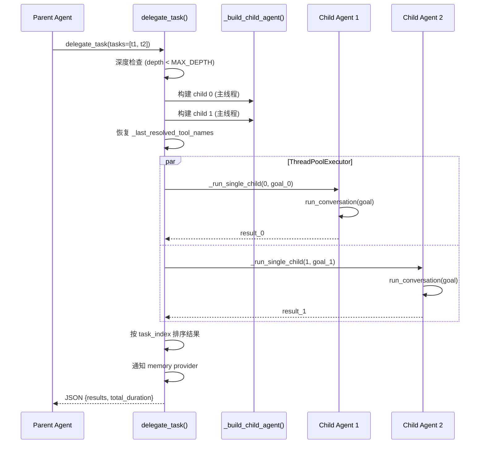
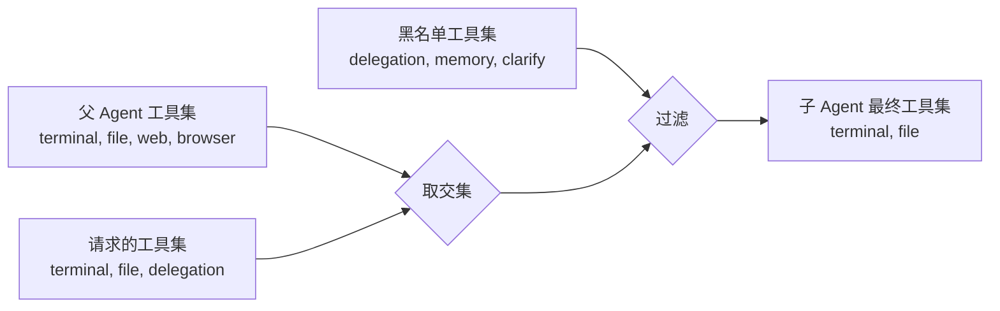
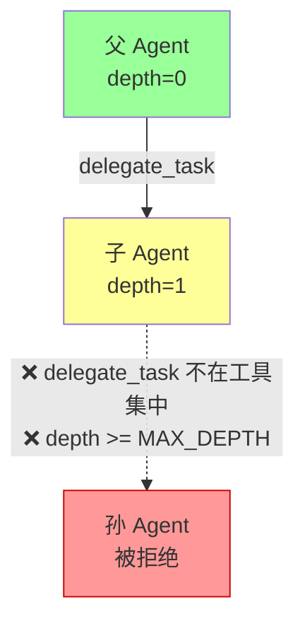
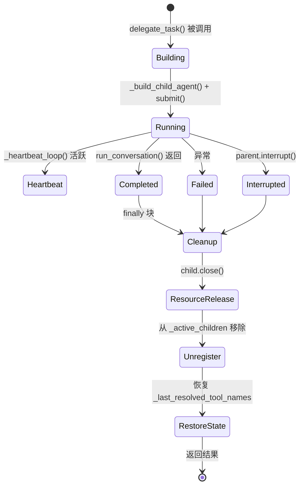

# 第 16 章 子智能体委托

> **核心文件**: `tools/delegate_tool.py`（1103 行，46KB）  
> **辅助文件**: `run_agent.py`、`agent/context_compressor.py`、`agent/memory_provider.py`、`model_tools.py`  
> **关键词**: delegate_task、沙箱隔离、迭代预算分配、并行/串行策略、MAX_DEPTH

## 16.1 为什么需要子智能体？

当你让 Hermes Agent 处理一个复杂任务——比如"重构这个项目的错误处理机制"——Agent 可能需要同时搜索多个目录、分析不同模块、生成多个文件。如果所有这些工作都在一个对话循环中串行完成，上下文窗口很快就会被中间步骤的细节淹没。

Hermes 的解决方案是 **子智能体委托**（`delegate_task`）：父 Agent 可以产生（spawn）一个或多个独立的子 Agent，每个子 Agent 拥有全新的上下文窗口、独立的迭代预算，并在完成后向父 Agent 返回一份精简的摘要。父 Agent 看不到子 Agent 的中间推理过程，只关心最终结果。

这种设计实现了五个核心目标：

| 目标 | 实现方式 |
|------|---------|
| **Context 隔离** | 子 Agent 拥有全新的 conversation history，不继承父 Agent 的对话 |
| **Toolset 限制** | 黑名单机制 + 父工具集交集约束，防止权限提升 |
| **批量并行** | `ThreadPoolExecutor` 支持多任务并发执行 |
| **递归防护** | `MAX_DEPTH = 2` 限制嵌套层级，三重防护机制 |
| **透明性** | 父 Agent 只看到 delegation call 和最终 summary |

## 16.2 架构全景

让我们先看看整个数据流的鸟瞰图：

```
Parent Agent
  ├─ 调用 delegate_task(goal=..., tasks=[...])
  ├─ _build_child_agent() × N  (主线程构建)
  ├─ ThreadPoolExecutor.submit(_run_single_child) × N
  │   ├─ child.run_conversation(goal)   ← 每个子 Agent 独立循环
  │   ├─ heartbeat_thread → parent._touch_activity()
  │   └─ return {status, summary, tool_trace, tokens, duration}
  ├─ results.sort(key=task_index)       ← 结果按输入顺序排列
  └─ return JSON {results: [...], total_duration_seconds: ...}
```

下面的时序图展示了一次典型的双任务并行委托：



整个系统由三个核心函数驱动：

- **`delegate_task()`**：主入口，负责参数验证、深度检查、构建子 Agent、提交到线程池、收集结果
- **`_build_child_agent()`**：构建一个完全隔离的 `AIAgent` 实例
- **`_run_single_child()`**：在工作线程中执行子 Agent 的对话循环，管理心跳和资源清理

## 16.3 Context 隔离——子 Agent 的沙箱

### 16.3.1 全新的运行环境

每个子 Agent 创建时获得一个精心隔离的环境：

```python
child = AIAgent(
    # 全新的 system prompt（不是父 Agent 的 prompt）
    ephemeral_system_prompt=child_prompt,
    # 不加载上下文文件
    skip_context_files=True,
    # 不加载 MEMORY.md
    skip_memory=True,
    # 无用户交互能力
    clarify_callback=None,
    # 静默模式——不输出到终端
    quiet_mode=True,
    # 独立的迭代预算
    iteration_budget=None,
)
```

注意 `skip_context_files=True` 和 `skip_memory=True`——子 Agent 不会继承父 Agent 的任何历史上下文。它拿到的只有一个聚焦的任务描述。

### 16.3.2 System Prompt 的构建

`_build_child_system_prompt()` 为子 Agent 生成一个简洁、聚焦的 prompt：

```python
def _build_child_system_prompt(goal, context=None, *, workspace_path=None):
    parts = [
        "You are a focused subagent working on a specific delegated task.",
        "",
        f"YOUR TASK:\n{goal}",
    ]
    if context:
        parts.append(f"\nCONTEXT:\n{context}")
    if workspace_path:
        parts.append(f"\nWORKSPACE PATH:\n{workspace_path}\n...")
    parts.append(
        "\nComplete this task... When finished, provide a clear, concise summary..."
    )
    return "\n".join(parts)
```

其中 `workspace_path` 的来源值得关注——`_resolve_workspace_hint()` 会从多个候选来源中解析：

```python
candidates = [
    os.getenv("TERMINAL_CWD"),
    parent_agent._subdirectory_hints.working_dir,
    parent_agent.terminal_cwd,
    parent_agent.cwd,
]
# 只注入绝对路径且目录存在的候选
```

这样做是为了避免子 Agent 猜测 `/workspace/...` 这类容器路径，确保它知道在真实的文件系统中该去哪里工作。

### 16.3.3 信息隔离的保证

父 Agent 的上下文窗口中只会看到：
- **发送**：delegation call 的 tool_call 消息
- **接收**：JSON 结果（summary + metadata）

**永远不会看到**的内容：
- 子 Agent 的中间 tool calls
- 子 Agent 的 reasoning / thinking
- 子 Agent 的完整 conversation history

这种隔离通过 `context_compressor.py` 进一步强化。当压缩上下文时，delegate_task 的结果会被极度摘要化：

```python
# agent/context_compressor.py
if tool_name == "delegate_task":
    goal = args.get("goal", "")[:57]
    return f"[delegate_task] '{goal}' ({content_len:,} chars result)"
```

一个可能包含数千字符的详细结果，在压缩后变成了一行摘要。

## 16.4 Toolset 限制——安全边界

### 16.4.1 全局黑名单

Hermes 定义了一组子 Agent **绝对不能使用**的工具：

```python
DELEGATE_BLOCKED_TOOLS = frozenset([
    "delegate_task",   # 防止递归委托
    "clarify",         # 子 Agent 不能与用户交互
    "memory",          # 不能写入共享 MEMORY.md
    "send_message",    # 不能触发跨平台副作用
    "execute_code",    # 子 Agent 应逐步推理，不应写脚本
])
```

这个黑名单的每一项都有充分的理由。`delegate_task` 防止递归；`clarify` 阻止子 Agent 弹出交互对话框打断用户；`memory` 防止多个并发子 Agent 竞争写入共享的 MEMORY.md 文件。

### 16.4.2 Toolset 级别的过滤

除了单个工具的黑名单，整个 toolset 也会被过滤：

```python
_EXCLUDED_TOOLSET_NAMES = frozenset({
    "debugging", "safe", "delegation", "moa", "rl"
})

def _strip_blocked_tools(toolsets):
    blocked_toolset_names = {
        "delegation", "clarify", "memory", "code_execution",
    }
    return [t for t in toolsets if t not in blocked_toolset_names]
```

### 16.4.3 父工具集交集约束

这是一个关键的安全原则：**子 Agent 不能获得父 Agent 没有的工具**。

```python
if toolsets:
    # 与父 Agent 的 toolset 取交集
    child_toolsets = _strip_blocked_tools(
        [t for t in toolsets if t in parent_toolsets]
    )
elif parent_enabled is not None:
    child_toolsets = _strip_blocked_tools(parent_enabled)
else:
    child_toolsets = _strip_blocked_tools(sorted(parent_toolsets))
```

整个过滤过程可以用下图表示：



如果模型请求了一个父 Agent 没有的工具集，交集操作会静默地把它移除。如果模型请求了一个被屏蔽的工具集（如 `delegation`），过滤操作会把它移除。双重过滤确保子 Agent 的能力永远不会超过父 Agent。

## 16.5 并行与串行——执行策略

### 16.5.1 两种模式

`delegate_task` 支持两种调用模式：

| 模式 | 输入参数 | 执行方式 |
|------|---------|---------|
| **单任务** | `goal` + optional `context`, `toolsets` | 直接调用，无线程池开销 |
| **批量** | `tasks` 数组 `[{goal, context, toolsets}, ...]` | `ThreadPoolExecutor` 并行 |

```python
# 单任务 — 直接执行，无线程池
if n_tasks == 1:
    result = _run_single_child(0, task["goal"], child, parent_agent)

# 批量 — ThreadPoolExecutor 并行
else:
    with ThreadPoolExecutor(max_workers=max_children) as executor:
        futures = {}
        for i, t, child in children:
            future = executor.submit(_run_single_child, ...)
            futures[future] = i

        for future in as_completed(futures):
            entry = future.result()
            results.append(entry)
```

单任务模式跳过了线程池的创建开销——这是一个务实的优化。当只有一个子 Agent 时，线程池带来的只有额外的复杂性。

### 16.5.2 并发控制

```python
_DEFAULT_MAX_CONCURRENT_CHILDREN = 3
MAX_DEPTH = 2  # parent(0) -> child(1) -> grandchild rejected(2)

def _get_max_concurrent_children():
    # 优先级: config.yaml > 环境变量 > 默认值(3)
    cfg = _load_config()
    val = cfg.get("max_concurrent_children")
    ...
```

### 16.5.3 双层防护

Hermes 在两个层面防止过多的委托调用。

**内部防护**——在 `delegate_task()` 函数入口检查 tasks 数量：

```python
if len(tasks) > max_children:
    return tool_error(f"Too many tasks: {len(tasks)} provided...")
```

**外部防护**——在 `run_agent.py` 中截断模型一次 turn 中发出的多个独立 `delegate_task` 调用：

```python
@staticmethod
def _cap_delegate_task_calls(tool_calls):
    """模型可能在一次 turn 中发出多个独立的 delegate_task 调用。
    截断超出的部分，保留所有非 delegate 调用。"""
    delegate_count = sum(1 for tc in tool_calls
                         if tc.function.name == "delegate_task")
    if delegate_count <= max_children:
        return tool_calls
    # 截断超出的 delegate_task 调用
```

为什么需要外部防护？因为模型可能绕过 `tasks` 数组的限制，直接发出 5 个独立的 `delegate_task` 调用，每个都只有一个任务。外部防护捕获的正是这种情况。

### 16.5.4 进度显示

子 Agent 的工具调用通过 callback 链实时中继到父 Agent 的显示：

```python
def _build_child_progress_callback(task_index, parent_agent, task_count=1):
    prefix = f"[{task_index + 1}] " if task_count > 1 else ""

    def _callback(event_type, tool_name=None, preview=None, **kwargs):
        if spinner:
            line = f" {prefix}├─ {emoji} {tool_name}"
            spinner.print_above(line)
        if parent_cb:
            _batch.append(tool_name)
            if len(_batch) >= 5:
                parent_cb("subagent_progress", f"🔀 {prefix}{summary}")
                _batch.clear()
```

CLI 的实时效果如下：

```
(◕‿◕) 🔀 2 tasks remaining
 [1] ├─ 🔍 search_files  "error handler"
 [1] ├─ 📄 read_file  "src/main.py"
 [2] ├─ 🌐 web_search  "Python async patterns"
 ✓ [1/2] Fix error handling  (12.3s)
 [2] ├─ 📝 write_file  "notes.md"
 ✓ [2/2] Research async patterns  (8.7s)
```

## 16.6 递归防护——三重保险

子 Agent 可以再产生子 Agent 吗？Hermes 的回答是：**绝对不行**，并且用三重防护来确保这一点。



| 层级 | 防护机制 | 说明 |
|------|---------|------|
| **第一层：工具黑名单** | `"delegate_task"` 在 `DELEGATE_BLOCKED_TOOLS` 中 | 子 Agent 根本看不到这个工具 |
| **第二层：Toolset 过滤** | `"delegation"` 在 `_strip_blocked_tools` 排除列表中 | 即使显式请求也会被过滤 |
| **第三层：深度检查** | `depth >= MAX_DEPTH` 返回错误 | 最终的安全网 |

```python
MAX_DEPTH = 2  # parent(0) → child(1) → grandchild rejected(2)

# delegate_task() 入口检查
depth = getattr(parent_agent, '_delegate_depth', 0)
if depth >= MAX_DEPTH:
    return json.dumps({
        "error": f"Delegation depth limit reached ({MAX_DEPTH}). "
                 "Subagents cannot spawn further subagents."
    })

# _build_child_agent() 中递增深度
child._delegate_depth = getattr(parent_agent, '_delegate_depth', 0) + 1
```

实际上第一层的工具黑名单就已经让子 Agent 无法调用 `delegate_task`——子 Agent 的工具定义列表里根本没有这个工具。深度检查是额外的安全网，体现了 **Defense in Depth**（纵深防御）的设计理念。

## 16.7 子 Agent 的生命周期

### 16.7.1 状态机



### 16.7.2 心跳机制

子 Agent 可能运行很长时间。如果父 Agent 在此期间没有任何活动，gateway 的不活动超时机制可能会误杀父 Agent。心跳机制解决了这个问题：

```python
_HEARTBEAT_INTERVAL = 30  # 秒

def _heartbeat_loop():
    """定期将子 Agent 活动传播到父 Agent，
    防止 gateway 的不活动超时机制误杀父 Agent。"""
    while not _heartbeat_stop.wait(_HEARTBEAT_INTERVAL):
        child_summary = child.get_activity_summary()
        desc = f"delegate_task: subagent running {child_tool} (iteration {child_iter}/{child_max})"
        parent_agent._touch_activity(desc)
```

每 30 秒，心跳线程告诉父 Agent："嘿，我还在忙，子 Agent 正在执行第 N 轮迭代。" 父 Agent 据此更新自己的活动时间戳。

### 16.7.3 中断传播

当父 Agent 被中断时，中断信号必须传播到所有运行中的子 Agent：

```python
# run_agent.py AIAgent.interrupt()
def interrupt(self, message=None):
    self._interrupt_requested = True
    _set_interrupt(True, self._execution_thread_id)
    # 传播到所有运行中的子 Agent
    with self._active_children_lock:
        children_copy = list(self._active_children)
    for child in children_copy:
        child.interrupt(message)  # 递归传播
```

子 Agent 通过一个线程安全的列表进行注册和注销：

```python
# _build_child_agent() — 注册
with parent_agent._active_children_lock:
    parent_agent._active_children.append(child)

# _run_single_child() finally — 注销
parent_agent._active_children.remove(child)
```

### 16.7.4 资源清理

`_run_single_child()` 的 `finally` 块执行完整的资源清理，确保无论子 Agent 是正常完成、出错还是被中断，资源都能被释放：

1. **停止心跳线程**: `_heartbeat_stop.set()`
2. **释放凭证租约**: `child_pool.release_lease(leased_cred_id)`
3. **恢复全局工具名**: `model_tools._last_resolved_tool_names = saved`
4. **从中断追踪中移除**: `parent_agent._active_children.remove(child)`
5. **关闭子 Agent 资源**: `child.close()` — 终端沙箱、浏览器守护进程、后台进程、httpx 客户端

## 16.8 全局状态保存与恢复

### 16.8.1 `_last_resolved_tool_names` 问题

`model_tools._last_resolved_tool_names` 是一个进程级全局变量，记录最后解析的工具名列表。当 `AIAgent()` 的构造函数调用 `get_tool_definitions()` 时会覆盖此全局变量。

这产生了一个微妙的 bug：当父 Agent 构建子 Agent 时，子 Agent 的工具集（通常更小）会覆盖此全局变量，导致父 Agent 后续操作看到错误的工具列表。

### 16.8.2 Save-Restore 协议

解决方案是一个经典的 Save-Restore 模式：

```python
# delegate_task() 中 — 构建前保存
_parent_tool_names = list(_model_tools._last_resolved_tool_names)

try:
    for i, t in enumerate(task_list):
        child = _build_child_agent(...)
        # 每个 child 记住父 Agent 的工具名
        child._delegate_saved_tool_names = _parent_tool_names
finally:
    # 权威恢复：即使构建失败也恢复
    _model_tools._last_resolved_tool_names = _parent_tool_names
```

在子 Agent 执行完成后也会恢复：

```python
# _run_single_child() finally 块
finally:
    saved_tool_names = getattr(child, "_delegate_saved_tool_names", None)
    if isinstance(saved_tool_names, list):
        model_tools._last_resolved_tool_names = list(saved_tool_names)
```

这是一个处理全局可变状态（Global Mutable State）在并发环境下的典型模式。虽然不够优雅，但它务实地解决了实际问题。

## 16.9 迭代预算分配

### 16.9.1 独立预算

每个子 Agent 获得独立的 `IterationBudget`，而不是和父 Agent 共享：

```python
child = AIAgent(
    max_iterations=effective_max_iter,  # delegation.max_iterations (默认: 50)
    iteration_budget=None,              # 创建全新的 budget
)
```

这意味着父 Agent + N 个子 Agent 的**总迭代次数可以超过父 Agent 的 `max_iterations`**。例如，一个 `max_iterations=100` 的父 Agent 产生 3 个子 Agent，每个子 Agent 各有 50 次迭代预算，总体最多可以执行 100 + 3 × 50 = 250 次迭代。

### 16.9.2 历史演变

这个设计经历了一次重要的演化：

- **v0.2.0**: 共享迭代预算（父 + 子共用），子 Agent 的迭代消耗父 Agent 的预算
- **v0.5.0**: 修复为独立预算（[#3004](https://github.com/hermes/issues/3004)），避免子 Agent 过早耗尽父 Agent 的预算

共享预算的问题很明显：如果父 Agent 剩余 20 次迭代，委托给子 Agent 后，子 Agent 可能很快把预算花光，导致父 Agent 连收集结果都做不了。

## 16.10 凭证管理与 ACP

### 16.10.1 凭证解析优先级

子 Agent 的模型凭证按以下优先级解析：

```python
# _resolve_delegation_credentials()
# 1. delegation.base_url (直接 OpenAI 兼容端点)
# 2. delegation.provider (通过 runtime provider 系统解析完整凭证)
# 3. 无配置 → 从父 Agent 继承
```

### 16.10.2 凭证池共享

```python
def _resolve_child_credential_pool(effective_provider, parent_agent):
    """
    规则:
    1. 与父 Agent 相同 provider → 共享父 Agent 的 pool（同步 cooldown）
    2. 不同 provider → 加载该 provider 自己的 pool
    3. 无 pool → 使用固定凭证
    """
```

共享凭证池的好处是：当某个 API key 触发了速率限制（cooldown），父 Agent 和子 Agent 都能感知到，不会反复重试同一个已经被限制的凭证。

### 16.10.3 ACP 子进程传输

ACP（Agent Communication Protocol）允许子 Agent 使用完全不同的 agent 运行时。例如，Hermes 父 Agent 可以产生一个 Claude Code 子 Agent：

```python
delegate_task(
    goal="Review this PR",
    acp_command="claude",
    acp_args=["--acp", "--stdio", "--model", "claude-opus-4-6"]
)
```

每个 task 也支持独立的 ACP 覆盖，使得混合 agent 运行时成为可能。

## 16.11 结果结构

### 16.11.1 单条结果

```json
{
    "task_index": 0,
    "status": "completed",
    "summary": "子 Agent 的最终文本响应",
    "api_calls": 12,
    "duration_seconds": 15.3,
    "model": "anthropic/claude-opus-4-20250514",
    "exit_reason": "completed",
    "tokens": {"input": 45000, "output": 3200},
    "tool_trace": [
        {"tool": "search_files", "args_bytes": 42, "result_bytes": 1500, "status": "ok"},
        {"tool": "read_file", "args_bytes": 35, "result_bytes": 8000, "status": "ok"}
    ]
}
```

`tool_trace` 是一个精妙的设计——它让父 Agent 知道子 Agent**做了什么**，但不暴露具体的文件内容或搜索结果。这对于调试和审计非常有价值。

### 16.11.2 Memory Provider 通知

委托完成后，会通知父 Agent 的 memory provider：

```python
for entry in results:
    parent_agent._memory_manager.on_delegation(
        task=task_goal,
        result=entry.get("summary", ""),
        child_session_id=child.session_id,
    )
```

这使得 MEMORY.md 可以记录委托历史，为后续会话提供参考。

## 16.12 线程安全

并行委托引入了多线程，Hermes 通过以下机制保证线程安全：

| 资源 | 同步机制 | 说明 |
|------|---------|------|
| `_active_children` | `threading.Lock` | 保护子 Agent 注册/注销 |
| `IterationBudget` | 内部 `threading.Lock` | 保护预算计数器 |
| `_last_resolved_tool_names` | Save-Restore + try/finally | 保护全局工具名列表 |
| 子 Agent 构建 | **仅在主线程** | 避免 `AIAgent()` 构造函数的并发问题 |
| `_SafeWriter` | 包装 stdout/stderr | 防止 I/O 异常 |

`_SafeWriter` 值得特别说明：当子 Agent 在 `ThreadPoolExecutor` 线程中运行时，共享的 stdout 句柄可能在线程拆除和清理之间关闭，抛出 `ValueError: I/O operation on closed file`。`_SafeWriter` 包装 stdout/stderr，静默捕获此异常，避免无害的 I/O 错误成为致命错误。

注意一个关键的设计决策：**子 Agent 在主线程中构建，只在工作线程中执行**。这避免了 `AIAgent()` 构造函数中各种初始化逻辑（工具注册、凭证加载等）的并发问题。

## 16.13 配置体系

### 16.13.1 config.yaml 中的 delegation 块

```yaml
delegation:
  model: "anthropic/claude-sonnet-4-20250514"    # 子 Agent 可用更便宜的模型
  provider: "openrouter"
  max_iterations: 50                              # 每个子 Agent 的迭代上限
  max_concurrent_children: 3                      # 最大并发子 Agent 数
  reasoning_effort: "low"                         # 子 Agent 的 reasoning 级别
  default_toolsets: ["terminal", "file", "web"]   # 默认工具集
  base_url: ""                                    # 直接端点覆盖
  api_key: ""                                     # 端点 API key
```

这个配置块让用户可以为子 Agent 使用更便宜的模型（比如 Sonnet 而不是 Opus），降低委托的成本。`reasoning_effort: "low"` 也有助于减少 token 消耗。

### 16.13.2 Schema 设计

工具的 Schema 有几个值得注意的设计：

- **互斥参数**: `goal`（单任务）或 `tasks`（批量），通过运行时验证而非 Schema 约束
- **无 `maxItems`**: tasks 数组不在 Schema 中限制上限，通过运行时配置动态控制
- **详细的使用指南**: Schema 的 description 字段包含何时使用、何时不使用的建议

## 16.14 设计模式总结

Hermes 的子智能体委托系统综合运用了多种设计模式：

| 模式 | 应用 |
|------|------|
| **Fork-Join** | 父 Agent fork 多个子 Agent，join 等待所有完成 |
| **Save-Restore** | `_last_resolved_tool_names` 全局状态保存/恢复 |
| **Observer** | Memory provider 的 `on_delegation()` 回调 |
| **Builder** | `_build_child_agent()` 分步构建子 Agent |
| **Heartbeat** | 定期 touch 父 Agent 防止超时 |
| **Capability Intersection** | 子 Agent 工具集 ⊆ 父 Agent 工具集 |
| **Defense in Depth** | MAX_DEPTH + 黑名单 + toolset 过滤三重递归防护 |
| **Credential Pool Sharing** | 同 provider 共享池，不同 provider 独立池 |

## 16.15 本章小结

本章深入分析了 Hermes Agent 的子智能体委托系统。核心要点：

1. **Context 隔离是基石**：子 Agent 拥有全新的对话历史、独立的 system prompt 和独立的迭代预算，不会污染父 Agent 的上下文窗口。

2. **安全性通过多重防护实现**：工具黑名单、toolset 过滤、父工具集交集约束、递归深度限制——每一层都是独立的安全网。

3. **并行执行有严格的边界**：`ThreadPoolExecutor` 提供并发能力，但通过 `max_concurrent_children` 和双层防护限制并发度，防止资源爆炸。

4. **生命周期管理面面俱到**：心跳机制防止超时误杀，中断传播确保优雅停止，`finally` 块保证资源释放。

5. **全局状态管理是现实的妥协**：`_last_resolved_tool_names` 的 Save-Restore 模式不够优雅，但它务实地解决了进程级全局变量在并发环境下的问题。

6. **独立预算是经验教训**：从 v0.2.0 的共享预算到 v0.5.0 的独立预算，这个演变说明了子 Agent 预算隔离的重要性。

子智能体委托是 Hermes 实现"分而治之"的核心机制。通过精心的隔离设计，它让 Agent 能够将复杂任务分解为独立的子任务，在保持安全边界的同时实现并行执行，最终只向父 Agent 返回精炼的结果。
