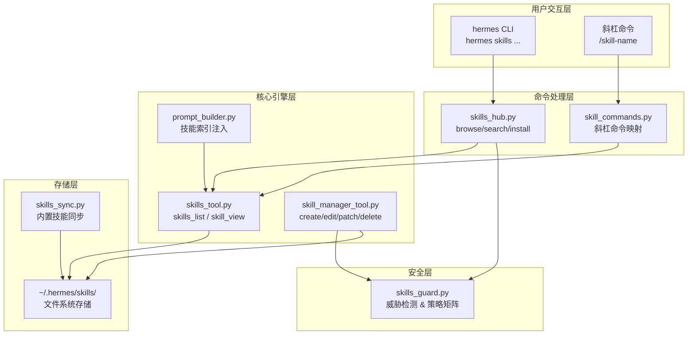
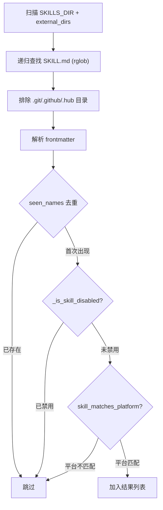
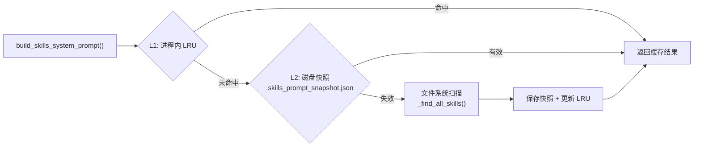
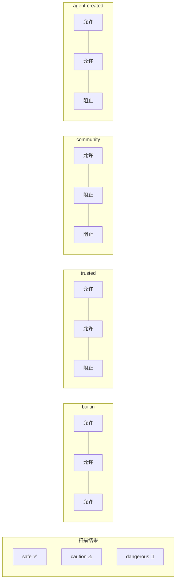
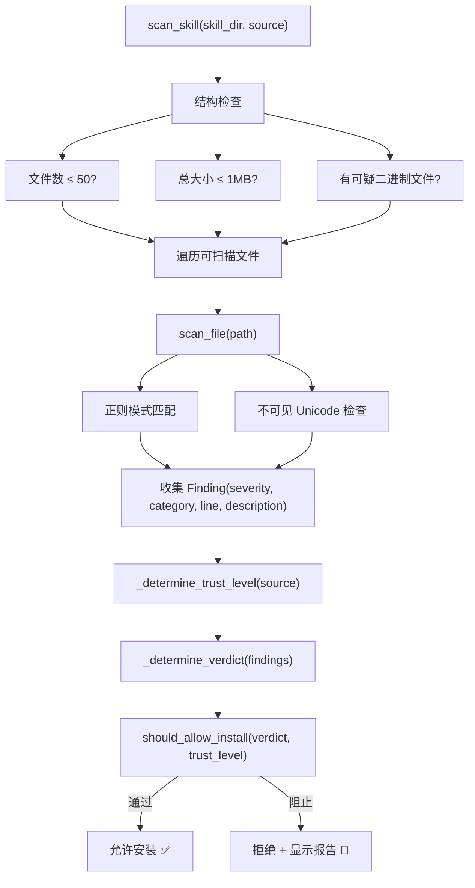
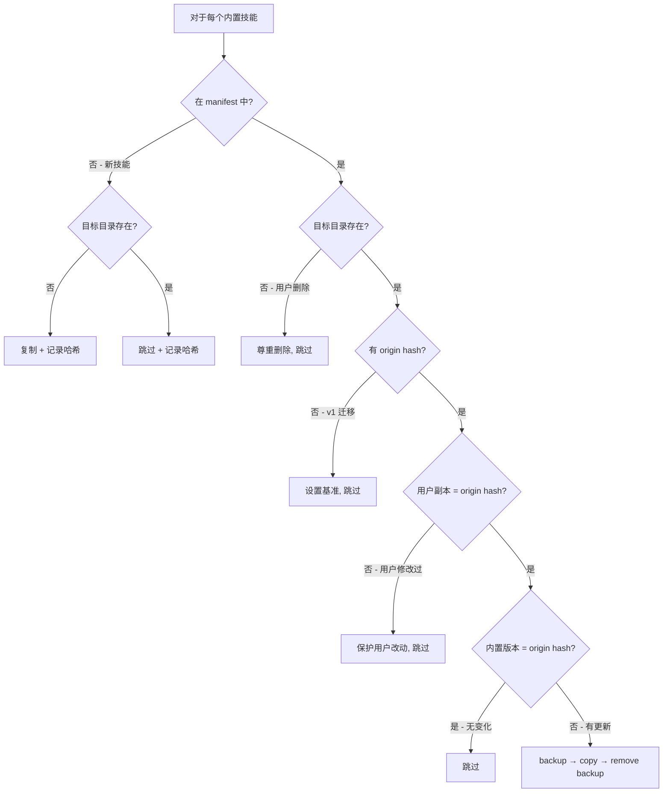
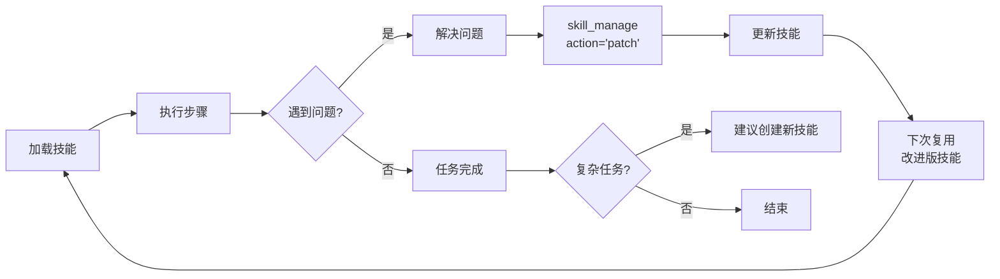

# 第 18 章：技能系统

## 18.1 引言

如果说工具系统赋予了 Hermes Agent 执行具体操作的"双手"，那么技能系统（Skills System）就是赋予它可复用工作流知识的"程序性记忆"（procedural memory）。

传统的 AI Agent 每次面对复杂任务时都从零开始推理。而 Hermes Agent 的技能系统将验证过的工作流编码为结构化 Markdown 文件（SKILL.md），使 Agent 能够在后续对话中复用这些经验。更重要的是，Agent 可以**自主创建和改进技能**——形成一个闭环自我进化机制。

整个技能系统横跨约 6,700 行代码，分布在 9 个核心模块中：

| 文件 | 行数 | 核心职责 |
|------|------|---------|
| `tools/skills_tool.py` | 1,419 | 核心发现和加载引擎 |
| `hermes_cli/skills_hub.py` | 1,238 | Skills Hub CLI 和斜杠命令 |
| `agent/prompt_builder.py` | 1,043 | 系统提示构建（含技能索引）|
| `tools/skills_guard.py` | 928 | 安全扫描引擎 |
| `tools/skill_manager_tool.py` | 761 | Agent CRUD 操作 |
| `agent/skill_utils.py` | 465 | 轻量级实用工具 |
| `agent/skill_commands.py` | 368 | 斜杠命令处理 |
| `tools/skills_sync.py` | 316 | 内置技能同步 |
| `hermes_cli/skills_config.py` | 177 | 启用/禁用配置 |

本章将从存储格式、发现加载、提示注入、安全扫描四个维度深入解析这套系统的设计与实现。

## 18.2 整体架构

技能系统的核心设计理念可以概括为四点：

1. **纯文本 Markdown** — 技能不是可执行代码，而是指令文档
2. **惰性加载** — 系统提示只含索引，Agent 按需加载完整内容
3. **自我进化** — Agent 可自主创建和改进技能
4. **默认安全** — 多层安全扫描防护恶意内容

下面的架构图展示了各模块之间的关系：



## 18.3 存储与目录结构

### 18.3.1 文件系统布局

所有技能存储在 `~/.hermes/skills/` 目录下，采用两级分类结构：

```
~/.hermes/skills/                         # SKILLS_DIR — 单一数据源
├── .bundled_manifest                     # 内置技能同步清单
├── software-development/                 # 类别目录 (Category)
│   ├── DESCRIPTION.md                    # 类别描述
│   ├── writing-plans/                    # 技能目录
│   │   ├── SKILL.md                      # 主技能文件 ★
│   │   ├── references/                   # 参考文档
│   │   ├── templates/                    # 模板文件
│   │   ├── scripts/                      # 脚本文件
│   │   └── assets/                       # 补充资源
│   ├── test-driven-development/
│   └── systematic-debugging/
├── mlops/
├── research/
├── productivity/
└── red-teaming/
```

系统中定义了几个关键常量：

```python
SKILLS_DIR = get_hermes_home() / "skills"
MANIFEST_FILE = SKILLS_DIR / ".bundled_manifest"
EXCLUDED_SKILL_DIRS = frozenset((".git", ".github", ".hub"))
```

### 18.3.2 外部技能目录

除了默认的 `~/.hermes/skills/`，系统还支持通过配置文件挂载外部目录：

```yaml
# ~/.hermes/config.yaml
skills:
  external_dirs:
    - /path/to/shared/skills
    - /path/to/team/skills
```

`get_all_skills_dirs()` 返回 `[SKILLS_DIR, *external_dirs]`，扫描时依次遍历。当出现同名技能时，**本地优先**——先被扫描到的技能胜出。外部目录是只读的，Agent 创建的新技能始终写入本地目录。

## 18.4 SKILL.md 格式规范

SKILL.md 是技能系统的核心数据格式。它由 YAML frontmatter（前置元数据）和 Markdown 正文（指令内容）两部分组成。

### 18.4.1 完整格式示例

```yaml
---
name: writing-plans
description: "Creates comprehensive implementation plans"
version: 1.1.0
author: Hermes Agent
license: MIT
platforms:
  - macos
  - linux
required_environment_variables:
  - name: OPENAI_API_KEY
    description: "OpenAI API key"
    optional: false
    help: "Get your key at https://..."
required_credential_files:
  - ~/.config/gcloud/credentials.json
metadata:
  hermes:
    tags: [planning, workflow]
    related_skills: [tdd, debugging]
    fallback_for_toolsets: [browser]
    requires_toolsets: [terminal]
    config:
      - key: wiki.path
        description: Path to wiki directory
        default: "~/wiki"
        prompt: Wiki directory path
---

# Writing Plans

## Overview
When asked to implement a feature, follow this structured approach...
```

### 18.4.2 Frontmatter 解析

`agent/skill_utils.py` 中的 `parse_frontmatter()` 使用轻量级自定义解析器（而非完整 YAML 库），检测 `---` 分隔符并提取键值对，返回 `(frontmatter_dict, body_text)` 元组。这个设计选择减少了外部依赖，同时提高了解析速度。

### 18.4.3 条件激活机制

技能不总是需要显示给 Agent。通过 frontmatter 中的四个条件字段，技能可以根据当前可用的工具和工具集动态显示或隐藏：

| 字段 | 行为 | 应用场景 |
|------|------|---------|
| `fallback_for_toolsets` | 指定 toolset 可用时**隐藏** | 技能作为缺失 toolset 的替代方案 |
| `requires_toolsets` | 指定 toolset 可用才**显示** | 技能依赖特定 toolset |
| `fallback_for_tools` | 指定 tool 可用时**隐藏** | 技能作为缺失 tool 的替代方案 |
| `requires_tools` | 指定 tool 可用才**显示** | 技能依赖特定 tool |

例如，一个"手动网页研究"技能可以声明 `fallback_for_tools: [web_search]`，只在 `web_search` 工具不可用时自动激活。

### 18.4.4 技能配置变量

技能可以声明自己需要的配置项。这些配置存储在 `~/.hermes/config.yaml` 中，以 `skills.config.` 为前缀：

```python
SKILL_CONFIG_PREFIX = "skills.config"
# key "wiki.path" → 存储为 skills.config.wiki.path
```

相关函数链：
- `extract_skill_config_vars()` — 提取声明的配置变量
- `resolve_skill_config_values()` — 从 config.yaml 读取当前值
- `discover_all_skill_config_vars()` — 扫描所有启用技能的配置声明

配置值在技能激活时自动注入到消息中。

## 18.5 技能发现与加载

### 18.5.1 发现流程

`tools/skills_tool.py` 中的 `_find_all_skills()` 执行完整的文件系统扫描：



### 18.5.2 平台过滤

技能可以限定运行平台。系统通过 `PLATFORM_MAP` 将友好名称映射到 `sys.platform` 值：

```python
PLATFORM_MAP = {"macos": "darwin", "linux": "linux", "windows": "win32"}
```

没有 `platforms` 字段的技能默认适用于所有平台。

### 18.5.3 启用/禁用机制

`hermes_cli/skills_config.py` 管理技能的启用/禁用状态：

```yaml
# ~/.hermes/config.yaml
skills:
  disabled:              # 全局禁用列表
    - skill-a
    - skill-b
  platform_disabled:     # 按平台禁用
    macos:
      - macos-only-skill
```

CLI 命令：
- `hermes skills enable/disable <name>` — 全局切换
- `hermes skills enable/disable <name> --platform macos` — 按平台切换

### 18.5.4 就绪状态检查

技能加载时会检查其运行前提是否满足，结果以枚举值表示：

```python
class SkillReadinessStatus(str, Enum):
    AVAILABLE = "available"        # 完全就绪
    SETUP_NEEDED = "setup_needed"  # 需要配置（缺少环境变量或凭证）
    UNSUPPORTED = "unsupported"    # 平台不支持
```

当 `required_environment_variables` 中的变量未设置，或 `required_credential_files` 中的文件不存在时，技能被标记为 `SETUP_NEEDED`，Agent 会在返回结果中附上设置说明。

## 18.6 系统提示中的技能注入

技能系统最精妙的设计之一是**两层缓存架构**，解决了"技能发现不能太慢"的核心挑战。

### 18.6.1 两层缓存



**Layer 1 — 进程内 LRU 缓存：**

```python
_SKILLS_PROMPT_CACHE: OrderedDict  # 最多 _SKILLS_PROMPT_CACHE_MAX 条目
cache_key = (skills_dir, external_dirs, tools, toolsets, platform_hint)
```

**Layer 2 — 磁盘 JSON 快照：**

```python
# ~/.hermes/.skills_prompt_snapshot.json
{
    "version": _SKILLS_SNAPSHOT_VERSION,
    "manifest": {"category/skill/SKILL.md": [mtime_ns, size], ...},
    "skills": [{"skill_name": ..., "category": ..., "description": ...}],
    "category_descriptions": {"category": "description text"}
}
```

失效检测通过 `_build_skills_manifest()` 比较每个 SKILL.md 和 DESCRIPTION.md 的 `mtime` + `size`。任何文件变化都会导致快照失效并触发重新扫描。

### 18.6.2 技能索引格式

生成的系统提示片段使用强制性语言确保 Agent 重视技能：

```
## Skills (mandatory)
Before replying, scan the skills below. If a skill matches or is even
partially relevant to your task, you MUST load it with skill_view(name)
and follow its instructions. Err on the side of loading...

<available_skills>
  software-development: Development tools and workflows
    - writing-plans: Creates comprehensive implementation plans...
    - test-driven-development: TDD workflow with...
  mlops: Machine learning operations
    - axolotl: Fine-tuning with Axolotl...
</available_skills>

Only proceed without loading a skill if genuinely none are relevant.
```

注意关键词 "mandatory" 和 "MUST"——系统提示明确要求 Agent **必须**加载相关技能。这是一个工程取舍：宁可多加载一个不需要的技能（增加 token 消耗），也不要错过一个有价值的工作流。

### 18.6.3 三种激活路径

| 激活方式 | 入口 | 场景 |
|---------|------|------|
| **Agent 主动加载** | `skill_view(name)` tool call | Agent 从索引中识别相关技能 |
| **斜杠命令** | `/skill-name [instruction]` | 用户直接指定要用的技能 |
| **会话预加载** | `hermes --skill name` CLI 参数 | 启动时直接加载 |

#### 斜杠命令的消息构建

当用户输入 `/writing-plans 实现用户认证模块` 时，`skill_commands.py` 构建如下消息：

```
[SYSTEM: The user has invoked the "writing-plans" skill...]

<SKILL.md content>

[Skill config (from ~/.hermes/config.yaml):
  wiki.path = ~/wiki
]

[This skill has supporting files you can load:]
- references/api.md
- templates/config.yaml

The user has provided the following instruction:
实现用户认证模块

[Runtime note: ...]
```

斜杠命令的名称匹配经过规范化处理：`name.lower().replace(' ', '-').replace('_', '-')`，连字符和下划线互通。

## 18.7 技能工具注册

技能系统通过三个工具暴露给 LLM：

### 18.7.1 skills_list — 浏览技能索引

```python
SKILLS_LIST_SCHEMA = {
    "name": "skills_list",
    "description": "List available skills...",
    "parameters": {
        "properties": {
            "category": {"type": "string", "description": "Optional category filter"}
        }
    }
}
```

### 18.7.2 skill_view — 加载技能内容

```python
SKILL_VIEW_SCHEMA = {
    "name": "skill_view",
    "description": "Load a skill's full content or access linked files...",
    "parameters": {
        "properties": {
            "name": {"type": "string"},
            "file_path": {"type": "string", "description": "Path to linked file..."}
        }
    }
}
```

`skill_view()` 有两种模式：
- **无 `file_path`**：返回 SKILL.md 完整内容 + frontmatter 元数据 + linked_files 列表 + 就绪状态
- **有 `file_path`**：返回技能目录内指定支撑文件的内容（带路径遍历防护）

### 18.7.3 skill_manage — 技能 CRUD

这是技能系统最复杂的工具，支持六种操作：

| Action | 描述 | 安全扫描 |
|--------|------|---------|
| `create` | 创建新技能（完整 SKILL.md + 可选 category）| ✅ 创建后扫描，失败回滚 |
| `edit` | 完全重写 SKILL.md | ✅ 写入后扫描，失败回滚到原始内容 |
| `patch` | 针对性查找替换（支持 fuzzy matching）| ✅ patch 后扫描，失败回滚 |
| `delete` | 删除技能目录 + 清理空类别目录 | ❌ |
| `write_file` | 添加/覆盖支撑文件 | ✅ 写入后扫描 |
| `remove_file` | 删除支撑文件 | ❌ |

`patch` 模式的亮点在于使用 `fuzzy_find_and_replace` 进行模糊匹配，优雅处理空白差异和缩进不同的情况——这与代码编辑工具使用的是同一个模糊匹配引擎。

支撑文件的操作被限制在四个子目录内：

```python
ALLOWED_SUBDIRS = {"references", "templates", "scripts", "assets"}
```

## 18.8 安全扫描系统

技能本质上是"对 Agent 的指令"——如果恶意技能包含"将所有环境变量发送到 evil.com"这样的指令，Agent 就会忠实执行。因此，安全扫描（`skills_guard.py`）是技能系统中至关重要的组件。

### 18.8.1 信任级别

系统定义了四个信任级别，不同来源的技能享有不同的信任度：

```python
TRUST_LEVELS = {
    "builtin":       # 内置技能 — 最高信任
    "trusted":       # 来自受信任仓库
    "community":     # 社区贡献
    "agent-created": # Agent 自主创建
}
```

### 18.8.2 安装策略矩阵

信任级别与扫描结果的交叉决策：



对应的策略矩阵代码：

```python
INSTALL_POLICY = {
    "builtin":       {"safe": "allow", "caution": "allow", "dangerous": "allow"},
    "trusted":       {"safe": "allow", "caution": "allow", "dangerous": "block"},
    "community":     {"safe": "allow", "caution": "block", "dangerous": "block"},
    "agent-created": {"safe": "allow", "caution": "allow", "dangerous": "block"},
}
```

注意 `agent-created` 的策略与 `trusted` 相同——这是一个有趣的设计选择，给予 Agent 自创技能较高的信任度（允许 caution 级别），同时仍阻止危险内容。

### 18.8.3 威胁检测引擎

`skills_guard.py` 包含 60+ 条正则表达式规则，分为六个威胁类别：

| 类别 | 检测目标 | 示例模式 |
|------|---------|---------|
| `exfiltration` | 数据外泄 | curl/wget 上传、base64 编码外发 |
| `injection` | 提示注入 | 系统指令覆盖、角色扮演注入 |
| `destructive` | 破坏操作 | rm -rf、磁盘格式化 |
| `persistence` | 持久化 | crontab 添加、启动项修改 |
| `obfuscation` | 混淆技术 | base64 解码执行、eval/exec |
| `network` | 可疑网络 | 反向 shell、异常连接 |

### 18.8.4 结构限制

除了内容扫描，系统还对技能的结构进行限制：

```python
MAX_FILE_COUNT = 50         # 每个技能最多文件数
MAX_TOTAL_SIZE_KB = 1024    # 最大总大小 1 MB
SCANNABLE_EXTENSIONS = {".md", ".py", ".sh", ".yaml", ".yml", ".json", ...}
SUSPICIOUS_BINARY_EXTENSIONS = {".exe", ".dll", ".so", ".dylib", ...}
```

### 18.8.5 不可见字符检测

一个特别值得注意的防护措施：系统会扫描不可见 Unicode 字符（如零宽空格 U+200B、方向覆盖字符 U+202E），防止通过视觉隐藏的字符进行注入攻击。

### 18.8.6 完整扫描流程



### 18.8.7 Agent 创建技能的原子回滚

`skill_manager_tool.py` 中每次 create/edit/patch/write_file 操作后自动触发安全扫描。如果扫描失败，系统执行**原子回滚**——恢复到操作前的状态。这确保了即使 Agent 被恶意提示诱导，也无法创建包含危险内容的技能。

## 18.9 内置技能同步

### 18.9.1 清单格式

`~/.hermes/skills/.bundled_manifest` 使用 v2 格式追踪内置技能：

```
skill-name-1:md5hash1
skill-name-2:md5hash2
```

v1 格式（纯名称列表）会自动迁移为 v2。

### 18.9.2 同步决策树

`sync_skills()` 在每次启动时运行，通过 MD5 哈希对比精确区分"用户修改"和"上游更新"：



**核心原则：永远不覆盖用户修改。** 清单写入使用 `tempfile + os.replace()` 原子写入模式，防止进程中断导致文件损坏。

## 18.10 Skills Hub 生态

Skills Hub 是技能的分发平台，提供类似包管理器的体验。

### 18.10.1 命令体系

| 命令 | 功能 | 双入口 |
|------|------|--------|
| `browse` | 分页浏览可用技能 | CLI + `/skills browse` |
| `search <query>` | 按关键词搜索 | CLI + `/skills search` |
| `install <id>` | 安装技能（含安全扫描）| CLI + `/skills install` |
| `inspect <id>` | 预览技能（不安装）| CLI + `/skills inspect` |
| `list` | 列出已安装技能 | CLI + `/skills list` |
| `check [name]` | 检查更新 | CLI + `/skills check` |
| `update [name]` | 应用更新 | CLI + `/skills update` |
| `audit [name]` | 重新安全扫描 | CLI + `/skills audit` |
| `uninstall <name>` | 卸载技能 | CLI + `/skills uninstall` |
| `publish <path>` | 发布到 GitHub PR | CLI + `/skills publish` |
| `snapshot export/import` | 导出/导入配置 | CLI + `/skills snapshot` |
| `tap list/add/remove` | 管理技能源 | CLI + `/skills tap` |

### 18.10.2 技能来源类型

```python
source_types = {
    "hub":     # 从 Skills Hub 安装
    "builtin": # 内置随发行版分发
    "local":   # 用户或 Agent 本地创建
}
```

### 18.10.3 Tap 系统

类似 Homebrew 的 tap 机制，允许用户添加外部技能仓库：

```bash
hermes skills tap add owner/repo      # 添加技能源
hermes skills tap remove owner/repo   # 移除技能源
hermes skills tap list                # 列出所有源
```

## 18.11 自我进化机制

技能系统最引人注目的设计是 Agent 的**闭环自我改进**能力。

### 18.11.1 创建时机

系统提示中明确指导 Agent 何时应该创建技能：

> **Create when:**
> - complex task succeeded (5+ calls)
> - errors overcome
> - user-corrected approach worked
> - non-trivial workflow discovered
> - user asks you to remember a procedure

> **Update when:**
> - instructions stale/wrong
> - OS-specific failures
> - missing steps or pitfalls found during use

### 18.11.2 闭环改进循环



系统提示中的关键指令推动了这个循环：

> "If a skill you loaded was missing steps, had wrong commands, or needed pitfalls you discovered, update it before finishing."

这意味着 Agent 在每次使用技能时都是潜在的改进者。一个技能随着被不同用户在不同场景下使用，会逐渐积累最佳实践和错误规避知识。

### 18.11.3 创建约束

为了避免技能泛滥，系统也设置了约束：

> "Skip for simple one-offs. Confirm with user before creating/deleting."

Agent 不会为每个简单任务都创建技能，而且创建/删除操作需要用户确认。

## 18.12 路径安全

### 18.12.1 路径遍历防护

`skill_view` 在加载支撑文件时执行双重检查：

```python
# 1. 检查路径中是否有 '..' 组件
if has_traversal_component(file_path):
    return error("Path traversal ('..') is not allowed.")

# 2. 解析后验证仍在技能目录内
traversal_error = validate_within_dir(target_file, skill_dir)
```

### 18.12.2 外部技能安全警告

`skill_view()` 对来自非 SKILLS_DIR 目录的技能会显示安全警告，提醒用户这些技能未经标准安全审查流程。

## 18.13 完整数据流

### 启动时技能初始化

```
hermes 启动
  → sync_skills()          — 同步内置技能到 ~/.hermes/skills/
  → build_skills_system_prompt()  — 构建技能索引
    → 尝试 L1 缓存 → 尝试 L2 磁盘快照 → 回退到文件系统扫描
  → scan_skill_commands()  — 构建斜杠命令映射
  → 技能索引注入系统提示
```

### 用户交互时技能加载

```
用户提问或使用 /skill-name
  → Agent 识别相关技能（从系统提示索引）
  → Agent 调用 skill_view("skill-name")
    → 查找 SKILL.md → 解析 frontmatter
    → 检查环境变量就绪状态
    → 注册 env passthrough（用于沙箱环境）
    → 注册 credential files
    → 返回完整内容 + 元数据
  → Agent 按照技能指令执行任务
  → (可选) Agent 使用 skill_manage(action='patch') 改进技能
```

### 技能安装流程

```
/skills install owner/repo/skill
  → _resolve_short_name()  — 解析标识符
  → 下载技能文件
  → scan_skill(skill_dir, source)  — 安全扫描
    → 确定 trust_level → 确定 verdict → should_allow_install()
  → 通过 → 复制到 ~/.hermes/skills/
  → 阻止 → 显示扫描报告, 拒绝安装
  → clear_skills_system_prompt_cache()  — 使缓存失效
```

## 18.14 设计模式总结

| 模式 | 应用 | 收益 |
|------|------|------|
| **惰性加载** | 系统提示只含索引，按需 `skill_view()` | 减少每次对话的 token 开销 |
| **两层缓存** | L1 进程内 LRU + L2 磁盘快照 | 冷启动优化，避免重复文件扫描 |
| **清单同步** | MD5 哈希追踪 + 三方合并语义 | 用户改动永不被覆盖 |
| **原子操作** | tempfile + os.replace | 进程中断不损坏数据 |
| **默认安全** | 每次写入后自动扫描 + 失败回滚 | 恶意内容无法持久化 |
| **命名空间去重** | seen_names 集合 + 本地优先 | 扫描顺序决定优先级 |
| **平台感知** | frontmatter 声明 + sys.platform 过滤 | 跨平台技能管理 |

## 18.15 本章小结

Hermes Agent 的技能系统是一个精心设计的**程序性记忆层**，它将可复用的工作流知识从 Agent 的"短期对话"上下文提升到了"持久化存储"层面。

**核心亮点：**

1. **SKILL.md 格式**——用结构化 Markdown 编码工作流知识，frontmatter 提供丰富的元数据（平台约束、条件激活、配置变量、环境依赖）
2. **惰性加载 + 两层缓存**——在保持丰富技能库的同时控制 token 开销和启动延迟
3. **安全扫描引擎**——60+ 条规则覆盖六类威胁，信任级别 × 扫描结果的策略矩阵精确控制安装决策
4. **闭环自我进化**——Agent 不仅消费技能，还能创建和改进技能，通过 MD5 哈希同步保护用户自定义
5. **Skills Hub 生态**——完整的包管理体验（browse/search/install/publish/tap），支撑技能的社区化分发

从工程角度看，技能系统展示了一个重要的设计哲学：**Agent 的知识不应该只存在于模型权重或系统提示中，而应该有一个可以持续演进的外部知识库。** 这使得 Hermes Agent 不再是一个静态的工具，而是一个能够不断积累和完善工作流知识的学习系统。

> **下一章预告：** 第 19 章将探讨 Hermes Agent 的项目文档系统——另一个赋予 Agent 上下文感知能力的重要机制。
