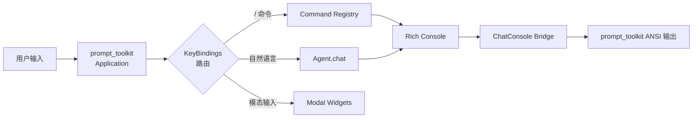
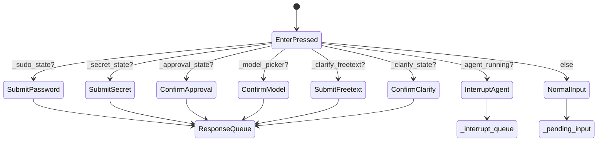
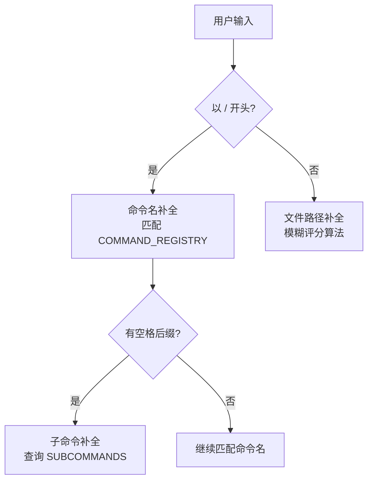
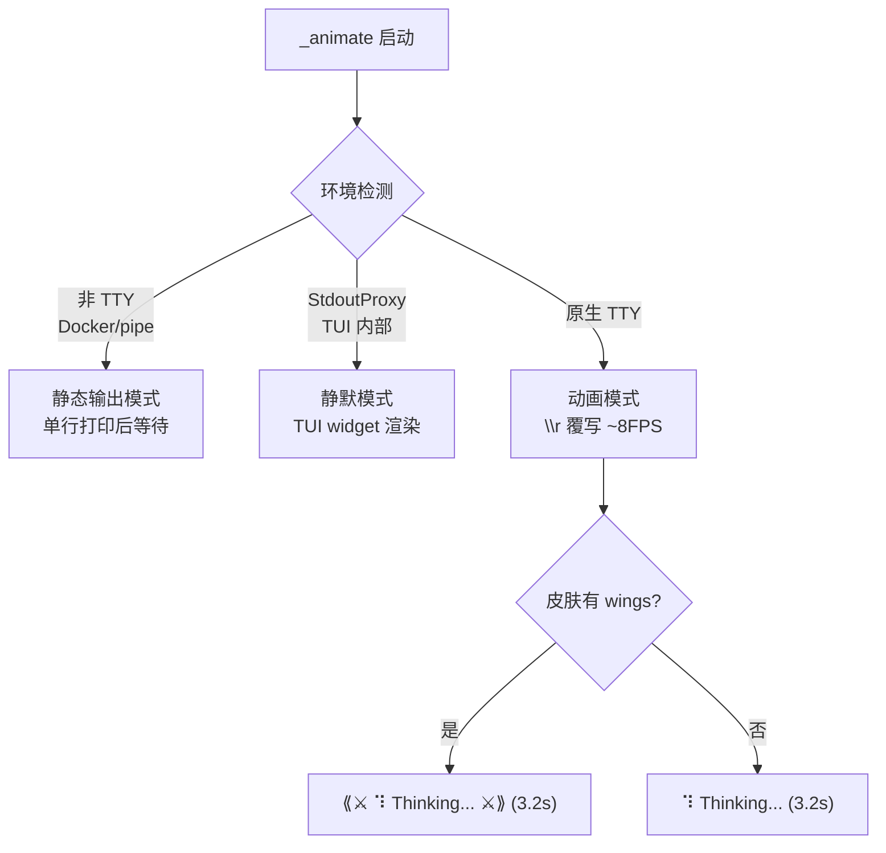

# 第20章 CLI 交互界面

> **"A command-line interface is a conversation between human and machine."**

Hermes Agent 的 CLI 远非一个简陋的 `input()` 循环。它是一个基于 **prompt_toolkit** 和 **Rich** 构建的完整 TUI (Terminal User Interface)，具备窗口布局、实时动画、皮肤引擎、Tab 补全等功能。本章将深入剖析这个交互界面的每一个核心子系统：从 prompt_toolkit 与 Rich 的桥接架构，到 Slash 命令注册表的数据驱动设计，再到 KawaiiSpinner 的多环境动画引擎和支持 YAML 自定义的皮肤系统。

## 20.1 总体架构

CLI 的核心类 `HermesCLI`（`cli.py` 约 L1577）整合了五个子系统。prompt_toolkit 管理输入、布局和按键；Rich 管理输出渲染；两者通过 `ChatConsole` 桥接。



## 20.2 prompt_toolkit 集成

### 20.2.1 TUI 窗口布局

`_build_tui_layout_children()` 方法（L8140-8183）使用 `HSplit` 定义窗口层次：

| 层级 | 组件 | 功能 |
|---|---|---|
| 顶部锚定 | `Window(height=0)` | 占位/滚动锚定 |
| 模态层 | sudo / secret / approval / clarify widget | 条件显示的交互窗口 |
| 模型选择 | model_picker_widget | `/model` 命令的选择器 |
| 状态指示 | spinner_widget | TUI 内嵌 spinner 状态 |
| 弹性间距 | spacer | 将输入区推到底部 |
| 插件扩展 | *extra_widgets | 插件通过 `_get_extra_tui_widgets` 注入 |
| 状态栏 | status_bar | token/model/context 信息 |
| 输入区 | input_rule + image_bar + TextArea + input_rule | 用户输入 |
| 底部 | voice_status_bar + completions_menu | 语音状态与 Tab 补全 |

每个模态组件都包装在 `ConditionalContainer` 中，通过 `Condition` 过滤器控制可见性——sudo 密码框只在 `_sudo_state is not None` 时显示，审批框只在 `_approval_state` 非空时出现。

### 20.2.2 按键绑定与状态机

Enter 键的处理是 CLI 状态机的核心。`run()` 方法（L8185+）创建 `KeyBindings`（L8316），Enter 的路由逻辑构成了一个隐式状态机：



**关键细节**：以 `/` 开头的输入始终进入 `_pending_input`，确保 slash 命令在 agent 运行期间也能被正确识别为命令而非中断文本。

### 20.2.3 双队列与 ChatConsole 桥接

CLI 使用两个队列隔离常规输入和中断消息：

```python
self._pending_input = queue.Queue()    # 常规输入（命令 + 新查询）
self._interrupt_queue = queue.Queue()  # agent 运行期间的中断消息
```

`busy_input_mode` 控制中断行为：`"interrupt"`（默认）将输入发送到 `_interrupt_queue` 供 agent 实时读取；`"queue"` 则直接排入 `_pending_input` 等待顺序处理。

另一个关键组件是 `ChatConsole`（L1332-1372），它解决了 Rich 与 prompt_toolkit 的兼容问题。`patch_stdout` 将 `sys.stdout` 替换为 `StdoutProxy`，Rich 的直接输出会被破坏。`ChatConsole` 让 Rich 先渲染到 `StringIO` 缓冲区，再通过 prompt_toolkit 的 `print_formatted_text(ANSI(...))` 逐行输出：

```python
class ChatConsole:
    def __init__(self):
        self._buffer = StringIO()
        self._inner = Console(file=self._buffer, force_terminal=True,
                              color_system="truecolor", highlight=False)

    def print(self, *args, **kwargs):
        self._buffer.seek(0); self._buffer.truncate()
        self._inner.width = shutil.get_terminal_size().columns
        self._inner.print(*args, **kwargs)
        for line in self._buffer.getvalue().rstrip("\n").split("\n"):
            _cprint(line)  # → _pt_print(_PT_ANSI(text))
```

## 20.3 Slash 命令注册表

### 20.3.1 CommandDef 数据类

命令系统采用数据驱动设计，所有命令通过 `CommandDef` 声明：

```python
@dataclass(frozen=True)
class CommandDef:
    name: str                          # 规范名称: "background"
    description: str                   # 人类可读描述
    category: str                      # "Session", "Configuration" 等
    aliases: tuple[str, ...] = ()      # 别名: ("bg",)
    args_hint: str = ""                # 参数占位符: "<prompt>"
    subcommands: tuple[str, ...] = ()  # Tab 可补全子命令
    cli_only: bool = False             # 仅 CLI 可用
    gateway_only: bool = False         # 仅 Gateway 可用
    gateway_config_gate: str | None = None  # 配置门控路径
```

`frozen=True` 使得 `CommandDef` 实例不可变且线程安全——这是一个值得借鉴的设计：将配置声明为不可变对象，消除了运行时意外修改的风险。

### 20.3.2 命令分类

`COMMAND_REGISTRY`（L59-168）按功能分组定义了全部命令：

| 类别 | 命令示例 | 数量 |
|---|---|---|
| **Session** | new, clear, history, save, retry, undo, branch, compress, background | ~18 |
| **Configuration** | config, model, provider, personality, skin, voice, yolo | ~11 |
| **Tools & Skills** | tools, toolsets, skills, cron, reload, browser, plugins | ~8 |
| **Info** | commands, help, usage, insights, paste, image, debug | ~10 |
| **Exit** | quit (aliases: exit, q) | 1 |

### 20.3.3 派生查找表

从 `COMMAND_REGISTRY` 在模块导入时自动构建多个查找表，这是**单一事实来源**（Single Source of Truth）模式的典型应用：

```python
# 名称+别名 → CommandDef（O(1) 查找）
_COMMAND_LOOKUP: dict[str, CommandDef]

# "/cmd" → 描述（向后兼容旧 API）
COMMANDS: dict[str, str]

# 分类 → {"/cmd": 描述}
COMMANDS_BY_CATEGORY: dict[str, dict]

# "/cmd" → ["sub1", "sub2"]（子命令列表）
SUBCOMMANDS: dict[str, list[str]]

# Gateway 识别的命令集
GATEWAY_KNOWN_COMMANDS: frozenset[str]
```

别名解析通过 `resolve_command()` 完成：`resolve_command("bg")` → 返回 `CommandDef(name="background", ...)`。

子命令有两种来源：
1. 显式声明的 `subcommands` 字段
2. 从 `args_hint` 中自动提取管道分隔模式，如 `"[on|off|tts|status]"` → `["on", "off", "tts", "status"]`

### 20.3.4 Tab 补全与自动建议

`SlashCommandCompleter` 继承 prompt_toolkit 的 `Completer` 接口，提供三级补全：



`SlashCommandAutoSuggest` 则提供基于历史的 ghost-text 建议——用户开始输入时，终端右侧显示灰色的历史命令补全。

### 20.3.5 命令分发

`process_command()`（L5262+）通过 `resolve_command()` 将输入的别名解析为规范命令名，然后 if-elif 链分发到具体处理函数。返回 `True` 继续主循环，`False` 退出程序。

## 20.4 KawaiiSpinner 动画指示器

### 20.4.1 设计理念

`KawaiiSpinner`（`display.py` L571-756）在工具执行期间显示带有 kawaii 表情的动画进度指示器（如 `⠹ (◕‿◕✿) contemplating... 3.2s`）。它预定义了 9 种动画样式（dots、bounce、arrows、moon、brain 等），每种由一组 Unicode 字符帧组成。

### 20.4.2 Kawaii 表情系统

Spinner 随机选择 kawaii 表情（如 `(｡◕‿◕｡)`、`(◔_◔)`、`( ͡° ͜ʖ ͡°)`）和思考动词（pondering、contemplating、cogitating 等），为等待过程增添趣味。表情分为 `KAWAII_WAITING`（等待状态）和 `KAWAII_THINKING`（思考状态）两组。

### 20.4.3 三模式动画引擎

`_animate()` 方法根据运行环境自动选择输出策略，体现了**优雅降级**的设计原则：



三种模式的切换完全自动：

1. **非 TTY 模式**（Docker / 管道 / systemd）：打印一行静态文本后等待，避免日志中出现大量 `\r` 覆写噪音
2. **StdoutProxy 模式**（prompt_toolkit 的 `patch_stdout` 内部）：动画线程静默循环，状态通过专用的 TUI `_spinner_text` widget 显示
3. **原生 TTY 模式**：使用 `\r` 回车覆写实现约 8 FPS 的流畅动画

### 20.4.4 线程安全

KawaiiSpinner 作为上下文管理器在 daemon 线程中运行（`with KawaiiSpinner("Searching...") as s: ...`）。线程安全通过三个机制保证：`_write()` 在创建时快照 `sys.stdout` 引用，免受后续重定向影响；`print_above()` 方法在动画运行时安全插入文本；`stop()` 使用空格覆盖而非 ANSI 转义序列，避免 `patch_stdout` 环境下的乱码。

## 20.5 皮肤引擎

### 20.5.1 SkinConfig 数据结构

皮肤引擎（`skin_engine.py`）是一个数据驱动的主题系统：

```python
@dataclass
class SkinConfig:
    name: str
    description: str = ""
    colors: Dict[str, str] = field(default_factory=dict)      # 18+ 颜色键
    spinner: Dict[str, Any] = field(default_factory=dict)      # 表情/动词/翅膀
    branding: Dict[str, str] = field(default_factory=dict)     # 品牌文案
    tool_prefix: str = "┊"                                     # 工具输出前缀
    tool_emojis: Dict[str, str] = field(default_factory=dict)  # 工具 emoji
    banner_logo: str = ""           # 自定义 ASCII art 大字
    banner_hero: str = ""           # 自定义 hero 图案
```

颜色键（18+ 个）覆盖 UI 各层面：`banner_border/title/accent/dim/text` 控制横幅，`ui_accent/ok/error/warn` 控制信号色，`prompt/input_rule/response_border/status_bar_bg/completion_menu_bg` 控制交互元素。

### 20.5.2 内置皮肤

`_BUILTIN_SKINS` 提供了多套开箱即用的皮肤：

| 皮肤名称 | 风格描述 | 主色调 |
|---|---|---|
| `default` | Classic Hermes — gold and kawaii | 金色 / 暖白 |
| `ares` | War-god theme — crimson and bronze | 红铜 / 暗红 |
| `mono` | Clean grayscale monochrome | 灰度极简 |
| `slate` | Cool blue developer-focused | 冷蓝 / 石板灰 |
| `daylight` | Light background with dark text | 浅色主题 |
| `charizard` | Volcanic — burnt orange and ember | 火焰橙 / 余烬 |
| `boulder` | Granite grey monumental theme | 花岗岩灰 |
| `warm-lightmode` | Warm brown/gold for light terminals | 暖棕 / 金色 |

每套皮肤可自定义 colors、spinner（表情/动词/翅膀装饰）、branding（agent 名称/欢迎语/告别语/提示符）以及 banner 的 ASCII art。

### 20.5.3 YAML 自定义皮肤

用户可在 `~/.hermes/skins/<name>.yaml` 创建自定义皮肤，定义 `colors`、`spinner`、`branding` 等字段。未定义的键自动继承 default 皮肤。

### 20.5.4 加载流程

加载优先级：用户自定义（`~/.hermes/skins/`）> 内置皮肤 > default 回退。`_active_skin` 全局缓存首次调用时惰性加载，`/skin <name>` 命令通过 `set_active_skin()` 即时切换。

### 20.5.5 prompt_toolkit 样式桥接

`get_prompt_toolkit_style_overrides()` 将皮肤颜色转换为 prompt_toolkit 样式字典（30+ 键），涵盖 `input-area`、`status-bar`、`completion-menu`、`clarify-border`、`sudo-prompt` 等。这意味着 `/skin charizard` 切换时，所有 TUI 元素立即更新，无需重建 Application。

## 20.6 欢迎横幅与响应渲染

`banner.py`（535 行）构建 CLI 启动时的欢迎界面。`build_welcome_banner()` 使用 Rich `Table.grid()` 双列布局：左列放品牌图案 + 模型/路径信息，右列放工具列表 + MCP 服务器 + 技能。终端窄于 80 列时自动切换到 `_build_compact_banner()` 紧凑版。

Agent 的响应通过 Rich `Panel` 渲染，颜色和标签从皮肤引擎获取：

```python
_skin = get_active_skin()
label = _skin.get_branding("response_label", "⚕ Hermes")
_resp_color = _skin.get_color("response_border", "#CD7F32")

_chat_console.print(Panel(
    _rich_text_from_ansi(response),
    title=f"[{_resp_color} bold]{label}[/]",
    border_style=_resp_color,
    box=rich_box.HORIZONTALS,
    padding=(1, 4),
))
```

响应渲染有三条路径：流式（`_open_stream_box()` 逐 token 写入）、非流式（完整文本一次性渲染）、TTS 流式（逐句写入 + 语音合成）。

## 20.7 工具输出与上下文压力

`get_cute_tool_message()`（display.py L796-950）为每种工具调用生成带 emoji 的单行摘要（如 `┊ 🔍 search "how to parse JSON" 2.3s`）。`┊` 前缀可由皮肤自定义，路径和内容自动截断，失败时显示红色 `[exit 1]` / `[error]` 后缀。

`format_context_pressure()` 则用 `▰▱` 字符绘制 context window 使用进度条，颜色随压力等级变化，并提供无 ANSI 的 gateway 版本。

## 20.8 设计模式总结

本章涉及的核心设计模式：

| 模式 | 应用 |
|---|---|
| **桥接器** (Bridge) | ChatConsole 桥接 Rich 渲染 → prompt_toolkit 输出管道 |
| **数据驱动配置** | CommandDef + SkinConfig：声明式数据 → 运行时行为派生 |
| **单一事实来源** | COMMAND_REGISTRY / _BUILTIN_SKINS 是唯一定义点，查找表自动构建 |
| **状态机 UI** | Enter 键路由基于当前 UI 状态，模态窗口通过 response_queue 与后台通信 |
| **优雅降级** | KawaiiSpinner 适配 3 种环境；皮肤加载失败回退 default；prompt_toolkit 缺失时补全器降级 |
| **线程安全** | stdout 快照、_approval_lock 序列化审批、双队列隔离输入 |

## 20.9 本章小结

Hermes 的 CLI 交互界面是一个精心设计的 TUI 系统，五个子系统各司其职：

| 子系统 | 核心文件 | 行数 | 职责 |
|---|---|---|---|
| TUI 框架 | `cli.py` | ~10,000 | prompt_toolkit Application、布局、按键、主循环 |
| 命令注册 | `commands.py` | ~1,200 | CommandDef、COMMAND_REGISTRY、补全器 |
| 动画指示 | `display.py` | ~1,000 | KawaiiSpinner、工具摘要、Diff 渲染 |
| 皮肤引擎 | `skin_engine.py` | ~800 | SkinConfig、内置皮肤、YAML 加载 |
| 欢迎横幅 | `banner.py` | ~530 | ASCII art、双列布局、技能扫描 |

三个值得借鉴的设计：**prompt_toolkit 管输入 + Rich 管输出**的分工通过 ChatConsole 桥接器优雅解决兼容问题；**数据驱动的命令注册表**让新增命令只需一行声明；**KawaiiSpinner 的三模式降级**在 TTY、管道、TUI 三种环境提供一致体验。
