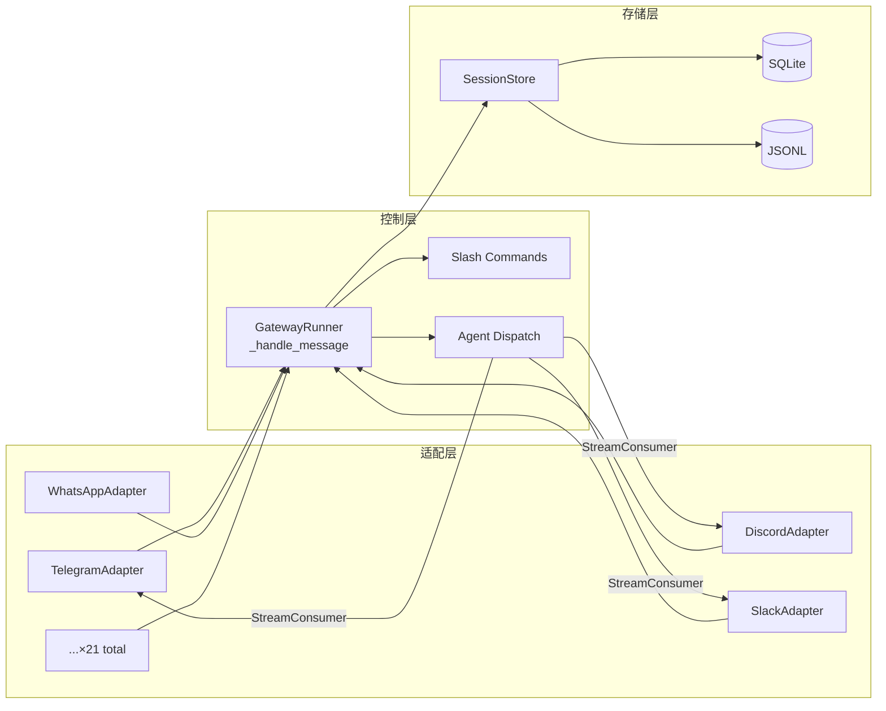
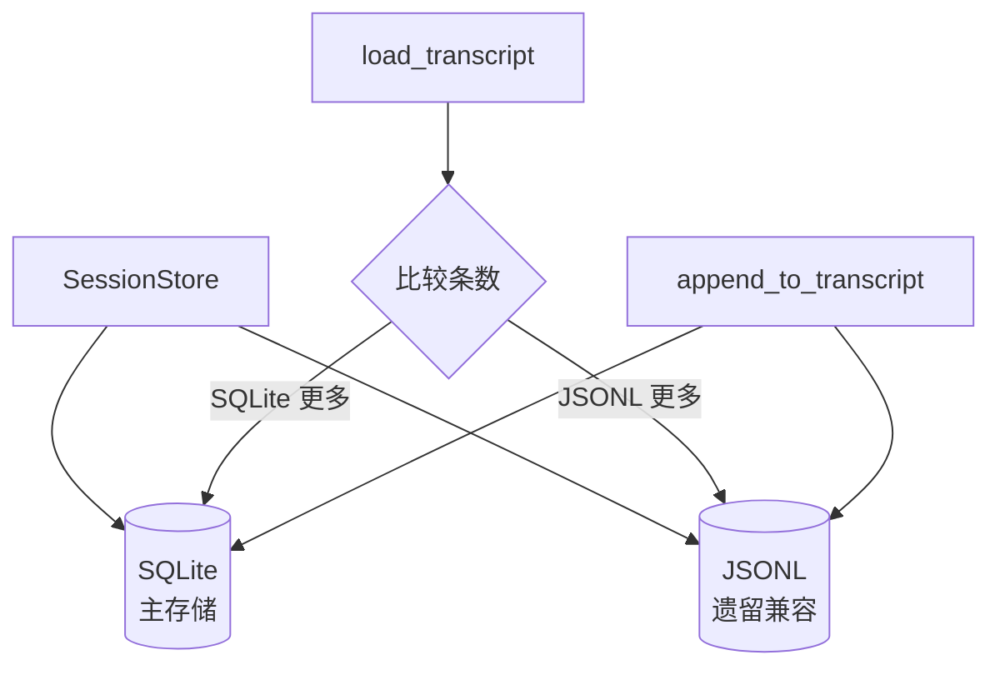
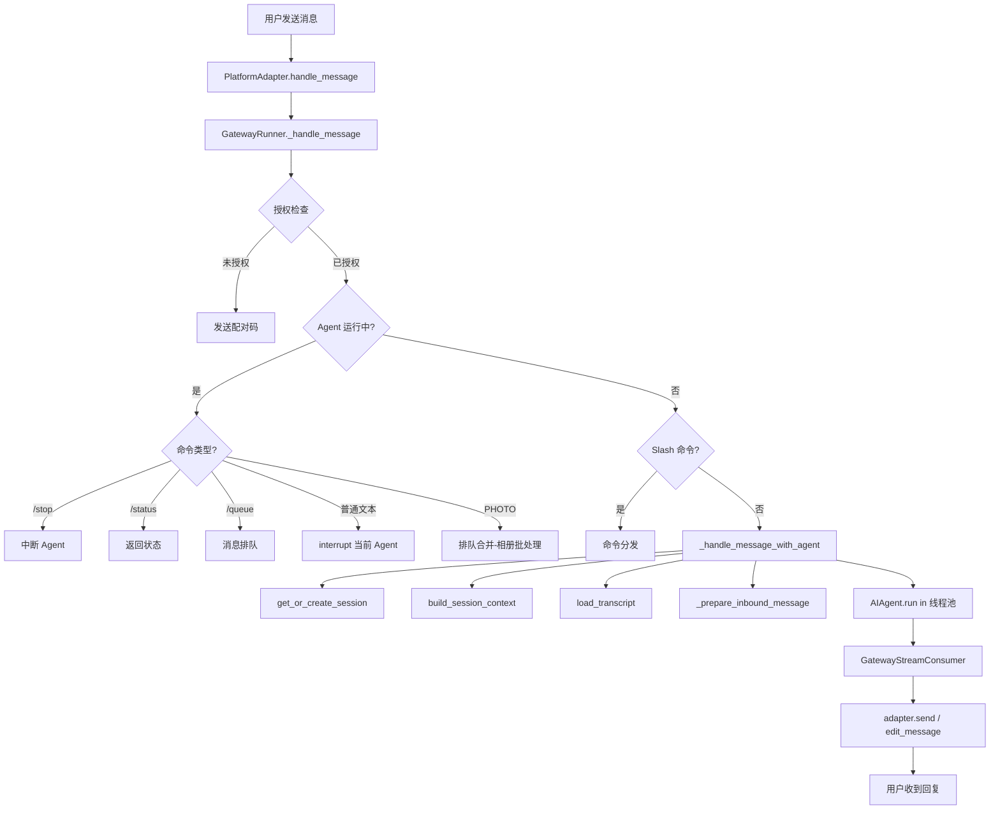
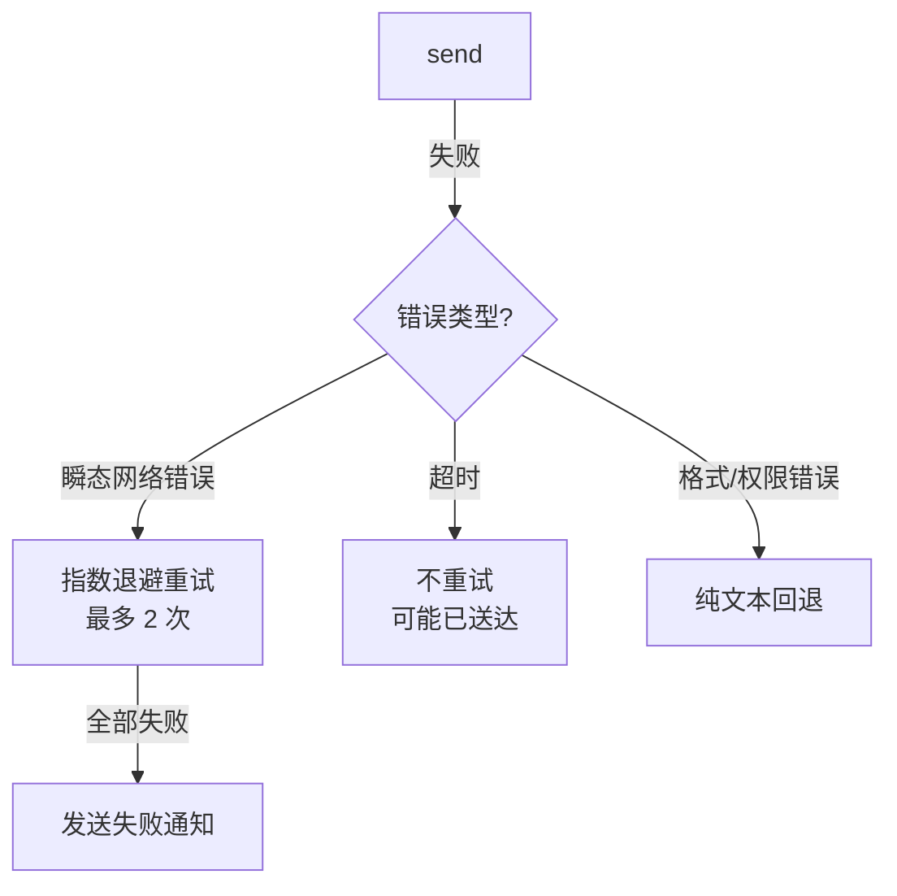
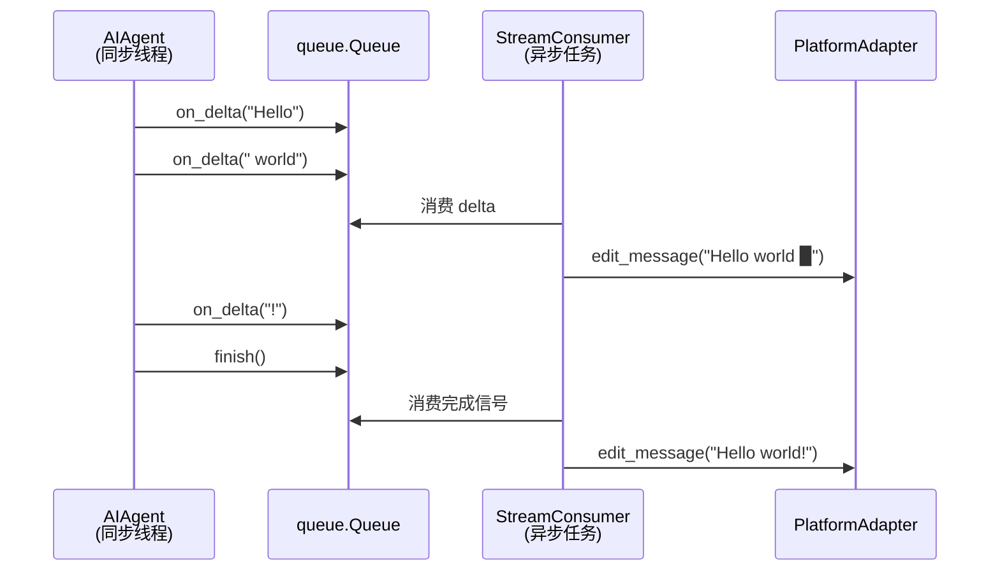
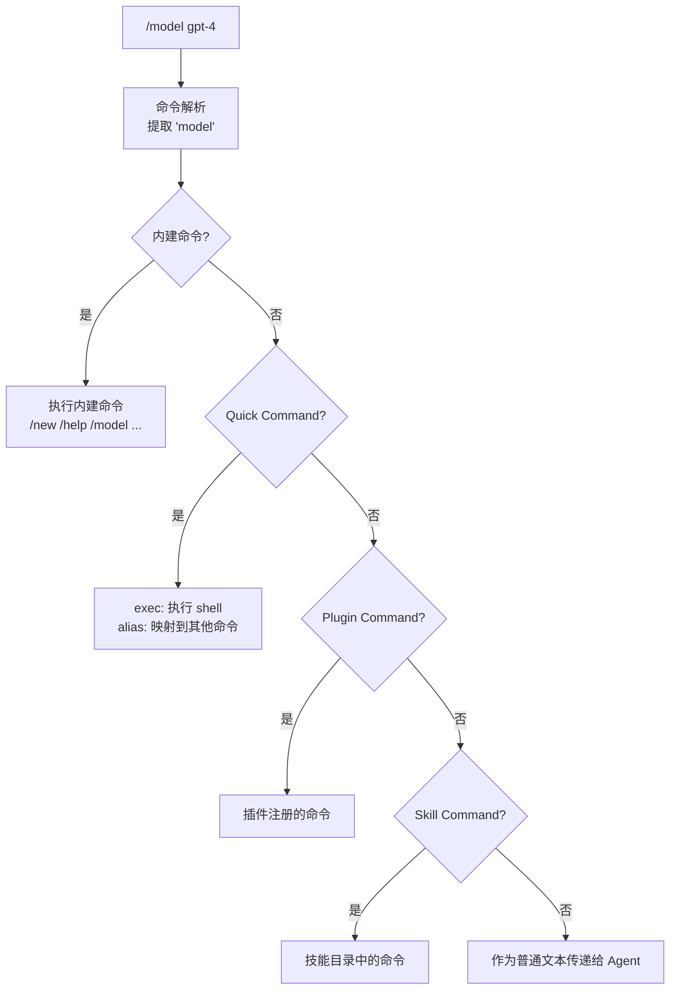

# 第 21 章 消息网关

> **关键词**: `gateway/run.py`、platform adapters、session 管理、多平台路由

消息应用生态如此碎片化——Telegram、Discord、Slack、微信、飞书、钉钉、WhatsApp、Signal……每个平台都有自己的 API 协议、消息格式和交互范式。Hermes Agent 面临的核心挑战之一，就是如何在这些差异巨大的平台之间构建一个统一的消息入口。

答案是**消息网关**（Message Gateway）。

网关是 Hermes 的"总线"，它将来自 19 种平台的消息归一化为统一的内部事件，经过认证、会话管理、命令分发和智能体调度，最终将回复投递回源平台。整个过程对上层的 Agent 完全透明——Agent 不需要知道消息来自 Telegram 还是飞书，它只需处理标准化的文本和附件。

本章将深入分析网关的架构设计、消息处理流水线、会话管理机制，以及支撑多平台统一体验的适配器模式。

---

## 21.1 网关总体架构

网关的核心架构可以用三层来概括：**适配层**（Platform Adapters）、**控制层**（GatewayRunner）和**存储层**（SessionStore）。



**文件清单**——`gateway/` 目录包含 41 个 Python 文件，核心文件如下：

| 文件 | 行数 | 职责 |
|------|------|------|
| `run.py` | 9654 | `GatewayRunner` 主控制器，消息处理流水线 |
| `session.py` | 1086 | `SessionStore`、`SessionContext`、会话键构建 |
| `delivery.py` | 256 | `DeliveryTarget`、`DeliveryRouter`——消息投递路由 |
| `config.py` | 1160 | `Platform` 枚举（19 值）、`GatewayConfig`、`SessionResetPolicy` |
| `hooks.py` | 170 | `HookRegistry`——生命周期事件钩子 |
| `stream_consumer.py` | 744 | `GatewayStreamConsumer`——流式响应渐进编辑 |
| `platforms/base.py` | 2071 | `BasePlatformAdapter` 抽象基类、`MessageEvent`、`SendResult` |

一个值得注意的数字：`run.py` 接近 **一万行**。这个文件承担了太多职责——从授权检查到命令分发，从 Agent 调度到消息投递——这在工程上并不理想，但它也忠实地反映了网关作为"交通枢纽"的复杂性。

---

## 21.2 事件模型：MessageEvent

所有来自不同平台的消息，最终都被归一化为一个 `MessageEvent` 数据类。这是网关内部通信的"通用货币"。

```python
@dataclass
class MessageEvent:
    text: str                               # 消息文本内容
    message_type: MessageType = TEXT        # TEXT/PHOTO/VOICE/AUDIO/DOCUMENT/...
    source: SessionSource = None            # 消息来源（平台、聊天、用户）
    raw_message: Any = None                 # 平台原始消息对象
    message_id: Optional[str] = None        # 平台消息 ID
    media_urls: List[str] = []              # 媒体附件的本地文件路径
    media_types: List[str] = []             # MIME 类型列表
    reply_to_message_id: Optional[str] = None
    reply_to_text: Optional[str] = None
    auto_skill: Optional[str|list] = None   # 自动加载的 Skill
    internal: bool = False                  # 内部事件标志（跳过授权）
    timestamp: datetime = datetime.now()
```

`MessageType` 枚举覆盖了常见的消息类型：

| 类型 | 说明 | 典型来源 |
|------|------|----------|
| `TEXT` | 纯文本 | 所有平台 |
| `PHOTO` | 图片 | Telegram 相册、Discord 附件 |
| `VOICE` | 语音 | Telegram 语音消息、Discord 语音频道 |
| `AUDIO` | 音频文件 | 各平台文件分享 |
| `DOCUMENT` | 文档 | PDF、Office 文件等 |
| `COMMAND` | 斜杠命令 | `/help`、`/new` 等 |
| `STICKER` | 贴纸 | Telegram |
| `LOCATION` | 位置 | WhatsApp、Telegram |

**发送结果** `SendResult` 同样标准化：

```python
@dataclass
class SendResult:
    success: bool
    message_id: Optional[str] = None
    error: Optional[str] = None
    raw_response: Any = None
    retryable: bool = False  # 标记为可重试的瞬态错误
```

`retryable` 字段是一个精巧的设计——它让上层的重试逻辑能够区分"网络抖动"（值得重试）和"权限不足"（重试无意义）。

---

## 21.3 SessionSource：消息来自哪里

每条消息都携带一个 `SessionSource`，精确描述消息的来源坐标：

```python
@dataclass
class SessionSource:
    platform: Platform          # 平台枚举
    chat_id: str               # 聊天 ID
    chat_name: Optional[str]   # 聊天名称
    chat_type: str = "dm"      # "dm" | "group" | "channel" | "thread"
    user_id: Optional[str]     # 用户 ID
    user_name: Optional[str]   # 用户名
    thread_id: Optional[str]   # 论坛话题 / Discord 线程
    chat_topic: Optional[str]  # 频道主题描述
    user_id_alt: Optional[str] # Signal UUID 备选 ID
    chat_id_alt: Optional[str] # Signal group 内部 ID
```

`user_id_alt` 和 `chat_id_alt` 是为 Signal 协议专门预留的字段——Signal 使用 UUID 而非电话号码作为稳定标识符。这种"为特殊平台预留字段"的做法虽然不够优雅，但在实践中比复杂的泛型继承体系更加务实。

---

## 21.4 会话管理

会话（Session）是网关最重要的状态单元。它决定了 Agent 的记忆边界——同一个会话内的消息共享对话历史，不同会话之间彼此隔离。

### 21.4.1 会话键构建

每个会话由一个唯一的键标识，格式为：

```
agent:main:{platform}:{chat_type}:{chat_id}:{thread_id}:{user_id}
```

规则体现了对不同场景的灵活考虑：

- **私聊 (DM)**：`agent:main:telegram:dm:{chat_id}`——一个用户一个会话
- **群组**：`agent:main:discord:group:{chat_id}`——默认全群共享
- **用户隔离**：当 `group_sessions_per_user=True` 时，群组中每个用户有独立会话，键中追加 `user_id`
- **线程共享**：`thread_sessions_per_user=False`（默认），同一线程内所有用户共享会话

### 21.4.2 SessionStore——双层存储架构



`SessionStore` 采用**双写存储**策略：

```python
class SessionStore:
    def __init__(self, sessions_dir, config):
        self._db = SessionDB()          # SQLite 主存储
        self._entries: Dict[str, SessionEntry] = {}  # 内存索引
        self._lock = threading.Lock()   # 线程安全

    def get_or_create_session(source) -> SessionEntry
    def load_transcript(session_id) -> List[Dict]
    def append_to_transcript(session_id, message)
    def rewrite_transcript(session_id, messages)  # 用于 /retry, /undo, /compress
    def reset_session(session_key) -> SessionEntry
    def switch_session(key, target_id) -> SessionEntry  # /resume 切换
```

**为什么双写？** 这是从 JSONL 到 SQLite 迁移期间的兼容策略。写入时同时更新两个存储；读取时比较两者的消息条数，取多的那个。这确保了无论用户是从旧版本升级还是新安装，都不会丢失对话历史。

### 21.4.3 会话重置策略

`SessionResetPolicy` 提供四种模式：

| 模式 | 行为 |
|------|------|
| `daily` | 每日定时重置（默认凌晨 4 点） |
| `idle` | 空闲超时后重置（默认 120 分钟） |
| `both` | 两种策略同时生效 |
| `none` | 永不自动重置 |

```yaml
session_reset:
  mode: both
  at_hour: 4
  idle_minutes: 120
  notify: true
  notify_exclude_platforms: [api_server, webhook]
```

### 21.4.4 SessionContext——上下文组装

`SessionContext` 将会话信息打包为 Agent 可理解的上下文：

```python
@dataclass
class SessionContext:
    source: SessionSource               # 消息来源
    connected_platforms: List[Platform]  # 已连接的平台列表
    home_channels: Dict[Platform, HomeChannel]  # 各平台主频道
    session_key: str
    session_id: str
    created_at: datetime
    updated_at: datetime
```

`build_session_context_prompt()` 方法将上下文转换为自然语言，注入系统提示词。这让 Agent 知道：当前消息来自哪个平台和聊天、哪些平台已连接、定时任务输出应投递到哪里。

一个安全细节：对 WhatsApp、Signal、Telegram、BlueBubbles 等平台，支持 `redact_pii` 选项，用 SHA-256 哈希替换用户 ID 和聊天 ID，防止敏感信息泄露到 LLM 上下文中。

---

## 21.5 核心消息处理流水线

`_handle_message()` 位于 `run.py:2655`，是网关的**心脏**。让我们跟随一条消息走完它的完整生命周期。



### 21.5.1 授权检查

消息进入网关的第一关是授权：

1. `internal` 事件（系统内部生成）跳过授权
2. 无 `user_id` 的消息静默丢弃
3. 未授权用户在私聊中收到配对码（Pairing Code），管理员批准后获权

### 21.5.2 运行中 Agent 的优先处理

当 Agent 正在处理某个会话时，新消息的处理逻辑有特殊分支：

- `/stop` → 强制中断 + 释放会话锁
- `/new` → 中断 + 重置会话
- `/queue` → 排队但不打断
- `/approve` / `/deny` → 绕过中断，直接处理审批
- `PHOTO` 消息 → 排队合并（照片批处理：短时间内连续到达的多张照片合并为一个事件）
- 其他文本 → `interrupt()` 中断当前 Agent

### 21.5.3 `_handle_message_with_agent()`

通过授权和命令分发后，消息进入 Agent 调用阶段：

```
1. get_or_create_session()           → 获取或创建会话
2. build_session_context()           → 组装上下文
3. build_session_context_prompt()    → 注入系统提示词
4. 自动重置通知                        → 如果会话过期被重置
5. Auto-skill 加载                   → 话题/频道绑定的 Skill
6. load_transcript()                 → 加载会话历史
7. 会话卫生检查                        → 自动压缩过大的 transcript
8. _prepare_inbound_message_text()   → 消息增强
   ├── 共享线程中添加 [username] 标识
   ├── 图片 → Vision 增强
   ├── 音频 → STT 转文字
   └── 文档 → 内容提取
9. 创建 AIAgent + GatewayStreamConsumer
10. 线程池中运行 Agent
11. StreamConsumer 渐进式发送响应
```

### 21.5.4 并发控制——PENDING_SENTINEL

网关使用 `_running_agents` 字典跟踪活跃的 Agent：

```python
self._running_agents: Dict[str, Any]    # session_key → Agent 或 PENDING_SENTINEL
self._running_agents_ts: Dict[str, float]  # 时间戳
```

一个精妙的细节：在 Agent 实际创建**之前**，就用 `PENDING_SENTINEL` 哨兵对象占位。为什么？因为 Agent 创建涉及异步操作（加载 transcript、构建上下文），在这些 `await` 点之间可能有新消息到达。如果没有占位，就可能为同一个会话创建两个 Agent 实例——这是一个经典的异步竞态条件。

```python
# 占位——防止在 Agent 创建过程中有新消息闯入
self._running_agents[key] = PENDING_SENTINEL

# ... 异步准备工作 ...

# 替换为真正的 Agent
self._running_agents[key] = agent
```

---

## 21.6 消息投递

消息从 Agent 产出后，需要路由到正确的目标平台。

### 21.6.1 DeliveryTarget

```python
@dataclass
class DeliveryTarget:
    platform: Platform
    chat_id: Optional[str] = None       # None 表示使用主频道
    thread_id: Optional[str] = None
    is_origin: bool = False             # 回复到消息来源
    is_explicit: bool = False           # chat_id 是显式指定的
```

目标解析支持多种格式：

| 格式 | 含义 |
|------|------|
| `"origin"` | 回复到消息来源 |
| `"local"` | 保存到本地文件 |
| `"telegram"` | Telegram 主频道 |
| `"telegram:123456"` | 指定 Telegram 聊天 |
| `"telegram:123456:789"` | 指定聊天和线程 |

### 21.6.2 重试与回退

`_send_with_retry()` 实现了三级容错策略：



可重试的错误模式包括：`connecterror`、`connectionreset`、`network`、`broken pipe`、`remotedisconnected`、`eoferror`。这些都是典型的瞬态网络问题。

---

## 21.7 流式响应——GatewayStreamConsumer

用户期望在聊天中看到"正在输入"的实时感受。`GatewayStreamConsumer` 实现了从同步 Agent 线程到异步平台投递的桥接。



**跨线程桥接**：Agent 运行在线程池的同步线程中，而消息发送是异步操作。`queue.Queue` 作为跨线程通道，Agent 线程同步写入 delta token，异步 `run()` 任务消费并渐进式编辑平台消息。

**关键配置**：
- `edit_interval`: 1.0 秒——编辑频率上限，避免触发平台 API 限流
- `buffer_threshold`: 40 字符——缓冲阈值，攒够了再编辑
- `cursor`: ` ▉`——打字光标，给用户实时感

**Think-block 过滤**：状态机过滤 `<think>`、`<reasoning>`、`<THINKING>` 等模型推理标签，防止原始推理内容泄露到用户界面。这是因为某些推理模型（如 DeepSeek-R1）会在输出中包含推理过程。

**Flood Control**：连续 3 次编辑失败后永久禁用渐进式编辑，回退到最终一次性发送。这是对平台 API 限流的优雅降级。

---

## 21.8 平台适配器

### 21.8.1 BasePlatformAdapter——抽象基类

所有适配器继承自 `BasePlatformAdapter`，它定义了统一接口：

```python
class BasePlatformAdapter(ABC):
    # 必须实现
    async def connect() -> bool
    async def disconnect()
    async def send(chat_id, content, reply_to, metadata) -> SendResult
    async def send_typing(chat_id, metadata)

    # 可选覆盖（提供默认回退）
    async def edit_message(...)     # 默认返回 "Not supported"
    async def send_image(...)      # 默认回退为文本 URL
    async def send_voice(...)      # 默认回退为文本
    async def send_document(...)   # 默认回退为文本
    async def play_tts(...)        # 默认 → send_voice

    # 生命周期钩子
    async def on_processing_start(event)
    async def on_processing_complete(event, outcome)
```

这里的设计哲学是 **Graceful Degradation**（优雅降级）。并非所有平台都支持发送图片、语音或编辑消息。默认实现提供了合理的回退——不支持图片就发 URL，不支持语音就发文本。子类可以选择性地覆盖以提供原生体验。

### 21.8.2 19 种平台适配器

| # | 适配器 | 平台 | 特色能力 |
|---|--------|------|----------|
| 1 | `TelegramAdapter` | Telegram | MarkdownV2 格式化、网络容错、webhook 冲突检测 |
| 2 | `DiscordAdapter` | Discord | `VoiceReceiver` 语音捕获、Opus 解码、表情反应 |
| 3 | `SlackAdapter` | Slack | Socket Mode、多工作区、Assistant API |
| 4 | `WhatsAppAdapter` | WhatsApp | Meta Business API |
| 5 | `SignalAdapter` | Signal | UUID 备选 ID |
| 6 | `WeComAdapter` | 企业微信 | 企业级消息 |
| 7 | `WecomCallbackAdapter` | 企业微信回调 | 回调模式 |
| 8 | `FeishuAdapter` | 飞书/Lark | 复杂的卡片消息 API |
| 9 | `WeixinAdapter` | 微信 | 公众号/个人号 |
| 10 | `DingTalkAdapter` | 钉钉 | 阿里巴巴生态 |
| 11 | `QQAdapter` | QQ | 腾讯 QQ 机器人 |
| 12 | `MatrixAdapter` | Matrix | 开放联邦协议 |
| 13 | `MattermostAdapter` | Mattermost | 开源 Slack 替代 |
| 14 | `HomeAssistantAdapter` | Home Assistant | 智能家居集成 |
| 15 | `BlueBubblesAdapter` | iMessage | macOS 桥接 |
| 16 | `SmsAdapter` | SMS | 短信 |
| 17 | `EmailAdapter` | Email | 电子邮件 |
| 18 | `APIServerAdapter` | REST API | HTTP API 接口 |
| 19 | `WebhookAdapter` | Webhook | 通用 Webhook |

最大的适配器是 Discord（3020 行）和 Telegram（2825 行）——它们也是功能最丰富的平台，支持语音、线程、反应等高级特性。

### 21.8.3 Typing 指示器

一个看似简单但体验极佳的功能——"正在输入"指示器：

```python
async def _keep_typing(chat_id, interval=2.0):
    # 每 2 秒刷新 typing 状态
    # 支持暂停（审批等待时）
    # 取消时自动调用 stop_typing()
```

`pause_typing_for_chat()` / `resume_typing_for_chat()` 是线程安全的（依赖 CPython GIL），可以从同步 Agent 线程调用——比如当 Agent 等待用户审批危险命令时，暂停 typing 指示器。

---

## 21.9 跨平台 Slash 命令

### 21.9.1 命令分发层次

网关提供了 30+ 个内建命令，支持四层分发：



### 21.9.2 常用内建命令

| 命令 | 功能 |
|------|------|
| `/new` (`/reset`) | 重置会话 |
| `/help` | 帮助信息 |
| `/model` | 切换模型 |
| `/provider` | 切换提供商 |
| `/stop` | 停止当前 Agent |
| `/retry` | 重试上次回复 |
| `/undo` | 撤销上次对话 |
| `/compress` | 压缩会话历史 |
| `/usage` | Token 使用统计 |
| `/approve` / `/deny` | 危险命令审批 |
| `/queue` (`/q`) | 排队消息（不打断当前 Agent） |
| `/btw` | 插话——发送 side message |
| `/resume` | 恢复历史会话 |
| `/branch` | 分支会话 |

**Telegram 兼容细节**：Telegram 的 BotCommand 菜单不支持连字符，命令名使用下划线。`resolve_skill_command_key()` 自动处理转换：`/claude_code` → `claude-code`。

---

## 21.10 Hook 系统

网关在关键生命周期节点发出事件，允许外部 Hook 响应：

```python
class HookRegistry:
    events = [
        "gateway:startup",
        "session:start", "session:end", "session:reset",
        "agent:start", "agent:step", "agent:end",
        "command:*"  # 通配符
    ]
```

Hook 从 `~/.hermes/hooks/` 目录自动发现（每个 Hook 包含 `HOOK.yaml` + `handler.py`）。关键设计原则：**Fire-and-forget**——Hook 的错误被捕获并记录，永不阻塞主流水线。这确保了即使某个 Hook 崩溃，也不会影响核心消息处理。

---

## 21.11 设计模式总结

网关代码中运用了多种经典设计模式：

| 模式 | 应用场景 | 效果 |
|------|----------|------|
| **适配器模式** | `BasePlatformAdapter` + 21 个具体适配器 | 平台差异被封装在适配器内部 |
| **模板方法** | `handle_message()` 定义骨架，子类注入平台特定行为 | Discord 用 👀/✅/❌ 表情反应标记处理状态 |
| **策略模式** | `send()` → `_send_with_retry()` → 纯文本回退 | 多级容错 |
| **生产者-消费者** | `GatewayStreamConsumer` 的 `queue.Queue` | 跨线程流式响应桥接 |
| **哨兵模式** | `PENDING_SENTINEL` 占位防并发 | 解决异步竞态条件 |
| **发布-订阅** | `HookRegistry` 事件系统 | 解耦扩展点 |
| **双写存储** | SQLite + JSONL 同时写入 | 平滑迁移 |

---

## 21.12 安全机制

网关在多个层面实施安全防护：

- **用户授权**：`_is_user_authorized()` 检查用户白名单
- **配对系统**：未授权的 DM 用户获得配对码，管理员批准后才能使用
- **SSRF 防护**：`is_safe_url()` 验证 URL 安全性，防止内网探测
- **PII 脱敏**：可选的用户 ID 哈希化，保护隐私
- **平台锁**：`_acquire_platform_lock()` 防止多个网关实例使用同一个平台 Token
- **速率限制**：配对请求有频率限制，防止暴力破解

---

## 本章小结

消息网关是 Hermes Agent 架构中最复杂的子系统之一。它的核心价值在于**屏蔽差异**——让上层的 Agent、命令系统、会话管理都不需要关心消息来自哪个平台。

几个关键的架构决策值得借鉴：

1. **统一事件模型**：`MessageEvent` 和 `SendResult` 作为"通用货币"，解耦了平台差异和业务逻辑
2. **优雅降级**：不支持的功能有合理的回退路径，而非报错
3. **双写迁移**：SQLite + JSONL 的双写策略，让存储迁移对用户透明
4. **哨兵占位**：在异步操作的 await 点之间使用 sentinel 防止竞态条件
5. **Fire-and-forget Hook**：扩展点的错误永不阻塞主流程

当然，`run.py` 接近一万行的体量也提醒我们：当一个模块承担太多职责时，即使设计精良，维护成本也会迅速攀升。如何在保持统一入口的同时合理拆分——这是每个网关架构都需要持续思考的问题。

在下一章中，我们将深入网关之上的另一个关键系统——看看 Hermes 如何调度和编排多个 Agent 的协作。
