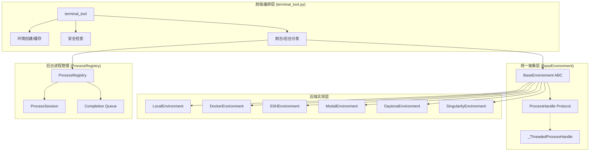
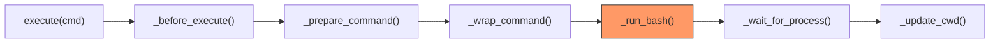
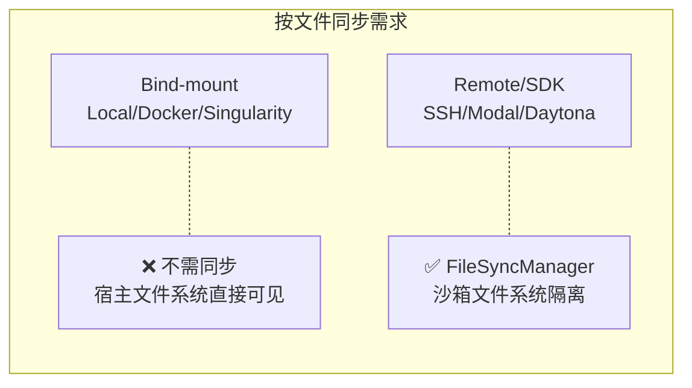
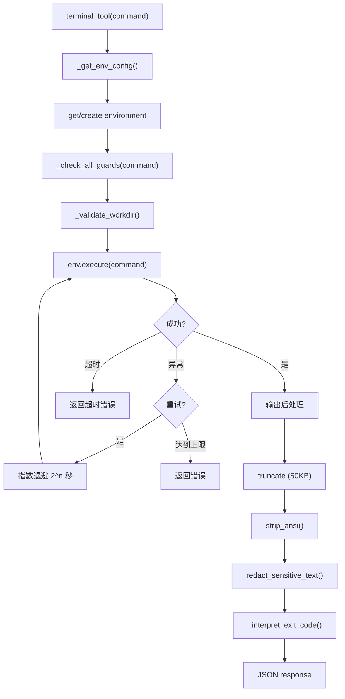
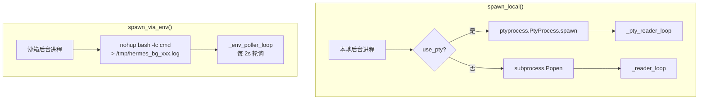

# 第二十二章：终端后端

> *"Any sufficiently advanced AI agent is indistinguishable from a very persistent sysadmin."*

在前面的章节中，我们已经看到 Hermes Agent 如何接收用户指令、规划任务、调用工具。但这一切最终都要落到一个最原始的能力上——**在终端中执行命令**。无论是安装依赖、编译代码、运行测试还是管理服务器，终端都是 Agent 与操作系统对话的通道。

本章深入剖析 Hermes Agent 的终端后端架构：一个支持 Local、Docker、SSH、Modal、Daytona、Singularity 六种后端的统一执行层。我们将看到这个系统如何用经典的设计模式解决跨环境执行的复杂性，如何在安全、性能和可扩展性之间取得平衡。

## 22.1 三层架构全景

Hermes Agent 的终端系统采用清晰的**三层架构**，每一层有明确的职责边界：



**层次职责**：

| 层次 | 文件 | 核心职责 |
|------|------|----------|
| 前端编排层 | `terminal_tool.py` (1749行) | 环境生命周期管理、安全检查、输出处理、重试 |
| 统一抽象层 | `environments/base.py` (579行) | 定义 ProcessHandle 协议、execute() 管道、CWD 跟踪 |
| 后端实现层 | `environments/*.py` | 各后端的具体执行逻辑 |
| 进程管理层 | `process_registry.py` (1172行) | 后台进程生命周期、输出缓冲、崩溃恢复 |

### 核心设计原则

1. **Spawn-per-call 模型**：每次 `execute()` 调用 spawn 一个新的 shell 进程。CWD 跨调用跟踪，但 shell 环境（局部变量、别名等）不保留
2. **后端透明性**：`terminal_tool()` 对 LLM 呈现统一接口，LLM 无需知道底层是 Docker 还是 Modal
3. **安全隔离**：非 local 后端在沙箱中执行，敏感环境变量通过 blocklist 过滤
4. **惰性初始化**：环境在首次使用时创建，通过 `_active_environments` 字典缓存

## 22.2 统一抽象层 — BaseEnvironment

`BaseEnvironment` 是整个终端后端的核心抽象，定义了所有后端必须遵循的契约。

### ProcessHandle 协议

```python
class ProcessHandle(Protocol):
    """Duck type that every backend's _run_bash() must return.
    subprocess.Popen satisfies this natively. SDK backends return
    _ThreadedProcessHandle which adapts their blocking calls."""
    def poll(self) -> int | None: ...
    def kill(self) -> None: ...
    def wait(self, timeout: float | None = None) -> int: ...
    @property
    def stdout(self) -> IO[str] | None: ...
    @property
    def returncode(self) -> int | None: ...
```

这是一个**鸭子类型协议**——`subprocess.Popen` 天然满足它，无需任何适配。对于 Modal、Daytona 等 SDK 后端，则通过 `_ThreadedProcessHandle` 适配器包装：

```python
class _ThreadedProcessHandle:
    """Wraps a blocking exec_fn() -> (output_str, exit_code)
    in a background thread and exposes ProcessHandle-compatible interface."""
    def __init__(self, exec_fn, cancel_fn=None):
        # 后台线程执行 exec_fn()
        # 输出通过 os.pipe() 传递，实现 stdout 兼容
        # kill() 时调用 cancel_fn 执行后端特定的取消操作
```

这是经典的**适配器模式（Adapter Pattern）**——将 SDK 的阻塞式 API 适配为 Popen 兼容的非阻塞接口。

### execute() 管道

`execute()` 是模板方法模式的典型应用，定义了固定的执行骨架：



| 步骤 | 方法 | 职责 |
|------|------|------|
| 1 | `_before_execute()` | FileSyncManager hook，远程后端同步凭据文件 |
| 2 | `_prepare_command()` | sudo 密码转换 |
| 3 | `_wrap_command()` | 添加 CWD 标记、环境变量、bash 包装 |
| 4 | **`_run_bash()`** | **后端特定**：实际执行命令（子类覆写） |
| 5 | `_wait_for_process()` | 等待完成，带 interrupt 检查 |
| 6 | `_update_cwd()` | 从输出中提取新 CWD |

其中 `_run_bash()` 是唯一需要各后端自行实现的方法，其余步骤在基类中统一完成。

### CWD 跟踪机制

由于每次命令都在新进程中执行，`cd /some/path` 的效果不会自动保留。Hermes 使用 **marker 技术** 解决这个问题：

- **Local 后端**：使用 `mktemp` 创建临时文件，将 CWD 写入文件后读取
- **其他后端**：在 bash 包装命令末尾追加 `; echo "HERMES_CWD_MARKER$(pwd)"`，然后从输出中提取

这个看似简单的方案优雅地解决了跨进程 CWD 持久化问题。

## 22.3 六大后端实现

### 3.1 LocalEnvironment — 本地后端

最简单直接的后端，使用 `subprocess.Popen` 在宿主机上执行命令。

```python
# 查找 shell 的优先级
# $SHELL → /bin/bash → /usr/bin/bash → shutil.which("bash") → /bin/sh
```

**核心特性**：

| 特性 | 实现 |
|------|------|
| 执行方式 | `subprocess.Popen` with login shell (`bash -lic`) |
| 进程隔离 | `os.setsid()` 创建新进程组 |
| 安全机制 | `_HERMES_PROVIDER_ENV_BLOCKLIST` 过滤 ~60+ 敏感环境变量 |
| CWD 跟踪 | 临时文件写入 + 读取 |

**环境变量屏蔽**是本地后端最重要的安全措施。被屏蔽的变量包括：

- API 密钥：`OPENAI_API_KEY`, `ANTHROPIC_API_KEY`, `GOOGLE_API_KEY` 等
- 消息平台凭据：`DISCORD_BOT_TOKEN`, `SLACK_BOT_TOKEN`
- Hermes 内部：`HERMES_*` 系列变量
- 数据库/存储：`REDIS_URL`, `DATABASE_URL`, `SUPABASE_*`

```python
def _sanitize_subprocess_env(base_env, extra_vars=None):
    """Create a sanitized copy of the environment, removing blocked variables."""
    env = {k: v for k, v in base_env.items()
           if k not in _HERMES_PROVIDER_ENV_BLOCKLIST}
    if extra_vars:
        env.update(extra_vars)
    return env
```

### 3.2 DockerEnvironment — Docker 后端

Docker 后端提供了最强的安全隔离，适用于不信任的代码执行。

**容器创建时的安全加固**：

```python
cmd = [docker, "run", "-d",
       "--cap-drop", "ALL",                    # 丢弃所有 Linux capabilities
       "--security-opt", "no-new-privileges",  # 禁止提权
       "--pids-limit", "256",                  # 进程数限制
       "-w", cwd,                              # 工作目录
       "-v", f"{workspace}:/workspace",        # bind mount
       "-v", f"{home}:/root",                  # home 持久化
]
```

**容器发现**：`find_docker()` 函数不仅搜索 PATH，还检查 `/usr/local/bin/docker` 和 `/opt/homebrew/bin/docker`（macOS Homebrew 安装路径），确保在各种环境下都能找到 Docker 可执行文件。

**清理策略**：`cleanup()` 使用 `timeout 60 docker stop` + 后台 `docker rm -f`，采用非阻塞设计避免清理过程拖慢主流程。

### 3.3 SSHEnvironment — SSH 后端

SSH 后端通过 ControlMaster 连接池优化性能，避免每次命令都重新建立 SSH 连接。

```python
def _build_ssh_command(self, command):
    return ["ssh",
            "-o", "BatchMode=yes",
            "-o", f"ControlPath={self._control_path}",
            "-o", "ControlMaster=auto",
            "-o", "ControlPersist=300",   # 保持连接 5 分钟
            "-p", str(self.port),
            f"{self.user}@{self.host}",
            command]
```

SSH 后端与 `FileSyncManager` 紧密集成——每次命令执行前，通过 `_before_execute()` hook 将凭据文件（credentials/skills/cache）同步到远程。同步使用 `scp` 进行单文件上传，支持批量上传优化。

### 3.4 ModalEnvironment — Modal SDK 后端

Modal 是云端沙箱后端，设计最为复杂。核心挑战在于 Modal SDK 是异步的，而终端工具在同步上下文中调用。

**异步桥接**：

```python
class _AsyncWorker:
    """Single-thread event loop for sync→async bridging.
    All Modal SDK calls go through this to avoid blocking the main thread."""
    def run(self, coro) -> Any:
        future = asyncio.run_coroutine_threadsafe(coro, self._loop)
        return future.result()
```

**镜像解析**（`_resolve_modal_image`）支持多种输入格式：

| 输入格式 | 处理方式 |
|---------|---------|
| `sha256:...` | Modal snapshot ID 恢复 |
| 含 `/` 的路径 | Docker Hub 镜像 (`modal.Image.from_registry`) |
| Dockerfile 路径 | `modal.Image.from_dockerfile` |
| Ubuntu/Debian | 自动 `add_python()` 确保 Python 可用 |

**持久性**通过文件系统快照（`sandbox.snapshot_filesystem()`）实现，快照 ID 存储在 `modal_snapshots.json` 中，实现跨会话的状态保留。

### 3.5 ManagedModalEnvironment — 托管 Modal 后端

与直接使用 Modal SDK 不同，托管模式通过 tool-gateway HTTP API 间接操作 sandbox：

```python
class BaseModalExecutionEnvironment(BaseEnvironment):
    """Override BaseEnvironment.execute() because gateway handles
    command preparation, CWD tracking, and snapshot management."""
    _stdin_mode = "payload"           # stdin 作为 HTTP payload 传递

    # Template Method pattern
    @abstractmethod
    def _start_modal_exec(self, prepared) -> ModalExecStart: ...
    @abstractmethod
    def _poll_modal_exec(self, handle) -> dict | None: ...
    @abstractmethod
    def _cancel_modal_exec(self, handle) -> None: ...
```

采用 **Poll-based 执行模型**：发起请求 → 以 0.25 秒间隔轮询完成状态。`idempotency_key` 防止网络重试导致的重复 sandbox 创建。

### 3.6 DaytonaEnvironment 与 SingularityEnvironment

**Daytona** 通过 `daytona.Daytona` SDK 管理沙箱，支持 sandbox 的 stop/resume 实现持久性。注意 `_stdin_mode = "heredoc"` 是因为 SDK 不支持管道式 stdin。磁盘限制硬编码为 10GB（`min(disk, 10240)`）。

**Singularity/Apptainer** 针对 HPC 环境设计，使用 `--containall --no-home` 实现安全隔离，通过 writable overlay 目录实现文件系统持久性。

## 22.4 后端分类学

从不同维度对六大后端进行分类，有助于理解它们的设计取舍：



### stdin 模式分类

| 模式 | 后端 | 说明 |
|------|------|------|
| `pipe` (默认) | Local, Docker, SSH, Singularity | stdin 通过管道传递 |
| `heredoc` | Daytona | SDK 不支持管道，stdin 嵌入为 heredoc |
| `payload` | ManagedModal | stdin 作为 HTTP payload 传递给 gateway |

### 持久性策略分类

| 后端 | 持久性机制 |
|------|-----------|
| Local | 宿主文件系统（天然持久） |
| Docker | Bind mount 目录到宿主机 |
| SSH | 远程文件系统（天然持久） |
| Singularity | Writable overlay 目录 |
| Modal | 文件系统快照 (`snapshot_filesystem()`) |
| Daytona | SDK sandbox stop/resume |

## 22.5 前端编排层

`terminal_tool.py` 是整个终端系统的入口，负责环境生命周期管理、安全检查和输出处理。

### 环境生命周期管理

```python
# 全局状态
_active_environments: Dict[str, Any] = {}     # task_id → env 实例
_last_activity: Dict[str, float] = {}          # task_id → 最后使用时间
_creation_locks: Dict[str, threading.Lock] = {} # 防止并发创建同一 task 的沙箱
```

环境创建使用**双重检查锁（Double-Checked Locking）**模式：

```python
# 1. 快速路径: 在全局锁下检查缓存
with _env_lock:
    if effective_task_id in _active_environments:
        env = _active_environments[effective_task_id]
        needs_creation = False

# 2. 慢速路径: 获取 per-task lock
if needs_creation:
    with task_lock:
        # 再次检查（另一个线程可能已创建）
        with _env_lock:
            if effective_task_id in _active_environments:
                needs_creation = False
        if needs_creation:
            new_env = _create_environment(...)
```

为什么需要这么复杂的锁？因为 Atropos 等训练框架会并发执行多个 rollout，每个 rollout 可能同时请求创建环境。Docker/Modal sandbox 的创建耗时数秒到数十秒，不加锁会导致重复创建。

### 工厂方法

`_create_environment()` 是经典的工厂方法，根据 `TERMINAL_ENV` 环境变量选择后端：

```python
def _create_environment(env_type, image, cwd, ...):
    if env_type == "local":       return _LocalEnvironment(...)
    elif env_type == "docker":    return _DockerEnvironment(...)
    elif env_type == "singularity": return _SingularityEnvironment(...)
    elif env_type == "modal":     # Direct vs Managed 选择逻辑
    elif env_type == "daytona":   return _DaytonaEnvironment(...)
    elif env_type == "ssh":       return _SSHEnvironment(...)
```

### 空闲清理线程

一个后台守护线程每 60 秒运行一次，清理空闲环境：

```python
def _cleanup_inactive_envs(lifetime_seconds=300):
    # Phase 1: 在锁内收集过期环境
    #   - 有活跃后台进程的环境不清理
    #   - 收集超过 lifetime_seconds 的过期环境
    # Phase 2: 在锁外执行 cleanup
    #   - Modal/Docker cleanup 可能阻塞 10-15s
    #   - 不能在锁内阻塞，否则影响其他调用
```

**两阶段清理**是关键设计：如果在持有锁时执行 `docker stop`，其他线程的 `terminal_tool()` 调用会被阻塞数秒。将收集和清理分开，最大限度减少锁持有时间。

### 前台命令执行流



几个值得注意的细节：

- **输出截断策略**：超过 50,000 字符时保留 **40% 头部 + 60% 尾部**。这个比例经过精心设计——错误信息常出现在开头，最新输出在末尾
- **Exit Code 语义注释**：为 `grep`(1=无匹配)、`diff`(1=文件不同)、`curl`(28=超时) 等添加说明，防止 LLM 将非错误退出码误判为失败
- **前台超时上限**：硬限 600 秒，超过的请求被拒绝并引导使用 `background=true`

### 环境配置

所有配置通过环境变量驱动：

| 环境变量 | 默认值 | 说明 |
|---------|--------|------|
| `TERMINAL_ENV` | `local` | 后端类型 |
| `TERMINAL_DOCKER_IMAGE` | `nikolaik/python-nodejs:python3.11-nodejs20` | Docker 镜像 |
| `TERMINAL_TIMEOUT` | `180` | 默认超时秒数 |
| `TERMINAL_LIFETIME_SECONDS` | `300` | 空闲环境清理阈值 |
| `TERMINAL_CONTAINER_CPU` | `1` | CPU 核数 |
| `TERMINAL_CONTAINER_MEMORY` | `5120` | 内存 MB |
| `TERMINAL_SSH_HOST/USER/PORT/KEY` | — | SSH 连接配置 |

## 22.6 后台进程管理 — ProcessRegistry

`ProcessRegistry` 管理所有后台进程的生命周期，是终端系统中最复杂的组件之一。

### ProcessSession 数据模型

```python
@dataclass
class ProcessSession:
    id: str               # "proc_xxxxxxxxxxxx" (UUID-based)
    command: str           # 原始命令
    task_id: str           # 任务隔离键
    pid: int               # OS PID 或 sandbox PID
    process: Popen         # 本地 Popen 句柄 (local only)
    env_ref: Any           # 环境对象引用 (非 local)
    pid_scope: str         # "host" | "sandbox"
    output_buffer: str     # 滚动输出 (200KB 窗口)
    detached: bool         # 崩溃恢复后无管道
    notify_on_complete: bool     # 完成时通知 agent
    watch_patterns: List[str]    # 输出模式匹配
```

### 两种 Spawn 模式



**`spawn_local()`** 直接在宿主机上 spawn 进程，Reader 线程实时读取 stdout。

**`spawn_via_env()`** 在沙箱中启动 nohup 进程，将输出重定向到日志文件，PID 写入 `.pid` 文件，退出码写入 `.exit` 文件。然后 `_env_poller_loop` 每 2 秒通过 `cat` 和 `kill -0` 轮询日志和进程状态。

### Watch Patterns — 智能输出监控

模型可以设置 `watch_patterns=["ERROR", "FAIL"]`，当后台进程的输出匹配到这些模式时，自动触发通知。为防止日志刷屏导致通知风暴，设计了三层保护：

```python
WATCH_MAX_PER_WINDOW = 8        # 每 10 秒窗口最多 8 条通知
WATCH_WINDOW_SECONDS = 10       # 窗口长度
WATCH_OVERLOAD_KILL_SECONDS = 45 # 持续过载 45 秒后永久禁用
```

1. **速率限制**：每 10 秒最多 8 条通知
2. **抑制计数**：超限时抑制并记录被抑制数量
3. **永久禁用**：持续 45 秒过载后永久禁用该进程的 watch，发送 `watch_disabled` 事件

### 崩溃恢复

```python
CHECKPOINT_PATH = get_hermes_home() / "processes.json"

def _write_checkpoint(self):
    """Atomic JSON write of all running process metadata."""
    # 每次 spawn/move/kill 后更新

def recover_from_checkpoint(self) -> int:
    """Gateway startup: probe host PIDs from checkpoint file."""
    # 只恢复 pid_scope="host" 的进程
    # sandbox-backed 进程跳过（sandbox handle 已丢失）
    # 恢复为 detached=True（无管道，但可查状态/kill）
```

Gateway 重启后，通过 `processes.json` 检查点文件恢复本地后台进程的追踪。恢复后的进程标记为 `detached=True`——无法再读取输出管道，但仍可查询状态和发送 kill 信号。

### 完成通知队列

```python
self.completion_queue: queue.Queue = queue.Queue()
# 三种事件类型:
# 1. type="completion"     — 进程退出通知
# 2. type="watch_match"    — 输出模式匹配
# 3. type="watch_disabled" — 过载后禁用通知
```

CLI 和 Gateway 在每次 agent turn 后 drain 此队列，将事件注入到对话流中。

## 22.7 关键数值参数

| 常量 | 值 | 说明 |
|------|-----|------|
| `MAX_OUTPUT_CHARS` (buffer) | 200,000 | 输出滚动缓冲区大小 |
| `MAX_OUTPUT_CHARS` (tool) | 50,000 | 返回给 LLM 的最大输出 |
| `MAX_PROCESSES` | 64 | 最大并发跟踪进程数 |
| `FINISHED_TTL_SECONDS` | 1,800 | 完成进程保留 30 分钟 |
| `FOREGROUND_MAX_TIMEOUT` | 600 | 前台命令最大超时 |
| `_SYNC_INTERVAL_SECONDS` | 5.0 | 文件同步最小间隔 |
| `ControlPersist` | 300 | SSH 连接保持 5 分钟 |
| `WATCH_OVERLOAD_KILL_SECONDS` | 45 | Watch 过载禁用阈值 |

## 22.8 安全体系

终端系统的安全分为三个层面：

### 命令安全

- **Tirith 策略引擎**：外部策略规则检查
- **危险命令检测**：内置模式匹配（`rm -rf /` 等）
- **用户审批流**：`approval_required` 状态 → 等待用户确认
- **Smart Approval**：AI 自动判断安全性

### Workdir 注入防护

```python
def _validate_workdir(workdir):
    """Block shell injection via malicious workdir paths."""
    # 检查 shell 元字符: $, `, ;, |, &, (, ) 等
```

防止 LLM 通过恶意 workdir 参数（如 `workdir="/tmp; rm -rf /"`) 进行注入。

### 输出安全

- `strip_ansi()`：去除终端转义码，防止 LLM 将控制字符复制到文件
- `redact_sensitive_text()`：密钥脱敏（`env`/`printenv` 泄露防护）
- `_HERMES_PROVIDER_ENV_BLOCKLIST`：从源头屏蔽敏感环境变量

## 22.9 线程安全模型

终端系统涉及多种并发场景，锁层次设计至关重要：

```
_env_lock (全局环境锁)
  └── _creation_locks_lock (创建锁的锁)
       └── _creation_locks[task_id] (每任务创建锁)

ProcessRegistry._lock (注册表锁)
  └── ProcessSession._lock (每会话锁)
```

并发访问场景包括：

- **Executor 线程**：处理 terminal_tool 和 process tool 调用
- **Gateway asyncio loop**：watcher tasks、session reset 检查
- **Cleanup 线程**：sandbox 清理协调
- **Reader 线程**：每个后台进程的输出读取

## 22.10 设计模式总结

| 模式 | 应用位置 | 说明 |
|------|---------|------|
| **Strategy（策略）** | Backend 选择 | `TERMINAL_ENV` 决定使用哪个后端 |
| **Factory Method（工厂方法）** | `_create_environment()` | 根据 env_type 创建对应实例 |
| **Template Method（模板方法）** | `BaseEnvironment.execute()` | 骨架流程固定，子类覆写 `_run_bash()` |
| **Adapter（适配器）** | `_ThreadedProcessHandle` | SDK 阻塞 API → Popen 接口 |
| **Protocol / Duck Typing** | `ProcessHandle` | 行为协议，不要求继承 |
| **Observer（观察者）** | Watch patterns + completion_queue | 后台进程事件通知 |
| **Double-Checked Locking** | 环境创建 | 避免并发重复创建沙箱 |
| **Two-Phase Cleanup** | `_cleanup_inactive_envs()` | 锁内收集 → 锁外清理 |

## 本章小结

Hermes Agent 的终端后端系统展现了如何用经典软件工程模式应对真实世界的复杂性：

1. **统一抽象**：`BaseEnvironment` 和 `ProcessHandle` 协议将六种截然不同的执行环境统一在同一套接口下，LLM 无需关心底层细节
2. **安全纵深**：从环境变量屏蔽、命令安全检查到输出脱敏，构建了多层安全防线
3. **性能优化**：双重检查锁避免重复创建、SSH ControlMaster 连接池、两阶段清理减少锁争用
4. **弹性设计**：崩溃恢复、指数退避重试、Watch 速率限制，确保系统在各种异常情况下仍能稳定运行
5. **可扩展性**：添加新后端只需实现 `_run_bash()` 方法，其余逻辑由基类和编排层处理

理解了终端后端的架构，我们就掌握了 Hermes Agent 与外部世界交互的核心机制。下一章，我们将探讨文件操作工具——另一个 Agent 影响现实世界的关键通道。
