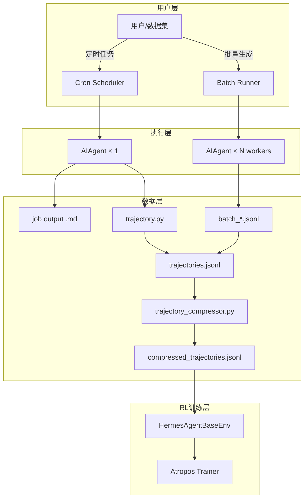
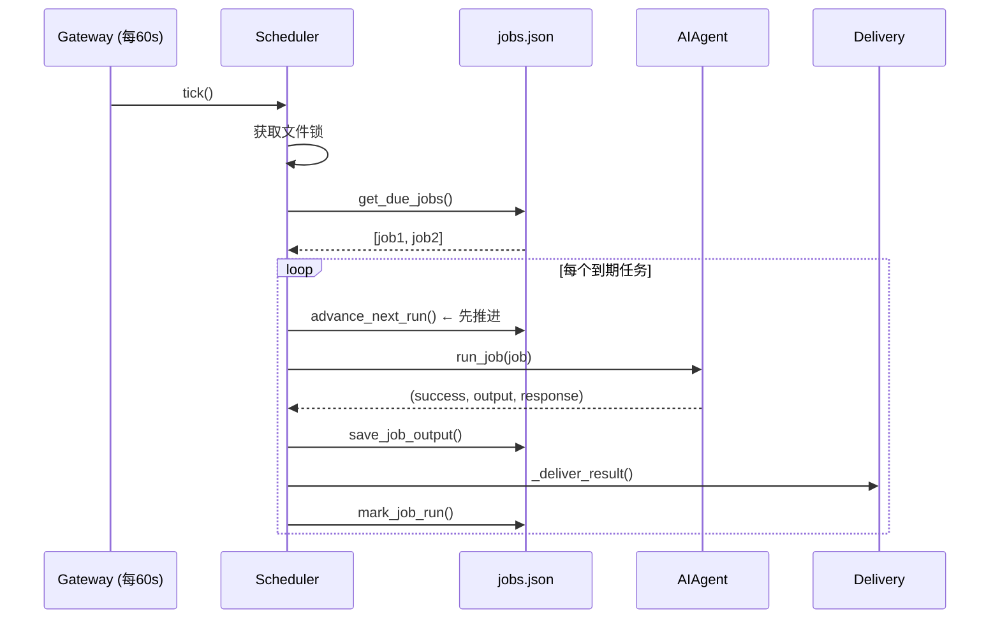
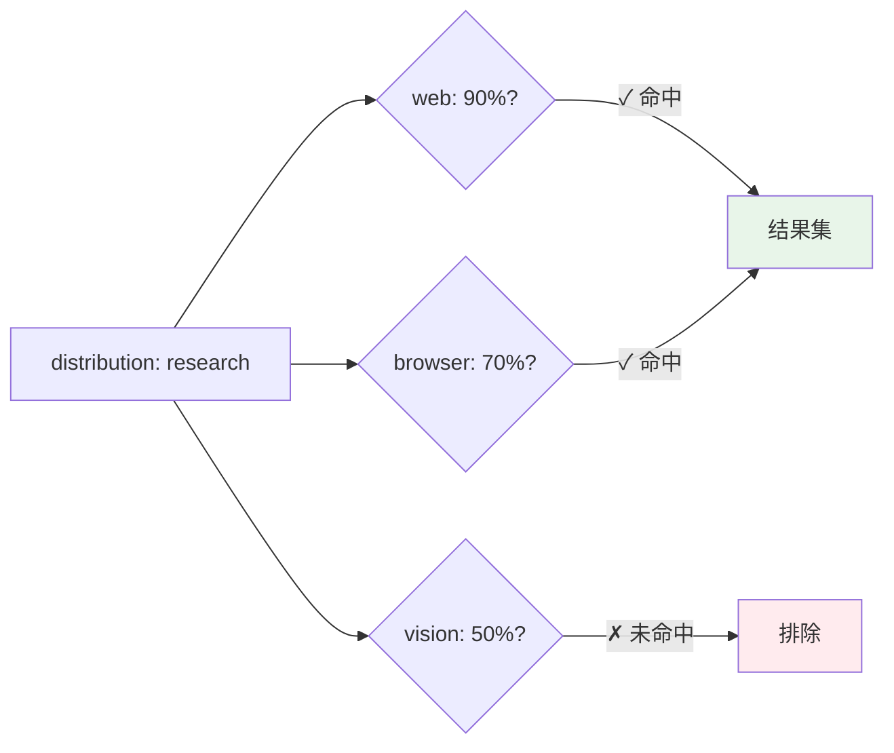
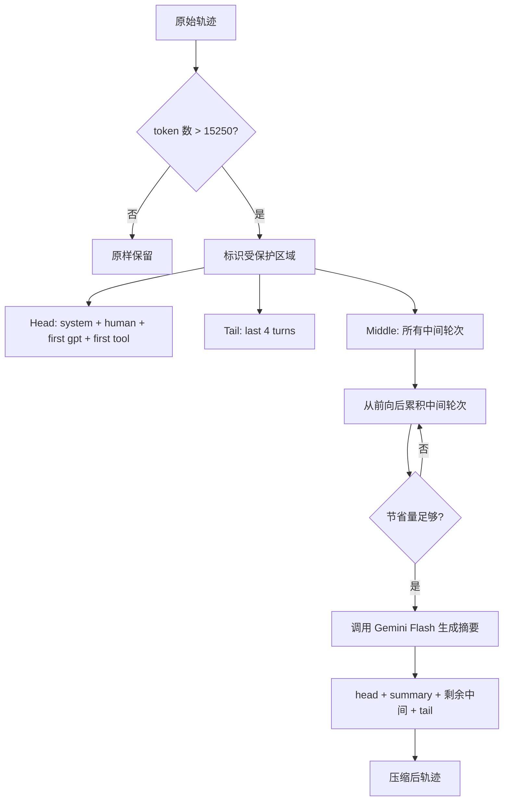
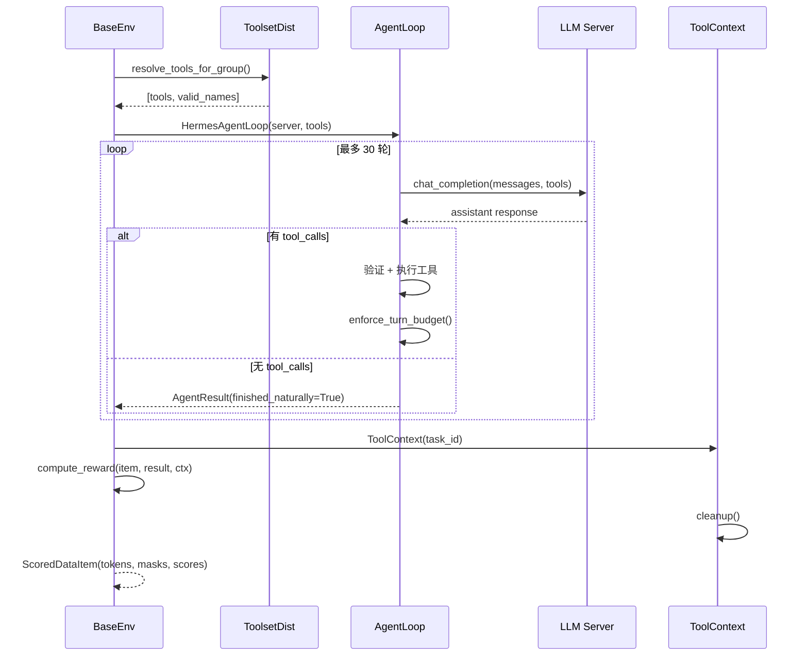

# 第 23 章：批处理与轨迹基础设施

## 23.1 引言

一个 Agent 如果只能一次处理一条用户消息，那它就只是一个聊天机器人。Hermes Agent 之所以能从"单次交互工具"演化为"规模化数据生产平台"，核心在于三层后台基础设施的协同——**Cron 调度系统**、**批处理运行器 (Batch Runner)** 和**轨迹 (Trajectory) 管道**。

这三层解决了截然不同的问题：

| 层级 | 核心职责 | 入口文件 |
|------|---------|---------|
| **Cron 调度** | 定时/周期性自动执行 Agent 任务 | `cron/scheduler.py`、`cron/jobs.py` |
| **批处理运行器** | 从数据集批量生成训练轨迹 | `batch_runner.py` |
| **轨迹管道** | 轨迹保存、压缩、格式化 | `agent/trajectory.py`、`trajectory_compressor.py` |

此外，`environments/` 目录下的 **Atropos 集成层**将上述管道与强化学习训练框架对接，形成完整的数据→训练闭环。



---

## 23.2 Cron 调度系统

### 23.2.1 三文件协作

Cron 调度的职责被精确分割到三个文件中：

| 文件 | 职责 | 核心 API |
|------|------|---------|
| `cron/jobs.py` | Job 的增删改查与持久化 | `create_job()`、`load_jobs()`、`save_jobs()`、`mark_job_run()` |
| `cron/scheduler.py` | 定时触发与结果投递 | `tick()`、`run_job()`、`_deliver_result()` |
| `tools/cronjob_tools.py` | Agent 可调用的工具接口 | `cronjob(action=...)` 统一入口 |

存储结构极其简洁——没有数据库，只有 JSON 文件：

```
~/.hermes/cron/
├── jobs.json                    # 所有 job 的 JSON 数组
└── output/
    └── {job_id}/
        └── {timestamp}.md      # 每次运行的 Markdown 输出
```

### 23.2.2 Job 数据模型

每个 Job 是一个包含丰富元数据的字典：

```python
{
    "id": "uuid",
    "name": "每日新闻摘要",
    "prompt": "搜索今天的科技新闻并写一份摘要",
    "skills": ["web_search", "writing"],    # 可选，关联技能
    "schedule": {"type": "interval", "seconds": 1800},
    "schedule_display": "every 30m",
    "enabled": True,
    "state": "scheduled",                   # scheduled|paused|completed
    "repeat": {"times": 5, "completed": 0}, # None = 无限重复
    "deliver": "origin",                    # origin|local
    "origin": {"platform": "telegram", "chat_id": "123"},
    "model": "claude-opus-4-20250514",
    "next_run_at": "2026-04-15T12:00:00",
    "last_run_at": "2026-04-15T11:30:00",
    "last_status": "ok",
}
```

`schedule` 支持三种格式，通过 `parse_schedule()` 统一解析：

| 格式 | 示例 | 依赖 |
|------|------|------|
| Cron 表达式 | `"30 9 * * *"` | 可选 `croniter` 库 |
| Interval | `"every 30m"`、`"every 2h"` | 内置 `parse_duration()` |
| One-shot | `"in 5m"`、`"in 1h"` | 内置，一次性执行 |

一个优雅的降级设计：`HAS_CRONITER` 标志控制 cron 表达式是否可用。未安装 croniter 时，系统仍可正常工作，只是不支持标准 cron 表达式。

### 23.2.3 Tick 机制与预推进模式

调度器的心脏是 `tick()` 函数，由 Gateway 后台线程每 60 秒调用一次：

```python
def tick(verbose=True, adapters=None, loop=None) -> int:
    # 1. 文件锁 — 跨进程互斥
    lock_fd = open(_LOCK_FILE, "w")
    fcntl.flock(lock_fd, LOCK_EX | LOCK_NB)

    # 2. 获取到期任务
    due_jobs = get_due_jobs()

    # 3. 逐个执行
    for job in due_jobs:
        advance_next_run(job["id"])       # ← 预推进！
        success, output, response, error = run_job(job)
        save_job_output(job["id"], output)
        _deliver_result(job, response)    # 投递到 Telegram/Discord/...
        mark_job_run(job["id"], success, error)
```

这里有一个值得注意的**预推进模式 (Pre-Advance Pattern)**：`advance_next_run()` 在任务执行*之前*就推进了 `next_run_at`。这样即使 Agent 在执行过程中崩溃，重启后也不会重复触发同一任务。唯一的例外是 one-shot 任务，允许在失败时重试。



### 23.2.4 任务执行的安全边界

`run_job()` 在实例化 AIAgent 时施加了严格的安全限制：

- **禁用工具集**：`["cronjob", "messaging", "clarify"]` — 防止 Cron 任务创建新 Cron 任务（递归风险）
- **`skip_context_files=True`** — 不注入 SOUL.md/AGENTS.md
- **`skip_memory=True`** — 不加载用户记忆，防止上下文污染
- **活动超时**：基于 Agent 活动追踪器，默认 600 秒无活动即超时（注意不是固定超时）
- **SILENT 标记**：Agent 回复 `[SILENT]` 时跳过投递

```python
# 基于不活动的超时 — 不是 "最多运行 10 分钟"
# 而是 "如果 10 分钟没有任何活动，则超时"
while True:
    done, _ = concurrent.futures.wait({future}, timeout=POLL_INTERVAL)
    if done: break
    idle_secs = agent.get_activity_summary()["seconds_since_activity"]
    if idle_secs >= inactivity_limit:
        raise TimeoutError(...)
```

### 23.2.5 Cron 工具 API 与安全扫描

`cronjob_tools.py` 提供的 `cronjob()` 函数是 Agent 管理定时任务的统一入口：

```python
cronjob(action="create|list|get|update|delete|pause|resume|trigger|history",
        job_id=..., prompt=..., schedule=..., ...)
```

安全扫描层 `_scan_cron_prompt()` 检测 10 种威胁模式：

- **Prompt 注入** — 检测试图覆盖系统指令的文本
- **数据外泄** — 检测 curl/wget 等外发数据的命令
- **破坏性操作** — 检测 rm -rf / 等危险命令
- **隐形字符** — 检测 U+200B (零宽空格)、U+FEFF (BOM) 等不可见 Unicode 字符
- **脚本路径验证** — 必须相对于 `~/.hermes/scripts/`，禁止绝对路径和 `..` 遍历

---

## 23.3 批处理运行器 (Batch Runner)

### 23.3.1 架构总览

`batch_runner.py` 是大规模训练数据生产的核心引擎。它从 JSONL 数据集中加载 prompt，通过多进程并行运行 Agent，最终产出 ShareGPT 格式的训练轨迹。

```
JSONL Dataset → BatchRunner → AIAgent × N workers → batch_*.jsonl → trajectories.jsonl
                    ↕
           checkpoint.json (断点续传)
```

### 23.3.2 BatchRunner 配置

```python
class BatchRunner:
    def __init__(self,
        dataset_file: str,              # JSONL 输入文件
        batch_size: int,                # 每批大小
        run_name: str,                  # 运行名称（决定输出目录）
        distribution: str = "default",  # 工具集分布
        max_iterations: int = 10,       # 每个 prompt 最大工具调用轮次
        model: str = "claude-opus-4-20250514",
        num_workers: int = 4,           # 并行进程数
        reasoning_config: dict = None,  # 推理配置
        prefill_messages: list = None,  # 预填充消息
        max_samples: int = None,        # 限制处理总数
    )
```

### 23.3.3 多进程并行模型

BatchRunner 选择了 `ProcessPoolExecutor` 而非 `ThreadPoolExecutor`——这是一个深思熟虑的决定。由于每个 Agent 执行涉及大量 CPU 密集型操作（JSON 序列化、工具结果解析等），多进程模型可以真正绕过 GIL 限制。

```python
with ProcessPoolExecutor(max_workers=num_workers) as executor:
    futures = {
        executor.submit(process_single_prompt, prompt, ...): prompt_index
        for prompt_index, prompt in prompts_to_process
    }
    for future in as_completed(futures):
        result = future.result()
        # 收集工具统计、推理统计
```

并行策略是**批内并行、批间串行**——每个 batch 内部的 prompt 并行处理，但 batch 之间按顺序执行。这平衡了资源利用率和断点续传的粒度。

### 23.3.4 断点续传

长时间的批量生成不可避免会遇到中断。`checkpoint.json` 记录了所有已完成的 prompt 索引：

```json
{
    "completed_prompts": [0, 1, 2, 5, 8],
    "run_name": "my_run",
    "distribution": "default"
}
```

恢复时，`prompts_to_process` 自动过滤掉已完成的索引，只处理剩余项。这意味着即使在第 500 条 prompt 时崩溃，也不需要从头开始。

### 23.3.5 工具集概率分布

`toolset_distributions.py` 定义了一套基于概率的工具组合策略：

```python
DISTRIBUTIONS = {
    "default":      {"web": 100, "vision": 100, "terminal": 100, "file": 100},
    "development":  {"terminal": 80, "file": 80, "moa": 60, "web": 30},
    "research":     {"web": 90, "browser": 70, "vision": 50},
    "terminal_tasks": {"terminal": 97, "file": 97},
    "browser_tasks":  {"browser": 97, "vision": 12},
    "creative":     {"image_gen": 90, "vision": 90, "web": 30},
}
```

每个数值是**包含概率（百分比）**，而非权重。`sample_toolsets_from_distribution()` 对每个工具集独立进行**伯努利采样**：



这种设计的意义在于训练数据多样性：模型在不同工具组合下学习解决问题，而不是总是依赖完整的工具集。一个被 50% 概率排除的 "vision" 工具意味着模型必须学会在没有图像分析的情况下也能完成部分任务。

### 23.3.6 合并与质量过滤

`run()` 完成所有批次后，执行合并和过滤：

```python
VALID_TOOLS = ALL_POSSIBLE_TOOLS  # 来自 model_tools.TOOL_TO_TOOLSET_MAP
for entry in all_entries:
    invalid_tools = [k for k in entry["tool_stats"] if k not in VALID_TOOLS]
    if invalid_tools:
        # 跳过该条目 — 模型幻觉了不存在的工具名
        filtered_entries += 1
        continue
    merged.append(entry)
```

过滤器检测两类问题：
1. **幻觉工具名** — 模型调用了不存在的工具（如 `google_search` 而非 `web_search`）
2. **JSON 解码错误** — 损坏的轨迹条目

最终产物是一个干净的 `trajectories.jsonl`，同时附带工具使用率和推理覆盖率的统计报告。

---

## 23.4 轨迹管道 (Trajectory Pipeline)

### 23.4.1 基础保存：trajectory.py

`agent/trajectory.py` 只有 56 行，但承担着轨迹持久化的核心职责：

```python
def save_trajectory(trajectory, model, completed, filename=None):
    """追加写入 JSONL"""
    entry = {
        "conversations": trajectory,      # ShareGPT 格式
        "timestamp": datetime.now().isoformat(),
        "model": model,
        "completed": completed,
    }
    with open(filename, "a") as f:
        f.write(json.dumps(entry) + "\n")
```

输出采用 **ShareGPT 格式**，这是 LLM 微调领域的事实标准：

```json
{
    "conversations": [
        {"from": "system", "value": "You are Hermes..."},
        {"from": "human", "value": "Search for..."},
        {"from": "gpt", "value": "<think>Let me search...</think>\n<tool_call>..."},
        {"from": "tool", "value": "{\"results\": [...]}"},
        {"from": "gpt", "value": "Based on my research..."}
    ],
    "tool_stats": {"web_search": {"count": 3, "success": 3, "failure": 0}},
    "reasoning_stats": {"total_assistant_turns": 4, "turns_with_reasoning": 3},
    "model": "claude-opus-4-20250514",
    "timestamp": "2026-04-15T23:30:00"
}
```

两个辅助函数值得关注：
- **`convert_scratchpad_to_think()`** — 将 `<REASONING_SCRATCHPAD>` 标签转为 `<think>` 标签（格式统一化）
- **`has_incomplete_scratchpad()`** — 检测未闭合的推理标签，这是截断的指标

### 23.4.2 轨迹压缩器：trajectory_compressor.py

当 Agent 在复杂任务中执行了数十轮工具调用后，轨迹可能膨胀到 30,000+ tokens。直接用于训练不仅浪费计算资源，还可能超出模型的上下文窗口。`trajectory_compressor.py`（1462 行）就是解决这一问题的 LLM 驱动压缩引擎。

#### 压缩配置

```python
@dataclass
class CompressionConfig:
    tokenizer_name: str = "moonshotai/Kimi-K2-Thinking"
    target_max_tokens: int = 15250           # 目标 token 上限
    summary_target_tokens: int = 750         # 摘要目标 token
    summarization_model: str = "google/gemini-3-flash-preview"
    protect_last_n_turns: int = 4            # 尾部保护轮数
    max_concurrent_requests: int = 50        # 最大并发 API 调用
    per_trajectory_timeout: int = 300        # 单条轨迹超时 (5 min)
```

#### 受保护区域压缩算法

这是本章最精巧的设计之一。压缩器将轨迹划分为三个区域：

```
原始轨迹 (30000 tokens):
┌─────────────────────────────────────────────────────────────┐
│ [Protected Head]     [Compressible Region]   [Protected Tail] │
│ system → human →     tool → gpt → tool →     last 4 turns    │
│ first gpt → first    ...many middle turns...  gpt → tool → gpt│
│ tool result                                                   │
└─────────────────────────────────────────────────────────────┘

压缩后 (15000 tokens):
┌─────────────────────────────────────────────────────────────┐
│ [Protected Head]  [CONTEXT SUMMARY]          [Protected Tail] │
│ system → human →  "The assistant searched     last 4 turns    │
│ first gpt → tool  three databases, found..."  gpt → tool → gpt│
└─────────────────────────────────────────────────────────────┘
```



核心步骤：

1. **Token 计数** — 使用 `moonshotai/Kimi-K2-Thinking` tokenizer 精确计数
2. **判定是否需要压缩** — 总 token > 15250 时触发
3. **标识受保护区域** — Head 保留任务定义和初始策略；Tail 保留最终行动和结论
4. **计算压缩量** — `tokens_to_save = total - target + summary_target`
5. **累积中间轮次** — 从 `compress_start` 向后累积，直到节省量足够
6. **LLM 生成摘要** — 调用 Gemini Flash 生成 `[CONTEXT SUMMARY]` 前缀的摘要
7. **构建压缩轨迹** — 拼接三部分

#### 异步批量处理

压缩大量轨迹时，API 调用延迟是瓶颈。压缩器使用 `asyncio.Semaphore` 限流并发：

```python
async def _process_directory_async(self, input_dir, output_dir):
    semaphore = asyncio.Semaphore(self.config.max_concurrent_requests)  # 50
    tasks = [process_single(...) for entry in all_entries]
    await asyncio.gather(*tasks)
```

容错设计：API 调用失败时不会中断整个管道，而是生成固定文本 `[Summary generation failed ...]` 作为降级方案。

#### 压缩指标

每条轨迹追踪完整的压缩指标：

| 指标 | 说明 |
|------|------|
| `original_tokens` | 压缩前 token 数 |
| `compressed_tokens` | 压缩后 token 数 |
| `compression_ratio` | 压缩比 |
| `turns_removed` | 被移除的轮次数 |
| `summarization_api_calls` | 摘要 API 调用次数 |
| `still_over_limit` | 压缩后仍超标的标志 |

---

## 23.5 Agent 环境与 Atropos RL 集成

### 23.5.1 HermesAgentBaseEnv — RL 训练环境基类

`environments/hermes_base_env.py` 是所有 Hermes RL 环境的抽象基类，集成 **Atropos** 强化学习框架。它定义了一个优雅的双阶段架构：

| Phase | Server 类型 | 用途 | Token 处理 |
|-------|------------|------|-----------|
| **Phase 1** | OpenAI Server | SFT 数据生成、评估 | 占位符 tokens |
| **Phase 2** | VLLM/SGLang + ManagedServer | RL 训练 | 精确 token IDs + logprobs |

子类必须实现四个方法：

```python
class MyEnv(HermesAgentBaseEnv):
    async def setup(self):          # 加载数据集
    async def get_next_item(self):  # 返回下一个 dataset item
    def format_prompt(self, item):  # 将 item 转为 user message
    async def compute_reward(self, item, result, ctx):  # 打分
```

### 23.5.2 单次 Rollout 流程

`collect_trajectory()` 是 RL 数据生成的核心循环：



### 23.5.3 HermesAgentLoop — 多轮工具调用引擎

`environments/agent_loop.py` 实现了通用的 Agent 循环，核心设计值得深入理解：

**线程池隔离**：Agent loop 使用独立的 `ThreadPoolExecutor(128)` 执行工具调用。这解决了一个微妙的死锁问题——Modal/Docker/Daytona 等后端内部调用 `asyncio.run()`，而 Atropos 已有自己的事件循环，嵌套事件循环会死锁。每个工具调用在独立线程中获得干净的事件循环，彻底避免冲突。

```python
# 工具调用在独立线程中执行
tool_result = await loop.run_in_executor(
    _tool_executor,  # ThreadPoolExecutor(128)
    lambda: handle_function_call(name, args, task_id=task_id)
)
```

**上下文膨胀控制**：`maybe_persist_tool_result()` 将超大工具结果持久化到文件，`enforce_turn_budget()` 在接近轮次上限时提示模型收敛。

### 23.5.4 ToolContext — 奖励函数的工具访问

`ToolContext` 是 RL 训练中最巧妙的设计之一。奖励函数 `compute_reward()` 可以通过 ToolContext 访问 Agent 的完整沙箱环境——执行终端命令、读取文件、搜索内容：

```python
class ToolContext:
    def __init__(self, task_id: str):
        self.task_id = task_id  # 复用 rollout 的沙箱

    def terminal(self, command, timeout=180) -> Dict:
        """在 rollout 的终端会话中执行命令"""
        return _run_tool_in_thread("terminal", {"command": command}, self.task_id)

    def read_file(self, path) -> Dict: ...
    def write_file(self, path, content) -> Dict: ...
    def search_files(self, pattern, path=".") -> Dict: ...

    def cleanup(self):
        """清理 rollout 的终端/浏览器沙箱"""
        cleanup_vm(self.task_id)
        cleanup_browser(self.task_id)
```

核心理念：Agent 创建的文件、运行的进程、打开的浏览器标签——奖励函数都能直接访问来验证结果。这使得编写精确的奖励函数变得直观，例如"检查 Agent 是否真的创建了一个能通过测试的 Python 文件"。

---

## 23.6 关键设计模式

### 预推进模式 (Pre-Advance Pattern)

Cron 调度器在执行任务*之前*就推进 `next_run_at`，确保崩溃恢复时不会重复触发。这是分布式系统中"at-most-once"语义的简洁实现。

### 受保护区域压缩 (Protected-Region Compression)

轨迹压缩只触碰中间区域，保护头部（任务定义）和尾部（最终结论）。这确保了训练数据中任务描述和结果完整性，而重复性的中间搜索/操作被摘要替代。

### 伯努利工具集采样 (Bernoulli Toolset Sampling)

不是选择一个固定工具集，而是对每个工具独立进行概率采样。这产生了组合爆炸级别的工具配置多样性，使模型学会适应不同的工具可用性。

### 双阶段服务器架构 (Two-Phase Server)

Phase 1 用标准 OpenAI API 快速生成和评估，Phase 2 切换到 VLLM 获取精确的 token IDs 和 logprobs 用于 RL 训练。同一环境代码支持两种模式，通过配置切换。

### 活动追踪超时 (Activity-Based Timeout)

不是"最多运行 N 分钟"，而是"N 分钟没有任何活动就超时"。这对长时间运行但持续产出的 Agent 任务更友好——一个搜索了 20 分钟但一直在活跃调用工具的任务不会被误杀。

---

## 23.7 端到端数据流

三个子系统的数据流汇总如下：

**Cron 数据流：**
```
User → cronjob(action="create") → jobs.json
Gateway 每 60s → tick() → get_due_jobs() → run_job()
  → AIAgent.run_conversation(prompt)
  → save_job_output() → ~/.hermes/cron/output/{id}/{ts}.md
  → _deliver_result() → Telegram/Discord/Slack/...
  → mark_job_run() → jobs.json
```

**Batch 数据流：**
```
JSONL dataset → BatchRunner.run()
  → ProcessPoolExecutor(4) × process_single_prompt()
    → AIAgent → ShareGPT trajectory
  → batch_*.jsonl → 过滤幻觉工具 → trajectories.jsonl
  → TrajectoryCompressor → compressed_trajectories.jsonl
```

**RL 训练数据流：**
```
HermesAgentBaseEnv.collect_trajectories(item)
  → resolve_tools_for_group()    # 伯努利采样工具集
  → collect_trajectory(item)     # N 次并行 rollout
    → HermesAgentLoop.run()      # 多轮 tool-calling
    → ToolContext → compute_reward()  # 沙箱验证 + 打分
  → ScoredDataItem(tokens, masks, scores)
  → Atropos trainer → 模型更新
```

---

## 23.8 本章小结

本章深入分析了 Hermes Agent 从"单次交互"扩展到"规模化数据生产"的三大基础设施层。核心要点：

1. **Cron 调度系统**采用极简的 JSON 文件存储 + 文件锁 + 预推进模式，在不引入数据库依赖的前提下实现了可靠的定时任务调度，并通过活动追踪超时和安全扫描确保了运行时的健壮性。

2. **批处理运行器**通过 `ProcessPoolExecutor` 多进程并行、断点续传、伯努利工具集采样等机制，实现了高效且可恢复的大规模轨迹生成。质量过滤层检测并剔除了工具幻觉等问题数据。

3. **轨迹管道**从 56 行的基础保存到 1462 行的 LLM 驱动压缩器，形成了完整的数据后处理流水线。受保护区域压缩算法在保留关键信息的同时将轨迹压缩到目标 token 数以内。

4. **Atropos 集成层**通过双阶段服务器架构、线程池隔离、ToolContext 沙箱共享等设计，将 Agent 执行能力无缝对接到强化学习训练循环中。

这些基础设施层的共同特征是**务实的工程设计**——JSON 文件而非数据库、文件锁而非分布式协调、进程池而非复杂的任务队列。在 Agent 系统快速迭代的早期阶段，这种简洁性比过度工程化更有价值。
