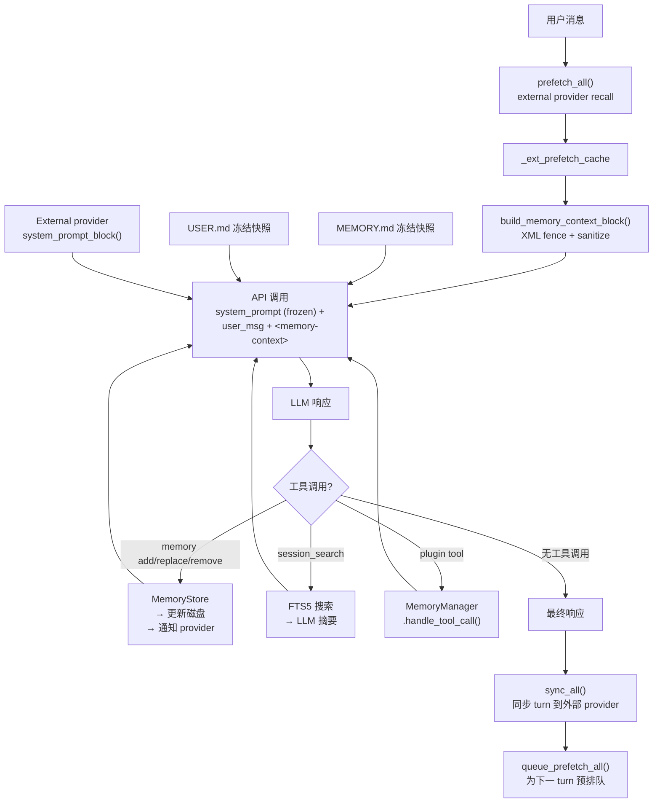

## 16-子智能体系统
### 总结
本章深入分析了 Hermes Agent 的子智能体委托系统。核心要点：

1. **Context 隔离是基石**：子 Agent 拥有全新的对话历史、独立的 system prompt 和独立的迭代预算，不会污染父 Agent 的上下文窗口。

2. **安全性通过多重防护实现**：工具黑名单、toolset 过滤、父工具集交集约束、递归深度限制——每一层都是独立的安全网。

3. **并行执行有严格的边界**：`ThreadPoolExecutor` 提供并发能力，但通过 `max_concurrent_children` 和双层防护限制并发度，防止资源爆炸。

4. **生命周期管理面面俱到**：心跳机制防止超时误杀，中断传播确保优雅停止，`finally` 块保证资源释放。

5. **全局状态管理是现实的妥协**：`_last_resolved_tool_names` 的 Save-Restore 模式不够优雅，但它务实地解决了进程级全局变量在并发环境下的问题。

6. **独立预算是经验教训**：从 v0.2.0 的共享预算到 v0.5.0 的独立预算，这个演变说明了子 Agent 预算隔离的重要性。

子智能体委托是 Hermes 实现"分而治之"的核心机制。通过精心的隔离设计，它让 Agent 能够将复杂任务分解为独立的子任务，在保持安全边界的同时实现并行执行，最终只向父 Agent 返回精炼的结果。

与deerflow2.0的区别
subagent与父agent的交互有区别
deerflow2.0 子gent可以看到父agent的消息，而hermes则是生成子agent的sys_prompt的做法
Hermes中子agent无法使用父agent没有的工具

---
## 17-记忆系统
### 总结
Hermes 的记忆系统是一个精心设计的多层架构，解决了 AI Agent 在实际使用中面临的核心挑战：

1. **什么值得记住？** 通过 `memory` vs `user` 双存储和 schema 中的行为指导，引导 LLM 做出正确的记忆决策
2. **如何安全注入？** 冻结快照保护 prefix cache，context fencing 防止注入攻击，安全扫描拦截恶意内容
3. **如何回忆过去？** FTS5 全文搜索 + LLM 辅助摘要，零外部依赖实现跨会话记忆
4. **如何扩展？** MemoryProvider ABC + 插件发现机制，8 个内置插件开箱即用
5. **如何在并发环境中可靠运行？** 文件锁 + 原子写入 + 锁内重载的 Safe RMW 模式

### 数据流全景

下面用一个完整的数据流图总结记忆系统在一个 turn 中的所有交互：



---
## 18-技能系统
### 总结
Hermes Agent 的技能系统是一个精心设计的**程序性记忆层**，它将可复用的工作流知识从 Agent 的"短期对话"上下文提升到了"持久化存储"层面。

**核心亮点：**

1. **SKILL.md 格式**——用结构化 Markdown 编码工作流知识，frontmatter 提供丰富的元数据（平台约束、条件激活、配置变量、环境依赖）
2. **惰性加载 + 两层缓存**——在保持丰富技能库的同时控制 token 开销和启动延迟
3. **安全扫描引擎**——60+ 条规则覆盖六类威胁，信任级别 × 扫描结果的策略矩阵精确控制安装决策
4. **闭环自我进化**——Agent 不仅消费技能，还能创建和改进技能，通过 MD5 哈希同步保护用户自定义
5. **Skills Hub 生态**——完整的包管理体验（browse/search/install/publish/tap），支撑技能的社区化分发

从工程角度看，技能系统展示了一个重要的设计哲学：**Agent 的知识不应该只存在于模型权重或系统提示中，而应该有一个可以持续演进的外部知识库。** 这使得 Hermes Agent 不再是一个静态的工具，而是一个能够不断积累和完善工作流知识的学习系统。

### 完整数据流

#### 启动时技能初始化

```
hermes 启动
  → sync_skills()          — 同步内置技能到 ~/.hermes/skills/
  → build_skills_system_prompt()  — 构建技能索引
    → 尝试 L1 缓存 → 尝试 L2 磁盘快照 → 回退到文件系统扫描
  → scan_skill_commands()  — 构建斜杠命令映射
  → 技能索引注入系统提示
```

#### 用户交互时技能加载

```
用户提问或使用 /skill-name
  → Agent 识别相关技能（从系统提示索引）
  → Agent 调用 skill_view("skill-name")
    → 查找 SKILL.md → 解析 frontmatter
    → 检查环境变量就绪状态
    → 注册 env passthrough（用于沙箱环境）
    → 注册 credential files
    → 返回完整内容 + 元数据
  → Agent 按照技能指令执行任务
  → (可选) Agent 使用 skill_manage(action='patch') 改进技能
```

#### 技能安装流程

```
/skills install owner/repo/skill
  → _resolve_short_name()  — 解析标识符
  → 下载技能文件
  → scan_skill(skill_dir, source)  — 安全扫描
    → 确定 trust_level → 确定 verdict → should_allow_install()
  → 通过 → 复制到 ~/.hermes/skills/
  → 阻止 → 显示扫描报告, 拒绝安装
  → clear_skills_system_prompt_cache()  — 使缓存失效
```

--- 
## 19-安全体系

### 总结
Hermes Agent 的安全体系体现了**纵深防御**的工程哲学：

1. **不信任任何单一防线。** 从 38+ 个危险模式检测到 Tirith 引擎扫描，从手动审批到 Smart Approve，从 pre-flight URL 检查到 post-redirect SSRF guard——每一层都独立运作。

2. **在安全性和可用性之间做务实的权衡。** MCP 注入检测选择 WARNING 而非 BLOCK；Tirith 默认 fail-open；沙箱环境自动跳过审批。

3. **透明地记录限制。** DNS rebinding 漏洞被明确写在代码注释中，而非假装它不存在。

4. **以 ContextVar 实现会话隔离。** 确保多租户环境下的安全边界不被跨会话操作打破。

对于正在构建 AI Agent 系统的开发者而言，Hermes 的安全架构提供了一个完整的参考实现——不是完美的（DNS rebinding 仍是 open issue），但足够务实、足够深入、足够透明。

| 核心文件 | 行数 | 核心职责 |
|----------|------|----------|
| `tools/tirith_security.py` | 670 | Tirith 引擎包装、自动安装、供应链验证 |
| `tools/approval.py` | 926 | 危险模式检测、审批状态、Smart Approve |
| `tools/skills_guard.py` | 928 | Skill 静态分析、484+ 威胁模式、信任模型 |
| `tools/url_safety.py` | 97 | SSRF pre-flight 检查 |
| `tools/path_security.py` | 43 | 路径遍历防护 |
| `agent/redact.py` | 181 | 秘密脱敏、日志集成 |
| `tools/env_passthrough.py` | 101 | 环境变量白名单、ContextVar 隔离 |
| `tools/mcp_tool.py` | 2273 | MCP 安全上下文、注入扫描、sampling 限制 |

