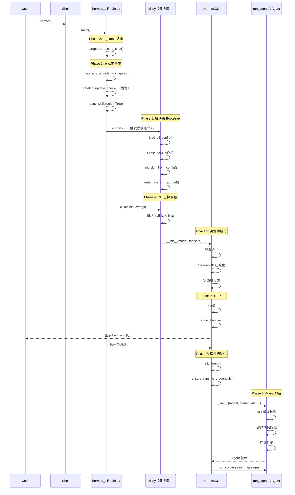
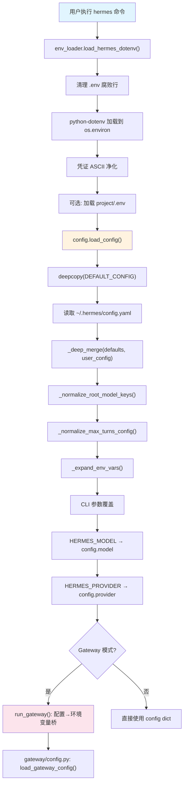

## 02-启动链路
### 总结
```python
# 完整链路
HermesCLI.run->HermesCLI.run.process_loop(后台持续监控)->HermesCLI.chat->HermesCLI.chat.run_agent->AIAgent.run_conversation->agent.conversation_loop.run_conversation

# 在agent.conversation_loop.run_conversation中
#会有turn_context/turn_summary/turn_retry_state/turn_finalizer函数进行辅助

#llm_api_call循环出现在agent.conversation_loop.run_conversation中，采用react方式直至response中无工具调用

#整个循环中任意环节可打断
```

### 完整时序图

---
## 03-配置系统
### 总结
Hermes 的配置系统展示了一个成熟 CLI 框架应有的配置管理水准：

1. **四层覆盖**保证了灵活性——从硬编码默认到 CLI 参数，每层都可以精确覆盖
2. **`_deep_merge()`** 让用户只需关注差异，不必复制完整配置
3. **Config Migration** 让版本升级对用户透明，无需手动修改配置文件
4. **Gateway 配置桥** 优雅地解决了跨进程配置传递问题
5. **Profile 系统** 通过目录级隔离提供了简单可靠的多环境支持
6. **安全加固** 从文件权限到凭证净化，层层防护

### 配置数据流：从启动到就绪

Hermes 的配置加载并非一次完成，而是分阶段、分层级地逐步构建。以下是一次完整的配置加载时序：


---
## 04-状态持久化
### 总结
Hermes 的状态持久化层是一个教科书级的 SQLite 工程实践。在一个 1238 行的文件中，它实现了：

- **完整的会话生命周期管理**——从创建到分裂再到剪枝
- **高并发写入安全**——WAL + 双层锁 + 随机抖动重试
- **高效全文搜索**——FTS5 content-sync 模式 + 精心设计的查询清洗
- **灵活的谱系追踪**——通过 `parent_session_id` 链式关联
- **渐进式 Schema 演进**——幂等迁移确保向后兼容
