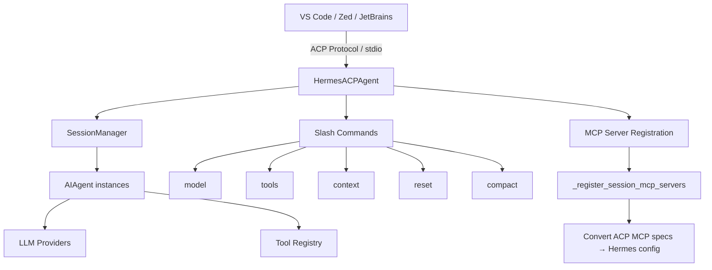

## 11-工具注册表设计
### 总结
Hermes Agent 的工具注册表是一个精心设计的中央协调层。让我们回顾核心要点：

1. **AST 发现是零成本抽象**：通过静态分析避免导入不含工具的模块，比遍历所有模块再过滤更高效，也更安全

2. **Schema 是真理之源**：所有 handler、check_fn、元数据都与 schema 一起注册到同一个 `ToolEntry` 中，不存在分散的映射表

3. **防幻觉 Schema 重写**：`execute_code` 和 `browser_navigate` 的动态 schema 修改确保 LLM 只看到真正可用的工具信息

4. **参数自动修正**：`coerce_tool_args` 处理 LLM 常见的类型错误（`"42"` → `42`），提高系统鲁棒性

5. **层次化 Toolset 设计**：通过 `includes` 实现 Composite 模式，`_HERMES_CORE_TOOLS` 单一定义确保所有平台（CLI、Telegram、Discord 等）工具集一致

6. **MCP 冲突保护**：内置工具不可被外部覆盖，但 MCP-to-MCP 覆写允许，在安全性和灵活性之间取得平衡

7. **双层错误保护**：`dispatch()` 和 `handle_function_call()` 各自捕获异常，确保任何工具执行失败都不会导致 Agent 崩溃

这套设计让 Hermes Agent 能够优雅地管理从 4 个到 400 个工具的扩展，同时保持启动速度、运行稳定性和开发者友好性。下一章我们将深入探讨这些工具中最核心的一类——终端与文件操作工具的实现细节。
### 数据流

```mermaid
flowchart TB
    LLM[LLM Response<br/>tool_call] --> HFC[handle_function_call]
    HFC --> COERCE[coerce_tool_args<br/>类型强制转换]
    COERCE --> AGENT{Agent-loop<br/>工具?}
    AGENT -->|todo/memory/...| STUB[返回 stub error<br/>由 agent loop 处理]
    AGENT -->|普通工具| HOOK[pre_tool_call hook]
    HOOK -->|blocked| BLOCK[返回 block error]
    HOOK -->|allowed| DISPATCH[registry.dispatch]
    DISPATCH --> ENTRY{ToolEntry<br/>存在?}
    ENTRY -->|No| ERR[返回 unknown tool error]
    ENTRY -->|Yes| ASYNC{is_async?}
    ASYNC -->|Yes| BRIDGE[_run_async bridge]
    ASYNC -->|No| EXEC[handler&#40;args&#41;]
    BRIDGE --> EXEC
    EXEC -->|Success| RESULT[JSON result string]
    EXEC -->|Exception| WRAP[包装为 JSON error]
    RESULT --> POST[post_tool_call hook]
    WRAP --> POST
```


---
## 12-终端工具深度剖析
### 总结
1. **Terminal 工具是三层架构**：Schema 注册 → 编排调度 → 环境执行
2. **安全审批采用纵深防御**：37 条正则 + 反绕过归一化 + Smart Approval + 容器免检
3. **Spawn-per-call 模型**简单可靠，通过 CWD marker 和环境快照实现状态持久化
4. **后台进程注册表**是完整的进程管理器，支持 8 种操作、watch pattern、crash recovery
5. **七种执行后端**通过策略模式统一接口，每种都有特定的安全/同步策略
6. **输出后处理管线**（截断→清理→脱敏→注释）保证 Agent 看到干净、安全、有用的结果
---

## 13-文件与代码工具
### 总结
Hermes Agent 的文件与代码工具体系展现了几个深层次的架构洞察：

1. **Shell 命令抽象是跨后端的关键**：不使用 Python 文件 I/O，而是通过 shell 命令操作文件，使得同一套代码可以在 local/docker/ssh/modal 上无缝运行。

2. **Context Window 是最珍贵的资源**：100K 字符上限、dedup、循环检测、大文件提示——多层机制保护 LLM 的 context window 不被浪费。

3. **渐进式容错**：fuzzy_match 的 9 策略链体现了对 LLM 输出不确定性的深入理解——从精确匹配逐渐放宽到模糊匹配，在准确性和鲁棒性之间取得平衡。

4. **沙箱隔离**：execute_code 通过 RPC 间接调用工具，子进程无法直接访问 API 密钥或 agent 内部状态，实现了安全隔离。

5. **防御性设计**：从设备路径拦截到敏感路径双重检查，从环境变量过滤到输出脱敏，每一层都假设"最坏情况可能发生"并提前防护。

这套工具体系的设计哲学可以概括为：**让 LLM 高效工作的同时，确保它不会伤害系统或浪费资源**。

---
## 14-Web与浏览器工具
### 总结
Hermes Agent 的 Web 与浏览器工具链是一个设计精良的多层系统：

1. **搜索/提取层** — 四后端抽象（Parallel、Firecrawl、Exa、Tavily），统一的结果归一化，LLM 驱动的智能内容压缩
2. **浏览器自动化层** — 双模式架构（CamoFox REST vs agent-browser CLI），三云 Provider 抽象（Browserbase、Browser Use、Firecrawl），完善的会话生命周期管理
3. **反检测层** — CamoFox 基于 Firefox 指纹欺骗，支持持久身份和 VNC 实时预览
4. **安全层** — 六层纵深防御，从 Secret Exfiltration 到 Post-Redirect SSRF 检查

贯穿整个系统的设计哲学是**策略模式 + 优雅降级 + 多层防御**。每一层都为上层提供稳定的抽象，每一个失败路径都有合理的 fallback，每一个安全检查点都有冗余的防护。这种工程化的严谨性，使得 Hermes Agent 能够在复杂的真实网络环境中可靠地运行。

---
## 15-MCP-与浏览器工具
### 总结
MCP 协议实现是 Hermes 最具工程深度的模块之一。本章的核心收获：

1. **双向架构**：Hermes 不仅消费 MCP 工具生态（客户端），也将自身暴露为 MCP/ACP 服务器，形成完整的协议双向实现。

2. **传输抽象**：通过统一的 `MCPServerTask` 抽象，stdio 和 HTTP 传输对上层完全透明，运行时根据配置自动选择。

3. **专用事件循环**：MCP 的所有异步 I/O 运行在独立的 asyncio 事件循环和守护线程上，通过 `_run_on_mcp_loop()` 实现中断感知的跨线程调度。

4. **多层安全防御**：环境变量过滤、凭据清理、提示注入检测、OSV 恶意软件检查——每一层都有明确的防御目标，且采用 fail-open 策略避免影响可用性。

5. **优雅的生命周期管理**：从指数退避的自动重连，到三层保障的关闭清理，再到孤儿进程的追踪与终止——每个边界条件都被妥善处理。

6. **ACP 适配器**：通过回调工厂和权限桥接，将 Hermes 的完整能力暴露给 IDE，展示了如何在保持内部架构不变的前提下适配新协议。

### 完整的工具调用路径
```
User prompt
  → LLM: function_call(mcp_server_toolname, args)
    → _make_tool_handler._handler(args)
      → _run_on_mcp_loop(async _call(), timeout)
        → server.session.call_tool(tool_name, arguments=args)
          → [MCP JSON-RPC over stdio/HTTP]
            → MCP Server 处理工具调用
          ← CallToolResult(content, isError, structuredContent)
        ← json.dumps({"result": text}) or {"error": sanitized}
      ← result string
    ← tool_result 加入对话
  → LLM: 带工具结果的下一轮对话
```
### 整体架构

