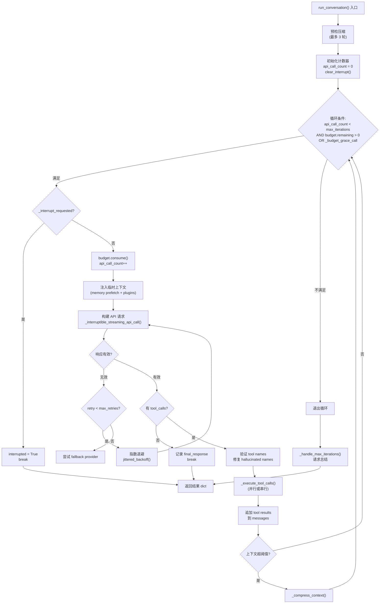
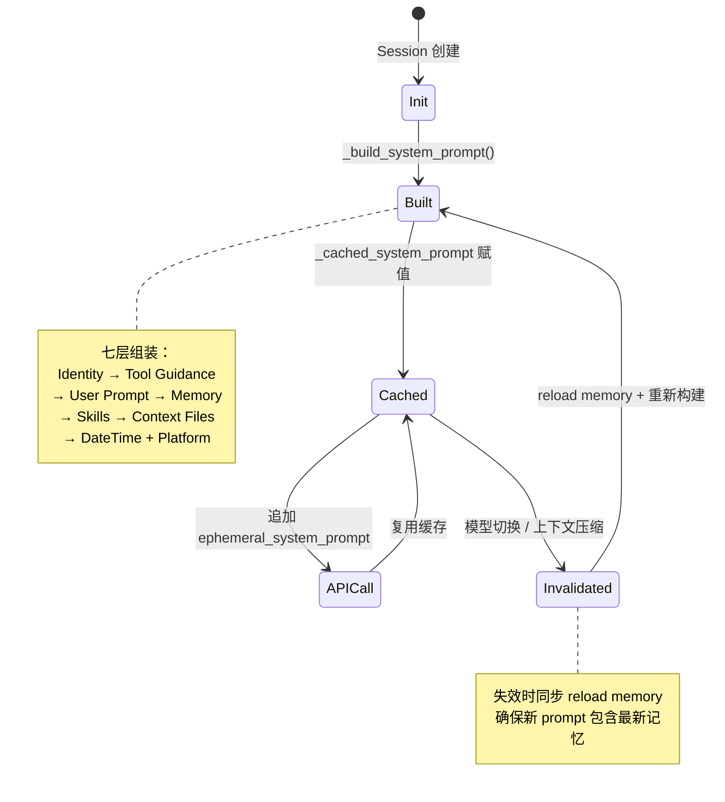
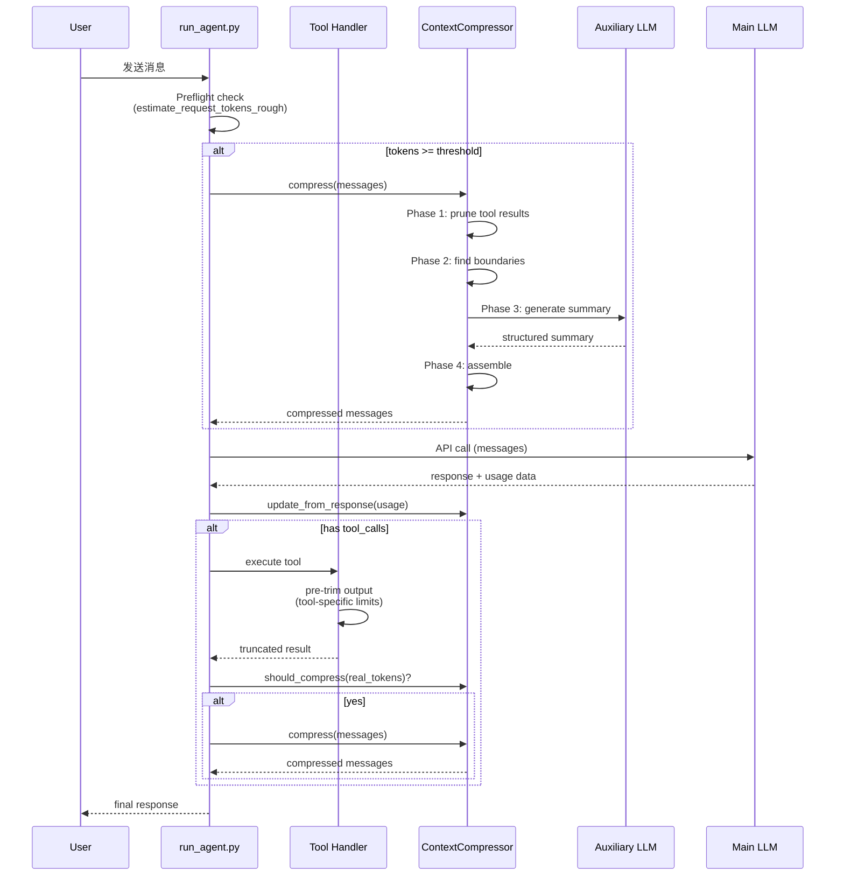
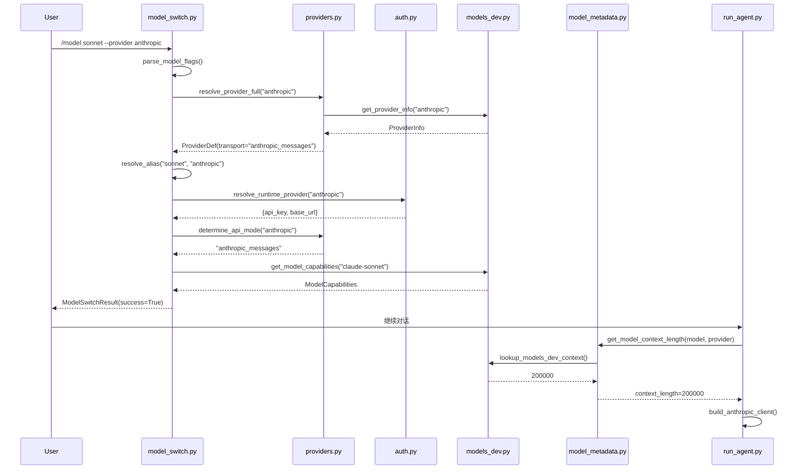

## 05-对话循环
### 总结
对话循环是 Hermes Agent 最复杂的子系统之一。它的核心并不复杂——一个 `while` 循环加上 LLM 调用和工具分发——但真正的工程挑战在于处理所有边缘情况：

1. **预算管理**：`IterationBudget` 通过线程安全的共享计数器，在父子 Agent 之间实现细粒度的资源控制。Grace Call 机制确保预算耗尽时模型仍能给出有意义的回复。

2. **工具调度**：三组工具分类常量（NEVER_PARALLEL、PARALLEL_SAFE、PATH_SCOPED）定义了精确的并发策略。自修复机制让 hallucinated tool name 不再是致命错误。

3. **中断处理**：协作式中断模型在 16 个检查点上确保随时可安全退出，同时保证消息列表的完整性。session 持久化让中断/恢复成为自然的对话延续。

4. **上下文压缩**：Token-budget 尾部保护、boundary alignment、anti-thrashing 等机制，让压缩在保持信息完整性的同时最大化空间回收。

5. **错误韧性**：重试 → fallback provider → 压缩的降级链，加上 jittered backoff 和 streaming 健康检查，让系统能在各种异常条件下继续运行。

这些机制共同构成了一个能在真实生产环境中**长时间稳定运行**的对话引擎——这正是 Hermes 从"demo 级别"迈向"工程级别"的关键一步。

其他细节：
- 共享预算
- 循环中预检压缩
- 工具执行->定义工具并行安全性(非安全、安全、局部安全)->too_calls后判断是否并行->tool_call验证与修复(3次以上会作为assistant回复结束)->tool_call执行失败进行失败结果填充
- 近20+处打断检测，session被中断后会进行持久化存储，方便后续重载
- 消息压缩->循环开始前、循环内压缩->压缩前将上下文保存->context_compressor.compress()压缩成有格式的结果->若有todo，则放进上下文中->创建新session->清除文件去重缓存
- 压缩方法：1、三段式，保留头部尾部，中间历史做结构化摘要；2、Token-Budge尾部保护;3、摘要生成，结构化摘要包含Goal、todo等方面。失败后会降级fallback模型，兜底做消息截断
### 主循环流程

### 设计模式总结
| 模式 | 位置 | 说明 |
|------|------|------|
| **Shared Budget** | `IterationBudget` | 父子 Agent 共享、线程安全的迭代预算 |
| **Grace Call** | 主循环 | 预算耗尽后允许一次宽限 API 调用 |
| **Ephemeral Injection** | API 调用前 | 临时上下文只注入到 API 请求，不持久化 |
| **Self-Correction Loop** | Tool 验证 | 工具名错误返回给模型自纠正（最多 3 次） |
| **Cooperative Interruption** | 中断系统 | 标志位检查而非强制终止，保证一致性 |
| **Iterative Summarization** | 上下文压缩 | 增量更新而非每次从零生成摘要 |
| **Boundary Alignment** | 压缩边界 | 不切割 tool_call/result 对 |
| **Anti-Thrashing** | 压缩效果追踪 | 低效压缩计数防止频繁无效操作 |
| **Token-Budget Tail Protection** | 尾部保护 | 基于 token 而非固定消息数保护近期上下文 |
| **Fallback Chain** | 错误处理 | 重试 → fallback provider → 压缩 → 降级 |
| **Jittered Backoff** | 重试等待 | 指数退避 + 随机抖动避免群体效应 |
| **Static Fallback Marker** | 摘要失败 | 摘要生成失败时插入静态标记而非丢弃 |
| **Streaming for Health** | API 调用 | 即使无消费者也用 streaming 获取健康检查能力 |

---
## 06-System-Prompt-工程
### 总结

| 维度 | 设计决策 | 工程收益 |
|------|----------|----------|
| **架构** | 七层分段构建 | 关注点分离，每层独立可测试 |
| **缓存** | Cache-Aside + 快照隔离 | prefix cache 命中率最大化，节省 ~75% token 费用 |
| **安全** | 多层扫描 + 整文件阻断 + 围栏隔离 | 防御 prompt injection、fence-escape、数据外泄 |
| **适配** | Platform hints + Developer role + Enforcement models | 一套代码适配 12+ 平台和多个模型家族 |
| **性能** | 两层技能缓存（LRU + Disk Snapshot） | 冷启动时扫描文件系统，热路径命中内存 |

**核心洞察**：system prompt 不是一段文字，而是一条精心设计的管线。在这条管线中，**缓存稳定性**和**安全性**的优先级始终高于**实时性**——这是一个清醒的工程权衡，也是区分 demo 项目和生产级系统的标志。

- 函数入口：AIAgent._build_system_prompt()->agent.system_prompt.build_system_prompt_parts()
- stable/context/volatile三种，简单join，构造后会进行缓存，stable保存不变，可快速复用
- 缓存失效触发：1、对象构造；2、模型切换；3、上下文压缩
- Anthropic Prompt Caching：支持 4 个 cache_control breakpoint，system_and_3 策略：1 个给 system prompt，3 个给最近的非 system 消息，被标记的消息前缀成为可缓存区域，后续请求如果前缀相同可以节省 ~75% 的 input token 费用

### System Prompt 生命周期

---
## 07-上下文管理
### 总结
Hermes Agent 的上下文管理体系展现了**工程化思维**在 AI Agent 系统中的重要性。几个值得借鉴的设计原则：

1. **纵深防御**：不依赖单一机制，而是在多个层次构建保护——工具源头裁剪、预飞检查、真实 token 后检。每一层都是独立有效的。

2. **渐进式降级**：从零成本的机械裁剪（Phase 1 pruning）到需要 LLM 调用的智能摘要（Phase 3），成本逐渐递增。只在低成本方案不够时才启用高成本方案。

3. **Head/Tail 统一模式**：在工具输出、消息压缩、摘要输入三个层次都使用了相同的设计直觉——保留头尾、牺牲中间。

4. **结构完整性保证**：边界对齐、tool pair sanitization、角色冲突处理，确保压缩后的消息列表在语义和格式上都是合法的。

5. **容灾设计**：Summary 失败有 fallback、模型不可用有降级、无效压缩有 anti-thrashing——系统在异常情况下也能继续工作。 

其他细节：
- 统一将字符长度除4作为token预估数，快速计算，也将工具的schemas纳入估算
- tool的result会按照不同工具采用不同的裁剪策略；压缩后需要将messages的格式进行纠正
- 当已有 _previous_summary 时，不再从头生成，而是增量更新
- 支持压缩时指定焦点主题
### 数据流全景

---
## 08-多模型适配
### 总结
Hermes Agent 的多模型适配系统是一个精心设计的分层架构，解决了大模型碎片化带来的三个核心挑战：

**协议统一**：通过 `api_mode` 抽象将三种 wire protocol 统一到一个编程模型下。内部使用 OpenAI 格式作为「通用语」，只在 API 调用边界才通过适配器转换。关键在于 6 级自动检测链，让用户几乎不需要手动指定协议。

**信息完备**：通过三层数据源（models.dev + OpenRouter + hardcoded defaults）和 10 级上下文长度解析链，确保对任何模型都能获得足够的元数据来正确工作。provider-aware 的解析设计处理了「同模型不同限制」的现实问题。

**体验无缝**：90+ provider 别名、20+ 模型别名、4 级 provider 解析链、多 provider fallback chain——这些机制共同构成了一个目标：让用户用最少的输入完成模型切换，出错时自动回退，绝不死在半路。

从设计模式的角度看，这套系统是策略模式、责任链模式、适配器模式和注册表模式的经典组合。每种模式都不是为了炫技，而是在解决具体的工程问题。最让人印象深刻的是安全设计——凭据隔离不是 README 里的一行宣言，而是用代码和测试保证的架构约束，而且这个约束是被真实的生产 bug 驱动出来的。

其他细节：
- openai chat completions比较通用；anthropic messages输入有格式要求---system单独传；codex responses特定解析，不同provider在请求Header也可能不同，需要做配置
- api_mode优先级：显式指定->Provider名称->Base URL->Model前缀->URL->默认 openai
- agent/anthropic_adapter.py 中的 convert_messages_to_anthropic() 是整个适配层最复杂的函数（约 200 行），负责将 OpenAI 格式消息转换为 Anthropic 格式。
- Model Metadata 注册表数据来源：models.dev 社区数据库 、OpenRouter Live API 、内置默认值。收集模型数据并统一模型结构信息 **class ModelInfo**
- 别名系统

### 数据流序列图

最后，通过一个完整的序列图展示模型切换的端到端数据流：


---
## 09-辅助客户端与成本控制
### 总结
本章剖析了 Hermes Agent 的辅助调用与成本控制体系。几个核心要点：

1. **`call_llm()` 是所有辅助调用的 Facade**——它隐藏了 provider 解析、client 缓存、格式转换和 fallback 的全部复杂性，让消费者只需关心"发什么消息、期望什么响应"。

2. **适配器模式统一了三种 API**——OpenAI Chat Completions（直接使用）、Codex Responses API 和 Anthropic Messages API 被统一包装为 `chat.completions.create()` 接口。Codex 适配器的流式响应收集与 backfill 机制尤其精巧。

3. **凭证池实现了四种选择策略和自动 cooldown**——exhausted 凭证会自动在 TTL 过期后恢复，round_robin 策略的优先级重编号和持久化保证了跨重启的状态一致性。

4. **定价引擎使用三层查找和 Decimal 精度计算**——从实时 API 查询到静态文档快照，确保在各种场景下都能提供成本估算。`normalize_usage()` 处理了三种 API 格式的微妙差异（尤其是 cache token 的包含/不包含问题）。

5. **完整的成本数据流**从 API 响应出发，经过标准化、估算、累加、持久化，最终流向 InsightsEngine，为用户提供历史成本分析。

这些组件共同构成了一个生产级的多 provider 弹性调用框架——在任何单一 provider 出现问题时，系统都能自动切换到备选方案，同时精确追踪每一次调用的成本。

其他细节：
- auxiliary_client.py.call_llm() 统一辅助任务的调用入口
- agent/credential_pool.py四种选择策略：1、默认选择最高优先级；2、round_bin，选择后将当前凭证移到末尾；3、random；4、选择调用最少的
- error_classifier.py定义了 13 种错误分类，覆盖了 LLM API 调用中可能遇到的所有失败模式。分类器不仅识别错误类型，还提供结构化的恢复建议
---
## 10-错误处理与韧性
### 总结
Hermes Agent 的错误处理架构体现了一种**"永不放弃"**的设计哲学：

1. **结构化分类**：14 种 FailoverReason + 4 维 recovery action vector，将混乱的 HTTP 错误码转化为清晰的恢复指令
2. **分层恢复**：从凭证轮换到传输重建到模型回退到上下文压缩，每一层都尽最大努力恢复
3. **智能退避**：去相关抖动退避 + 可中断 sleep + Retry-After 尊重，兼顾恢复速度和系统友好
4. **Turn-scoped fallback**：瞬态故障不会永久改变系统行为，下一轮自动恢复主模型
5. **工具自我纠正**：三级名称修复 + JSON 参数修复 + 自我纠正循环，给模型自动改错的机会
6. **优雅降级**：压缩失败冷却、防抖动保护、大会话 persistence 规避，防止恢复操作本身造成更大问题

从 credential rotation 到 transport rebuild 到 provider fallback 到 context compression，每一步都在尽最大努力避免将错误暴露给用户。只有在所有策略都耗尽后才会 abort——这正是一个生产级 AI Agent 系统应有的韧性。

### 数据流总结

将整个错误处理系统的数据流压缩为一张图：

```
classify_api_error(error, provider, model, tokens, ctx_length)
    ↓
ClassifiedError { reason, retryable, should_compress, should_rotate, should_fallback }
    ↓
_recover_with_credential_pool(classified.reason)  →  rotate/refresh credential
    ↓ (if not recovered)
Rate-limit → eager fallback (skip backoff)
Context overflow → parse limit → probe tier → compress
Non-retryable → fallback → abort
Max retries → transport rebuild → fallback → abort
Default → jittered_backoff → interruptible_sleep → retry
```
